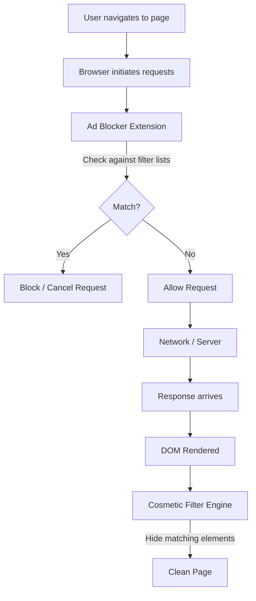
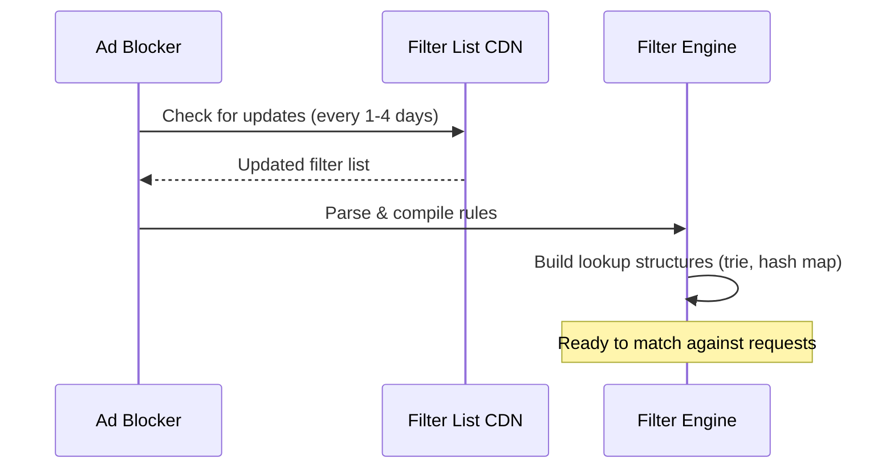
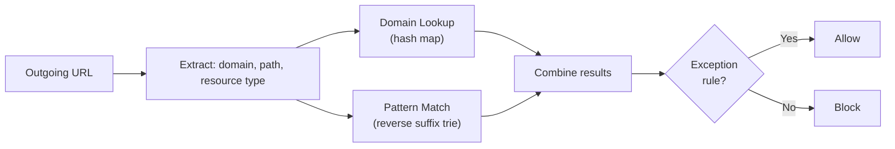
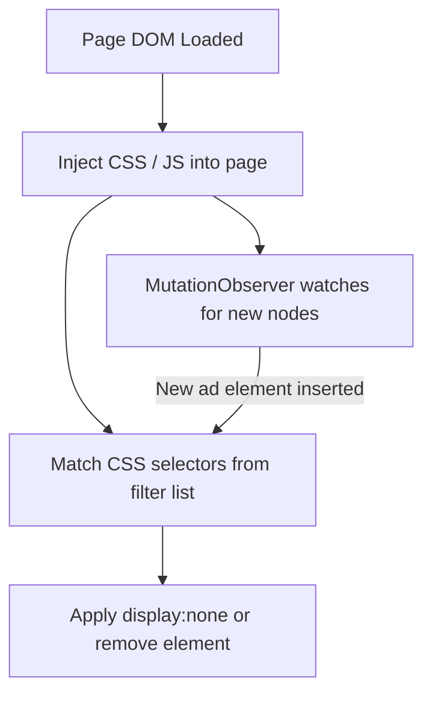
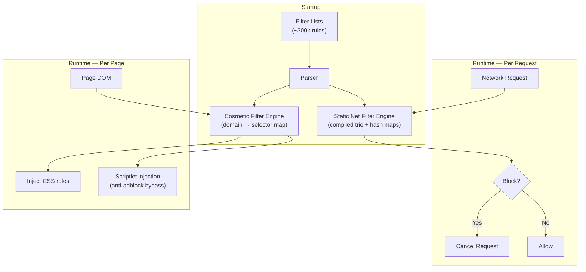
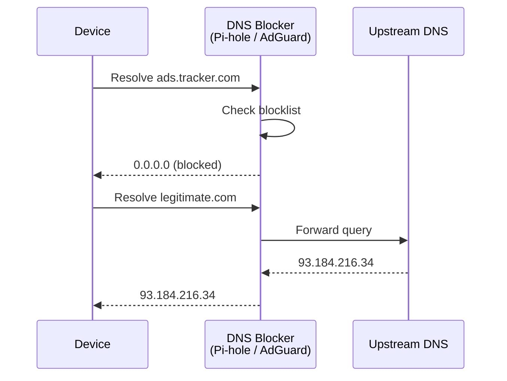
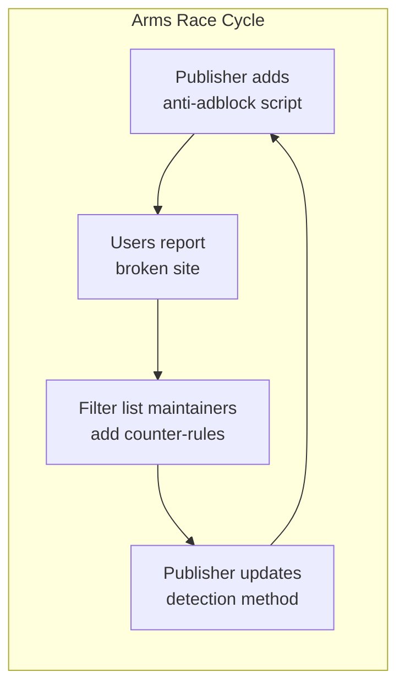

# How Ad Blockers Work

Ad blockers prevent advertisements from loading and displaying on web pages. They operate at multiple levels — intercepting network requests before they reach the server, hiding DOM elements that contain ads, and filtering at the DNS layer. Most browser-based ad blockers combine **request blocking** (stop the ad from downloading) with **cosmetic filtering** (hide whatever slipped through).

---

## Architecture Overview



---

## Types of Ad Blockers

| Type | Where It Runs | Mechanism | Example |
|---|---|---|---|
| **Browser Extension** | In-browser (per device) | Intercepts HTTP requests + hides DOM elements | uBlock Origin, AdBlock Plus |
| **DNS-based** | Network level (router/server) | Resolves ad domains to `0.0.0.0` / `NXDOMAIN` | Pi-hole, AdGuard DNS, NextDNS |
| **Network Proxy** | Between device and internet | MITM proxy inspects and filters traffic | Privoxy, AdGuard Home |
| **OS-level** | Hosts file / system resolver | Maps ad domains to localhost | Custom `/etc/hosts` entries |
| **Browser-native** | Built into the browser | Content blocking rules shipped with the browser | Brave Shields, Safari Content Blockers |

!!! note "Layered Defense"
    Many users combine multiple layers — a DNS blocker at the network edge catches ads across all devices, while a browser extension handles cosmetic filtering and anti-adblock circumvention that DNS alone can't address.

---

## Filter Lists

Ad blockers rely on community-maintained **filter lists** — text files containing thousands of rules that define what to block and what to hide.

### Major Filter Lists

| List | Purpose | Rule Count (approx.) |
|---|---|---|
| **EasyList** | Primary ad-blocking list | ~80,000 |
| **EasyPrivacy** | Tracking and analytics domains | ~20,000 |
| **Peter Lowe's List** | Ad and tracking servers (DNS-friendly) | ~3,500 |
| **Fanboy's Annoyances** | Cookie notices, popups, social widgets | ~10,000 |
| **uBlock filters** | uBlock Origin's own supplementary rules | ~15,000 |

### Filter List Update Flow



---

## Request Blocking

The primary mechanism — intercept outgoing HTTP requests and cancel those that match ad-related patterns.

### How Matching Works

Every URL the browser requests is tested against the filter list. Efficient ad blockers compile rules into optimized data structures rather than testing each rule sequentially.



### Filter Syntax (AdBlock Plus / uBlock Origin)

```
! Comment line
||ads.example.com^            Block any URL from ads.example.com
||example.com/banner/*        Block URLs matching path pattern
@@||example.com/needed-ad.js  Exception — allow this specific resource
/ads\d+\.js/                  Regex-based blocking
||tracker.com^$third-party    Block only when loaded as third-party
||cdn.example.com^$script     Block only script resources from this domain
```

| Syntax Element | Meaning |
|---|---|
| `||` | Match domain anchor (any protocol) |
| `^` | Separator character (end of domain, `/`, `?`, etc.) |
| `@@` | Exception (allowlist) rule |
| `$third-party` | Only match third-party requests |
| `$script`, `$image`, `$stylesheet` | Match specific resource types |
| `$domain=example.com` | Apply rule only on specific pages |
| `/regex/` | Full regex pattern |

---

## Cosmetic Filtering

Even after request blocking, some ads are injected inline (not from external URLs) or rendered from first-party resources. **Cosmetic filters** use CSS selectors and DOM manipulation to hide these elements.

### How It Works



### Cosmetic Filter Syntax

```
! Hide element by CSS selector on all sites
##.ad-banner
##div[id^="google_ads"]
###sidebar-advertisement

! Hide element only on specific domains
example.com##.sponsored-content
example.com,news.site##.ad-wrapper

! Procedural cosmetic filters (uBlock Origin extended syntax)
example.com##:has-text(Advertisement)
example.com##.article:has(> .sponsored-tag)
example.com##.widget:matches-css(position: fixed)
```

| Filter Type | Syntax | What It Does |
|---|---|---|
| **Element hiding** | `##.selector` | Injects `display:none !important` via CSS |
| **Domain-specific hiding** | `domain.com##.selector` | Applies only on matching domains |
| **Procedural** | `##:has-text(Ad)` | Uses JS-based matching for complex patterns |
| **Element removal** | `##+js(remove-node, .ad)` | Physically removes node from DOM instead of hiding |

!!! warning "First-party vs. Third-party Ads"
    Cosmetic filters are essential for **native ads** and **sponsored content** served from the same domain as the real content. Request blocking can't distinguish these because the URLs are first-party.

---

## Browser APIs for Ad Blocking

Browser extensions use specific APIs to intercept requests. The shift from Manifest V2 to V3 fundamentally changed how ad blockers operate.

### Manifest V2: webRequest API

The `webRequest` API gives extensions **synchronous, blocking access** to every network request.

```javascript
chrome.webRequest.onBeforeRequest.addListener(
  (details) => {
    if (shouldBlock(details.url, details.type)) {
      return { cancel: true };
    }
  },
  { urls: ["<all_urls>"] },
  ["blocking"]
);
```

| Aspect | Details |
|---|---|
| **Model** | Imperative — extension code runs on every request |
| **Power** | Full programmatic control; can inspect, redirect, modify headers |
| **Performance** | Extension code sits in the critical path of every request |
| **Rule limit** | None — limited only by memory and CPU |

### Manifest V3: declarativeNetRequest API

Google replaced `webRequest` with `declarativeNetRequest` (DNR) — a **declarative, rules-based** system where the browser evaluates rules without calling extension code.

```json
{
  "id": 1,
  "priority": 1,
  "action": { "type": "block" },
  "condition": {
    "urlFilter": "||ads.example.com^",
    "resourceTypes": ["script", "image", "sub_frame"]
  }
}
```

| Aspect | Details |
|---|---|
| **Model** | Declarative — browser engine evaluates pre-registered rules |
| **Power** | Limited to predefined actions (block, redirect, modify headers) |
| **Performance** | Rules are compiled by the browser; no extension code in request path |
| **Rule limit** | 330,000 static + 30,000 dynamic rules (as of 2025) |

### MV2 vs. MV3 Comparison

=== "Manifest V2 (webRequest)"

    ```
    Pros:
    ✓ Unlimited rules
    ✓ Full programmatic control
    ✓ Can inspect request/response bodies
    ✓ Proven model — uBlock Origin uses ~300k rules efficiently

    Cons:
    ✗ Extension code runs on every request (performance concern)
    ✗ Potential for abuse (data exfiltration)
    ✗ Being deprecated in Chrome
    ```

=== "Manifest V3 (declarativeNetRequest)"

    ```
    Pros:
    ✓ Better performance — browser-native rule evaluation
    ✓ Reduced abuse surface — no access to request data
    ✓ Privacy-preserving — extension never sees URLs

    Cons:
    ✗ Static rule cap limits complex filter lists
    ✗ No regex lookback/lookahead
    ✗ Cannot dynamically decide based on request content
    ✗ Harder to implement advanced cosmetic filtering
    ```

!!! warning "Impact on Ad Blockers"
    The MV3 transition has been controversial. uBlock Origin developed **uBlock Origin Lite** (uBOL) as a MV3-compatible version, but it has reduced capability compared to the full MV2 version. Firefox continues to support `webRequest` in MV3, giving Firefox-based ad blockers an advantage.

---

## Under the Hood: uBlock Origin's Architecture

uBlock Origin is the most widely used ad blocker and demonstrates best-in-class engineering for filter matching performance.



### Key Optimizations

| Technique | Purpose |
|---|---|
| **Token-based indexing** | Each rule is indexed by its most distinctive token; only rules sharing a token with the URL are tested |
| **Compiled binary format** | Filter lists are parsed once and stored in a compact binary format for fast load |
| **Bucket deduplication** | Identical sub-filters are stored once and referenced by multiple rules |
| **Bitmap-based domain matching** | Domain sets are encoded as bitmaps for O(1) lookup |
| **Wasm-compiled matching** | Critical matching code compiled to WebAssembly for near-native speed |

---

## DNS-Level Blocking

DNS-based ad blockers intercept domain resolution rather than HTTP requests.



| Advantage | Limitation |
|---|---|
| Works for **all devices** on the network (IoT, smart TVs, apps) | Cannot do **cosmetic filtering** (no DOM access) |
| **Zero browser overhead** — no extension running | Cannot block **path-based** ads (same domain, different path) |
| Blocks tracking in **native apps**, not just browsers | HTTPS + DoH can **bypass** local DNS blockers |
| Simple to deploy (Pi-hole runs on a Raspberry Pi) | **False positives** break entire domains, not just specific URLs |

---

## Anti-Adblock and Circumvention

Publishers detect and counter ad blockers. Ad blockers in turn develop countermeasures, creating an ongoing arms race.

### Detection Techniques

| Technique | How It Works |
|---|---|
| **Bait element** | Insert a hidden div with class `ad-banner`; check if it was hidden by CSS |
| **Script check** | Load a script from a known ad domain; if `onerror` fires, an ad blocker is present |
| **Height/visibility check** | Create an ad-sized element; if `offsetHeight === 0`, it was hidden |
| **Server-side detection** | Detect missing ad impression callbacks on the server |
| **First-party ad serving** | Serve ads from the same domain as content (defeats request blocking) |

### Counter-Circumvention by Ad Blockers

| Counter-Technique | How It Works |
|---|---|
| **Scriptlet injection** | Inject JS that overrides anti-adblock detection functions |
| **`$removeparam`** | Strip tracking parameters from URLs |
| **CNAME uncloaking** | Resolve CNAME chains to detect third-party trackers disguised as first-party |
| **Response body filtering** | Modify inline scripts before execution (MV2 only) |
| **Element removal** | Physically remove anti-adblock overlays from the DOM |



---

## Performance Impact

| Metric | Without Ad Blocker | With Ad Blocker | Reason |
|---|---|---|---|
| **Requests per page** | 100-300+ | 30-80 | Blocked requests never leave the browser |
| **Data transferred** | 3-8 MB | 1-3 MB | No ad creatives, tracking pixels, or analytics scripts |
| **Page load time** | 4-8s | 1-4s | Fewer requests, less JS execution |
| **CPU usage** | Higher | Lower net | Ad scripts consume more CPU than the filter matching saves |
| **Memory (extension)** | — | ~50-150 MB | Filter list data structures held in memory |
| **Battery (mobile)** | Higher | Lower net | Reduced network + JS execution outweighs extension overhead |

!!! note "Net Positive"
    Despite the memory cost of holding filter lists, ad blockers almost always improve overall performance because the blocked content (video ads, tracking scripts, real-time bidding auctions) is far more expensive than the filter matching.

---

??? question "Interview Questions"
    **Q: What is the difference between request blocking and cosmetic filtering?**
    Request blocking intercepts HTTP requests before they reach the server — the ad content never downloads. Cosmetic filtering uses CSS selectors or DOM manipulation to hide elements that already exist on the page. Request blocking is more efficient (saves bandwidth and CPU), but cosmetic filtering handles inline ads and first-party ad content that can't be caught by URL-based rules.

    **Q: How does a browser ad blocker efficiently match URLs against hundreds of thousands of rules?**
    Modern ad blockers like uBlock Origin use token-based indexing: each filter rule is indexed by its most distinctive token (a substring). When a URL arrives, the engine extracts tokens from the URL and only checks rules that share at least one token. This reduces the search space from hundreds of thousands to a handful of candidates. Additional optimizations include compiled binary formats, bitmap-based domain sets, and WebAssembly for critical paths.

    **Q: Why is the Manifest V3 transition controversial for ad blockers?**
    MV3 replaces the imperative `webRequest` API (where extension code runs on every request) with the declarative `declarativeNetRequest` API (where the browser evaluates pre-registered rules). While DNR is faster and more privacy-preserving, it imposes a static rule limit (~330k) and removes the ability to programmatically inspect or modify requests. Complex filter lists exceed these limits, and advanced features like CNAME uncloaking and response body filtering are impossible under DNR.

    **Q: How does DNS-level ad blocking work, and what are its limitations?**
    DNS blockers (like Pi-hole) intercept DNS queries and return `0.0.0.0` or `NXDOMAIN` for known ad/tracker domains. This blocks ads across all devices on the network without per-device software. Limitations: it can't do cosmetic filtering (no browser access), can't block path-based ads (entire domain is either blocked or allowed), and can be bypassed by DNS-over-HTTPS to external resolvers.

    **Q: How do publishers detect ad blockers, and how do ad blockers counter this?**
    Publishers use bait elements (hidden divs with ad-related class names), script load checks (attempt to load from known ad domains), and size/visibility checks on ad containers. Ad blockers counter with scriptlet injection (override detection functions like `getComputedStyle` or `XMLHttpRequest`), element removal (strip anti-adblock overlays), and community-maintained counter-rules that target specific anti-adblock scripts.

    **Q: What is CNAME uncloaking and why does it matter?**
    Some trackers disguise themselves as first-party by using a CNAME DNS record (e.g., `tracker.example.com` CNAMEs to `actual-tracker.net`). Simple URL-based blocking sees the first-party domain and allows the request. CNAME uncloaking resolves the full CNAME chain to reveal the true third-party origin, allowing the ad blocker to apply third-party blocking rules. This technique requires DNS resolution access, which is available in Firefox extensions but limited in Chrome's MV3.

!!! tip "Further Reading"
    - [uBlock Origin Wiki — Overview of uBlock's Network Filtering Engine](https://github.com/gorhill/uBlock/wiki/Overview-of-uBlock's-network-filtering-engine)
    - [AdBlock Plus — How Filter Rules Work](https://adblockplus.org/en/filters)
    - [EasyList — Official Filter Lists](https://easylist.to/)
    - [Chrome Manifest V3 — declarativeNetRequest API](https://developer.chrome.com/docs/extensions/reference/api/declarativeNetRequest)
    - [Pi-hole Documentation](https://docs.pi-hole.net/)
    - [Brave Shields — How Brave Blocks Ads](https://brave.com/privacy-features/)
