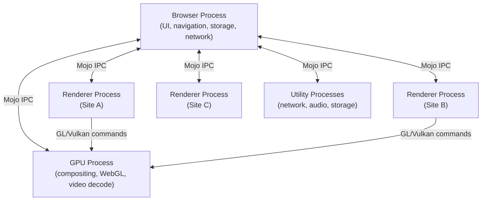
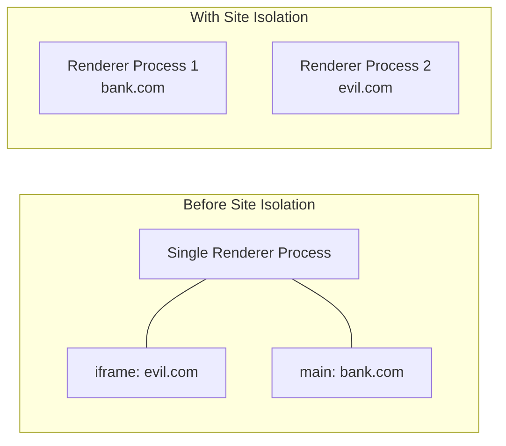
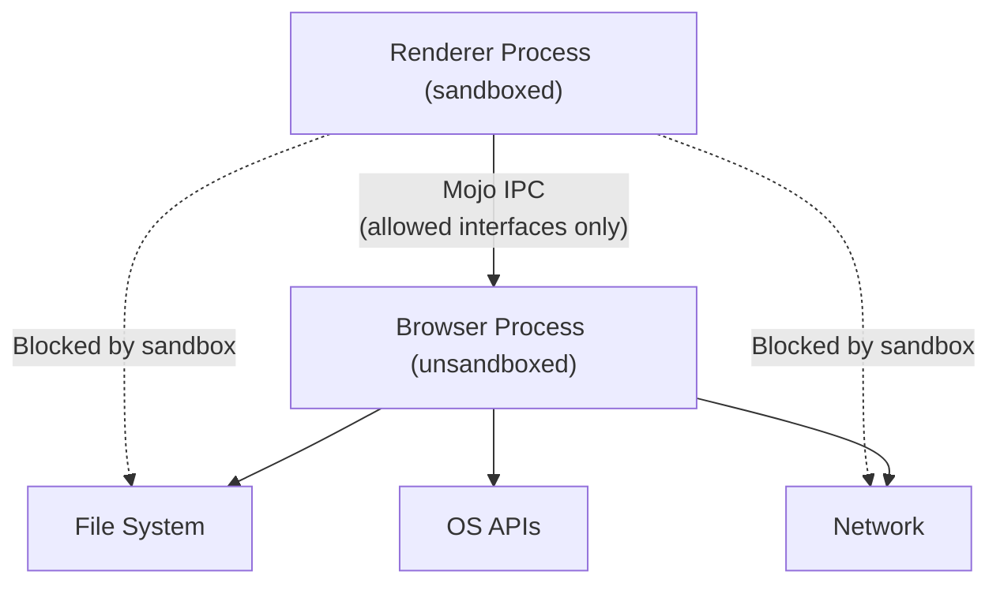
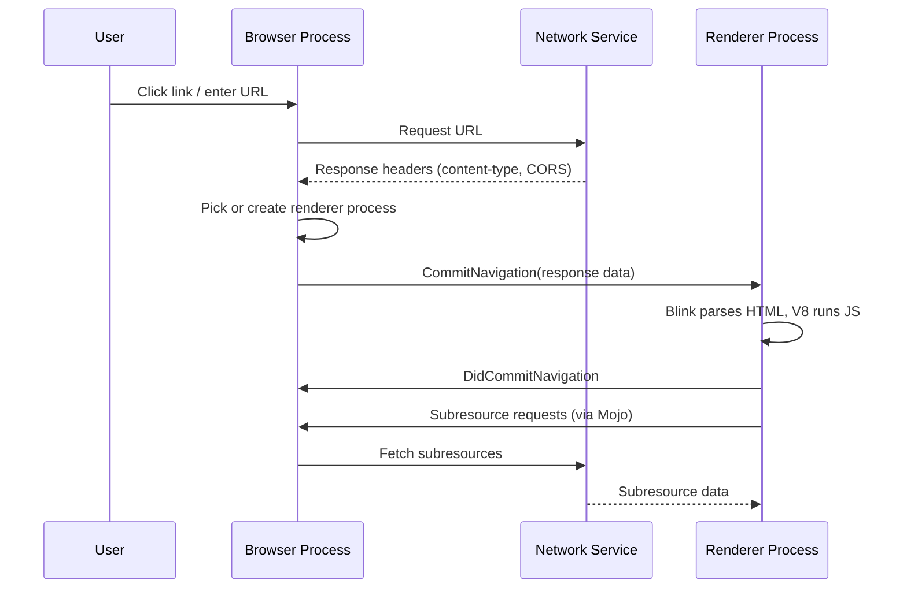

# Chromium Architecture

Chromium uses a **multi-process architecture** where the browser, each renderer, GPU, and utility services all run in separate OS processes. This design provides security (a compromised renderer can't access the filesystem), stability (a tab crash doesn't take down the browser), and performance (renderers run in parallel on multi-core CPUs).

---

## Multi-Process Model



### Process Types

| Process | Responsibility | Count |
|---|---|---|
| **Browser** | UI shell (address bar, tabs, menus), navigation, storage, managing child processes | 1 |
| **Renderer** | Runs Blink + V8 — parses HTML/CSS, executes JS, produces paint commands | 1 per site instance |
| **GPU** | Composites layers from renderers, handles WebGL, video decode/encode | 1 |
| **Network Service** | All HTTP/HTTPS requests, DNS, caching, cookie management | 1 (utility process) |
| **Storage Service** | IndexedDB, Cache API, file system access | 1 (utility process) |
| **Plugin** | Runs PPAPI plugins (legacy, mostly deprecated) | 1 per plugin |
| **Extension** | Hosts extension background scripts and service workers | 1 per extension |

---

## Site Isolation

Since Chrome 67, **site isolation** ensures each cross-site document runs in its own renderer process, making Spectre-class attacks across origins significantly harder.



| Concept | Description |
|---|---|
| **Site** | scheme + eTLD+1 (e.g., `https://example.com`) — all subdomains share a site |
| **Site Instance** | A group of connected pages from the same site within a browsing context |
| **Process-per-site-instance** | Default policy — each site instance gets its own renderer process |
| **Out-of-process iframes (OOPIF)** | Cross-origin iframes run in a separate renderer, not the parent's process |

!!! warning "Memory Trade-off"
    Site isolation increases memory usage because more renderer processes are created. Chrome uses **process sharing heuristics** on memory-constrained devices — on Android, limits are stricter and low-memory devices may share processes across sites.

---

## Sandboxing

Each renderer process runs inside a **security sandbox** that restricts what it can do at the OS level, even if an attacker achieves arbitrary code execution inside the renderer.

| Layer | Mechanism | What It Blocks |
|---|---|---|
| **OS Sandbox** | Linux: `seccomp-bpf` + namespaces; Windows: restricted tokens + job objects; macOS: `sandbox_init` profiles | Direct filesystem access, network sockets, process creation |
| **Site Isolation** | Separate process per origin | Cross-site memory reads (Spectre mitigation) |
| **Mojo Capability Model** | Renderer can only call interfaces the browser explicitly grants | Arbitrary IPC to browser services |



!!! note "The Browser Process Is the Gatekeeper"
    The renderer never touches the filesystem or network directly. Every resource request is proxied through the browser process, which enforces permissions, CORS, and content security policies before forwarding data back.

---

## Inter-Process Communication (IPC)

### Mojo

**Mojo** is Chromium's IPC framework. It replaces the older Chrome IPC system with a capability-based message-passing model.

| Concept | Description |
|---|---|
| **Interface** | A set of methods defined in `.mojom` files (like protobuf for IPC) |
| **Pipe** | A bidirectional message channel between two processes |
| **Pending Receiver / Remote** | The two endpoints of a Mojo pipe — one sends, one receives |
| **Capability** | Access to a specific interface; the browser selectively grants capabilities to renderers |

```
// Example: simplified .mojom definition
interface PageLoader {
  LoadURL(string url) => (int32 status_code, string body);
  GetTitle() => (string title);
};
```

### Message Flow: Navigation Example



---

## Process Lifecycle

| Event | What Happens |
|---|---|
| **New tab** | Browser process creates a new renderer process (or reuses a spare) |
| **Cross-site navigation** | Current renderer is swapped out; a new renderer for the target site is created |
| **Tab close** | Renderer process is terminated; resources freed |
| **Crash** | Only the affected renderer dies — browser shows "Aw, Snap!" for that tab; other tabs continue |
| **Memory pressure** | Background tab renderers may be discarded; state is restored from cache on revisit |

!!! note "Spare Renderer Process"
    Chrome pre-creates a single **spare renderer process** on startup so the first navigation doesn't pay the process spawn cost. This is why `chrome://process-internals` often shows one renderer even with no tabs open.

---

## Chrome vs. Chromium

| | Chromium | Chrome |
|---|---|---|
| **License** | BSD (open-source) | Proprietary (built on Chromium) |
| **Auto-updates** | No | Yes |
| **Codecs** | Open codecs only (VP8/VP9/AV1, Opus) | Adds proprietary codecs (H.264/AAC) |
| **Google integration** | No Sync, no account features | Full Google account integration |
| **Crash reporting** | Optional | Enabled by default (sends to Google) |
| **Widevine DRM** | Not included | Included (Netflix, Disney+, etc.) |

---

??? question "Interview Questions"
    **Q: Why does Chrome use a multi-process architecture instead of multi-threaded?**
    Process isolation provides security (sandbox) and stability (one tab crash doesn't kill others). Threads share memory space, so a compromised thread could access all tab data. Processes also enable site isolation for Spectre mitigations.

    **Q: What happens when a renderer process crashes?**
    Only the tab(s) served by that renderer show the "Aw, Snap!" error page. The browser process remains alive and all other tabs continue normally. The user can reload the crashed tab, which spawns a new renderer.

    **Q: How does site isolation defend against Spectre?**
    Spectre allows reading arbitrary memory within a process. Site isolation ensures cross-origin documents are in *separate* processes, so a Spectre attack in one renderer can only read memory belonging to the same site.

    **Q: What is the role of the GPU process?**
    It composites the final frame from layer tiles produced by renderers, handles WebGL/WebGPU commands, and performs hardware-accelerated video decode. Isolating it prevents GPU driver bugs from crashing the browser.

    **Q: What is Mojo and why was it introduced?**
    Mojo is Chromium's capability-based IPC framework. It replaced the legacy IPC system with strongly-typed interfaces (`.mojom` files), better security through capability-based access control, and support for services that can live in any process.

!!! tip "Further Reading"
    - [Multi-process Architecture — Chromium Docs](https://www.chromium.org/developers/design-documents/multi-process-architecture/)
    - [Site Isolation Design Document](https://www.chromium.org/Home/chromium-security/site-isolation/)
    - [Mojo IPC Introduction](https://chromium.googlesource.com/chromium/src/+/HEAD/mojo/README.md)
    - [Inside look at modern web browser — Part 1](https://developer.chrome.com/blog/inside-browser-part1/)
