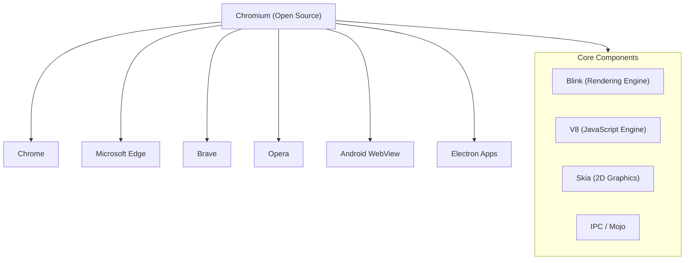

# Chrome Browser Ecosystem

The Chrome browser is built on **Chromium**, an open-source project that powers Chrome, Edge, Brave, Opera, and Android WebView. Understanding its internals — from multi-process architecture to the rendering pipeline — is essential for web performance optimization, debugging, and system design interviews.

---

## Ecosystem Overview

## Components at a Glance

| Component | Role | Origin |
|---|---|---|
| **Chromium** | Open-source browser project providing the codebase | Google (open-source) |
| **Blink** | Rendering engine — parses HTML/CSS, builds the render tree, paints pixels | Forked from WebKit (2013) |
| **V8** | JavaScript & WebAssembly engine — compiles JS to machine code | Google |
| **Skia** | 2D graphics library — rasterizes everything Blink wants to paint | Google (open-source) |
| **Mojo** | IPC system connecting browser, renderer, GPU, and utility processes | Chromium-specific |
| **Compositor** | Manages layers and produces final frames for the GPU | Part of Blink/Viz |

## Sub-Topics

| Topic | What It Covers |
|---|---|
| [Chromium Architecture](chromium-architecture.md) | Multi-process model, process types, sandboxing, IPC, and site isolation |
| [Rendering Pipeline](rendering-pipeline.md) | How Blink turns HTML/CSS into pixels — DOM, CSSOM, layout, paint, compositing |
| [V8 Engine](v8-engine.md) | JavaScript compilation pipeline, JIT tiers, garbage collection, and the event loop |
| [WebView](webview.md) | How WebView works on Android and iOS — architecture, lifecycle, performance, and security |

!!! tip "Further Reading"
    - [Chromium Project Home](https://www.chromium.org/Home/)
    - [Chrome for Developers — How Browsers Work](https://web.dev/articles/howbrowserswork)
    - [Inside look at modern web browser (4-part series)](https://developer.chrome.com/blog/inside-browser-part1/)
