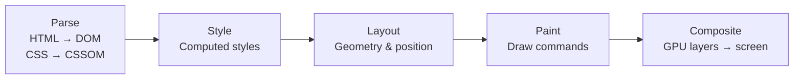
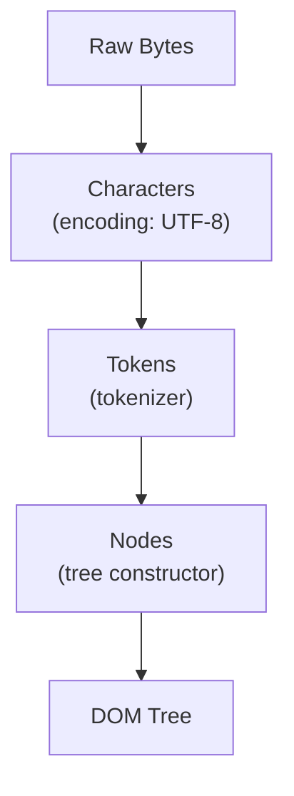
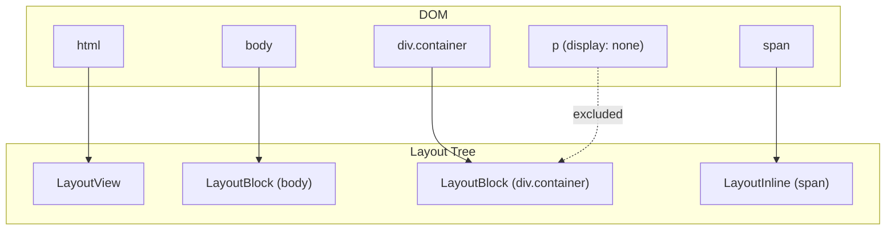
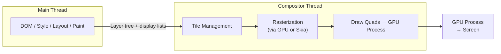
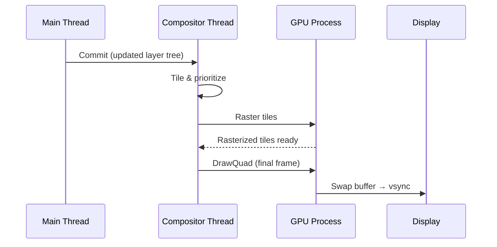

# Rendering Pipeline

The rendering pipeline is how Blink (Chromium's rendering engine) transforms HTML, CSS, and JavaScript into pixels on screen. Understanding each stage is critical for diagnosing performance bottlenecks, writing efficient CSS, and answering browser internals questions.

---

## Pipeline Overview



Each stage takes the output of the previous one. Skipping stages is how CSS optimizations work — a `transform` change skips layout and paint entirely, going straight to composite.

| Stage | Input | Output | Expensive? |
|---|---|---|---|
| **Parse** | Raw HTML/CSS bytes | DOM tree + CSSOM tree | Moderate |
| **Style** | DOM + CSSOM | Computed style per element | Moderate |
| **Layout** | Styled DOM | Layout tree with positions and sizes | Yes |
| **Paint** | Layout tree | Ordered list of draw commands (display list) | Moderate |
| **Composite** | Paint layers | Final pixels on GPU | Cheap |

---

## Stage 1: Parsing

### HTML Parsing → DOM

The HTML parser converts raw bytes into a **Document Object Model (DOM)** — a tree of nodes representing the document structure.



Key behaviors:

- **Incremental**: The parser processes HTML as it arrives, building the DOM incrementally
- **Speculative parsing**: While the main parser is blocked (e.g., by a sync `<script>`), a speculative parser scans ahead for resources to prefetch
- **Parser-blocking scripts**: A `<script>` without `async` or `defer` blocks HTML parsing until the script is downloaded and executed

### CSS Parsing → CSSOM

CSS is parsed into the **CSS Object Model (CSSOM)** — a tree mirroring the DOM with style information.

!!! warning "CSS Is Render-Blocking"
    The browser won't render anything until the CSSOM is fully constructed. Unlike HTML, CSS cannot be parsed incrementally because later rules can override earlier ones (cascade). This is why critical CSS should be inlined or loaded early.

### Resource Loading Impact

| Resource | Parser-blocking? | Render-blocking? | Best Practice |
|---|---|---|---|
| `<script>` | Yes (blocks parsing) | Yes | Use `defer` or `async` |
| `<script defer>` | No | No (runs after parse) | Preferred for most scripts |
| `<script async>` | No | No (runs when ready) | For independent scripts (analytics) |
| `<link rel="stylesheet">` | No | Yes (blocks render) | Inline critical CSS; preload the rest |
| `` | No | No | Use `loading="lazy"` below fold |
| `<link rel="preload">` | No | No | Hints browser to fetch early |

---

## Stage 2: Style Calculation

The browser walks every DOM node and determines the **computed style** — the final resolved value for every CSS property.

1. **Collect matching rules** — selector matching against the DOM node
2. **Cascade** — resolve conflicts using specificity, source order, `!important`
3. **Defaulting** — apply inherited values and initial defaults
4. **Resolve relative values** — convert `em`, `%`, `vh` to absolute `px`

!!! note "Style Invalidation"
    When a DOM mutation occurs or a class changes, Chrome doesn't restyle the entire document. It uses **style invalidation sets** — precomputed sets of selectors affected by a given change — to restyle only the affected subtree.

---

## Stage 3: Layout

Layout (also called "reflow") computes the **exact position and size** of every visible element on the page.

### Layout Tree

The layout tree is separate from the DOM. Elements with `display: none` don't get layout nodes; pseudo-elements (`::before`, `::after`) do.



### Layout Algorithms

| Algorithm | Used For | How It Works |
|---|---|---|
| **Block flow** | Block-level elements (`div`, `p`) | Top-to-bottom stacking, width fills parent, height wraps content |
| **Inline flow** | Inline elements (`span`, `a`, text) | Left-to-right within line boxes, wraps at container edge |
| **Flexbox** | `display: flex` containers | Single-axis distribution with grow/shrink factors |
| **Grid** | `display: grid` containers | Two-axis placement on explicit/implicit grid tracks |
| **Table** | `<table>` elements | Column width negotiation across rows |

### Layout Invalidation

Changing layout-triggering properties forces a **reflow** — the most expensive pipeline stage.

Properties that trigger layout:

| Category | Properties |
|---|---|
| **Geometry** | `width`, `height`, `padding`, `margin`, `border-width` |
| **Position** | `top`, `left`, `right`, `bottom`, `position` |
| **Text** | `font-size`, `font-family`, `line-height`, `text-align` |
| **Flow** | `display`, `float`, `overflow`, `flex-*`, `grid-*` |

!!! warning "Forced Synchronous Layout (Layout Thrashing)"
    Reading a layout property (e.g., `offsetHeight`, `getBoundingClientRect()`) after a DOM write forces the browser to perform layout **synchronously** before returning the value. Batching reads and writes avoids this.

    ```javascript
    // BAD: layout thrashing
    for (const el of elements) {
      el.style.width = box.offsetWidth + 'px'; // read → write → repeat
    }

    // GOOD: batch reads, then writes
    const width = box.offsetWidth;
    for (const el of elements) {
      el.style.width = width + 'px';
    }
    ```

---

## Stage 4: Paint

Paint converts the layout tree into an ordered list of **draw commands** (a display list). Each command is something like "draw a rectangle at (x, y) with color #fff" or "draw text 'Hello' at position (10, 20)".

### Paint Order

Elements are painted in **stacking context** order, not DOM order:

1. Background and borders of the stacking context root
2. Child stacking contexts with negative `z-index`
3. In-flow, non-positioned block-level descendants
4. Non-positioned floats
5. In-flow, non-positioned inline-level descendants
6. Child stacking contexts with `z-index: 0` / `auto`
7. Child stacking contexts with positive `z-index`

### Layer Promotion

Certain properties cause an element to be promoted to its own **compositing layer**:

| Trigger | Why |
|---|---|
| `will-change: transform` | Explicit hint to compositor |
| `transform: translateZ(0)` | Classic hack (use `will-change` instead) |
| `position: fixed` | Needs independent scrolling behavior |
| `<video>`, `<canvas>`, `<iframe>` | Hardware-accelerated content |
| Overlapping a composited layer | Implicit promotion to maintain correct z-order |

!!! warning "Layer Explosion"
    Too many composited layers consume GPU memory. Use Chrome DevTools → Layers panel to audit. The browser has heuristics to **squash** unnecessary layers, but implicit promotions from overlap can still cause excessive layer counts.

---

## Stage 5: Compositing

The compositor takes painted layers and produces the final image sent to the display. This runs on the **compositor thread**, separate from the main thread, which is why compositor-only animations don't jank.



### Compositor-Only Properties

These properties can be animated without touching the main thread:

| Property | What Changes |
|---|---|
| `transform` | Position, rotation, scale (GPU matrix math) |
| `opacity` | Alpha blending on GPU |
| `filter` | Blur, contrast, etc. (GPU shader) |

Everything else (color, width, margin, etc.) requires main thread involvement and is more expensive to animate.

### Frame Production



Target: **16.67ms per frame** at 60fps. The compositor can produce frames independently of the main thread by reusing already-rasterized tiles — this is how scroll and `transform` animations stay smooth even when JS is busy.

---

## Performance Optimization Summary

| Goal | Technique |
|---|---|
| Avoid layout thrashing | Batch DOM reads before writes; use `requestAnimationFrame` |
| Reduce layout scope | Avoid changing geometry on high-in-tree elements |
| Skip layout + paint | Animate only `transform` and `opacity` |
| Reduce paint area | Promote animated elements to their own layer (`will-change`) |
| Unblock rendering | Inline critical CSS; `defer` scripts; lazy-load images |
| Reduce parse time | Minimize HTML/CSS size; avoid deeply nested DOM trees |

---

??? question "Interview Questions"
    **Q: What's the difference between reflow and repaint?**
    Reflow (layout) recalculates element geometry — triggered by size/position changes. Repaint only re-draws pixels — triggered by visual-only changes like `color` or `background`. Reflow is more expensive and always triggers a repaint, but repaint does not trigger reflow.

    **Q: Why are `transform` animations smoother than `left`/`top` animations?**
    `transform` is handled entirely by the compositor thread on the GPU — it skips layout and paint. `left`/`top` changes trigger layout on the main thread, which can be blocked by JavaScript execution, causing jank.

    **Q: What is the Critical Rendering Path?**
    The sequence of steps the browser must complete before the first paint: build DOM → build CSSOM → compute styles → layout → paint. Optimizing the CRP means minimizing render-blocking resources (CSS, sync JS) to get first paint as fast as possible.

    **Q: How does `will-change` work?**
    It hints to the browser that a property will animate, prompting layer promotion and resource pre-allocation. This moves the element to a separate compositing layer so future changes to that property bypass layout/paint. Overuse wastes GPU memory.

    **Q: What is layout thrashing and how do you fix it?**
    Layout thrashing occurs when code alternates between reading layout properties (`offsetHeight`) and writing style changes in a loop, forcing synchronous layout on every read. Fix by batching all reads first, then all writes, or using `requestAnimationFrame`.

!!! tip "Further Reading"
    - [Rendering Performance — web.dev](https://web.dev/articles/rendering-performance)
    - [CSS Triggers](https://csstriggers.com/) — which CSS properties trigger layout, paint, or composite
    - [Inside look at modern web browser — Part 3: Renderer Process](https://developer.chrome.com/blog/inside-browser-part3/)
    - [The Pixel Pipeline — Chrome DevTools docs](https://developer.chrome.com/docs/devtools/performance/reference/)
