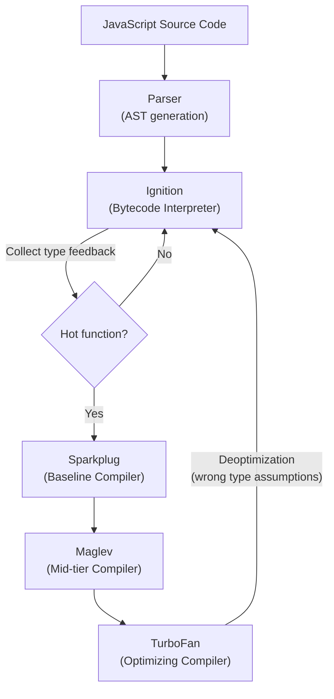
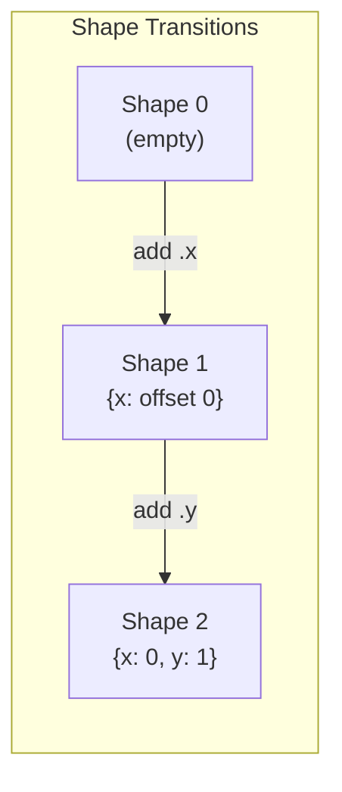
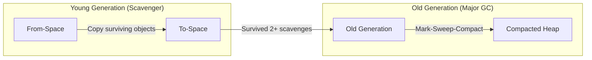
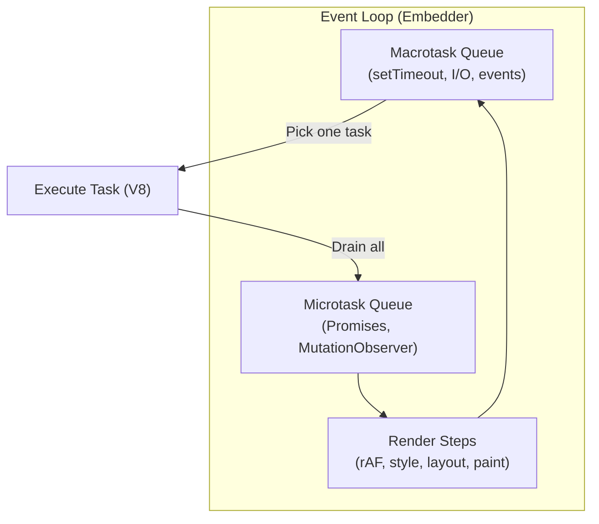

# V8 Engine

V8 is Google's open-source JavaScript and WebAssembly engine, written in C++. It powers Chrome, Node.js, Deno, and Android WebView. V8 compiles JavaScript directly to native machine code using a multi-tier JIT pipeline — there is no interpreter bytecode shipped to the CPU.

---

## Compilation Pipeline

V8 uses a **multi-tier** compilation strategy that balances fast startup with peak performance.



### Compiler Tiers

| Tier | Name | Speed | Code Quality | When Used |
|---|---|---|---|---|
| **Tier 0** | Ignition | Instant | Interpreted bytecode | All functions start here |
| **Tier 1** | Sparkplug | Very fast | Baseline machine code (no optimization) | Warm functions |
| **Tier 2** | Maglev | Fast | Mid-tier optimized code | Moderately hot functions |
| **Tier 3** | TurboFan | Slow (compile time) | Highly optimized machine code | Hot loops and functions |

### Key Concepts

**Type Feedback**: Ignition collects runtime type information (e.g., "this `+` always sees two integers") and stores it in **feedback vectors**. TurboFan uses this to generate type-specialized machine code.

**Speculative Optimization**: TurboFan generates optimized code based on observed types. If assumptions are violated at runtime (e.g., a function suddenly receives a string instead of a number), V8 performs a **deoptimization** — discarding the optimized code and falling back to Ignition.

**Inline Caches (ICs)**: Caches for property lookups, function calls, and binary operations that record observed shapes and types. ICs make repeated operations on same-shaped objects near-instant.

!!! warning "Deoptimization Is Expensive"
    Each deopt discards compiled code and resumes in the interpreter. Frequent deopts (from polymorphic call sites or type instability) can make code run *slower* than staying in the interpreter. Write type-stable code — don't mix types in the same variable.

---

## Hidden Classes & Shapes

V8 assigns each object a **hidden class** (internally called a **Map** or **Shape**) that describes its property layout — offsets, types, and transitions.



```javascript
// Same shape — fast property access
const a = { x: 1, y: 2 };
const b = { x: 3, y: 4 }; // shares shape with 'a'

// Different shape — slower, creates new transition chain
const c = { y: 2, x: 1 }; // different property order!
```

| Scenario | Shape Behavior | Performance Impact |
|---|---|---|
| Same constructor, same property order | Shared shape | Fast — IC hits, optimized access |
| Same properties, different order | Different shapes | Slow — IC misses, polymorphic access |
| Dynamically adding/deleting properties | Shape transitions / dictionary mode | Slow — falls out of fast path |
| `delete obj.prop` | Transitions to dictionary mode | Very slow — avoid `delete` |

!!! note "Monomorphic > Polymorphic > Megamorphic"
    A call site that always sees the same shape is **monomorphic** (fastest). If it sees 2-4 shapes, it's **polymorphic** (IC caches multiple entries). Beyond 4, it becomes **megamorphic** and falls back to a generic (slow) lookup.

---

## Garbage Collection

V8 uses a **generational garbage collector** based on the observation that most objects die young.



### Heap Structure

| Space | Purpose | GC Algorithm |
|---|---|---|
| **Young Generation** (semi-space) | New allocations; most objects die here | **Scavenger** (copying collector) — fast, pauses ~1ms |
| **Old Generation** | Long-lived objects promoted from young gen | **Mark-Compact** — slower, concurrent/incremental |
| **Large Object Space** | Objects > 256KB | Tracked individually, never moved |
| **Code Space** | Compiled machine code from JIT | Managed separately |

### GC Strategies

| Strategy | Description |
|---|---|
| **Incremental Marking** | Mark phase broken into small chunks interleaved with JS execution |
| **Concurrent Marking** | Background threads mark the heap while JS runs on the main thread |
| **Concurrent Sweeping** | Background threads reclaim memory after marking |
| **Parallel Scavenging** | Multiple threads cooperate to scavenge young generation |
| **Idle-time GC** | Schedules GC work during idle periods (requestIdleCallback integration) |

!!! note "Orinoco"
    V8's GC project is called **Orinoco**. The goal: make GC pauses imperceptible by running as much work as possible concurrently and in parallel, off the main thread.

---

## Event Loop & Task Scheduling

V8 itself doesn't implement the event loop — the **embedder** (Chrome, Node.js) provides it. But understanding the interaction is essential.



### Task Priority

| Queue | Examples | When Drained |
|---|---|---|
| **Microtask** | `Promise.then`, `queueMicrotask`, `MutationObserver` | After every macrotask, before rendering |
| **Macrotask** | `setTimeout`, `setInterval`, I/O callbacks, UI events | One per event loop iteration |
| **Animation** | `requestAnimationFrame` | Before each paint (if rendering) |
| **Idle** | `requestIdleCallback` | When the browser has spare time before next frame |

```javascript
console.log('1');                    // sync
setTimeout(() => console.log('2')); // macrotask
Promise.resolve().then(() => console.log('3')); // microtask
console.log('4');                    // sync

// Output: 1, 4, 3, 2
```

---

## WebAssembly in V8

V8 compiles WebAssembly using **Liftoff** (baseline) and **TurboFan** (optimizing), similar to the JS pipeline.

| Tier | Compiler | Purpose |
|---|---|---|
| **Baseline** | Liftoff | Fast single-pass compilation, ~10x faster than TurboFan |
| **Optimizing** | TurboFan | Produces highly optimized machine code for hot Wasm functions |

Key differences from JS compilation:

- **No deoptimization** — Wasm types are known at compile time
- **Streaming compilation** — V8 compiles Wasm bytes as they arrive over the network
- **Shared memory** — `SharedArrayBuffer` enables true multi-threaded Wasm with `Atomics`

---

## Performance Tips for V8

| Practice | Why |
|---|---|
| **Initialize objects with all properties in constructors** | Creates a consistent hidden class; avoids shape transitions |
| **Don't add or delete properties dynamically** | `delete` forces dictionary mode; adding properties causes transitions |
| **Keep functions monomorphic** | Pass objects of the same shape to the same function |
| **Avoid type changes on variables** | `let x = 1; x = "string"` causes deopt at usage sites |
| **Prefer `for` loops over `forEach` for hot paths** | `for` is easier for TurboFan to optimize (no closure overhead) |
| **Use typed arrays for numeric computation** | Fixed layout, no hidden class overhead, SIMD-friendly |
| **Avoid megamorphic property access** | Functions seeing >4 shapes fall to generic slow path |

---

??? question "Interview Questions"
    **Q: What is the difference between Ignition and TurboFan?**
    Ignition is V8's bytecode interpreter — it compiles JS to bytecode quickly with minimal optimization. TurboFan is the optimizing compiler that produces highly-tuned machine code for hot functions using type feedback. Ignition prioritizes startup speed; TurboFan prioritizes peak throughput.

    **Q: What are hidden classes and why do they matter?**
    Hidden classes (Shapes/Maps) describe the memory layout of an object — which properties exist and at what offsets. Objects with the same shape share a hidden class, enabling fast inline-cached property access. Inconsistent property ordering or dynamic property addition breaks shape sharing and degrades performance.

    **Q: What is deoptimization?**
    When TurboFan's type assumptions are violated at runtime (e.g., a function compiled for integers receives a string), V8 discards the optimized code and falls back to the Ignition interpreter. This is expensive and should be minimized by writing type-stable code.

    **Q: How does V8's garbage collector minimize pauses?**
    V8 uses a generational GC (Orinoco): young generation uses a fast scavenger (~1ms), old generation uses incremental + concurrent mark-compact. Most marking and sweeping happens on background threads, and GC work is scheduled during idle time to avoid janking animations.

    **Q: Why does `Promise.then` run before `setTimeout`?**
    Promise callbacks are **microtasks** — they're drained after the current macrotask completes but before the next one. `setTimeout` callbacks are macrotasks that wait in the macrotask queue. The event loop always empties the microtask queue before picking the next macrotask.

!!! tip "Further Reading"
    - [V8 Blog](https://v8.dev/blog) — official deep dives into V8 internals
    - [Sparkplug — V8's baseline compiler](https://v8.dev/blog/sparkplug)
    - [Maglev — V8's mid-tier compiler](https://v8.dev/blog/maglev)
    - [Trash Talk: the Orinoco GC](https://v8.dev/blog/trash-talk)
    - [Understanding V8's Bytecode](https://medium.com/nicedayfinance/understand-v8s-bytecode-317d46c94775)
