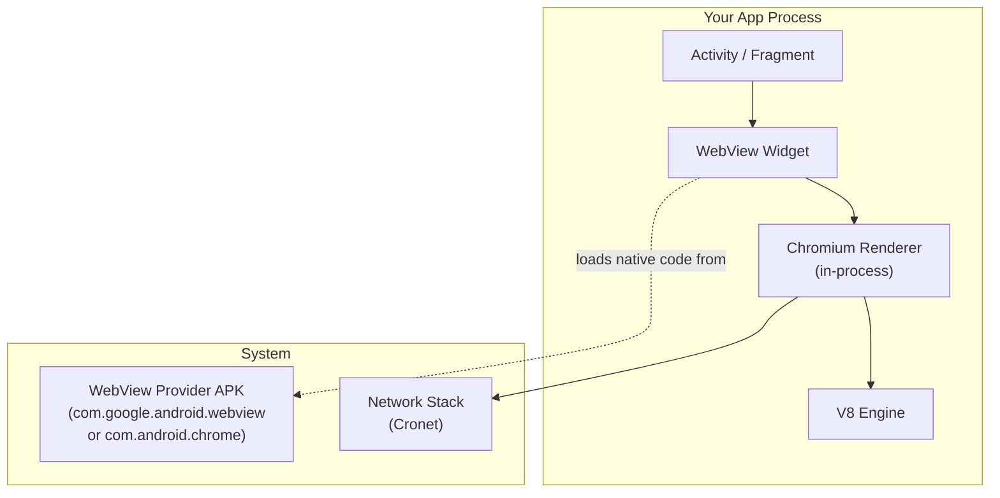

# WebView

WebView is an embeddable browser component that lets native apps display web content inline. On Android, it's powered by Chromium; on iOS, by WebKit. Understanding WebView architecture is critical for hybrid apps, in-app browsers, and security-sensitive integrations like OAuth flows.

---

## Android WebView Architecture

Android WebView is a **system component** backed by the same Chromium codebase as Chrome. Since Android 7.0 (Nougat), it ships as a standalone APK updatable via the Play Store, decoupled from OS updates.



### WebView Provider

| Android Version | WebView Provider | Update Mechanism |
|---|---|---|
| 4.4 (KitKat) | Built into framework (Chromium 30) | OS updates only |
| 5.0–6.0 | Standalone `com.google.android.webview` APK | Play Store |
| 7.0–9.0 | Chrome APK serves as WebView provider | Play Store (Chrome updates = WebView updates) |
| 10+ | Either standalone WebView APK or Chrome (Trichrome) | Play Store |

!!! note "Trichrome Architecture (Android 10+)"
    On Android 10+, Chrome and WebView share a common library APK (**Trichrome Library**) to avoid duplicating ~100MB of Chromium native code. Both Chrome and WebView load from this shared library.

### In-Process vs. Multi-Process

Unlike Chrome (which uses one process per site), Android WebView historically runs the renderer **in the app's own process** due to Android's app process model.

| Mode | Description | Availability |
|---|---|---|
| **Single-process** | Renderer runs in the app process | Default (all versions) |
| **Multi-process** | Renderer in a separate sandboxed process | Android 8.0+, opt-in via developer options |

!!! warning "Security Implication"
    In single-process mode, a renderer exploit gives the attacker access to the entire app's memory and permissions — no sandbox. For security-critical apps, consider Chrome Custom Tabs instead of WebView.

---

## Core WebView API (Android)

### Basic Setup

```kotlin
class WebViewActivity : AppCompatActivity() {
    private lateinit var webView: WebView

    override fun onCreate(savedInstanceState: Bundle?) {
        super.onCreate(savedInstanceState)
        webView = WebView(this).apply {
            settings.javaScriptEnabled = true
            settings.domStorageEnabled = true
            webViewClient = MyWebViewClient()
            webChromeClient = MyChromeClient()
        }
        setContentView(webView)
        webView.loadUrl("https://example.com")
    }

    override fun onDestroy() {
        webView.destroy()
        super.onDestroy()
    }
}
```

### Key Components

| Component | Purpose |
|---|---|
| `WebView` | The view widget — handles display and input |
| `WebSettings` | Configuration: JS enabled, cache mode, user agent, zoom controls |
| `WebViewClient` | Intercepts page navigation, errors, resource loading |
| `WebChromeClient` | Handles JS dialogs (`alert`, `confirm`), progress, file chooser, console messages |
| `CookieManager` | Read/write cookies; sync between WebView and network stack |

### WebViewClient Callbacks

| Callback | When Called | Common Use |
|---|---|---|
| `shouldOverrideUrlLoading()` | Before navigating to a new URL | Deep link interception, URL filtering |
| `onPageStarted()` | Page begins loading | Show loading indicator |
| `onPageFinished()` | Page fully loaded | Hide loading indicator |
| `shouldInterceptRequest()` | For every resource request | Local asset injection, request modification |
| `onReceivedError()` | HTTP error or network failure | Custom error pages |
| `onReceivedSslError()` | SSL certificate validation failure | **Never call `handler.proceed()` in production** |

---

## JavaScript ↔ Native Bridge

### Native → JavaScript

```kotlin
webView.evaluateJavascript("document.title") { result ->
    Log.d("Title", result) // returns the page title
}
```

### JavaScript → Native

```kotlin
class NativeBridge {
    @JavascriptInterface
    fun showToast(message: String) {
        Toast.makeText(context, message, Toast.LENGTH_SHORT).show()
    }
}

webView.addJavascriptInterface(NativeBridge(), "Android")
```

```javascript
// In web page JavaScript
Android.showToast("Hello from web!");
```

!!! warning "Security: `@JavascriptInterface`"
    Before Android 4.2, `addJavascriptInterface` exposed **all public methods** of the object to JavaScript, including `getClass()` — enabling arbitrary code execution via reflection. Always target API 17+ and annotate only the methods you intend to expose with `@JavascriptInterface`.

### Bridge Communication Patterns

| Pattern | Direction | Mechanism |
|---|---|---|
| **Evaluate JS** | Native → Web | `evaluateJavascript()` (async, returns result) |
| **Load URL scheme** | Native → Web | `loadUrl("javascript:...")` (legacy, no return value) |
| **JS Interface** | Web → Native | `@JavascriptInterface` annotated methods |
| **URL interception** | Web → Native | `shouldOverrideUrlLoading()` with custom scheme |
| **Message port** | Bidirectional | `WebView.createWebMessageChannel()` (HTML5 MessagePort) |

---

## iOS: WKWebView

iOS uses **WKWebView** (backed by WebKit) — the only browser engine allowed on iOS.

```swift
import WebKit

class ViewController: UIViewController, WKNavigationDelegate {
    var webView: WKWebView!

    override func viewDidLoad() {
        super.viewDidLoad()
        let config = WKWebViewConfiguration()
        config.allowsInlineMediaPlayback = true
        webView = WKWebView(frame: view.bounds, configuration: config)
        webView.navigationDelegate = self
        view.addSubview(webView)
        webView.load(URLRequest(url: URL(string: "https://example.com")!))
    }
}
```

### Android WebView vs. iOS WKWebView

| Feature | Android WebView | iOS WKWebView |
|---|---|---|
| **Engine** | Blink + V8 (Chromium) | WebKit + JavaScriptCore |
| **Process model** | In-process (default) | Out-of-process (always) |
| **JS bridge** | `@JavascriptInterface` | `WKScriptMessageHandler` |
| **Updates** | Play Store (independent of OS) | OS updates only |
| **Custom engine allowed** | Yes (can ship own browser engine) | No (all browsers must use WebKit) |
| **Cookie access** | `CookieManager` (sync API) | `WKHTTPCookieStore` (async API) |

!!! note "iOS Browser Engine Mandate (Changing)"
    Historically, Apple required all iOS browsers to use WebKit. Starting with iOS 17.4 in the EU (under the Digital Markets Act), alternative browser engines are permitted, though adoption remains limited.

---

## Chrome Custom Tabs vs. WebView

For showing third-party web content, **Chrome Custom Tabs** (CCT) is preferred over WebView.

| Feature | WebView | Chrome Custom Tabs |
|---|---|---|
| **Rendering engine** | Chromium (in-process) | Full Chrome browser (separate process) |
| **Security** | No sandbox (single-process) | Full Chrome sandbox |
| **Shared state** | No (separate cookie jar, no autofill) | Shares Chrome cookies, autofill, saved passwords |
| **Customization** | Full control (HTML injection, JS bridge) | Toolbar color, action buttons, menu items |
| **Performance** | Cold start (loads Chromium into app) | Warm start (Chrome pre-warmed via `warmup()`) |
| **Use case** | Hybrid app UI, controlled content | External links, OAuth, third-party content |

```kotlin
// Chrome Custom Tabs — simple usage
val intent = CustomTabsIntent.Builder()
    .setToolbarColor(ContextCompat.getColor(this, R.color.primary))
    .setShowTitle(true)
    .build()
intent.launchUrl(this, Uri.parse("https://example.com"))
```

!!! tip "When to Use What"
    - **WebView**: You own the web content, need JS bridge, or build a hybrid app
    - **Chrome Custom Tabs**: Displaying third-party URLs, OAuth flows, or any untrusted content
    - **External browser**: When the user explicitly wants to "open in browser"

---

## WebView Performance

| Optimization | Description |
|---|---|
| **Pre-initialize** | Create WebView during `Application.onCreate()` to pay init cost early |
| **Preload content** | Use `loadUrl()` or `loadDataWithBaseURL()` before the view is visible |
| **Enable caching** | Set `LOAD_CACHE_ELSE_NETWORK` for content that doesn't change often |
| **Hardware acceleration** | Enabled by default; verify with `setLayerType(View.LAYER_TYPE_HARDWARE, null)` |
| **Minimize bridge calls** | Batch JS-to-native calls; each crossing has ~1ms overhead |
| **Avoid `loadUrl("javascript:")` | Use `evaluateJavascript()` — it's async and returns results |

### Memory Management

```kotlin
override fun onDestroy() {
    webView.apply {
        loadUrl("about:blank")
        clearHistory()
        removeAllViews()
        destroy()
    }
    super.onDestroy()
}
```

!!! warning "WebView Memory Leaks"
    WebView holds a strong reference to its `Context`. If created with an Activity context and not properly destroyed, it leaks the entire Activity. Use `applicationContext` for the WebView constructor, or ensure `destroy()` is called in `onDestroy()`.

---

## WebView Security Checklist

| Risk | Mitigation |
|---|---|
| **JS bridge exploitation** | Annotate with `@JavascriptInterface`; expose minimal methods; validate inputs |
| **SSL bypass** | Never call `handler.proceed()` in `onReceivedSslError()` |
| **File access** | Disable `setAllowFileAccess(false)` unless needed; disable `setAllowFileAccessFromFileURLs(false)` |
| **Content injection** | Sanitize data passed to `loadDataWithBaseURL()` |
| **URL scheme hijacking** | Validate URLs in `shouldOverrideUrlLoading()` against an allowlist |
| **Mixed content** | Set `setMixedContentMode(MIXED_CONTENT_NEVER_ALLOW)` |

---

??? question "Interview Questions"
    **Q: Why is Chrome Custom Tabs preferred over WebView for third-party content?**
    Chrome Custom Tabs runs in Chrome's fully sandboxed process, shares cookies and autofill with the user's Chrome session, and provides a familiar browsing UX. WebView runs in the app's process without a sandbox, doesn't share Chrome state, and a renderer exploit can compromise the entire app.

    **Q: How does the JavaScript-to-native bridge work in Android WebView?**
    You register a Java/Kotlin object via `addJavascriptInterface(obj, "name")`. Methods annotated with `@JavascriptInterface` become callable from JavaScript as `name.methodName()`. The call crosses from V8 to the JVM via JNI. The annotation restriction (API 17+) prevents reflection-based RCE attacks.

    **Q: What is the Trichrome architecture?**
    On Android 10+, Chrome and WebView share a common native library APK (Trichrome Library) instead of each bundling their own copy of Chromium. This saves ~100MB of storage and ensures both components use identical Chromium versions.

    **Q: Why might WebView cause memory leaks?**
    WebView holds a strong reference to its `Context`. If constructed with an Activity context and the Activity is destroyed without calling `webView.destroy()`, the WebView prevents the Activity (and its entire view hierarchy) from being garbage collected.

    **Q: What's the difference between Android WebView and iOS WKWebView process models?**
    Android WebView defaults to single-process (renderer runs in the app), providing no sandbox. iOS WKWebView always runs the renderer in a separate process with full sandbox, similar to Safari. This makes WKWebView inherently more secure against renderer exploits.

!!! tip "Further Reading"
    - [Android WebView Docs](https://developer.android.com/develop/ui/views/layout/webapps/webview)
    - [Chrome Custom Tabs — Best Practices](https://developer.chrome.com/docs/android/custom-tabs/best-practices/)
    - [WebKit — WKWebView Documentation](https://developer.apple.com/documentation/webkit/wkwebview)
    - [WebView Security Best Practices — OWASP](https://owasp.org/www-project-mobile-top-10/)
