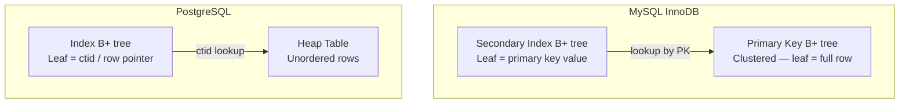

# Database Indexing

An index is a separate data structure that maintains a sorted reference to rows in a table, enabling O(log n) lookups instead of O(n) full table scans. Understanding index internals is essential for writing performant queries and diagnosing slow ones.

---

## How Indexes Work

Without an index, the database must scan every row (sequential scan). With an index, it navigates a sorted structure to locate rows directly.

```mermaid
flowchart LR
    subgraph "Without Index"
        Q1[SELECT * FROM users<br/>WHERE email = 'a@b.com'] --> SCAN[Full Table Scan<br/>O(n) — read every row]
    end
    
    subgraph "With Index on email"
        Q2[SELECT * FROM users<br/>WHERE email = 'a@b.com'] --> BTREE[B-tree Lookup<br/>O(log n)] --> ROW[Direct row access]
    end
```

---

## Index Data Structures

### B-tree / B+ tree

The default index type in PostgreSQL, MySQL (InnoDB), SQLite, and most relational databases.

```
                    [30 | 60]                    ← Internal node (keys + pointers)
                   /    |    \
          [10 | 20]  [40 | 50]  [70 | 80]       ← Internal nodes
          /  |  \    /  |  \    /  |  \
        [10][20][30][40][50][60][70][80][90]      ← Leaf nodes (→ row pointers)
              ↔    ↔    ↔    ↔    ↔    ↔         ← Leaf-to-leaf links (B+ tree)
```

| Property | B-tree | B+ tree |
|----------|--------|---------|
| Data storage | Internal + leaf nodes | **Leaf nodes only** |
| Leaf linking | No | Yes (doubly-linked list) |
| Range queries | Requires traversal | Follow leaf links — fast |
| Used by | Theoretical concept | PostgreSQL, MySQL, SQLite (all use B+ tree variants) |

**Why B+ tree dominates databases:**

- Fan-out of 100-500 children per node → 3-4 levels for billions of rows
- Leaf-level linked list enables efficient range scans and ORDER BY
- Internal nodes are small (keys + pointers only) → fit in cache

### Hash Index

Maps keys to row locations via a hash function. O(1) lookup for exact matches.

| Aspect | B-tree | Hash |
|--------|--------|------|
| Exact match (`=`) | O(log n) | **O(1)** |
| Range queries (`>`, `<`, `BETWEEN`) | **Yes** | No |
| ORDER BY | **Yes** (sorted) | No |
| Pattern matching (`LIKE 'abc%'`) | **Yes** (prefix) | No |
| Crash recovery | WAL-logged | Depends on implementation |

!!! note "Hash Index Availability"
    PostgreSQL supports hash indexes (fully WAL-logged since v10). MySQL InnoDB does **not** support hash indexes on disk — its "adaptive hash index" is an automatic in-memory optimization. SQLite does not support hash indexes.

### Other Index Types

| Type | Engine | Use Case |
|------|--------|----------|
| **GiST** | PostgreSQL | Geometric data, full-text search, range types |
| **GIN** | PostgreSQL | Full-text search, JSONB, arrays |
| **BRIN** | PostgreSQL | Very large tables with naturally ordered data (timestamps) |
| **R-tree** | MySQL, SQLite | Spatial/geographic queries |
| **Bitmap** | Oracle, PostgreSQL (internal) | Low-cardinality columns in OLAP |

---

## Index Types by Usage

### Single-Column Index

```sql
CREATE INDEX idx_users_email ON users (email);
```

Speeds up: `WHERE email = ?`, `ORDER BY email`, `WHERE email LIKE 'abc%'`

### Composite (Multi-Column) Index

```sql
CREATE INDEX idx_orders_customer_date ON orders (customer_id, order_date);
```

**Leftmost prefix rule** — the index is usable for queries that filter on a left prefix of the columns:

| Query | Uses Index? | Why |
|-------|-------------|-----|
| `WHERE customer_id = 5` | Yes | Leftmost column |
| `WHERE customer_id = 5 AND order_date > '2024-01-01'` | Yes | Both columns (full match) |
| `WHERE order_date > '2024-01-01'` | **No** | Skips leftmost column |
| `WHERE customer_id = 5 ORDER BY order_date` | Yes | Filter + sort on index |

!!! tip "Column Order Matters"
    Put the **most selective** (highest cardinality) column first, OR the column most frequently used in equality conditions. Columns used for range conditions (`>`, `<`, `BETWEEN`) should come last — range scans break the ability to use subsequent index columns.

### Covering Index

An index that contains **all columns** needed by a query — the database reads the index only, never touching the table (index-only scan).

```sql
-- Query
SELECT name, email FROM users WHERE email = 'a@b.com';

-- Covering index — includes the SELECT columns
CREATE INDEX idx_users_email_covering ON users (email) INCLUDE (name);
```

| Scan Type | I/O Pattern |
|-----------|-------------|
| Index scan → table lookup | Index B-tree → heap page (random I/O) |
| **Index-only scan** | Index B-tree only (no heap access) |

### Partial (Filtered) Index

Indexes only rows matching a condition — smaller index, faster writes.

```sql
CREATE INDEX idx_active_users ON users (email) WHERE status = 'active';
```

- Only indexes rows where `status = 'active'`
- Queries must include the filter condition to use this index
- Saves space when most rows don't match the condition

### Unique Index

Enforces uniqueness and provides lookup performance.

```sql
CREATE UNIQUE INDEX idx_users_email_unique ON users (email);
```

---

## Clustered vs Non-Clustered

| Aspect | Clustered Index | Non-Clustered (Secondary) Index |
|--------|----------------|-------------------------------|
| **Table order** | Rows stored in index order | Rows stored independently |
| **Per table** | One only | Many |
| **Leaf nodes** | Contain actual row data | Contain pointers to row |
| **Lookup** | Direct (data is in the index) | Indirect (index → table lookup) |
| **MySQL InnoDB** | Primary key = clustered | Secondary indexes point to PK |
| **PostgreSQL** | No clustered index by default | All indexes are secondary |



!!! warning "Secondary Index Double Lookup (MySQL)"
    In InnoDB, a secondary index lookup first finds the primary key, then does a **second** B-tree traversal on the clustered index to find the actual row. This is why covering indexes are especially valuable in MySQL — they avoid the second lookup entirely.

---

## EXPLAIN — Reading Query Plans

Every major database has `EXPLAIN` to show how a query will be executed.

=== "PostgreSQL"

    ```sql
    EXPLAIN ANALYZE SELECT * FROM users WHERE email = 'alice@example.com';
    ```

    ```
    Index Scan using idx_users_email on users  (cost=0.29..8.31 rows=1 width=72)
      (actual time=0.025..0.026 rows=1 loops=1)
      Index Cond: (email = 'alice@example.com'::text)
    Planning Time: 0.089 ms
    Execution Time: 0.044 ms
    ```

=== "MySQL"

    ```sql
    EXPLAIN SELECT * FROM users WHERE email = 'alice@example.com';
    ```

    ```
    +----+-------+----------------+---------+------+------+----------+
    | id | type  | possible_keys  | key     | rows | filtered | Extra |
    +----+-------+----------------+---------+------+------+----------+
    |  1 | const | idx_users_email| idx_... |    1 |   100.00 | NULL  |
    +----+-------+----------------+---------+------+------+----------+
    ```

### Key EXPLAIN Scan Types

| Scan Type | Meaning | Performance |
|-----------|---------|-------------|
| **Seq Scan** / **ALL** | Full table scan | Worst (reads every row) |
| **Index Scan** / **ref** | B-tree lookup + table access | Good |
| **Index Only Scan** / **covering** | B-tree only, no table access | Best |
| **Bitmap Index Scan** | Index → bitmap → table (PostgreSQL) | Good for many matches |
| **Hash Join** / **Merge Join** | Join algorithms | Depends on data size |

---

## Index Selectivity & Cardinality

**Cardinality** = number of distinct values in a column.
**Selectivity** = cardinality / total rows (0 to 1).

| Column | Cardinality | Selectivity | Index Useful? |
|--------|-------------|-------------|---------------|
| `user_id` (PK) | 1,000,000 | 1.0 | Yes (unique) |
| `email` | 999,500 | ~1.0 | Yes (near-unique) |
| `country` | 195 | 0.0002 | Marginal |
| `is_active` | 2 | 0.000002 | **No** (bitmap scan at best) |

!!! tip "Rule of Thumb"
    Index columns with selectivity > 10-15%. Low-selectivity columns (boolean, status enum) are poor index candidates — the optimizer will often prefer a full table scan anyway because it would need to read most of the table.

---

## When NOT to Index

| Scenario | Reason |
|----------|--------|
| Small tables (< 1000 rows) | Full scan is fast enough; index overhead not worth it |
| Low-selectivity columns | Index scan + random I/O worse than sequential scan |
| Write-heavy tables with infrequent reads | Every INSERT/UPDATE/DELETE must update all indexes |
| Wide columns (TEXT, BLOB) | Large index size, poor cache efficiency |
| Columns rarely used in WHERE/JOIN/ORDER BY | Index sits unused, costs write performance |

### The Write Penalty

Every index on a table adds overhead to every write operation:

```
INSERT into table with 5 indexes:
  1. Insert row into heap/clustered index
  2. Insert entry into index 1  ← B-tree insert + possible page split
  3. Insert entry into index 2
  4. Insert entry into index 3
  5. Insert entry into index 4
  6. Insert entry into index 5

Each index insert: ~1 B-tree traversal + potential page split + WAL write
```

!!! warning "Over-indexing"
    Adding indexes "just in case" is a common anti-pattern in OLTP systems. Each unused index costs write performance and storage. Regularly audit with `pg_stat_user_indexes` (PostgreSQL) or `sys.dm_db_index_usage_stats` (SQL Server) to find unused indexes.

---

??? question "Interview Questions"

    **Q: Why is a B+ tree better than a binary search tree for databases?**

    A BST has fan-out of 2 (2 children per node) — for 1 million rows, that's ~20 levels = 20 disk I/Os. A B+ tree has fan-out of 100-500, so the same data needs only 3-4 levels = 3-4 disk I/Os. Fewer levels = fewer disk reads, which dominate query cost.

    **Q: What's the leftmost prefix rule in composite indexes?**

    A composite index on `(A, B, C)` is usable for queries filtering on `A`, `A+B`, or `A+B+C`, but NOT for `B` alone or `C` alone. The data is sorted by A first, then B within each A value, then C within each B value.

    **Q: Explain covering index and when you'd use one.**

    A covering index includes all columns a query needs (in the index key or INCLUDE clause). The database can answer the query from the index alone without accessing the table. Use them for hot queries that read specific columns — eliminates the random I/O of heap lookups.

    **Q: How do you decide whether to add an index?**

    Check: (1) is the column used in WHERE, JOIN, or ORDER BY? (2) Is selectivity high enough (>10-15%)? (3) Is the table read-heavy or write-heavy? (4) Does EXPLAIN show a sequential scan on a large table? If the query is critical, the column is selective, and reads dominate, add the index. Monitor write performance after.

    **Q: What's the difference between clustered and non-clustered indexes?**

    A clustered index determines the physical order of rows — leaf nodes contain the actual data. There can only be one per table. Non-clustered indexes store pointers back to the table. In MySQL InnoDB, the primary key is always the clustered index; secondary indexes store the primary key value and require a second lookup.

!!! tip "Further Reading"
    - [Use The Index, Luke — SQL Indexing Tutorial](https://use-the-index-luke.com/)
    - [PostgreSQL Index Types](https://www.postgresql.org/docs/current/indexes-types.html)
    - [MySQL InnoDB Index Architecture](https://dev.mysql.com/doc/refman/8.0/en/innodb-index-types.html)
