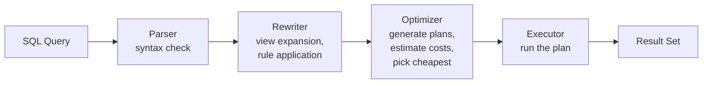
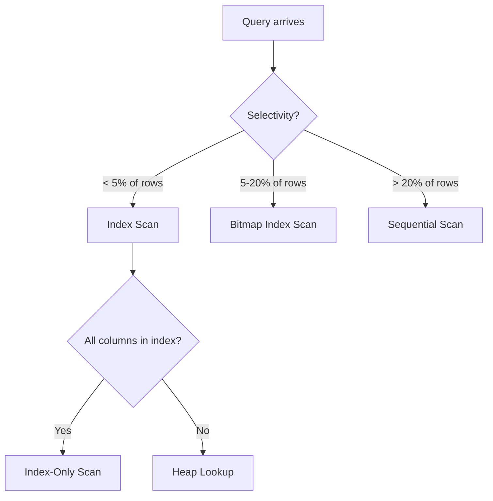
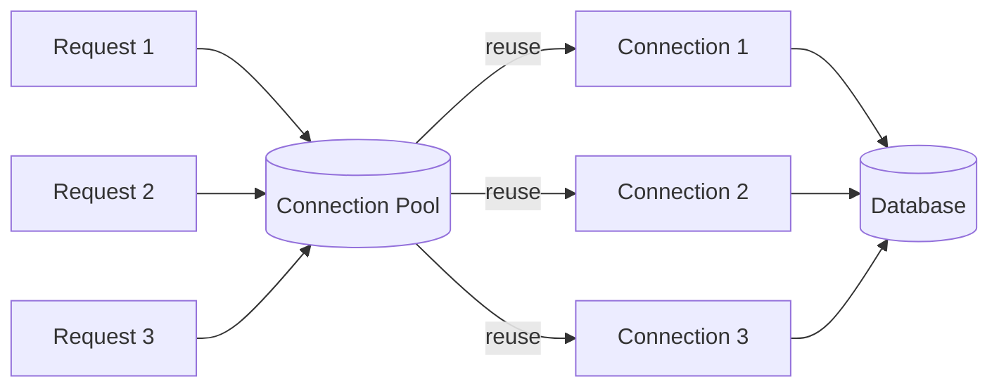

# Query Optimization

Query optimization is the process of choosing the most efficient execution plan for a SQL statement. The database optimizer evaluates multiple strategies — different join orders, index choices, and access methods — and picks the one with the lowest estimated cost.

---

## Query Execution Pipeline



| Stage | What Happens |
|-------|-------------|
| **Parser** | Checks SQL syntax, builds parse tree |
| **Rewriter** | Expands views, applies rules (e.g., predicate pushdown) |
| **Optimizer** | Generates candidate plans, estimates I/O and CPU cost, selects cheapest |
| **Executor** | Runs the selected plan against storage engine |

---

## Scan Methods

| Scan Type | How It Works | When Used |
|-----------|-------------|-----------|
| **Sequential Scan** | Reads every row in table order | No usable index, or low selectivity |
| **Index Scan** | Traverses B-tree, then fetches row from table | High selectivity, few matching rows |
| **Index-Only Scan** | Reads from index only, no table access | All needed columns are in the index (covering) |
| **Bitmap Index Scan** | Builds a bitmap of matching rows, then fetches | Medium selectivity, multiple conditions |



---

## Join Algorithms

The optimizer picks a join algorithm based on data sizes, available indexes, and memory.

### Nested Loop Join

For each row in the outer table, scan the inner table for matches. O(n × m) without an index on the inner table; O(n × log m) with an index.

```
FOR each row in orders:
    FOR each row in customers WHERE customers.id = orders.customer_id:
        emit joined row
```

**Best for**: Small outer table + indexed inner table.

### Hash Join

Build a hash table from the smaller table, then probe it with each row from the larger table. O(n + m).

```
BUILD hash table from customers (key = id)
FOR each row in orders:
    PROBE hash table with orders.customer_id
    emit joined row
```

**Best for**: Large unindexed tables, equi-joins only (`=`).

### Merge Join (Sort-Merge)

Sort both tables on the join key, then merge them in one pass. O(n log n + m log m) for sorting; O(n + m) if pre-sorted.

```
SORT orders BY customer_id
SORT customers BY id
MERGE both sorted streams on matching keys
```

**Best for**: Both tables already sorted (indexed), large equi-joins.

### Comparison

| Algorithm | Time Complexity | Memory | Index Required | Join Types |
|-----------|----------------|--------|---------------|------------|
| **Nested Loop** | O(n × m) or O(n × log m) | O(1) | Helps on inner | All types |
| **Hash Join** | O(n + m) | O(min(n,m)) | No | Equi-join only |
| **Merge Join** | O(n log n + m log m) | O(n + m) | Helps (pre-sorted) | Equi-join, range |

---

## Common Optimization Techniques

### 1. Predicate Pushdown

Move WHERE conditions as close to the data source as possible — filter early, process less.

```sql
-- Before optimization (filter after join)
SELECT * FROM orders o
JOIN products p ON o.product_id = p.id
WHERE p.category = 'electronics';

-- After pushdown (filter products first, then join)
-- The optimizer does this automatically
```

### 2. Projection Pushdown

Only read columns you need — reduces I/O and memory.

```sql
-- Bad: reads all columns, transfers unnecessary data
SELECT * FROM users WHERE id = 5;

-- Good: reads only needed columns, may enable index-only scan
SELECT name, email FROM users WHERE id = 5;
```

### 3. Index-Aware Query Writing

```sql
-- ❌ Function on indexed column — can't use index
SELECT * FROM users WHERE LOWER(email) = 'alice@example.com';

-- ✅ Expression index (PostgreSQL) or collation
CREATE INDEX idx_users_email_lower ON users (LOWER(email));

-- ❌ Implicit cast — may prevent index use
SELECT * FROM users WHERE phone = 12345;  -- phone is VARCHAR, literal is INT

-- ✅ Match types
SELECT * FROM users WHERE phone = '12345';

-- ❌ OR with different columns — usually can't use a single index
SELECT * FROM users WHERE email = 'a@b.com' OR name = 'Alice';

-- ✅ UNION of indexed queries
SELECT * FROM users WHERE email = 'a@b.com'
UNION ALL
SELECT * FROM users WHERE name = 'Alice' AND email != 'a@b.com';
```

### 4. Avoid N+1 Queries

The most common performance problem in application code.

```
// N+1 Problem: 1 query for orders + N queries for customers
orders = db.query("SELECT * FROM orders LIMIT 100")        // 1 query
for order in orders:
    customer = db.query("SELECT * FROM customers WHERE id = ?", order.customer_id)  // 100 queries
```

```sql
-- Fix: JOIN or batch fetch
SELECT o.*, c.name FROM orders o
JOIN customers c ON o.customer_id = c.id
LIMIT 100;

-- Or batch IN query
SELECT * FROM customers WHERE id IN (1, 2, 3, ..., 100);
```

### 5. Efficient Pagination

```sql
-- ❌ OFFSET-based (slow for deep pages — scans and discards rows)
SELECT * FROM articles ORDER BY created_at DESC LIMIT 20 OFFSET 10000;
-- Must scan 10,020 rows, discard 10,000

-- ✅ Keyset (cursor) pagination — constant time regardless of page depth
SELECT * FROM articles 
WHERE created_at < '2024-06-15T10:30:00'  -- cursor from last page
ORDER BY created_at DESC 
LIMIT 20;
```

| Method | Deep Page Performance | Supports Jump to Page | Consistency |
|--------|----------------------|----------------------|-------------|
| **OFFSET/LIMIT** | Degrades linearly | Yes | Inconsistent with concurrent writes |
| **Keyset/Cursor** | Constant | No | Consistent |

---

## Statistics and Cost Estimation

The optimizer relies on **table statistics** to estimate costs. Stale statistics lead to bad plans.

| Statistic | What It Tracks | Used For |
|-----------|---------------|----------|
| Row count | Estimated rows in table | Join ordering |
| Distinct values | NDV per column | Selectivity estimation |
| Most common values | Top N values + frequencies | Filter estimation |
| Histogram | Value distribution | Range query estimation |
| Correlation | Physical vs logical ordering | Sequential scan cost |

```sql
-- PostgreSQL: update statistics
ANALYZE users;

-- PostgreSQL: view statistics
SELECT * FROM pg_stats WHERE tablename = 'users';

-- MySQL: update statistics
ANALYZE TABLE users;

-- MySQL: view index cardinality
SHOW INDEX FROM users;
```

!!! warning "Stale Statistics"
    After bulk inserts, deletes, or schema changes, run `ANALYZE` (PostgreSQL) or `ANALYZE TABLE` (MySQL). Autovacuum handles this in PostgreSQL, but heavy write workloads may need manual intervention.

---

## Connection Pooling

Opening a database connection is expensive (TCP handshake, authentication, session setup). Connection pools maintain reusable connections.



| Parameter | Guideline |
|-----------|-----------|
| **Min connections** | Number of constant background tasks |
| **Max connections** | CPU cores × 2 + disk spindles (HikariCP formula) |
| **Idle timeout** | 10-30 minutes (avoid holding unused connections) |
| **Max lifetime** | 30 minutes (avoid stale connections past DNS/failover) |

| Pool Library | Language | Notes |
|-------------|----------|-------|
| **HikariCP** | Java/Kotlin | Default in Spring Boot, minimal overhead |
| **PgBouncer** | Any (proxy) | External proxy for PostgreSQL |
| **c3p0** | Java | Legacy, avoid in new projects |
| **SQLAlchemy Pool** | Python | Built into SQLAlchemy |

---

## Anti-Patterns

| Anti-Pattern | Problem | Fix |
|-------------|---------|-----|
| `SELECT *` | Reads unnecessary columns, prevents index-only scan | Select specific columns |
| N+1 queries | 1 + N round trips to database | JOIN or batch IN query |
| `OFFSET` for deep pages | Scans and discards rows | Keyset pagination |
| Function on indexed column | Prevents index use | Expression index or rewrite |
| Implicit type cast | May prevent index use | Match column types |
| Missing `LIMIT` on unbounded queries | May return millions of rows | Always LIMIT |
| `DISTINCT` to hide duplicate joins | Masks a bad query | Fix the JOIN logic |
| Correlated subquery | Re-executes per row | Rewrite as JOIN |

---

??? question "Interview Questions"

    **Q: How does a database decide between a sequential scan and an index scan?**

    The optimizer estimates the cost of each plan based on table statistics (row count, selectivity, correlation). If a query matches a small fraction of rows (high selectivity), an index scan is cheaper — fewer random I/Os. If it matches many rows, a sequential scan is cheaper because sequential I/O is much faster than random I/O. The crossover point is typically 5-20% of the table.

    **Q: Explain the N+1 query problem and how to fix it.**

    An N+1 problem occurs when code fetches a list of N items, then makes a separate query for each item's related data — 1 + N total queries. Fix with: (1) a JOIN that fetches everything in one query, (2) a batch IN query, or (3) an ORM eager loading strategy (`@EntityGraph` in JPA, `prefetch_related` in Django).

    **Q: Why is OFFSET pagination slow for deep pages?**

    `OFFSET 10000 LIMIT 20` must scan and discard 10,000 rows before returning 20. The database does the full sort and traversal up to offset + limit. Keyset pagination (`WHERE id > last_seen_id LIMIT 20`) uses an index and returns in constant time regardless of page depth.

    **Q: What's the difference between a hash join and a merge join?**

    Hash join builds an in-memory hash table from the smaller table and probes it — O(n+m) time, O(min(n,m)) memory, equi-joins only. Merge join sorts both inputs and merges — O(n log n + m log m) time (or O(n+m) if pre-sorted), works for range joins too. Hash join is usually faster for unindexed equi-joins; merge join wins when data is already sorted.

    **Q: How do stale statistics affect query performance?**

    The optimizer uses table statistics (row counts, value distributions, cardinality) to estimate costs. If statistics say a table has 100 rows when it actually has 10 million, the optimizer might choose a nested loop join instead of a hash join, or a sequential scan instead of an index scan. Fix with `ANALYZE`.

!!! tip "Further Reading"
    - [Use The Index, Luke — SQL Performance](https://use-the-index-luke.com/)
    - [PostgreSQL EXPLAIN Documentation](https://www.postgresql.org/docs/current/using-explain.html)
    - [MySQL Query Execution Plan](https://dev.mysql.com/doc/refman/8.0/en/execution-plan-information.html)
    - [HikariCP Connection Pool Sizing](https://github.com/brettwooldridge/HikariCP/wiki/About-Pool-Sizing)
