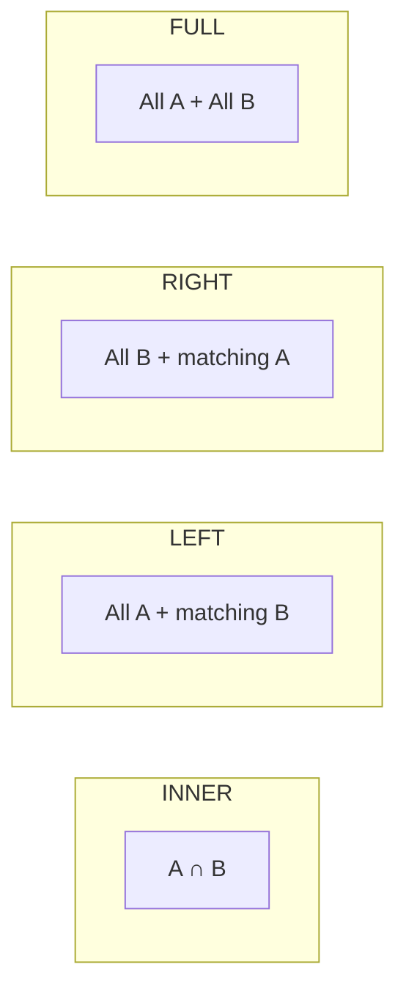
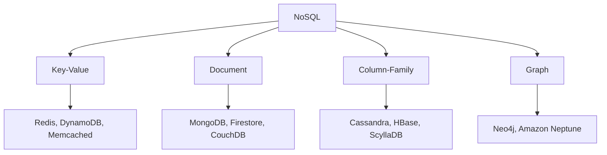
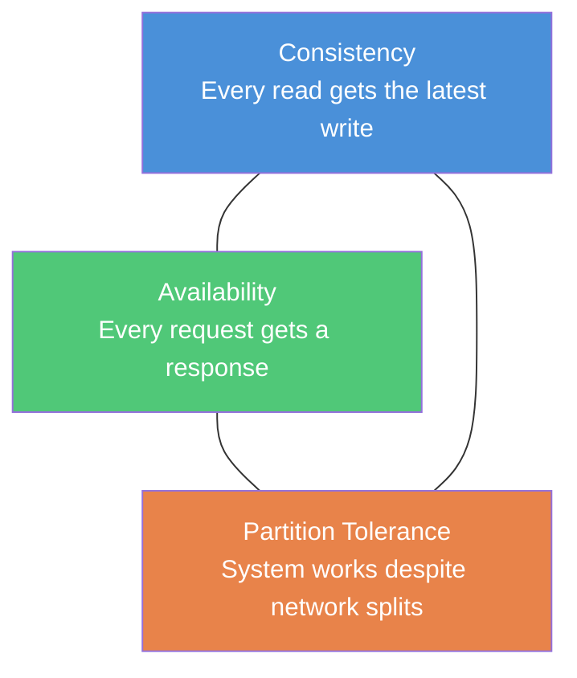
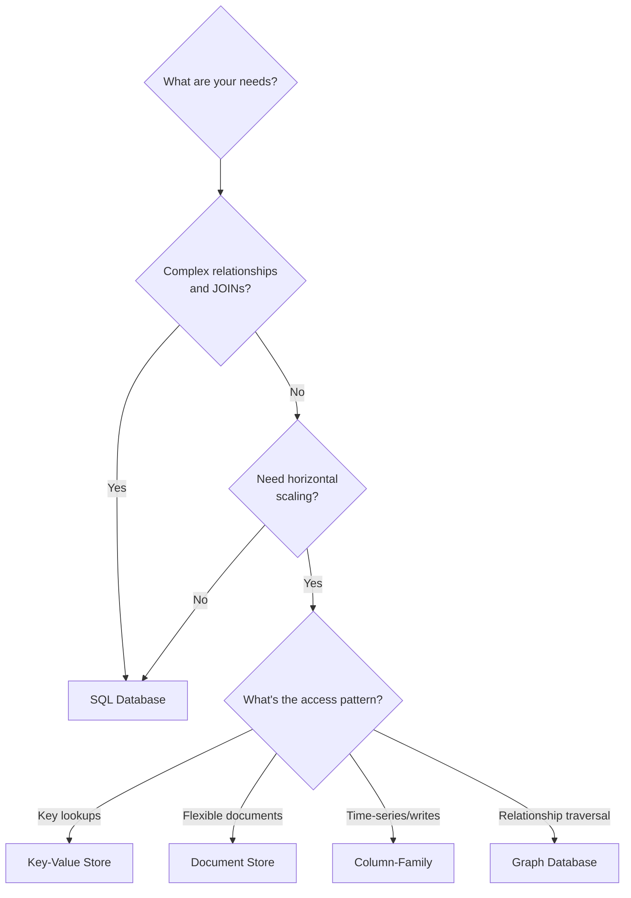

# SQL vs NoSQL

Two fundamentally different approaches to data storage — relational (SQL) and non-relational (NoSQL). The choice depends on data structure, scale, consistency requirements, and access patterns.

---

## SQL (Relational Databases)

Data is stored in **tables** with predefined schemas. Rows represent records; columns represent fields. Tables are linked through **foreign keys**.

### Core Properties — ACID

| Property | Meaning | Example |
|----------|---------|---------|
| **Atomicity** | Transaction is all-or-nothing | Bank transfer: debit + credit both succeed or both fail |
| **Consistency** | Data moves from one valid state to another | Foreign key constraints prevent orphan records |
| **Isolation** | Concurrent transactions don't interfere | Two users buying the last item — only one succeeds |
| **Durability** | Committed data survives crashes | Write-ahead log (WAL) ensures persistence |

### Normalization

Organizing data to **reduce redundancy** and improve integrity.

| Normal Form | Rule | Fix |
|-------------|------|-----|
| **1NF** | No repeating groups, atomic values | Split multi-valued columns into rows |
| **2NF** | 1NF + no partial dependencies | Remove columns that depend on part of a composite key |
| **3NF** | 2NF + no transitive dependencies | Remove columns that depend on non-key columns |

```sql
-- Denormalized (violations)
-- orders table with: order_id, customer_name, customer_email, product_name, product_price

-- 3NF normalized
CREATE TABLE customers (
    id INT PRIMARY KEY,
    name VARCHAR(100),
    email VARCHAR(100)
);

CREATE TABLE products (
    id INT PRIMARY KEY,
    name VARCHAR(100),
    price DECIMAL(10,2)
);

CREATE TABLE orders (
    id INT PRIMARY KEY,
    customer_id INT REFERENCES customers(id),
    product_id INT REFERENCES products(id),
    quantity INT,
    created_at TIMESTAMP DEFAULT CURRENT_TIMESTAMP
);
```

### Joins



```sql
-- INNER JOIN — only matching rows
SELECT o.id, c.name FROM orders o
INNER JOIN customers c ON o.customer_id = c.id;

-- LEFT JOIN — all orders, even without a customer match
SELECT o.id, c.name FROM orders o
LEFT JOIN customers c ON o.customer_id = c.id;

-- Aggregation
SELECT c.name, COUNT(o.id) as order_count, SUM(p.price * o.quantity) as total
FROM customers c
JOIN orders o ON c.id = o.customer_id
JOIN products p ON o.product_id = p.id
GROUP BY c.name
HAVING total > 100
ORDER BY total DESC;
```

### Indexes

Speed up reads at the cost of write performance and storage.

| Index Type | Use Case | Example |
|-----------|----------|---------|
| **B-Tree** (default) | Range queries, sorting, equality | `WHERE price > 100` |
| **Hash** | Exact equality lookups only | `WHERE email = 'user@example.com'` |
| **Composite** | Multi-column queries | `INDEX(country, city)` for `WHERE country = ... AND city = ...` |
| **Covering** | Query answered entirely from index | `INDEX(user_id, created_at) INCLUDE (amount)` |

```sql
CREATE INDEX idx_orders_customer ON orders(customer_id);
CREATE INDEX idx_orders_date ON orders(created_at DESC);
-- Composite: leftmost prefix rule applies
CREATE INDEX idx_customer_product ON orders(customer_id, product_id);
```

!!! warning "Index trade-offs"
    Every index slows down `INSERT`/`UPDATE`/`DELETE` (the index must be updated too). Don't index columns with low cardinality (e.g., boolean flags) — the optimizer will ignore them. Use `EXPLAIN ANALYZE` to verify indexes are actually used.

### Popular SQL Databases

| Database | Best For | Notable Feature |
|----------|----------|-----------------|
| **PostgreSQL** | General purpose, complex queries | JSONB support, extensions, full-text search |
| **MySQL** | Web applications, read-heavy | InnoDB engine, wide ecosystem |
| **SQLite** | Embedded/mobile, small datasets | File-based, zero configuration |
| **SQL Server** | Enterprise/.NET stack | Strong BI/reporting tools |

---

## NoSQL (Non-Relational Databases)

Designed for **flexible schemas, horizontal scaling, and specific access patterns**. Trade strict consistency for performance and availability.

### Types of NoSQL Databases



=== "Key-Value"

    Simplest model — a hash map at scale. `GET key → value`.

    ```
    SET user:1001 '{"name": "Sandy", "role": "admin"}'
    GET user:1001
    ```

    | Aspect | Details |
    |--------|---------|
    | **Strengths** | Sub-millisecond reads, simple API, easy horizontal scaling |
    | **Weaknesses** | No querying by value, no relationships, no partial updates |
    | **Use for** | Caching, sessions, rate limiting, feature flags |
    | **Examples** | Redis, Memcached, DynamoDB (also document) |

=== "Document"

    Stores **JSON/BSON documents** — each document is self-contained and can have a different structure.

    ```json
    {
      "_id": "order_1001",
      "customer": {
        "name": "Sandy",
        "email": "sandy@example.com"
      },
      "items": [
        { "product": "Laptop", "price": 999.99, "qty": 1 },
        { "product": "Mouse", "price": 29.99, "qty": 2 }
      ],
      "total": 1059.97,
      "status": "shipped"
    }
    ```

    | Aspect | Details |
    |--------|---------|
    | **Strengths** | Flexible schema, nested data, query by any field |
    | **Weaknesses** | No joins (must denormalize or use `$lookup`), data duplication |
    | **Use for** | Content management, catalogs, user profiles, event logging |
    | **Examples** | MongoDB, Firestore, CouchDB |

=== "Column-Family"

    Optimized for **write-heavy workloads** at massive scale. Data is grouped by column families, not rows.

    ```
    Row Key: user_1001
    ├── profile: { name: "Sandy", email: "sandy@ex.com" }
    └── activity: { last_login: "2026-05-01", page_views: 1523 }
    ```

    | Aspect | Details |
    |--------|---------|
    | **Strengths** | Linear horizontal scaling, high write throughput, time-series friendly |
    | **Weaknesses** | Limited query flexibility, no joins, eventual consistency |
    | **Use for** | IoT sensor data, time-series, analytics, messaging at scale |
    | **Examples** | Cassandra, HBase, ScyllaDB |

=== "Graph"

    Stores **nodes** and **edges** — optimized for traversing relationships.

    ```
    (Sandy)-[:FOLLOWS]->(Alex)
    (Sandy)-[:LIKES]->(Post:42)
    (Alex)-[:AUTHORED]->(Post:42)
    ```

    ```cypher
    // Find friends-of-friends who like the same posts
    MATCH (me:User {name: "Sandy"})-[:FOLLOWS]->(friend)-[:FOLLOWS]->(fof)
    WHERE NOT (me)-[:FOLLOWS]->(fof) AND fof <> me
    RETURN fof.name, COUNT(*) as mutual
    ORDER BY mutual DESC
    ```

    | Aspect | Details |
    |--------|---------|
    | **Strengths** | Relationship queries in O(1) per hop, intuitive data modeling |
    | **Weaknesses** | Not great for bulk analytics or simple CRUD |
    | **Use for** | Social networks, recommendation engines, fraud detection, knowledge graphs |
    | **Examples** | Neo4j, Amazon Neptune, ArangoDB |

### BASE Properties

NoSQL systems often follow BASE instead of ACID:

| Property | Meaning |
|----------|---------|
| **Basically Available** | System guarantees availability (may return stale data) |
| **Soft state** | State may change over time without input (due to replication lag) |
| **Eventually consistent** | Given enough time, all replicas converge to the same value |

---

## CAP Theorem

A distributed system can guarantee at most **two of three** properties simultaneously:



| Choice | Sacrifice | Database Examples |
|--------|-----------|-------------------|
| **CP** (Consistency + Partition Tolerance) | Availability during partitions | MongoDB, HBase, Redis Cluster |
| **AP** (Availability + Partition Tolerance) | Strong consistency | Cassandra, DynamoDB, CouchDB |
| **CA** (Consistency + Availability) | Partition tolerance (single node only) | Traditional RDBMS (PostgreSQL, MySQL) |

!!! note "CAP in practice"
    Network partitions **will** happen in distributed systems, so the real choice is between **CP** and **AP**. Most modern systems offer tunable consistency — e.g., Cassandra lets you configure consistency level per query (`ONE`, `QUORUM`, `ALL`).

---

## Head-to-Head Comparison

| Dimension | SQL | NoSQL |
|-----------|-----|-------|
| **Schema** | Fixed, predefined (DDL) | Dynamic, schema-on-read |
| **Data model** | Tables with rows and columns | Documents, key-value, graphs, wide-column |
| **Relationships** | Foreign keys + JOINs | Embedded/denormalized or application-level joins |
| **Scaling** | Vertical (bigger server) | Horizontal (add more nodes) |
| **Consistency** | Strong (ACID) | Tunable (eventual to strong) |
| **Query language** | SQL (standardized) | Database-specific APIs/query languages |
| **Transactions** | Multi-table, multi-row | Limited (single document in most NoSQL) |
| **Schema changes** | `ALTER TABLE` (can be expensive) | Just write different shaped data |
| **Best at** | Complex queries, aggregations, relationships | High throughput, flexible data, horizontal scale |

---

## When to Use Which



| Scenario | Choose | Why |
|----------|--------|-----|
| E-commerce with inventory, orders, payments | SQL (PostgreSQL) | ACID transactions, complex joins between orders/products/payments |
| User session storage | Key-Value (Redis) | Simple get/set, sub-ms latency, TTL expiration |
| Content management / blog platform | Document (MongoDB) | Flexible schemas, nested content, varied content types |
| IoT with millions of sensor writes/sec | Column-Family (Cassandra) | Write-optimized, linear horizontal scaling |
| Social network / recommendation engine | Graph (Neo4j) | Relationship traversal is the primary access pattern |
| Real-time analytics dashboard | SQL (ClickHouse) or Column-Family | Aggregation queries on large datasets |
| Mobile app with offline sync | Document (Firestore) | Built-in offline support, real-time sync |

!!! tip "Polyglot persistence"
    Modern systems often use **multiple databases** — SQL for transactional data, Redis for caching, Elasticsearch for search, a graph DB for recommendations. Pick the right tool for each access pattern.

---

??? question "Interview Questions"

    **Q: When would you choose NoSQL over SQL?**
    When you need horizontal scaling, have flexible/unstructured data, or your access patterns are simple (key lookups, document fetches). Also when schema evolution is frequent and `ALTER TABLE` migrations are too costly.

    **Q: Can NoSQL databases support transactions?**
    Some can — MongoDB supports multi-document ACID transactions (since 4.0), and DynamoDB supports transactional writes across items. However, transactions in NoSQL are typically slower and more limited than in SQL databases.

    **Q: Explain the CAP theorem with a real example.**
    During a network partition between two data centers, a CP system (like MongoDB with majority write concern) will reject writes to maintain consistency. An AP system (like Cassandra with `ONE` consistency) will accept writes on both sides, merging them later (potentially with conflicts).

    **Q: What is denormalization and when would you use it?**
    Storing redundant copies of data to avoid joins. In NoSQL, you embed related data in the same document (e.g., customer info inside each order). The trade-off: faster reads but harder updates (must update all copies). Use when read performance matters more than write complexity.

    **Q: How does indexing differ between SQL and NoSQL?**
    SQL uses B-tree indexes on columns with a query optimizer that chooses the best plan. Document databases (MongoDB) support similar indexes on any field, including nested fields and arrays. Key-value stores index only the key. Column-family stores optimize for partition key + clustering key access.

    **Q: What is sharding and how does it relate to SQL vs NoSQL?**
    Sharding splits data across multiple servers by a shard key. NoSQL databases (Cassandra, MongoDB) have built-in sharding. SQL databases can shard (e.g., Citus for PostgreSQL, Vitess for MySQL) but it adds complexity — cross-shard joins become expensive and distributed transactions are harder.

    **Q: When would you use both SQL and NoSQL in the same system?**
    Polyglot persistence — use each database for what it does best. Example: PostgreSQL for orders and inventory (transactional), Redis for session cache and rate limiting (speed), Elasticsearch for product search (full-text), Neo4j for "customers also bought" (graph traversal).

!!! tip "Further Reading"
    - [Designing Data-Intensive Applications](https://dataintensive.net/) — Martin Kleppmann's definitive guide to database internals and distributed systems
    - [MongoDB vs PostgreSQL](https://www.mongodb.com/compare/mongodb-postgresql) — official comparison
    - [CAP Theorem Revisited](https://www.infoq.com/articles/cap-twelve-years-later-how-the-rules-have-changed/) — Eric Brewer's updated perspective
