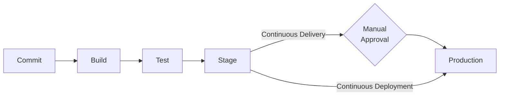
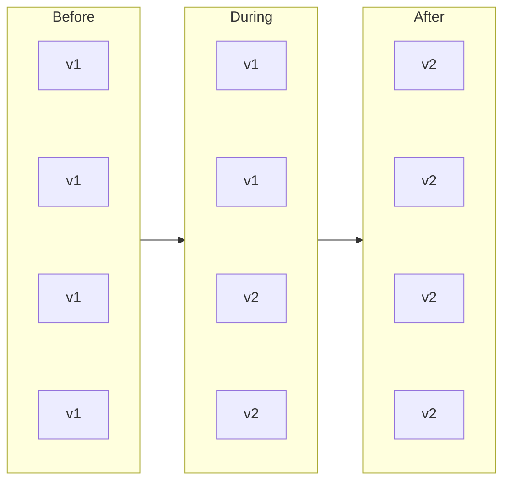
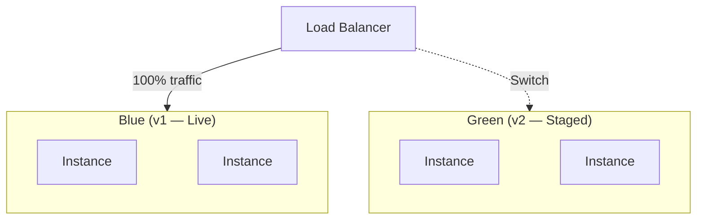
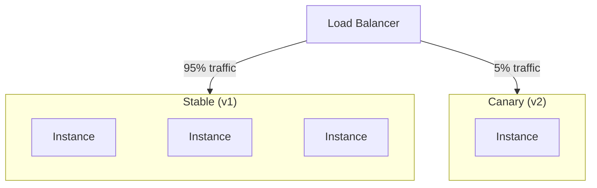
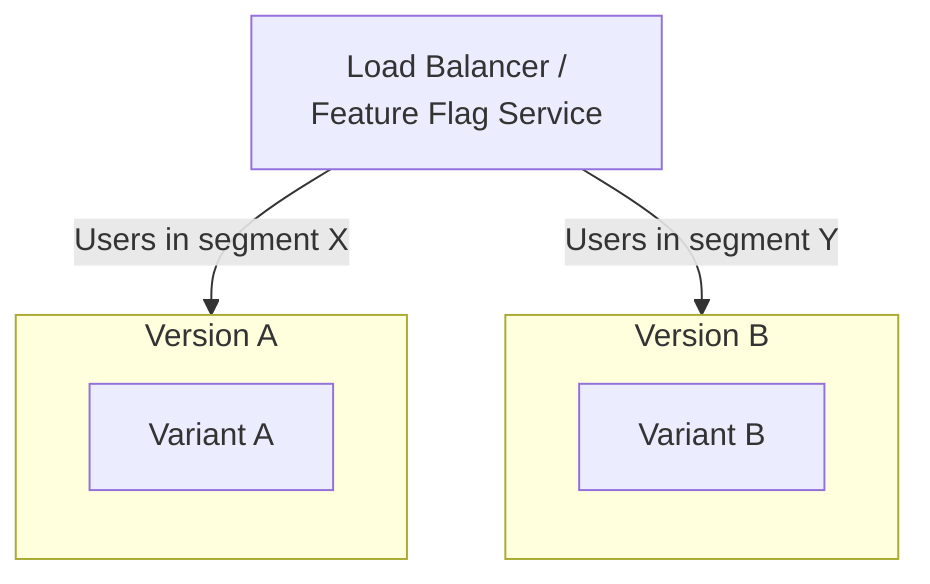
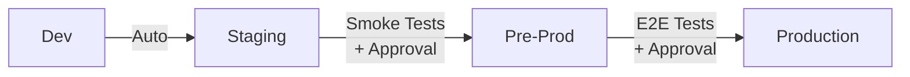
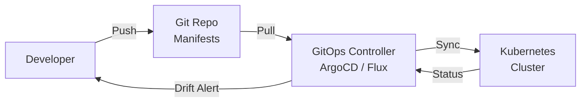

# Continuous Delivery & Deployment

Continuous Delivery ensures every commit is production-ready. Continuous Deployment goes one step further — every passing commit ships automatically. Both require mature testing, observability, and rollback capabilities.

---

## CD vs Continuous Deployment

| Aspect | Continuous Delivery | Continuous Deployment |
|--------|--------------------|-----------------------|
| **Definition** | Every commit *can* be deployed; production release requires manual approval | Every commit that passes the pipeline *is* deployed automatically |
| **Manual step** | Yes — approval gate before production | No — fully automated |
| **Risk tolerance** | Lower — human judgment at release time | Higher — requires robust automated quality gates |
| **Release frequency** | On-demand (daily to weekly) | Per commit (multiple times per day) |
| **Prerequisites** | Solid CI, staging environment, test coverage | All of Continuous Delivery + feature flags, canary releases, advanced monitoring |
| **Common in** | Enterprise, regulated industries, mobile apps | SaaS, web apps, cloud-native services |



---

## Deployment Strategies

### Rolling Update

Gradually replaces old instances with new ones. At any point during deployment, both versions are running.



### Blue/Green

Two identical environments. Route traffic from blue (current) to green (new) in one switch.



### Canary

Route a small percentage of traffic to the new version. Monitor metrics, then gradually increase.



### A/B Testing

Route traffic based on user segments (not random percentage). Used to test feature variants against business metrics.



### Strategy Comparison

| Strategy | Downtime | Rollback Speed | Resource Cost | Risk Level | Complexity |
|----------|----------|----------------|---------------|------------|------------|
| **Rolling** | Zero | Slow (re-roll) | Low (in-place) | Medium | Low |
| **Blue/Green** | Zero | Instant (switch back) | High (2x infra) | Low | Medium |
| **Canary** | Zero | Fast (route away) | Low-Medium | Low | High |
| **A/B Testing** | Zero | Fast (route away) | Medium | Low | High |
| **Recreate** | Yes | Slow (redeploy) | Low | High | Low |

---

## Environment Promotion



| Environment | Purpose | Deployment Trigger | Data |
|-------------|---------|-------------------|------|
| **Dev** | Developer testing, integration | Every push to main | Synthetic / fixtures |
| **Staging** | QA, regression testing | Auto after dev passes | Anonymized production-like |
| **Pre-Prod** | Final validation, performance testing | Manual promotion | Production mirror |
| **Production** | Live users | Approval gate or auto (CD) | Real data |

!!! warning "Environment Parity"
    Staging should mirror production as closely as possible — same OS, runtime versions, network topology, and data shape. Divergence between environments is a top source of production-only failures.

---

## Approval Gates and Manual Checkpoints

| Gate Type | When to Use | Implementation |
|-----------|------------|----------------|
| **Automated quality gate** | Always — test pass, coverage, security scan | Pipeline stage with pass/fail |
| **Manual approval** | Before production in Continuous Delivery | GitHub Environments, GitLab manual jobs, Slack bot |
| **Change advisory board (CAB)** | Regulated industries, high-risk changes | Formal review process, documented sign-off |
| **Scheduled release window** | When deployments need coordination | Cron-triggered pipeline, maintenance windows |

```yaml
# GitHub Actions: manual approval via environment
deploy-production:
  runs-on: ubuntu-latest
  needs: deploy-staging
  environment:
    name: production
    url: https://app.example.com
  steps:
    - name: Deploy
      run: ./deploy.sh production
```

---

## Feature Flags

Feature flags decouple deployment from release — code ships to production but features activate independently.

| Pattern | Description | Use Case |
|---------|-------------|----------|
| **Release toggle** | On/off switch for incomplete features | Ship WIP code safely behind a flag |
| **Ops toggle** | Runtime kill-switch for features | Disable a feature causing issues without redeploying |
| **Experiment toggle** | A/B test variant selection | Measure impact of a feature on business metrics |
| **Permission toggle** | Feature access by user role/tier | Premium features, beta access |

```python
# Simple feature flag check
if feature_flags.is_enabled("new-checkout-flow", user_id=user.id):
    return render_new_checkout()
else:
    return render_legacy_checkout()
```

!!! note "Flag Hygiene"
    Feature flags are technical debt. Establish a lifecycle: create → activate → measure → remove. Stale flags increase code complexity and testing surface area.

---

## GitOps

GitOps uses Git as the single source of truth for declarative infrastructure and application state. A reconciliation controller continuously syncs the desired state (in Git) with the actual state (in the cluster).

| Principle | Description |
|-----------|-------------|
| **Declarative** | Desired state described in code (YAML, Helm, Kustomize) |
| **Versioned and immutable** | All changes go through Git — full audit trail |
| **Pulled automatically** | Controller pulls desired state from Git (not pushed by CI) |
| **Continuously reconciled** | Drift from desired state is detected and corrected automatically |



### ArgoCD vs Flux

| Feature | ArgoCD | Flux |
|---------|--------|------|
| **UI** | Rich web UI with visualization | Minimal (CLI-focused) |
| **Multi-cluster** | Native support | Via Kustomization targets |
| **Helm support** | Yes | Yes (Helm Controller) |
| **Sync strategies** | Auto-sync, manual, selective | Auto-reconciliation |
| **Notifications** | Built-in (Slack, webhook, etc.) | Via Notification Controller |
| **Maturity** | CNCF Graduated | CNCF Graduated |
| **Best for** | Teams wanting visibility and UI | Teams preferring GitOps-native, minimal footprint |

---

## Rollback Strategies

| Strategy | Speed | Mechanism | Tradeoff |
|----------|-------|-----------|----------|
| **Redeploy previous version** | Minutes | Re-run pipeline with previous commit/tag | Requires working CI, takes time |
| **Blue/green switch** | Seconds | Route traffic back to old environment | Requires blue/green infrastructure |
| **Canary abort** | Seconds | Stop routing traffic to canary | Only works during canary phase |
| **GitOps revert** | Minutes | `git revert` on manifest repo, controller syncs | Clean audit trail, automated reconciliation |
| **Feature flag disable** | Seconds | Toggle flag off remotely | Feature must be behind a flag |
| **Database rollback** | Varies | Run reverse migration | Risky — may lose data if not backward-compatible |

!!! warning "Backward-Compatible Migrations"
    Always write database migrations that are backward-compatible. Deploy the schema change first, then the code that uses it. This ensures safe rollback without data loss.

---

??? question "Interview Questions"

    **Q: What is the difference between Continuous Delivery and Continuous Deployment?**

    Continuous Delivery means every commit is potentially releasable but requires a manual approval step before production. Continuous Deployment removes that manual step — every commit that passes all automated checks is deployed to production automatically. Continuous Deployment requires higher maturity in testing, monitoring, and rollback capabilities.

    **Q: When would you choose a canary deployment over blue/green?**

    Canary is better when you want to validate with real production traffic at low risk before committing to a full rollout — you start with 1-5% of traffic and scale up. Blue/green is better when you need instant, atomic switchover and can afford double the infrastructure. Canary is more cost-efficient but requires traffic splitting and granular monitoring.

    **Q: How do feature flags help with continuous delivery?**

    Feature flags decouple deployment from release. You can deploy incomplete or risky features to production behind a flag, ship code more frequently without waiting for a feature to be complete, run A/B experiments, and instantly disable features causing issues — all without redeploying. The tradeoff is added code complexity and the need for flag lifecycle management.

    **Q: What is GitOps and why is it useful?**

    GitOps uses Git as the single source of truth for infrastructure and application state. A controller (ArgoCD, Flux) continuously reconciles the cluster state with what is declared in Git. Benefits: full audit trail, easy rollback (`git revert`), declarative and reproducible state, and drift detection. It shifts the deployment model from push (CI pushes to cluster) to pull (controller pulls from Git).

    **Q: How would you handle a failed production deployment?**

    Immediate response: if canary/blue-green, route traffic away from the bad version. If feature-flagged, disable the flag. Then investigate: check monitoring dashboards, error rates, and logs. For rollback: either revert the Git commit (GitOps) or redeploy the previous known-good version. Post-incident: run a blameless postmortem, add the failure scenario to the test suite, and improve monitoring/alerting for the failure mode.

    **Q: What are environment promotion best practices?**

    Maintain environment parity (staging mirrors prod). Use the same artifact across all environments — inject environment-specific config at deploy time, never rebuild. Automate promotion where possible with quality gates at each stage. Run progressively more realistic tests at each level (unit → integration → E2E → performance). Require approval before production, and always have a rollback plan.

!!! tip "Further Reading"
    - [Continuous Delivery — Jez Humble & David Farley](https://continuousdelivery.com/)
    - [ArgoCD Documentation](https://argo-cd.readthedocs.io/)
    - [FluxCD Documentation](https://fluxcd.io/docs/)
    - [Feature Toggles — Martin Fowler](https://martinfowler.com/articles/feature-toggles.html)
