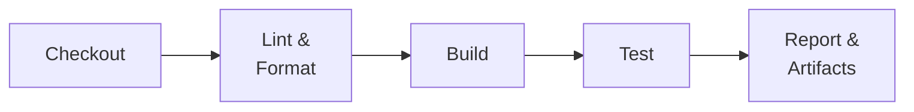
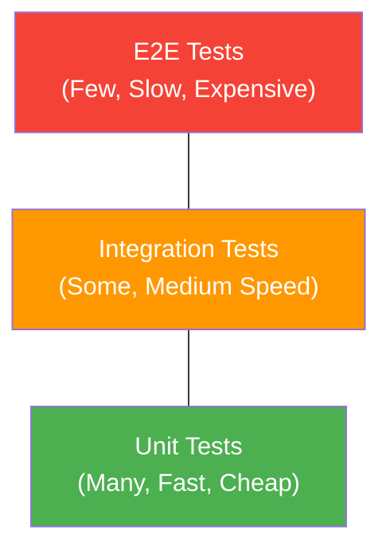
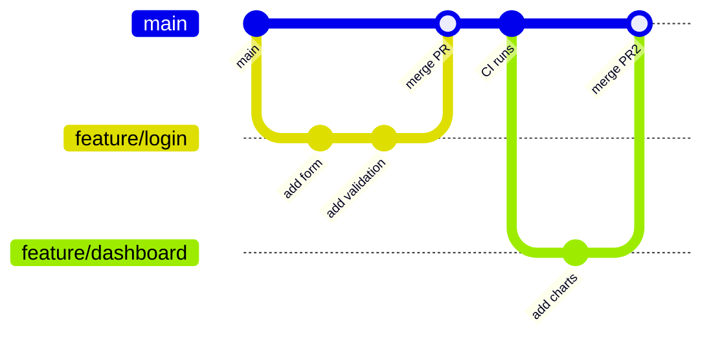

# Continuous Integration

Continuous Integration (CI) is the practice of merging developer work into a shared mainline frequently — ideally multiple times per day — with every integration verified by an automated build and test pipeline.

---

## CI Principles

| Principle | Why It Matters |
|-----------|---------------|
| **Commit often** | Small, frequent commits reduce merge conflicts and make failures easier to isolate |
| **Automate everything** | Manual steps are error-prone and slow — builds, tests, and quality checks should be fully automated |
| **Fix broken builds immediately** | A broken main branch blocks the entire team; fixing it takes priority over new work |
| **Keep builds fast** | Slow feedback loops reduce developer productivity; target < 10 minutes for CI |
| **Maintain a single source of truth** | All code, config, and pipeline definitions live in version control |
| **Everyone commits to mainline** | Long-lived branches create integration debt — merge early and often |

---

## CI Pipeline Stages



| Stage | Purpose | Tools |
|-------|---------|-------|
| **Checkout** | Clone repo, restore branch state | `git checkout`, `actions/checkout` |
| **Lint & Format** | Enforce code style, catch syntax issues early | ESLint, ktlint, Detekt, Black, Prettier |
| **Build** | Compile code, resolve dependencies | Gradle, Maven, npm, cargo, go build |
| **Test** | Run automated test suites | JUnit, pytest, Jest, go test |
| **Report** | Publish results, upload artifacts, notify | JaCoCo, Codecov, Slack notifications |

---

## Testing Pyramid



| Level | Scope | Speed | Cost | Coverage Goal |
|-------|-------|-------|------|---------------|
| **Unit** | Single function/class | ms | Low | 70-80% of tests |
| **Integration** | Module interactions, APIs, DB | Seconds | Medium | 15-20% of tests |
| **E2E** | Full user flows, UI | Minutes | High | 5-10% of tests |

!!! warning "Anti-pattern: Ice Cream Cone"
    Inverting the pyramid (many E2E, few unit tests) leads to slow, flaky, expensive CI. Prefer fast, isolated unit tests as the foundation.

---

## Code Quality Gates

| Gate | What It Checks | Example Threshold |
|------|---------------|-------------------|
| **Linting** | Code style, formatting | Zero warnings |
| **Static analysis** | Bug patterns, complexity, security | No critical/high issues |
| **Test coverage** | Percentage of code covered by tests | ≥ 80% line coverage |
| **Dependency audit** | Known vulnerabilities in dependencies | Zero critical CVEs |
| **Build success** | Code compiles without errors | Required |

```yaml
# Example: coverage gate in GitHub Actions
- name: Check coverage threshold
  run: |
    COVERAGE=$(cat coverage/coverage-summary.json | jq '.total.lines.pct')
    if (( $(echo "$COVERAGE < 80" | bc -l) )); then
      echo "Coverage $COVERAGE% is below 80% threshold"
      exit 1
    fi
```

---

## Artifact Management

| Concept | Description |
|---------|-------------|
| **Build artifacts** | Compiled binaries, JARs, AABs, static bundles — outputs of the build stage |
| **Container images** | Docker/OCI images tagged with commit SHA or semantic version |
| **Versioning** | Use semantic versioning (`MAJOR.MINOR.PATCH`) or commit-SHA-based tags for traceability |
| **Registry** | Centralized storage for artifacts — Docker Hub, GitHub Packages, Artifactory, ECR |
| **Retention** | Auto-expire old artifacts to manage storage costs; keep production releases indefinitely |

!!! note "Immutable Artifacts"
    Build once, deploy everywhere. The same artifact should move through dev → staging → prod without rebuilding. Environment-specific config is injected at deploy time.

---

## Branch Strategies and CI

| Strategy | Branch Lifetime | Merge Frequency | CI Complexity | Best For |
|----------|----------------|-----------------|---------------|----------|
| **Trunk-based** | Hours | Continuous | Low | High-performing teams, continuous deployment |
| **Feature branches** | Days | Per feature | Medium | Most teams, code review via PRs |
| **Gitflow** | Weeks-months | Per release | High | Packaged software, strict release cycles |



!!! tip "Trunk-Based Development"
    High-performing teams (per DORA research) favor trunk-based development with short-lived feature branches (< 1 day). Feature flags decouple deployment from feature release.

---

## Example CI Workflows

=== "GitHub Actions"

    ```yaml
    # .github/workflows/ci.yml
    name: CI

    on:
      push:
        branches: [main]
      pull_request:
        branches: [main]

    jobs:
      lint:
        runs-on: ubuntu-latest
        steps:
          - uses: actions/checkout@v4
          - uses: actions/setup-node@v4
            with:
              node-version: 20
              cache: npm
          - run: npm ci
          - run: npm run lint

      test:
        runs-on: ubuntu-latest
        needs: lint
        steps:
          - uses: actions/checkout@v4
          - uses: actions/setup-node@v4
            with:
              node-version: 20
              cache: npm
          - run: npm ci
          - run: npm test -- --coverage
          - uses: actions/upload-artifact@v4
            with:
              name: coverage-report
              path: coverage/

      build:
        runs-on: ubuntu-latest
        needs: test
        steps:
          - uses: actions/checkout@v4
          - uses: actions/setup-node@v4
            with:
              node-version: 20
              cache: npm
          - run: npm ci
          - run: npm run build
          - uses: actions/upload-artifact@v4
            with:
              name: build-output
              path: dist/
    ```

=== "GitLab CI"

    ```yaml
    # .gitlab-ci.yml
    stages:
      - lint
      - test
      - build

    variables:
      NODE_VERSION: "20"

    lint:
      stage: lint
      image: node:${NODE_VERSION}
      cache:
        paths:
          - node_modules/
      script:
        - npm ci
        - npm run lint

    test:
      stage: test
      image: node:${NODE_VERSION}
      cache:
        paths:
          - node_modules/
      script:
        - npm ci
        - npm test -- --coverage
      artifacts:
        paths:
          - coverage/
        expire_in: 7 days
      coverage: '/Lines\s*:\s*(\d+\.?\d*)%/'

    build:
      stage: build
      image: node:${NODE_VERSION}
      cache:
        paths:
          - node_modules/
      script:
        - npm ci
        - npm run build
      artifacts:
        paths:
          - dist/
        expire_in: 30 days
    ```

---

## Monorepo CI Considerations

In monorepos, running the full pipeline for every change is wasteful. Use path filters and affected-only builds to keep CI fast.

| Technique | How It Works | Example |
|-----------|-------------|---------|
| **Path filters** | Only trigger jobs when relevant files change | `paths: ['services/api/**']` in GitHub Actions |
| **Affected-only builds** | Dependency graph analysis to build/test only what changed | Nx `affected`, Turborepo, Bazel |
| **Shared caching** | Remote cache shared across all projects in the monorepo | Nx Cloud, Turborepo Remote Cache |
| **Parallel jobs** | Run independent project CI in parallel | Matrix strategy, dynamic job generation |

```yaml
# GitHub Actions path filter example
on:
  push:
    paths:
      - 'services/api/**'
      - 'libs/shared/**'
```

!!! note "Nx Affected"
    ```bash
    # Only test projects affected by changes since main
    npx nx affected --target=test --base=main --head=HEAD
    ```

---

??? question "Interview Questions"

    **Q: What is Continuous Integration and why is it important?**

    CI is the practice of automatically building and testing code every time a developer pushes changes to the shared repository. It catches integration issues early, reduces merge conflicts, and provides fast feedback — preventing the "integration hell" of infrequent merges.

    **Q: How would you design a CI pipeline for a new project?**

    Start with the fastest checks first (lint, format) to fail fast, then build, then unit tests, then integration tests. Use caching for dependencies, parallelize independent stages, enforce quality gates (coverage thresholds, zero lint errors), and publish artifacts. Target total pipeline time under 10 minutes.

    **Q: What is the testing pyramid and why does it matter for CI?**

    The testing pyramid recommends many fast unit tests at the base, fewer integration tests in the middle, and minimal E2E tests at the top. This structure keeps CI fast and reliable — E2E-heavy pipelines are slow and flaky, creating bottlenecks.

    **Q: Trunk-based development vs. Gitflow — when would you use each?**

    Trunk-based development works best for teams practicing continuous deployment with feature flags — short-lived branches, fast merges, minimal integration risk. Gitflow suits projects with scheduled releases, strict versioning (e.g., mobile apps, SDKs), where release branches need independent stabilization.

    **Q: How do you handle flaky tests in CI?**

    First, identify flaky tests with retry-and-flag mechanisms. Quarantine flaky tests so they don't block the pipeline but still run for visibility. Fix root causes (race conditions, time-dependent logic, external dependencies). Use test isolation, deterministic fixtures, and mock external services.

    **Q: How do you keep CI pipelines fast in a monorepo?**

    Use affected-only builds (Nx, Bazel) to skip unchanged projects. Apply path filters to trigger only relevant jobs. Leverage remote caching so unchanged modules use cached results. Parallelize independent project builds. Consider splitting into separate pipelines per service boundary.

!!! tip "Further Reading"
    - [Continuous Integration — Martin Fowler](https://martinfowler.com/articles/continuousIntegration.html)
    - [GitHub Actions Documentation](https://docs.github.com/en/actions)
    - [GitLab CI/CD Documentation](https://docs.gitlab.com/ee/ci/)
    - [Trunk-Based Development](https://trunkbaseddevelopment.com/)
