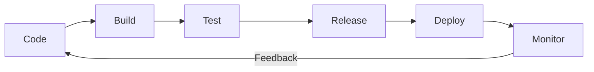

# CI/CD

Continuous Integration and Continuous Delivery/Deployment (CI/CD) is the backbone of modern software delivery. It automates the path from code commit to production, reducing human error, accelerating feedback loops, and enabling teams to ship reliably at high velocity.

---

## Pipeline Flow

---

## Sub-Topics

| Topic | What It Covers |
|-------|---------------|
| [Continuous Integration](continuous-integration.md) | CI principles, pipeline stages, testing pyramid, code quality gates, branch strategies, example workflows |
| [Continuous Delivery & Deployment](continuous-delivery.md) | CD vs Continuous Deployment, deployment strategies (rolling, blue/green, canary), GitOps, rollbacks |
| [Pipeline Design Patterns](pipeline-design.md) | Pipeline-as-code, caching, parallelization, secrets management, DORA metrics, security |

---

## CI/CD Platforms Comparison

| Platform | Type | Configuration | Strengths | Best For |
|----------|------|---------------|-----------|----------|
| **GitHub Actions** | Cloud-hosted | YAML (`.github/workflows/`) | Native GitHub integration, marketplace of actions, generous free tier | Open source, GitHub-native teams |
| **GitLab CI** | Cloud / Self-hosted | YAML (`.gitlab-ci.yml`) | Built-in container registry, Auto DevOps, single platform for SCM + CI | Full DevOps lifecycle in one tool |
| **Jenkins** | Self-hosted | Groovy (`Jenkinsfile`) | Extremely extensible, massive plugin ecosystem, full control | Enterprise with complex requirements |
| **CircleCI** | Cloud / Self-hosted | YAML (`.circleci/config.yml`) | Fast execution, powerful caching, Docker-first | Teams needing speed and Docker workflows |
| **ArgoCD** | Self-hosted (K8s) | Declarative YAML/Helm/Kustomize | GitOps-native, K8s-first, drift detection, auto-sync | Kubernetes-native continuous delivery |

---

## Key Terminology

| Term | Definition |
|------|-----------|
| **Continuous Integration** | Merging code to main frequently with automated build and test on every push |
| **Continuous Delivery** | Every commit is releasable; deployment to production requires manual approval |
| **Continuous Deployment** | Every commit that passes the pipeline is deployed to production automatically |
| **Pipeline** | Automated sequence of stages that code passes through from commit to deploy |
| **Artifact** | Build output (binary, container image, package) produced by the pipeline |
| **Gate** | Quality or approval checkpoint that must pass before the pipeline continues |

!!! tip "Further Reading"
    - [Continuous Delivery — Martin Fowler](https://martinfowler.com/bliki/ContinuousDelivery.html)
    - [DORA State of DevOps Reports](https://dora.dev/research/)
    - [The DevOps Handbook](https://itrevolution.com/product/the-devops-handbook-second-edition/)
    - [minimumcd.org — Minimum Viable CD](https://minimumcd.org/)
