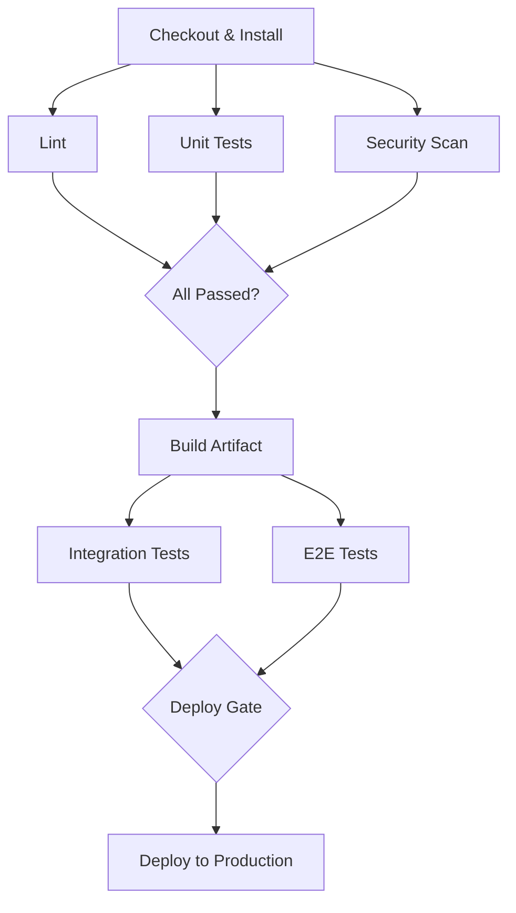

# Pipeline Design Patterns

Well-designed pipelines are fast, reliable, and maintainable. Poor pipeline design leads to slow feedback, flaky builds, and developer frustration. This page covers the patterns and practices that separate robust pipelines from fragile ones.

---

## Pipeline Architecture Principles

| Principle | What It Means |
|-----------|--------------|
| **Fast feedback** | Developers should know if their commit is broken within minutes, not hours |
| **Fail fast** | Run the cheapest, fastest checks first — lint before build, unit tests before E2E |
| **Idempotent stages** | Running a stage twice with the same input produces the same output |
| **Hermetic builds** | Builds don't depend on host state — everything is declared and reproducible |
| **Immutable artifacts** | Build once, deploy the same artifact to every environment |
| **Pipeline as code** | Pipeline definitions live in the repo, versioned alongside application code |

---

## Pipeline as Code

Pipeline definitions should be committed, reviewed, and versioned like any other code.

| Benefit | Description |
|---------|-------------|
| **Version control** | Pipeline changes are tracked, diffable, and auditable |
| **Code review** | Pipeline changes go through the same PR process as application code |
| **Reproducibility** | Any historical pipeline state can be reconstructed from Git history |
| **Self-documentation** | The pipeline definition *is* the documentation |
| **Branch-specific** | Feature branches can modify their own pipeline without affecting main |

```yaml
# Pipeline as code — lives in the repo root
# .github/workflows/ci.yml or .gitlab-ci.yml
# Changes reviewed via PR, versioned with the codebase
```

!!! warning "Avoid UI-Configured Pipelines"
    Pipelines configured through a CI tool's web UI are not version-controlled, not reviewable, and not reproducible. Always define pipelines in code.

---

## Caching Strategies

Caching avoids redundant work across pipeline runs. The right caching strategy can cut pipeline time by 50% or more.

| Cache Type | What It Caches | Cache Key | Invalidation |
|-----------|---------------|-----------|-------------|
| **Dependency cache** | `node_modules/`, `.gradle/`, `~/.m2/` | Hash of lockfile (`package-lock.json`, `gradle.lockfile`) | Lockfile changes |
| **Build cache** | Compiled outputs, intermediate artifacts | Hash of source files + build config | Source or config changes |
| **Docker layer cache** | Image layers from `Dockerfile` | Layer content hash | `Dockerfile` or context changes |
| **Test result cache** | Previous test outcomes for unchanged code | Hash of test files + source | Code changes |
| **Remote cache** | Shared across all CI runs (Nx, Bazel, Turborepo) | Content-addressable hash | Content changes |

=== "GitHub Actions Cache"

    ```yaml
    - uses: actions/cache@v4
      with:
        path: ~/.gradle/caches
        key: gradle-${{ hashFiles('**/*.gradle*', '**/gradle-wrapper.properties') }}
        restore-keys: |
          gradle-
    ```

=== "GitLab CI Cache"

    ```yaml
    build:
      cache:
        key:
          files:
            - package-lock.json
        paths:
          - node_modules/
        policy: pull-push
    ```

---

## Parallelization and Fan-Out/Fan-In

Run independent stages concurrently to reduce total pipeline time. Fan-out into parallel jobs, fan-in to a single aggregation step.



| Pattern | Description | Use Case |
|---------|-------------|----------|
| **Fan-out** | Split pipeline into parallel branches | Run lint, test, and security scan simultaneously |
| **Fan-in** | Wait for all parallel branches before continuing | Merge results before deploy decision |
| **Matrix** | Run the same job across multiple configurations | Test on Node 18, 20, 22 × Ubuntu, macOS |
| **Sharding** | Split a single test suite across parallel runners | Distribute 2000 tests across 4 runners |

---

## Secrets Management

| Approach | Security | Ease of Use | Rotation | Best For |
|----------|----------|-------------|----------|----------|
| **CI environment variables** | Medium — encrypted at rest | Easy — set in CI UI | Manual | Small teams, simple setups |
| **GitHub/GitLab secrets** | Medium-High — scoped to repo/environment | Easy — native UI | Manual | Most teams |
| **Vault (HashiCorp)** | High — dynamic secrets, audit log | Medium — requires agent/integration | Automatic | Enterprise, compliance-heavy |
| **Cloud KMS/Secrets Manager** | High — IAM-scoped, audit log | Medium — requires cloud SDK | Configurable | Cloud-native teams |
| **OIDC federation** | High — no stored secrets | Medium — requires setup | N/A (token-based) | Cloud deployments from CI |

```yaml
# GitHub Actions: OIDC with AWS (no stored secrets)
permissions:
  id-token: write
  contents: read

steps:
  - uses: aws-actions/configure-aws-credentials@v4
    with:
      role-to-assume: arn:aws:iam::123456789012:role/ci-deploy
      aws-region: us-east-1
```

!!! warning "Never Hardcode Secrets"
    Secrets must never appear in pipeline definitions, Dockerfiles, or source code. Use secret masking in CI logs. Audit secret access regularly. Rotate secrets after any suspected exposure.

---

## Matrix Builds

Matrix builds test across multiple dimensions (OS, language version, dependency version) using a single job definition.

```yaml
# GitHub Actions matrix example
jobs:
  test:
    strategy:
      matrix:
        os: [ubuntu-latest, macos-latest, windows-latest]
        node-version: [18, 20, 22]
      fail-fast: false
    runs-on: ${{ matrix.os }}
    steps:
      - uses: actions/checkout@v4
      - uses: actions/setup-node@v4
        with:
          node-version: ${{ matrix.node-version }}
      - run: npm ci
      - run: npm test
```

!!! note "`fail-fast: false`"
    By default, GitHub Actions cancels all matrix jobs if one fails. Set `fail-fast: false` to run all combinations to completion — useful for understanding the full compatibility picture.

---

## Self-Hosted vs Cloud Runners

| Factor | Cloud Runners | Self-Hosted Runners |
|--------|--------------|---------------------|
| **Setup** | Zero — managed by CI provider | Manual — install, configure, maintain |
| **Cost** | Per-minute billing, free tier available | Infrastructure cost (EC2, bare metal) |
| **Maintenance** | None — updates handled by provider | OS patches, agent updates, monitoring |
| **Performance** | Standard specs, cold start possible | Custom hardware, GPUs, warm cache |
| **Security** | Shared infrastructure (provider-isolated) | Full control, network isolation |
| **Scaling** | Auto-scales on demand | Manual or auto-scale (K8s runners, EC2 ASG) |
| **Network** | Public internet access | Private network access (internal registries, DBs) |
| **Best for** | Most workloads, open source | Large builds, GPU-heavy, airgap/compliance, private resources |

!!! tip "Hybrid Approach"
    Many teams use cloud runners for standard CI and self-hosted runners for specific needs — GPU builds, private network access, or performance-sensitive jobs. GitHub Actions and GitLab CI both support mixed runner configurations.

---

## Pipeline Observability

### Build Metrics

| Metric | What to Track | Target |
|--------|--------------|--------|
| **Pipeline duration** | Total time from trigger to completion | < 10 minutes (CI), < 30 minutes (full CD) |
| **Queue time** | Time waiting for a runner | < 30 seconds |
| **Success rate** | Percentage of pipeline runs that pass | > 95% |
| **Flaky test rate** | Tests that pass/fail non-deterministically | < 1% |
| **Cache hit rate** | Percentage of steps served from cache | > 80% |

### DORA Metrics

The four key metrics identified by DORA research that predict software delivery performance.

| Metric | Elite | High | Medium | Low |
|--------|-------|------|--------|-----|
| **Deployment frequency** | On-demand (multiple/day) | Weekly–monthly | Monthly–every 6 months | < once per 6 months |
| **Lead time for changes** | < 1 hour | 1 day–1 week | 1–6 months | > 6 months |
| **Mean time to restore (MTTR)** | < 1 hour | < 1 day | 1 day–1 week | > 6 months |
| **Change failure rate** | 0–15% | 16–30% | 16–30% | > 30% |

!!! note "Measure to Improve"
    Track DORA metrics over time. They surface systemic issues: high lead time often indicates slow CI, high change failure rate points to testing gaps, and slow MTTR reveals rollback and observability weaknesses.

---

## Common Anti-Patterns

| Anti-Pattern | Problem | Fix |
|-------------|---------|-----|
| **Snowflake pipelines** | Each project has a unique, unmaintainable pipeline | Standardize with shared templates / reusable workflows |
| **Manual steps in the pipeline** | Breaks automation, introduces human error | Automate everything; use approval gates for intentional checkpoints |
| **Shared mutable state** | Jobs interfere with each other via shared disk/DB/env | Use isolated runners, ephemeral environments, containers |
| **Long-running pipelines** | Slow feedback, developers context-switch away | Fail fast, parallelize, cache aggressively, split into stages |
| **No artifact versioning** | Cannot reproduce or rollback to a specific build | Tag artifacts with commit SHA or semantic version |
| **Secrets in code / logs** | Credential exposure, security breach | Use secret managers, mask logs, rotate on exposure |
| **Testing in production only** | Bugs reach users before being caught | Shift left — test in CI with realistic staging environments |
| **Ignoring flaky tests** | Erodes trust in the pipeline; developers ignore failures | Quarantine, track, and fix flaky tests systematically |

---

## Pipeline Security

### Supply Chain Threats

| Threat | Description | Mitigation |
|--------|-------------|------------|
| **Compromised dependency** | Malicious code in a third-party package | Lockfiles, dependency pinning, vulnerability scanning |
| **Tampered artifact** | Build output modified after creation | Artifact signing, checksums, provenance attestation |
| **Compromised CI runner** | Attacker gains access to the build environment | Ephemeral runners, least-privilege, network isolation |
| **Secret exfiltration** | Secrets leaked via logs, env, or malicious steps | Secret masking, scoped secrets, audit logs |
| **Dependency confusion** | Internal package name hijacked on public registry | Namespace scoping, registry priority configuration |

### SLSA Framework

SLSA (Supply-chain Levels for Software Artifacts) defines four levels of increasing supply chain integrity.

| Level | Requirement | What It Proves |
|-------|------------|---------------|
| **SLSA 1** | Build process is documented and scripted | Build is not entirely manual |
| **SLSA 2** | Version-controlled build definition, hosted build service | Build is reproducible and tamper-resistant |
| **SLSA 3** | Isolated, ephemeral build environment; signed provenance | Build cannot be influenced by other tenants |
| **SLSA 4** | Hermetic, reproducible builds; two-person review | Highest confidence in artifact integrity |

```yaml
# GitHub Actions: SLSA provenance with sigstore
- uses: slsa-framework/slsa-github-generator/.github/workflows/generator_generic_slsa3.yml@v2.1.0
  with:
    base64-subjects: ${{ needs.build.outputs.digest }}
```

!!! note "Signed Artifacts"
    Use Sigstore/Cosign to sign container images and verify them before deployment. This ensures the image deployed to production is exactly what the CI pipeline produced.

    ```bash
    # Sign an image
    cosign sign --key cosign.key ghcr.io/org/app:v1.2.3

    # Verify an image
    cosign verify --key cosign.pub ghcr.io/org/app:v1.2.3
    ```

---

??? question "Interview Questions"

    **Q: What does "fail fast" mean in pipeline design?**

    Fail fast means ordering pipeline stages so the cheapest, fastest checks run first. If linting takes 10 seconds and E2E tests take 10 minutes, run linting first. If lint fails, the developer gets feedback in seconds instead of waiting for the entire pipeline. This reduces wasted compute and shortens feedback loops.

    **Q: How would you optimize a pipeline that takes 45 minutes?**

    Profile the pipeline to find bottlenecks. Common optimizations: (1) Parallelize independent stages (lint, unit tests, security scan). (2) Add dependency and build caching. (3) Use path filters to skip unaffected jobs in monorepos. (4) Shard large test suites across multiple runners. (5) Move slow E2E tests to a separate, non-blocking pipeline. (6) Use faster runner hardware. Target: < 10 minutes for the blocking CI pipeline.

    **Q: What are DORA metrics and why do they matter?**

    DORA metrics are four measures of software delivery performance: deployment frequency, lead time for changes, mean time to restore, and change failure rate. They matter because DORA research shows these metrics correlate with organizational performance. They help teams identify bottlenecks — for example, high lead time often points to slow pipelines or lengthy review processes.

    **Q: How do you manage secrets in CI/CD pipelines?**

    Never store secrets in code or pipeline definitions. Use the CI platform's encrypted secret storage (GitHub Secrets, GitLab CI Variables) for simple cases. For enterprise/compliance needs, integrate with HashiCorp Vault or cloud secret managers (AWS Secrets Manager, GCP Secret Manager). Use OIDC federation to eliminate stored credentials entirely. Always mask secrets in logs and rotate them regularly.

    **Q: What is SLSA and why should teams care?**

    SLSA (Supply-chain Levels for Software Artifacts) is a framework that defines levels of supply chain security maturity. It addresses threats like compromised build systems, tampered artifacts, and dependency attacks. Teams should care because supply chain attacks are increasing — SLSA provides a concrete roadmap from basic (documented builds) to rigorous (hermetic, reproducible, signed builds with provenance).

    **Q: Self-hosted vs cloud runners — how do you decide?**

    Default to cloud runners for simplicity and zero maintenance. Switch to self-hosted when you need: (1) access to private networks or internal services, (2) specialized hardware (GPUs, ARM), (3) compliance requirements (air-gapped environments), or (4) cost optimization at scale (cloud runner minutes add up). Many teams use a hybrid approach — cloud for standard CI, self-hosted for specific workloads.

!!! tip "Further Reading"
    - [SLSA Framework](https://slsa.dev/)
    - [Sigstore / Cosign](https://docs.sigstore.dev/)
    - [DORA — Accelerate State of DevOps](https://dora.dev/)
    - [GitHub Actions Reusable Workflows](https://docs.github.com/en/actions/using-workflows/reusing-workflows)
