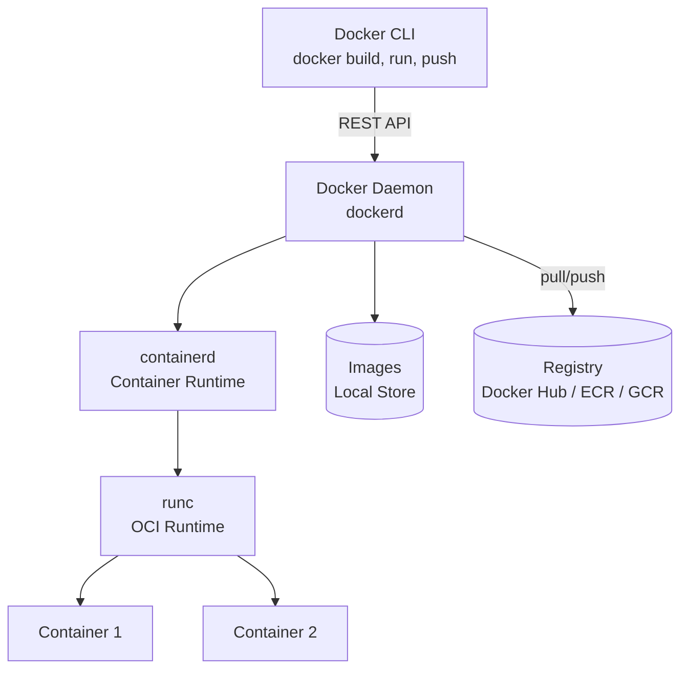
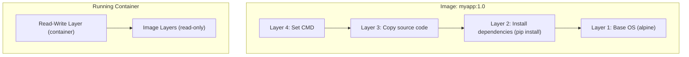

# Docker Fundamentals

How Docker works under the hood — containers vs VMs, the Docker architecture, image layers, and the Dockerfile instruction set.

---

## Containers vs Virtual Machines

| Aspect | Container | Virtual Machine |
|--------|-----------|----------------|
| **Isolation** | Process-level (shared kernel) | Hardware-level (separate OS kernel) |
| **Startup time** | Seconds | Minutes |
| **Size** | MBs (app + dependencies only) | GBs (full OS + app) |
| **Performance** | Near-native | Hypervisor overhead |
| **Density** | Hundreds per host | Tens per host |
| **OS support** | Same kernel as host | Any OS |
| **Use case** | Microservices, CI/CD, dev environments | Full OS isolation, legacy apps, multi-OS |

Containers use Linux kernel features — **namespaces** for isolation (PID, network, mount, user) and **cgroups** for resource limits (CPU, memory).

---

## Docker Architecture



| Component | Role |
|-----------|------|
| **Docker CLI** | User-facing command-line client, sends commands to the daemon via REST API |
| **Docker Daemon** (`dockerd`) | Background service that manages images, containers, networks, and volumes |
| **containerd** | Industry-standard container runtime that manages the container lifecycle |
| **runc** | Low-level OCI runtime that creates and runs containers using Linux kernel features |
| **Registry** | Remote storage for Docker images (Docker Hub, Amazon ECR, GitHub Container Registry) |

---

## Images and Layers

A Docker image is a read-only template made up of stacked **layers**. Each Dockerfile instruction creates a new layer.



| Concept | Description |
|---------|-------------|
| **Layer** | A filesystem diff created by each Dockerfile instruction. Layers are cached and shared across images |
| **Union filesystem** | OverlayFS merges all read-only layers + one writable layer into a single unified view |
| **Image ID** | Content-addressable SHA256 hash of the image configuration and layer digests |
| **Digest** | Immutable identifier for an image manifest in a registry (`sha256:abc123...`) |
| **Tag** | Mutable human-readable label pointing to an image ID (e.g., `nginx:1.25`, `myapp:latest`) |

!!! warning "The `latest` trap"
    `latest` is not a version — it's just a tag that points to whatever was last pushed without an explicit tag. Always use specific version tags in production.

---

## Dockerfile Instructions

| Instruction | Purpose | Example |
|-------------|---------|---------|
| `FROM` | Set the base image | `FROM python:3.12-slim` |
| `RUN` | Execute a command and commit the result as a new layer | `RUN apt-get update && apt-get install -y curl` |
| `COPY` | Copy files from build context into the image | `COPY requirements.txt .` |
| `ADD` | Like COPY but also handles URLs and tar extraction | `ADD archive.tar.gz /app/` |
| `WORKDIR` | Set the working directory for subsequent instructions | `WORKDIR /app` |
| `CMD` | Default command when container starts (overridable) | `CMD ["python", "app.py"]` |
| `ENTRYPOINT` | Main executable (not easily overridden) | `ENTRYPOINT ["python"]` |
| `EXPOSE` | Document which ports the container listens on | `EXPOSE 8080` |
| `ENV` | Set environment variable (persists in running container) | `ENV NODE_ENV=production` |
| `ARG` | Build-time variable (not available at runtime) | `ARG VERSION=1.0` |
| `LABEL` | Add metadata to the image | `LABEL maintainer="team@co.com"` |
| `USER` | Set the user for subsequent instructions and runtime | `USER appuser` |
| `HEALTHCHECK` | Define a command to check container health | `HEALTHCHECK CMD curl -f http://localhost/health` |

### Practical Dockerfile Example

```dockerfile
FROM python:3.12-slim

WORKDIR /app

# Install dependencies first (layer caching)
COPY requirements.txt .
RUN pip install --no-cache-dir -r requirements.txt

# Copy application code
COPY . .

# Non-root user
RUN useradd -r appuser
USER appuser

EXPOSE 8000

HEALTHCHECK --interval=30s --timeout=3s \
  CMD curl -f http://localhost:8000/health || exit 1

CMD ["gunicorn", "app:app", "--bind", "0.0.0.0:8000"]
```

---

## CMD vs ENTRYPOINT

| Aspect | `CMD` | `ENTRYPOINT` |
|--------|-------|-------------|
| **Purpose** | Default arguments / command | Main executable |
| **Override** | Fully replaced by `docker run <args>` | Requires `--entrypoint` flag to override |
| **Combination** | When both exist, CMD provides default args to ENTRYPOINT | Defines the executable |
| **Use case** | General-purpose images | Single-purpose tool images |

### Exec Form vs Shell Form

=== "Exec Form (Preferred)"

    ```dockerfile
    # Runs directly — PID 1 is your process, receives signals properly
    CMD ["python", "app.py"]
    ENTRYPOINT ["python", "app.py"]
    ```

=== "Shell Form"

    ```dockerfile
    # Wraps in /bin/sh -c — PID 1 is the shell, not your process
    CMD python app.py
    ENTRYPOINT python app.py
    ```

!!! warning "Always use exec form"
    Shell form wraps your command in `/bin/sh -c`, which means your process is not PID 1 and won't receive `SIGTERM` for graceful shutdown. Use exec form `["executable", "arg1"]` in production.

### CMD + ENTRYPOINT Together

```dockerfile
ENTRYPOINT ["python"]
CMD ["app.py"]
```

```bash
# Default: runs "python app.py"
docker run myimage

# Override CMD only: runs "python test.py"
docker run myimage test.py
```

---

## Build Context and .dockerignore

The **build context** is the set of files sent to the Docker daemon when you run `docker build`. By default, it's everything in the directory you specify.

```bash
# "." is the build context — all files in current directory are sent to daemon
docker build -t myapp .
```

Use `.dockerignore` to exclude files from the build context (faster builds, smaller images, no secrets leaked):

```text
# .dockerignore
.git
.gitignore
node_modules
*.md
.env
docker-compose*.yml
.idea
__pycache__
*.pyc
```

!!! note "Build context size matters"
    A large build context slows down every build because all files are sent to the daemon before any instruction runs. Use `.dockerignore` aggressively and keep your Dockerfile near the root of what it needs.

---

## Image Tagging and Versioning

```bash
# Tag during build
docker build -t myapp:1.2.3 .

# Add additional tags
docker tag myapp:1.2.3 myapp:latest
docker tag myapp:1.2.3 registry.example.com/myapp:1.2.3

# Push to registry
docker push registry.example.com/myapp:1.2.3
```

| Strategy | Example | When to Use |
|----------|---------|-------------|
| **Semantic version** | `myapp:1.2.3` | Production releases |
| **Git SHA** | `myapp:a1b2c3d` | CI/CD pipelines — immutable, traceable |
| **Branch name** | `myapp:main` | Dev/staging environments |
| **Date** | `myapp:2025-01-15` | Nightly builds |

!!! tip "Immutable tags in production"
    Use digest-pinned references (`myapp@sha256:abc...`) or unique tags (git SHA) in production deployments. Mutable tags like `latest` can silently change.

---

??? question "Interview Questions"

    **Q: What is the difference between a container and a VM?**

    A container shares the host OS kernel and isolates processes using namespaces and cgroups — it starts in seconds and uses MBs of space. A VM runs a full guest OS on a hypervisor, providing stronger isolation but with more overhead (GBs, minutes to boot). Containers are ideal for microservices; VMs are better when you need full OS isolation or multiple OS types.

    **Q: What happens when you run `docker run`?**

    The CLI sends the request to the Docker daemon. The daemon checks if the image exists locally (pulls if not), creates a read-write container layer on top of the image layers, sets up namespaces and cgroups, configures networking, and starts the process defined by CMD/ENTRYPOINT. The container gets its own PID namespace, network stack, and filesystem view.

    **Q: Explain Docker image layers and why they matter.**

    Each Dockerfile instruction creates an immutable filesystem layer. Layers are content-addressable (SHA256), cached locally, and shared across images. If two images use the same `FROM python:3.12-slim`, they share those base layers on disk. This makes builds faster (cache hits skip work) and images smaller (shared layers aren't duplicated). The running container adds one writable layer on top via a union filesystem (OverlayFS).

    **Q: What is the difference between CMD and ENTRYPOINT?**

    CMD sets the default command that can be fully overridden at `docker run` time. ENTRYPOINT sets the main executable that persists (args from `docker run` are appended). When both are present, CMD provides default arguments to ENTRYPOINT. Use ENTRYPOINT for single-purpose containers (CLI tools, servers) and CMD for general-purpose images.

    **Q: Why should you use exec form over shell form?**

    Exec form `["executable", "arg"]` runs the process directly as PID 1 inside the container. Shell form wraps the command in `/bin/sh -c`, making the shell PID 1. This means your actual process won't receive OS signals (like SIGTERM for graceful shutdown). In production, your app must be PID 1 to handle signals correctly.

    **Q: What is the build context and how does `.dockerignore` help?**

    The build context is the file tree sent to the Docker daemon when you run `docker build <path>`. Everything in that directory is transferred before the build starts. `.dockerignore` excludes files from the context — this speeds up builds (less data transferred), prevents secrets from leaking into images, and reduces image size if a careless `COPY . .` is used.

!!! tip "Further Reading"
    - [Dockerfile Reference](https://docs.docker.com/reference/dockerfile/) — official reference for all Dockerfile instructions
    - [Docker Storage Drivers](https://docs.docker.com/engine/storage/drivers/) — deep dive into how OverlayFS and image layers work
    - [Best practices for writing Dockerfiles](https://docs.docker.com/develop/develop-images/dockerfile_best-practices/) — official guide from Docker
    - [What even is a container?](https://jvns.ca/blog/2016/10/10/what-even-is-a-container/) — Julia Evans' explanation of namespaces and cgroups
