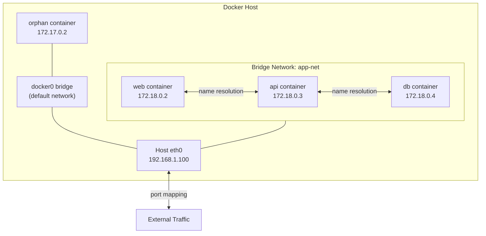
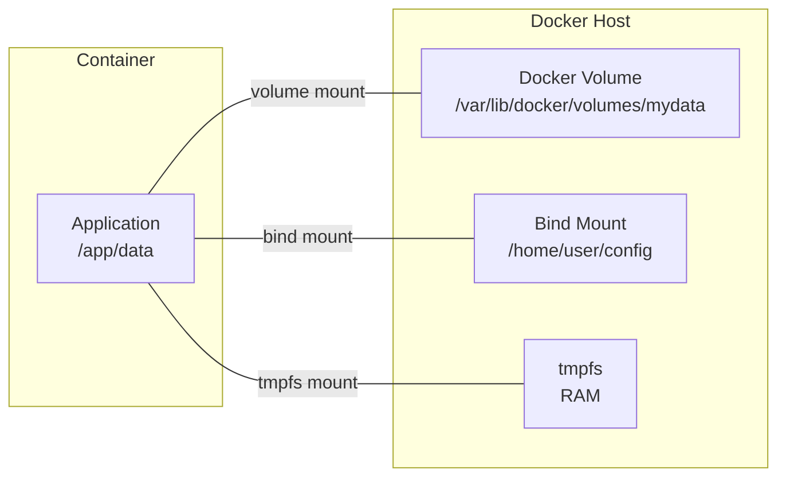

# Networking & Storage

How Docker handles container networking (drivers, DNS, port mapping) and persistent data (volumes, bind mounts, tmpfs).

---

## Network Drivers

| Driver | Scope | Use Case | Container-to-Container | External Access |
|--------|-------|----------|----------------------|-----------------|
| **bridge** | Single host | Default. Isolated network for containers on one host | Via container name (same network) | Port mapping (`-p`) |
| **host** | Single host | Container shares host's network stack directly | Via localhost | Direct (no port mapping needed) |
| **overlay** | Multi-host | Swarm / multi-node communication | Across hosts via VXLAN | Ingress routing mesh |
| **macvlan** | Single host | Container gets its own MAC address on the physical network | Via IP on physical LAN | Direct (appears as physical device) |
| **none** | Single host | Completely disable networking | No network | No network |

---

## Bridge Network Deep Dive

The **bridge** driver is Docker's default. Each user-defined bridge network creates an isolated virtual switch.



| Feature | Default bridge (`docker0`) | User-defined bridge |
|---------|---------------------------|-------------------|
| **DNS resolution** | No (must use `--link` or IP) | Yes — containers resolve by name |
| **Isolation** | All containers share one network | Separate networks are isolated from each other |
| **Connect/disconnect live** | No | Yes (`docker network connect/disconnect`) |
| **Recommendation** | Development only | Always use in practice |

```bash
# Create a user-defined bridge network
docker network create app-net

# Run containers on the same network
docker run -d --name api --network app-net myapi:1.0
docker run -d --name db --network app-net postgres:16

# "api" container can reach "db" by name:
# postgres://db:5432/mydb
```

!!! warning "Default bridge pitfall"
    The default `docker0` bridge does not provide DNS resolution between containers. Always create a user-defined bridge network. Containers on different user-defined networks cannot communicate unless explicitly connected to both.

---

## Container DNS and Service Discovery

Docker runs an embedded DNS server at `127.0.0.11` for user-defined networks.

| Feature | How It Works |
|---------|-------------|
| **Name resolution** | Container name resolves to its IP on the shared network |
| **Network aliases** | `--network-alias` lets multiple containers respond to the same DNS name (basic load balancing) |
| **DNS search domain** | Containers can also resolve `<container>.<network>` |
| **Custom DNS** | `--dns 8.8.8.8` overrides upstream DNS for external resolution |

```bash
# Multiple containers with the same alias (round-robin DNS)
docker run -d --name worker1 --network app-net --network-alias workers myworker
docker run -d --name worker2 --network app-net --network-alias workers myworker

# Any container on app-net can resolve "workers" and reach either worker1 or worker2
```

---

## Port Mapping

Port mapping exposes container ports to the host network.

```bash
# Map host port 8080 to container port 80
docker run -d -p 8080:80 nginx

# Map to a specific interface
docker run -d -p 127.0.0.1:8080:80 nginx

# Map a random host port
docker run -d -p 80 nginx   # check with docker ps

# Map UDP port
docker run -d -p 5000:5000/udp myapp

# Map multiple ports
docker run -d -p 80:80 -p 443:443 nginx
```

| Syntax | Meaning |
|--------|---------|
| `-p 8080:80` | Host 8080 to container 80 (all interfaces) |
| `-p 127.0.0.1:8080:80` | Host 8080 to container 80 (localhost only) |
| `-p 80` | Random host port to container 80 |
| `-p 8080:80/udp` | UDP port mapping |

!!! note "`EXPOSE` vs `-p`"
    `EXPOSE` in a Dockerfile is documentation only — it does not publish the port. You must use `-p` at runtime to actually map ports. `EXPOSE` is useful for `docker run -P` which maps all exposed ports to random host ports.

---

## Storage: Volumes vs Bind Mounts vs tmpfs

| Feature | Volume | Bind Mount | tmpfs |
|---------|--------|-----------|-------|
| **Managed by** | Docker | Host filesystem | Memory |
| **Location on host** | `/var/lib/docker/volumes/` | Anywhere on host | RAM only |
| **Persistence** | Survives container removal | Exists on host | Gone when container stops |
| **Shared across containers** | Yes | Yes | No |
| **Performance** | Native (on Linux) | Native | Fastest (RAM-backed) |
| **Populated by container** | Yes (pre-populated on first use) | No (host content shadows container) | No |
| **Use case** | Databases, persistent app data | Config files, source code (dev) | Secrets, scratch data |
| **Portability** | Portable across hosts | Tied to host path | N/A |



---

## Volumes

### Named Volumes

```bash
# Create a named volume
docker volume create pgdata

# Use it in a container
docker run -d \
  --name postgres \
  -v pgdata:/var/lib/postgresql/data \
  postgres:16

# Inspect
docker volume inspect pgdata

# List all volumes
docker volume ls

# Remove unused volumes
docker volume prune
```

### Anonymous Volumes

Created when no name is specified — Docker generates a random hash name:

```bash
# Anonymous volume — hard to manage, avoid in production
docker run -d -v /var/lib/postgresql/data postgres:16
```

| Volume Type | Syntax | Manageability | Use Case |
|-------------|--------|--------------|----------|
| **Named** | `-v mydata:/path` | Easy — has a human-readable name | Production data |
| **Anonymous** | `-v /path` (no name) | Hard — random hash, easy to lose | Temporary or Dockerfile `VOLUME` |

!!! tip "Prefer named volumes"
    Anonymous volumes are difficult to track and clean up. Always use named volumes for any data you care about.

---

## Bind Mounts

Bind mounts map a host directory or file directly into the container.

```bash
# Mount current directory into the container (development)
docker run -d \
  -v $(pwd):/app \
  -w /app \
  node:20 npm run dev

# Mount a config file (read-only)
docker run -d \
  -v /etc/myapp/config.yml:/app/config.yml:ro \
  myapp:1.0

# Modern --mount syntax (more explicit)
docker run -d \
  --mount type=bind,source=$(pwd),target=/app \
  node:20 npm run dev
```

!!! warning "Bind mount gotcha"
    A bind mount **shadows** whatever exists at the mount point in the container. If you mount an empty host directory to `/app`, the container's `/app` contents are hidden (not merged). This is a common source of "file not found" errors.

---

## tmpfs Mounts

In-memory filesystem — fast, non-persistent, not written to disk.

```bash
# Store secrets in memory only
docker run -d \
  --tmpfs /run/secrets:size=64m,mode=0700 \
  myapp:1.0

# --mount syntax
docker run -d \
  --mount type=tmpfs,destination=/tmp,tmpfs-size=100m \
  myapp:1.0
```

Use cases: sensitive data that should never touch disk, high-speed scratch space, temporary caches.

---

??? question "Interview Questions"

    **Q: What is the difference between the default bridge and a user-defined bridge network?**

    The default `docker0` bridge does not provide automatic DNS resolution between containers — you must use IP addresses or the deprecated `--link` flag. User-defined bridges provide built-in DNS (containers resolve each other by name), better isolation (only containers on the same network can communicate), and the ability to connect/disconnect containers at runtime.

    **Q: How does Docker DNS work?**

    Docker runs an embedded DNS server at `127.0.0.11` for containers on user-defined networks. Container names are registered as DNS entries when they join the network. Network aliases allow multiple containers to share a DNS name with round-robin resolution. This DNS server is not available on the default bridge network.

    **Q: When would you use a volume vs a bind mount?**

    Volumes are managed by Docker, portable, and ideal for persistent application data (databases, uploads). Bind mounts map a specific host path into the container — ideal for development (mounting source code for live reload) and injecting config files. In production, prefer volumes because they don't depend on the host's directory structure.

    **Q: What happens to data when a container is removed?**

    The container's writable layer is deleted, losing any data written inside the container that isn't on a volume or bind mount. Named volumes persist independently of containers — you must explicitly `docker volume rm` them. Anonymous volumes are also preserved on removal but are hard to find; use `docker volume prune` to clean them up.

    **Q: Explain the overlay network driver.**

    The overlay driver creates a distributed network spanning multiple Docker hosts (Swarm nodes). It uses VXLAN tunneling to encapsulate container traffic across hosts. Containers on the same overlay network can communicate by name regardless of which physical host they're on. This is the foundation for multi-node Docker Swarm service networking.

!!! tip "Further Reading"
    - [Docker Networking Overview](https://docs.docker.com/engine/network/) — official guide covering all network drivers
    - [Manage Data in Docker](https://docs.docker.com/engine/storage/) — volumes, bind mounts, and tmpfs explained
    - [Container Networking from Scratch](https://labs.iximiuz.com/tutorials/container-networking-from-scratch) — Ivan Velichko's deep dive into how container networking actually works
    - [Docker Networking Deep Dive](https://nigelpoulton.com/books/) — Nigel Poulton's detailed walkthrough of Docker networking internals
