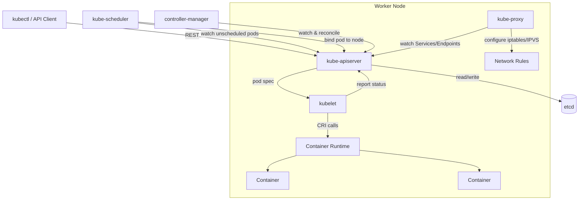
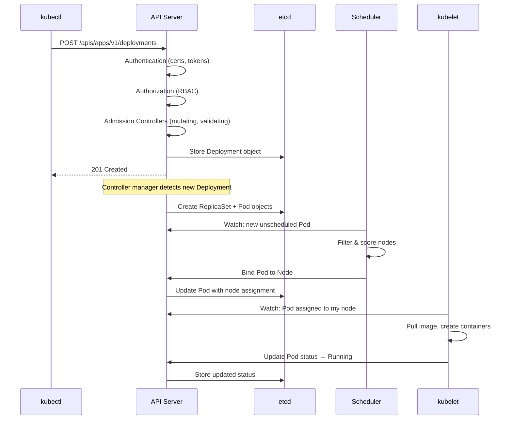

# Cluster Architecture

Kubernetes follows a master-worker architecture. The **control plane** makes global decisions (scheduling, detecting failures), while **worker nodes** run the actual application workloads.

---

## Control Plane Components

| Component | Role | Key Details |
|-----------|------|-------------|
| **kube-apiserver** | Front door to the cluster | REST API; all components communicate through it; handles authN, authZ, admission control |
| **etcd** | Cluster state store | Distributed key-value store; single source of truth; only the API server talks to it directly |
| **kube-scheduler** | Assigns pods to nodes | Watches for unscheduled pods; considers resource requests, affinity, taints, topology |
| **kube-controller-manager** | Runs controller loops | Includes ReplicaSet, Deployment, Node, Job, EndpointSlice controllers — each reconciles desired vs actual state |
| **cloud-controller-manager** | Cloud provider integration | Manages LoadBalancers, node lifecycle, routes; only present in cloud-managed clusters |

---

## Worker Node Components

| Component | Role | Key Details |
|-----------|------|-------------|
| **kubelet** | Node agent | Ensures containers described in PodSpecs are running and healthy; reports node status to API server |
| **kube-proxy** | Network proxy | Maintains network rules on nodes; implements Service abstraction via iptables or IPVS |
| **Container runtime** | Runs containers | Must implement CRI (Container Runtime Interface); common runtimes: containerd, CRI-O |

---

## Component Interactions



---

## API Request Lifecycle

When you run `kubectl apply -f deployment.yaml`, this is what happens:



---

## Admission Controllers

Admission controllers intercept requests to the API server **after** authentication and authorization but **before** persisting to etcd.

| Type | Purpose | Examples |
|------|---------|----------|
| **Mutating** | Modify the request object | Add default resource limits, inject sidecar containers |
| **Validating** | Accept or reject the request | Enforce naming conventions, block privileged pods |

Common built-in controllers: `NamespaceLifecycle`, `LimitRanger`, `ServiceAccount`, `DefaultStorageClass`, `ResourceQuota`.

Custom policies are implemented via **Validating/Mutating Admission Webhooks** or policy engines like **OPA Gatekeeper** and **Kyverno**.

---

## Cluster Networking Model

Kubernetes imposes a flat networking model with three fundamental rules:

| Rule | Meaning |
|------|---------|
| **Pod-to-Pod** | Every pod can communicate with every other pod without NAT |
| **Node-to-Pod** | Every node can communicate with every pod without NAT |
| **Pod IP = routable** | The IP a pod sees for itself is the same IP others use to reach it |

This is implemented by **CNI plugins** (Container Network Interface):

| CNI Plugin | Key Feature |
|------------|-------------|
| **Calico** | BGP-based routing, strong NetworkPolicy support |
| **Cilium** | eBPF-based, advanced observability and security |
| **Flannel** | Simple overlay network (VXLAN), minimal features |
| **Weave** | Mesh network with encryption support |

### Network Planes

```
┌──────────────────────────────────────────────┐
│  Pod Network (e.g., 10.244.0.0/16)           │  ← Pod-to-Pod traffic
├──────────────────────────────────────────────┤
│  Service Network (e.g., 10.96.0.0/12)        │  ← Virtual IPs for Services
├──────────────────────────────────────────────┤
│  Node Network (e.g., 192.168.1.0/24)         │  ← Physical/VM node IPs
└──────────────────────────────────────────────┘
```

---

## Namespaces

Namespaces provide logical isolation within a cluster. They scope resource names and can have their own resource quotas and RBAC policies.

| Namespace | Purpose |
|-----------|---------|
| `default` | Where resources go if no namespace is specified |
| `kube-system` | Control plane and system components |
| `kube-public` | Publicly readable data (e.g., cluster info) |
| `kube-node-lease` | Node heartbeat leases for faster failure detection |

```bash
# Create a namespace
kubectl create namespace staging

# List resources in a namespace
kubectl get pods -n staging

# Set default namespace for your context
kubectl config set-context --current --namespace=staging
```

!!! warning "Namespaces Are Not Security Boundaries"
    Namespaces provide logical separation, not network or security isolation. Pods in different namespaces can still communicate unless restricted by NetworkPolicies. For hard multi-tenancy, consider separate clusters.

---

## RBAC (Role-Based Access Control)

| Resource | Scope | Description |
|----------|-------|-------------|
| **Role** | Namespace | Grants permissions within a single namespace |
| **ClusterRole** | Cluster-wide | Grants permissions across all namespaces or on cluster-scoped resources |
| **RoleBinding** | Namespace | Binds a Role or ClusterRole to subjects within a namespace |
| **ClusterRoleBinding** | Cluster-wide | Binds a ClusterRole to subjects across the entire cluster |

```yaml
# Role: allow reading pods in "staging" namespace
apiVersion: rbac.authorization.k8s.io/v1
kind: Role
metadata:
  namespace: staging
  name: pod-reader
rules:
  - apiGroups: [""]
    resources: ["pods"]
    verbs: ["get", "watch", "list"]
---
# Bind it to a user
apiVersion: rbac.authorization.k8s.io/v1
kind: RoleBinding
metadata:
  name: read-pods-staging
  namespace: staging
subjects:
  - kind: User
    name: jane
    apiGroup: rbac.authorization.k8s.io
roleRef:
  kind: Role
  name: pod-reader
  apiGroup: rbac.authorization.k8s.io
```

---

??? question "Interview Questions"

    **Q: What happens if etcd goes down?**
    The cluster continues running existing workloads — kubelet keeps containers alive, kube-proxy maintains network rules. However, no new changes can be made: no new deployments, no scaling, no scheduling. The API server becomes read-only (cached data) or unavailable. This is why etcd should always run as a multi-node cluster (3 or 5 nodes) for high availability.

    **Q: What is the difference between a controller and an operator?**
    A controller is a control loop that watches the state of a resource and reconciles it toward the desired state. An operator is a *pattern* that extends Kubernetes with custom controllers + Custom Resource Definitions (CRDs) to manage complex, stateful applications (databases, message queues). All operators are controllers, but not all controllers are operators.

    **Q: How does the scheduler decide where to place a pod?**
    Two phases: (1) **Filtering** — eliminate nodes that don't meet hard constraints (resource requests, nodeSelector, taints, affinity). (2) **Scoring** — rank remaining nodes by soft preferences (resource balance, affinity weights, topology spread). The pod is assigned to the highest-scoring node.

    **Q: Why does Kubernetes use a flat network model?**
    It simplifies application design — containers can communicate using real IP addresses without NAT translation. This avoids port-mapping complexity and makes service discovery straightforward. The tradeoff is that the CNI plugin must implement this flat network, which adds infrastructure complexity.

    **Q: What are admission controllers and why are they important?**
    Admission controllers are plugins that intercept API requests after authentication/authorization but before persistence. They can mutate objects (e.g., inject sidecar containers, add default labels) or validate them (e.g., block privileged pods, enforce resource limits). They are critical for enforcing organizational policies and security standards.

!!! tip "Further Reading"
    - [Kubernetes Components — official docs](https://kubernetes.io/docs/concepts/overview/components/)
    - [Cluster Networking](https://kubernetes.io/docs/concepts/cluster-administration/networking/)
    - [RBAC Authorization](https://kubernetes.io/docs/reference/access-authn-authz/rbac/)
    - [A visual guide to Kubernetes networking — by Matt Klein](https://medium.com/@MattKlein123)
