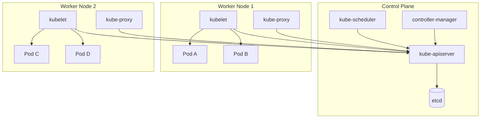

# Kubernetes

Kubernetes (K8s) is an open-source container orchestration platform that automates deployment, scaling, and management of containerized applications. Originally designed by Google and now maintained by the CNCF, it has become the standard for running production workloads at scale.

---

## Sub-Topics

| Topic | What It Covers |
|-------|---------------|
| [Cluster Architecture](architecture.md) | Control plane components, worker nodes, API request lifecycle, networking model, namespaces |
| [Workloads & Scheduling](workloads.md) | Pods, Deployments, StatefulSets, DaemonSets, Jobs, resource management, scheduling |
| [Networking & Services](networking.md) | Service types, Ingress, Gateway API, NetworkPolicy, DNS, traffic routing |
| [Storage & Configuration](storage-config.md) | Volumes, PV/PVC, StorageClasses, ConfigMaps, Secrets |
| [Scaling & Operations](scaling-operations.md) | HPA, VPA, Cluster Autoscaler, rolling updates, probes, Helm |

---

## High-Level Architecture

---

## Essential kubectl Commands

| Command | Description |
|---------|-------------|
| `kubectl get pods` | List pods in current namespace |
| `kubectl get pods -A` | List pods across all namespaces |
| `kubectl describe pod <name>` | Detailed info about a pod |
| `kubectl logs <pod>` | View pod logs |
| `kubectl logs <pod> -c <container>` | View logs for a specific container |
| `kubectl exec -it <pod> -- /bin/sh` | Shell into a running pod |
| `kubectl apply -f <file.yaml>` | Create or update resources from a file |
| `kubectl delete -f <file.yaml>` | Delete resources defined in a file |
| `kubectl get svc` | List services |
| `kubectl get nodes` | List cluster nodes |
| `kubectl top pods` | Show pod resource usage (requires metrics-server) |
| `kubectl config get-contexts` | List available cluster contexts |
| `kubectl config use-context <ctx>` | Switch cluster context |
| `kubectl port-forward svc/<name> 8080:80` | Forward local port to a service |
| `kubectl rollout status deployment/<name>` | Watch deployment rollout progress |
| `kubectl rollout undo deployment/<name>` | Roll back to previous revision |
| `kubectl scale deployment/<name> --replicas=3` | Scale a deployment |
| `kubectl get events --sort-by=.lastTimestamp` | View cluster events sorted by time |

---

## Why Kubernetes?

| Challenge | Without K8s | With K8s |
|-----------|------------|----------|
| **Deployment** | Manual SSH, scripts | Declarative YAML, `kubectl apply` |
| **Scaling** | Provision new VMs manually | `kubectl scale` or autoscaler |
| **Self-healing** | Monitor + restart manually | Automatic restart, reschedule |
| **Service discovery** | Hardcoded IPs, external LB | Built-in DNS + Service abstraction |
| **Rolling updates** | Downtime or custom scripts | Zero-downtime rolling updates built-in |
| **Config management** | Baked into images or env files | ConfigMaps + Secrets, decoupled from images |
