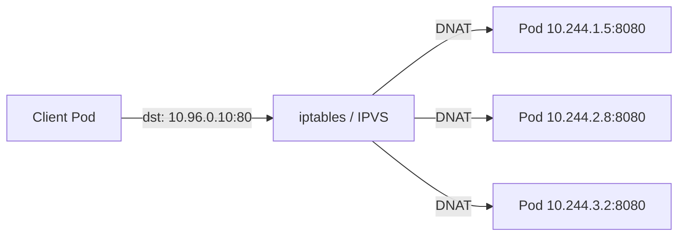
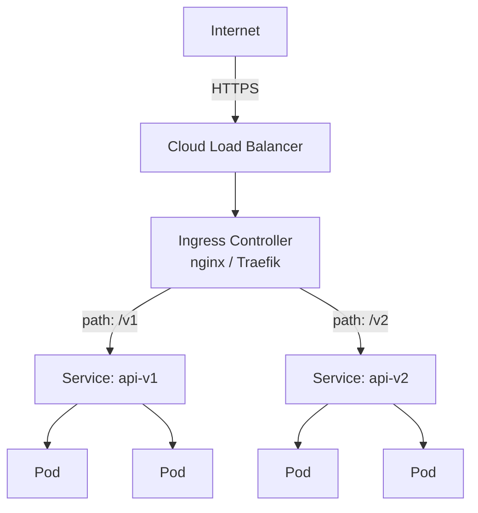
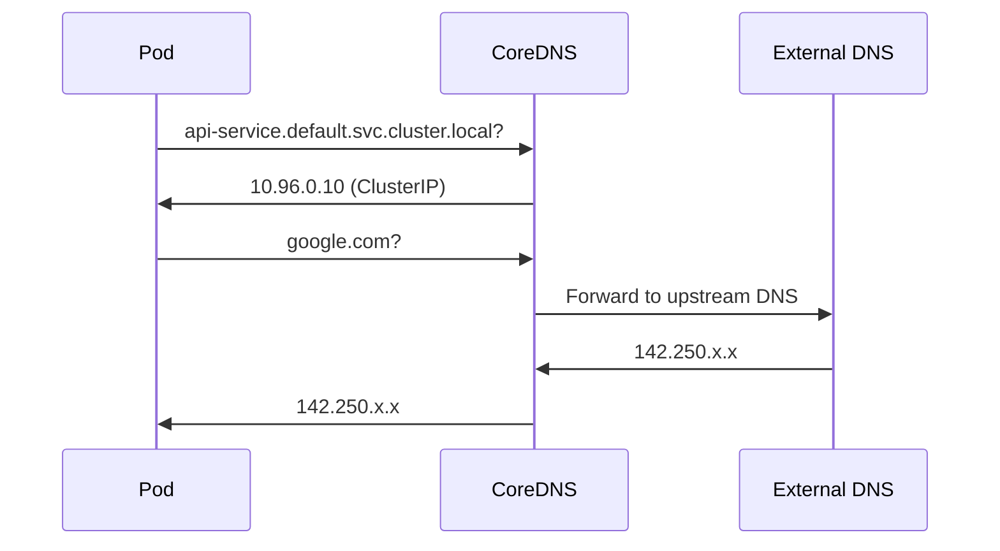

# Networking & Services

Kubernetes networking solves four problems: container-to-container (localhost within a pod), pod-to-pod (flat network via CNI), pod-to-service (virtual IPs via kube-proxy), and external-to-service (Ingress, LoadBalancer). Every layer builds on the one below it.

---

## Service Types

A **Service** provides a stable network endpoint for a set of pods, selected by labels. Pods come and go; the Service IP and DNS name remain constant.

| Type | Accessibility | Use Case |
|------|--------------|----------|
| **ClusterIP** | Internal only (default) | Backend services, databases |
| **NodePort** | External via `<NodeIP>:<port>` (30000-32767) | Development, simple external access |
| **LoadBalancer** | External via cloud LB | Production external traffic (GKE, EKS, AKS) |
| **ExternalName** | DNS alias to external service | Map `my-db` to `db.external.com` without proxying |

```yaml
apiVersion: v1
kind: Service
metadata:
  name: api-service
spec:
  type: ClusterIP
  selector:
    app: api-server
  ports:
    - name: http
      port: 80          # service port (what clients connect to)
      targetPort: 8080   # container port (where the app listens)
      protocol: TCP
```

### Headless Service

A Service with `clusterIP: None`. No virtual IP is assigned — DNS returns the individual pod IPs directly. Required for StatefulSets so clients can connect to specific pods.

```yaml
apiVersion: v1
kind: Service
metadata:
  name: postgres-headless
spec:
  clusterIP: None
  selector:
    app: postgres
  ports:
    - port: 5432
```

---

## How kube-proxy Routes Traffic

kube-proxy watches Services and Endpoints, then programs the node's network rules to forward traffic.

| Mode | Mechanism | Performance | Notes |
|------|-----------|-------------|-------|
| **iptables** (default) | Kernel netfilter rules | Good for < 1000 services | Random backend selection; no connection retries |
| **IPVS** | Kernel-level L4 load balancer | Better for large clusters | Supports round-robin, least-connections, source-hash |
| **nftables** (K8s 1.29+) | Modern netfilter replacement | Similar to iptables | Improved rule management |



---

## Service Discovery

### DNS (Primary Method)

CoreDNS creates DNS records for every Service automatically.

| Resource | DNS Record |
|----------|-----------|
| Service | `<svc>.<namespace>.svc.cluster.local` |
| Headless Service pod | `<pod-name>.<svc>.<namespace>.svc.cluster.local` |
| Service (short form) | `<svc>` (same namespace) or `<svc>.<namespace>` |

```bash
# From any pod in the same namespace
curl http://api-service               # short form
curl http://api-service.default       # with namespace
curl http://api-service.default.svc.cluster.local  # FQDN

# StatefulSet pod via headless service
curl http://postgres-0.postgres-headless.default.svc.cluster.local
```

### Environment Variables

Kubernetes injects `<SVC_NAME>_SERVICE_HOST` and `<SVC_NAME>_SERVICE_PORT` environment variables into every pod. Less flexible than DNS — only sees services that existed *before* the pod started.

---

## Ingress

An **Ingress** exposes HTTP/HTTPS routes from outside the cluster to Services inside. It requires an **Ingress Controller** (nginx, Traefik, HAProxy, AWS ALB) to be installed in the cluster.

```yaml
apiVersion: networking.k8s.io/v1
kind: Ingress
metadata:
  name: app-ingress
  annotations:
    nginx.ingress.kubernetes.io/rewrite-target: /
    cert-manager.io/cluster-issuer: letsencrypt-prod
spec:
  ingressClassName: nginx
  tls:
    - hosts:
        - api.example.com
      secretName: api-tls
  rules:
    - host: api.example.com
      http:
        paths:
          - path: /v1
            pathType: Prefix
            backend:
              service:
                name: api-v1
                port:
                  number: 80
          - path: /v2
            pathType: Prefix
            backend:
              service:
                name: api-v2
                port:
                  number: 80
```

---

## Traffic Flow



---

## Ingress vs Gateway API

Gateway API is the evolution of Ingress — more expressive, role-oriented, and supports TCP/UDP/gRPC natively.

| Aspect | Ingress | Gateway API |
|--------|---------|-------------|
| **Maturity** | Stable, widely used | GA since K8s 1.26 |
| **Protocols** | HTTP/HTTPS only | HTTP, HTTPS, TCP, UDP, gRPC, TLS |
| **Role separation** | Single resource | GatewayClass (infra), Gateway (cluster ops), HTTPRoute (developers) |
| **Extensibility** | Annotations (controller-specific) | Typed resources, portable across implementations |
| **Header matching** | Annotation-dependent | First-class support |
| **Traffic splitting** | Annotation-dependent | Native weighted backends |

```yaml
# Gateway API example
apiVersion: gateway.networking.k8s.io/v1
kind: HTTPRoute
metadata:
  name: api-route
spec:
  parentRefs:
    - name: main-gateway
  hostnames:
    - api.example.com
  rules:
    - matches:
        - path:
            type: PathPrefix
            value: /v1
      backendRefs:
        - name: api-v1
          port: 80
          weight: 90
        - name: api-v2
          port: 80
          weight: 10    # canary: 10% traffic to v2
```

---

## NetworkPolicy

NetworkPolicy acts as a pod-level firewall. By default, all pod-to-pod traffic is allowed. Creating a NetworkPolicy selects pods and defines allowed ingress/egress rules.

!!! warning "CNI Requirement"
    NetworkPolicy is only enforced if your CNI plugin supports it. Calico and Cilium support it fully. Flannel does **not** — policies will be created but have no effect.

```yaml
apiVersion: networking.k8s.io/v1
kind: NetworkPolicy
metadata:
  name: api-network-policy
  namespace: production
spec:
  podSelector:
    matchLabels:
      app: api-server
  policyTypes:
    - Ingress
    - Egress
  ingress:
    - from:
        - namespaceSelector:
            matchLabels:
              env: production
          podSelector:
            matchLabels:
              role: frontend
      ports:
        - protocol: TCP
          port: 8080
  egress:
    - to:
        - podSelector:
            matchLabels:
              app: postgres
      ports:
        - protocol: TCP
          port: 5432
    - to:                     # allow DNS
        - namespaceSelector: {}
      ports:
        - protocol: UDP
          port: 53
```

### Default Deny Patterns

```yaml
# Deny all ingress in a namespace
apiVersion: networking.k8s.io/v1
kind: NetworkPolicy
metadata:
  name: default-deny-ingress
spec:
  podSelector: {}       # selects all pods
  policyTypes:
    - Ingress
```

---

## DNS in Kubernetes (CoreDNS)

CoreDNS runs as a Deployment in `kube-system` and serves cluster DNS. It watches the API server for Services and Endpoints and creates DNS records.

### FQDN Format

```
<service>.<namespace>.svc.cluster.local
```

### DNS Resolution Flow



### Pod DNS Config

```yaml
spec:
  dnsPolicy: ClusterFirst         # default — use CoreDNS, fallback to upstream
  dnsConfig:
    nameservers:
      - 1.1.1.1
    searches:
      - my-namespace.svc.cluster.local
```

| DNS Policy | Behavior |
|-----------|----------|
| `ClusterFirst` | Use CoreDNS; fall back to node DNS for external names (default) |
| `Default` | Inherit DNS config from the node |
| `None` | Use only `dnsConfig` settings — full manual control |
| `ClusterFirstWithHostNet` | Like ClusterFirst but for pods using host networking |

---

??? question "Interview Questions"

    **Q: What is the difference between ClusterIP, NodePort, and LoadBalancer services?**
    ClusterIP is internal-only — accessible within the cluster via a virtual IP. NodePort extends ClusterIP by opening a static port on every node. LoadBalancer extends NodePort by provisioning a cloud load balancer that routes external traffic. Each type builds on the previous one.

    **Q: How does a headless Service differ from a regular Service?**
    A headless Service (`clusterIP: None`) has no virtual IP. DNS queries return the IP addresses of individual pods rather than a single stable IP. This is essential for StatefulSets where clients need to connect to specific pods (e.g., `postgres-0`).

    **Q: How does kube-proxy work?**
    kube-proxy runs on every node and watches the API server for Service and Endpoint changes. It programs network rules (iptables or IPVS) to intercept traffic destined for Service ClusterIPs and DNAT it to one of the backing pod IPs. It does not proxy traffic itself — the kernel handles the forwarding.

    **Q: What happens if you create a NetworkPolicy that selects no pods?**
    A NetworkPolicy with an empty `podSelector: {}` selects *all* pods in the namespace. If you set `policyTypes: [Ingress]` with no `ingress` rules, it acts as a default deny — all inbound traffic to pods in that namespace is blocked.

    **Q: How does Kubernetes DNS resolution work for services?**
    CoreDNS runs in the cluster and watches the API server. For each Service, it creates a DNS A record mapping `<service>.<namespace>.svc.cluster.local` to the ClusterIP. Pods are configured to use CoreDNS as their DNS server. Short names like `my-service` are resolved by appending search domains from `/etc/resolv.conf`.

!!! tip "Further Reading"
    - [Services, Load Balancing, and Networking](https://kubernetes.io/docs/concepts/services-networking/)
    - [Ingress Controllers](https://kubernetes.io/docs/concepts/services-networking/ingress-controllers/)
    - [Gateway API](https://gateway-api.sigs.k8s.io/)
    - [Network Policies](https://kubernetes.io/docs/concepts/services-networking/network-policies/)
