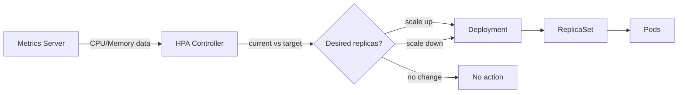

# Scaling & Operations

Kubernetes provides built-in mechanisms for scaling workloads, performing zero-downtime updates, monitoring application health, and managing cluster resources. This page covers the operational tools you need to run production workloads reliably.

---

## Horizontal Pod Autoscaler (HPA)

HPA automatically adjusts the number of pod replicas based on observed metrics (CPU, memory, or custom metrics).

```yaml
apiVersion: autoscaling/v2
kind: HorizontalPodAutoscaler
metadata:
  name: api-server-hpa
spec:
  scaleTargetRef:
    apiVersion: apps/v1
    kind: Deployment
    name: api-server
  minReplicas: 2
  maxReplicas: 20
  metrics:
    - type: Resource
      resource:
        name: cpu
        target:
          type: Utilization
          averageUtilization: 70
    - type: Resource
      resource:
        name: memory
        target:
          type: Utilization
          averageUtilization: 80
  behavior:
    scaleDown:
      stabilizationWindowSeconds: 300   # wait 5 min before scaling down
      policies:
        - type: Percent
          value: 25
          periodSeconds: 60             # scale down max 25% per minute
    scaleUp:
      stabilizationWindowSeconds: 0
      policies:
        - type: Pods
          value: 4
          periodSeconds: 60             # add max 4 pods per minute
```

```bash
# Quick HPA creation
kubectl autoscale deployment api-server --min=2 --max=20 --cpu-percent=70

# Check HPA status
kubectl get hpa
```

!!! note "Metrics Server Required"
    HPA requires the [Metrics Server](https://github.com/kubernetes-sigs/metrics-server) to be installed in the cluster. It provides the CPU and memory utilization data that HPA uses for scaling decisions.

### HPA Scaling Flow



**Scaling formula:** `desiredReplicas = ceil(currentReplicas * (currentMetric / targetMetric))`

---

## Vertical Pod Autoscaler (VPA)

VPA automatically adjusts **resource requests and limits** for containers based on historical usage. Useful when you don't know the right resource values.

| Mode | Behavior |
|------|----------|
| `Off` | Only provides recommendations (no changes) |
| `Initial` | Sets resources only at pod creation |
| `Auto` | Evicts and recreates pods with updated resources |

```yaml
apiVersion: autoscaling.k8s.io/v1
kind: VerticalPodAutoscaler
metadata:
  name: api-server-vpa
spec:
  targetRef:
    apiVersion: apps/v1
    kind: Deployment
    name: api-server
  updatePolicy:
    updateMode: Auto
  resourcePolicy:
    containerPolicies:
      - containerName: api
        minAllowed:
          cpu: 100m
          memory: 128Mi
        maxAllowed:
          cpu: 2
          memory: 2Gi
```

!!! warning "HPA and VPA Conflict"
    Do not use HPA and VPA on the same metric (e.g., both scaling on CPU). HPA scales horizontally (more pods), VPA scales vertically (bigger pods) — they can fight each other. Use HPA on CPU/memory and VPA on a separate metric, or use VPA in `Off` mode for recommendations only.

---

## Cluster Autoscaler

Scales the **number of nodes** in the cluster based on pending pods and node utilization.

| Trigger | Action |
|---------|--------|
| Pod is Pending due to insufficient resources | Add nodes to the node group |
| Node utilization is below threshold for extended period | Remove underutilized nodes (after draining pods) |

```
Scale Up:  Pod Pending → Cluster Autoscaler → Cloud API → New Node → Pod Scheduled
Scale Down: Low utilization → Drain node → Cloud API → Remove Node
```

| Parameter | Description | Typical Value |
|-----------|-------------|---------------|
| `--scale-down-utilization-threshold` | Node utilization below which scale-down is considered | `0.5` (50%) |
| `--scale-down-delay-after-add` | Wait time after scaling up before considering scale-down | `10m` |
| `--max-node-provision-time` | Max time to wait for a node to become ready | `15m` |

---

## Rolling Updates and Rollbacks

### Deployment Strategies

| Strategy | Behavior | Downtime | Use Case |
|----------|----------|----------|----------|
| **RollingUpdate** | Gradually replaces old pods with new ones | None | Default for most workloads |
| **Recreate** | Kills all old pods, then creates new ones | Yes | When old and new versions can't coexist |

```yaml
spec:
  strategy:
    type: RollingUpdate
    rollingUpdate:
      maxSurge: 25%         # max pods above desired during update
      maxUnavailable: 25%   # max pods that can be unavailable during update
```

```mermaid
flowchart LR
    subgraph Before
        V1A[v1 Pod]
        V1B[v1 Pod]
        V1C[v1 Pod]
    end

    subgraph Rolling Update
        V1D[v1 Pod]
        V1E[v1 Pod]
        V2A[v2 Pod ✓]
    end

    subgraph After
        V2B[v2 Pod]
        V2C[v2 Pod]
        V2D[v2 Pod]
    end

    Before --> Rolling Update --> After
```

### Rollback Commands

```bash
# Check rollout status
kubectl rollout status deployment/api-server

# View history
kubectl rollout history deployment/api-server

# Roll back to previous revision
kubectl rollout undo deployment/api-server

# Roll back to specific revision
kubectl rollout undo deployment/api-server --to-revision=3

# Pause/resume a rollout
kubectl rollout pause deployment/api-server
kubectl rollout resume deployment/api-server
```

---

## Blue/Green and Canary Deployments

Kubernetes does not natively support blue/green or canary — they are implemented using labels, Services, and tooling.

=== "Blue/Green"

    Run two full deployments (blue and green). Switch traffic by updating the Service selector.

    ```bash
    # Blue is live
    # Deploy green with new version
    kubectl apply -f deployment-green.yaml

    # Test green internally
    # Switch Service selector to green
    kubectl patch svc api-service -p '{"spec":{"selector":{"version":"green"}}}'

    # If issues, switch back to blue
    kubectl patch svc api-service -p '{"spec":{"selector":{"version":"blue"}}}'
    ```

    **Pros:** Instant rollback, full testing before switch.
    **Cons:** Requires 2x resources during deployment.

=== "Canary"

    Gradually shift traffic from old to new version. Use weighted traffic splitting via Ingress, service mesh (Istio), or Gateway API.

    ```yaml
    # Gateway API weighted routing
    apiVersion: gateway.networking.k8s.io/v1
    kind: HTTPRoute
    metadata:
      name: api-canary
    spec:
      parentRefs:
        - name: main-gateway
      rules:
        - backendRefs:
            - name: api-stable
              port: 80
              weight: 90
            - name: api-canary
              port: 80
              weight: 10
    ```

    **Pros:** Low risk, gradual rollout, real user validation.
    **Cons:** Requires traffic management tooling.

!!! tip "Argo Rollouts"
    For production-grade blue/green and canary deployments, consider [Argo Rollouts](https://argoproj.github.io/rollouts/) — it provides a `Rollout` CRD with built-in traffic management, analysis, and automated promotion/rollback.

---

## Health Probes

Probes let Kubernetes check whether your containers are alive, ready to serve traffic, or still starting up.

| Probe | Purpose | Failure Action |
|-------|---------|----------------|
| **Liveness** | Is the container alive? | Restart the container |
| **Readiness** | Is the container ready to serve traffic? | Remove from Service endpoints (no traffic) |
| **Startup** | Has the container finished starting? | Block liveness/readiness until success |

### Probe Mechanisms

| Mechanism | How It Works |
|-----------|-------------|
| `httpGet` | HTTP GET to a path; 200-399 = success |
| `tcpSocket` | TCP connect to a port; connection = success |
| `exec` | Run a command; exit code 0 = success |
| `grpc` | gRPC health check (K8s 1.27+) |

### Example Configuration

```yaml
spec:
  containers:
    - name: api
      image: api-server:latest
      ports:
        - containerPort: 8080
      startupProbe:               # slow-starting app
        httpGet:
          path: /healthz
          port: 8080
        failureThreshold: 30      # 30 * 10s = 5 min to start
        periodSeconds: 10
      livenessProbe:
        httpGet:
          path: /healthz
          port: 8080
        initialDelaySeconds: 0    # startup probe handles delay
        periodSeconds: 15
        timeoutSeconds: 3
        failureThreshold: 3       # restart after 3 consecutive failures
      readinessProbe:
        httpGet:
          path: /ready
          port: 8080
        periodSeconds: 5
        timeoutSeconds: 2
        failureThreshold: 2       # remove from LB after 2 failures
```

!!! warning "Common Probe Mistakes"
    - Making liveness probes check dependencies (database, external API) — if the dependency is down, all pods restart in a loop
    - Not using startup probes for slow-starting apps — liveness probe kills pods before they finish starting
    - Setting liveness and readiness to the same endpoint — they serve different purposes

---

## Pod Disruption Budgets (PDB)

PDBs limit the number of pods that can be simultaneously unavailable during **voluntary disruptions** (node drain, cluster upgrade, rolling update).

```yaml
apiVersion: policy/v1
kind: PodDisruptionBudget
metadata:
  name: api-pdb
spec:
  minAvailable: 2          # at least 2 pods must be running
  # OR
  # maxUnavailable: 1      # at most 1 pod can be down
  selector:
    matchLabels:
      app: api-server
```

| Field | Meaning |
|-------|---------|
| `minAvailable` | Minimum number (or %) of pods that must remain available |
| `maxUnavailable` | Maximum number (or %) of pods that can be unavailable |

!!! note "Voluntary vs Involuntary Disruptions"
    PDBs only apply to **voluntary** disruptions (node drain, upgrades). They do not protect against **involuntary** disruptions (node crash, OOM kill, hardware failure).

---

## Resource Quotas and LimitRanges

### ResourceQuota

Limits total resource consumption per namespace.

```yaml
apiVersion: v1
kind: ResourceQuota
metadata:
  name: team-quota
  namespace: team-a
spec:
  hard:
    requests.cpu: "10"
    requests.memory: 20Gi
    limits.cpu: "20"
    limits.memory: 40Gi
    pods: "50"
    services: "10"
    persistentvolumeclaims: "20"
```

### LimitRange

Sets default and max/min resource constraints for individual pods or containers in a namespace.

```yaml
apiVersion: v1
kind: LimitRange
metadata:
  name: default-limits
  namespace: team-a
spec:
  limits:
    - type: Container
      default:              # applied if no limits specified
        cpu: 500m
        memory: 512Mi
      defaultRequest:       # applied if no requests specified
        cpu: 100m
        memory: 128Mi
      max:
        cpu: 2
        memory: 4Gi
      min:
        cpu: 50m
        memory: 64Mi
```

| Resource | ResourceQuota | LimitRange |
|----------|--------------|------------|
| **Scope** | Namespace total | Individual pod/container |
| **Purpose** | Prevent one team from consuming all cluster resources | Ensure every pod has sensible defaults and bounds |
| **Enforcement** | Rejects pod creation if namespace quota exceeded | Injects defaults; rejects pods exceeding min/max |

---

## Helm

Helm is the package manager for Kubernetes. It bundles YAML manifests into **charts** — versioned, parameterized, reusable packages.

### Core Concepts

| Concept | Description |
|---------|-------------|
| **Chart** | A package of Kubernetes manifests + templates + default values |
| **Release** | An installed instance of a chart in a cluster |
| **Repository** | A hosted collection of charts (like a package registry) |
| **Values** | Configuration parameters that customize a chart installation |

### Common Commands

```bash
# Add a chart repository
helm repo add bitnami https://charts.bitnami.com/bitnami
helm repo update

# Search for charts
helm search repo postgres

# Install a chart
helm install my-postgres bitnami/postgresql \
  --namespace databases \
  --set auth.postgresPassword=secret \
  --set primary.persistence.size=50Gi

# Install with a values file
helm install my-app ./my-chart -f values-prod.yaml

# List releases
helm list -A

# Upgrade a release
helm upgrade my-postgres bitnami/postgresql \
  --set primary.persistence.size=100Gi

# Roll back
helm rollback my-postgres 1

# Uninstall
helm uninstall my-postgres -n databases

# Render templates locally (dry run)
helm template my-app ./my-chart -f values.yaml
```

### Chart Structure

```
my-chart/
├── Chart.yaml          # chart metadata (name, version, dependencies)
├── values.yaml         # default configuration values
├── templates/
│   ├── deployment.yaml # Go-templated K8s manifests
│   ├── service.yaml
│   ├── ingress.yaml
│   ├── _helpers.tpl    # reusable template functions
│   └── NOTES.txt       # post-install instructions
└── charts/             # dependency charts
```

---

??? question "Interview Questions"

    **Q: How does HPA decide when to scale?**
    HPA runs a control loop (default 15s). It fetches current metrics from the Metrics Server, calculates the ratio of current to target utilization, and computes desired replicas using: `desired = ceil(current_replicas * current_metric / target_metric)`. It respects the `behavior` field for stabilization windows and rate limiting to prevent flapping.

    **Q: What is the difference between liveness and readiness probes?**
    A liveness probe checks if the container is alive — failure triggers a container restart. A readiness probe checks if the container can serve traffic — failure removes it from Service endpoints but does not restart it. Use liveness to detect deadlocks; use readiness to handle temporary load or dependency issues.

    **Q: How do rolling updates achieve zero downtime?**
    The Deployment controller creates new pods before terminating old ones (controlled by `maxSurge` and `maxUnavailable`). New pods must pass their readiness probe before receiving traffic and before old pods are terminated. This ensures that at least some healthy pods are always serving requests during the update.

    **Q: When would you use a PodDisruptionBudget?**
    Whenever you need to guarantee minimum availability during voluntary disruptions (node drains, cluster upgrades, autoscaler scale-downs). For example, a 3-replica API server with a PDB of `minAvailable: 2` ensures that `kubectl drain` will only evict one pod at a time, waiting for the replacement to become ready before draining the next.

    **Q: What is the difference between Cluster Autoscaler and HPA?**
    HPA scales the number of pods within existing nodes. Cluster Autoscaler scales the number of nodes. They work together: HPA creates more pods, and if those pods can't be scheduled (Pending) due to insufficient node capacity, Cluster Autoscaler provisions new nodes.

    **Q: Why use Helm over raw kubectl apply?**
    Helm provides templating (reuse manifests across environments), versioning (track chart versions), release management (upgrade, rollback), dependency management (include sub-charts), and parameterization (override values per environment). Raw `kubectl apply` works for simple cases but becomes unwieldy for complex, multi-environment deployments.

!!! tip "Further Reading"
    - [Horizontal Pod Autoscaling](https://kubernetes.io/docs/tasks/run-application/horizontal-pod-autoscale/)
    - [Configure Liveness, Readiness and Startup Probes](https://kubernetes.io/docs/tasks/configure-pod-container/configure-liveness-readiness-startup-probes/)
    - [Helm Documentation](https://helm.sh/docs/)
    - [Argo Rollouts — Progressive Delivery](https://argoproj.github.io/rollouts/)
