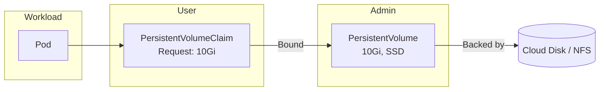
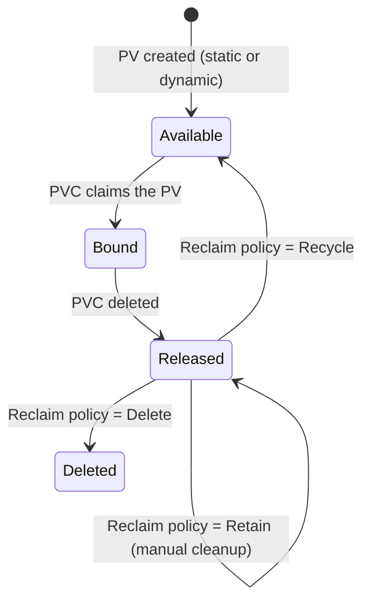

# Storage & Configuration

Containers are ephemeral by default — data is lost when a container restarts. Kubernetes provides a volume system for persistent storage and first-class primitives (ConfigMaps, Secrets) for externalizing configuration from container images.

---

## Volume Types

| Type | Persistence | Description |
|------|-------------|-------------|
| **emptyDir** | Pod lifetime | Scratch space shared between containers in a pod; deleted when pod is removed |
| **hostPath** | Node lifetime | Mounts a file or directory from the host node's filesystem; use with caution |
| **persistentVolumeClaim** | Cluster lifetime | Claims storage provisioned by a PersistentVolume; survives pod restarts |
| **configMap** | Cluster lifetime | Mounts ConfigMap data as files in a volume |
| **secret** | Cluster lifetime | Mounts Secret data as files (base64-decoded) |
| **projected** | Varies | Combines multiple sources (configMap, secret, serviceAccountToken) into one volume |
| **nfs** | External | Mounts an NFS share; allows ReadWriteMany across nodes |
| **csi** | External | Container Storage Interface — plugin-based storage (EBS, GCE PD, Ceph, etc.) |

---

## PersistentVolume (PV) and PersistentVolumeClaim (PVC)

**PV** = a piece of storage in the cluster, provisioned by an admin or dynamically via StorageClass.
**PVC** = a request for storage by a user/pod.



### PV and PVC Lifecycle



### Static Provisioning

```yaml
# Admin creates a PV
apiVersion: v1
kind: PersistentVolume
metadata:
  name: pv-ssd-10gi
spec:
  capacity:
    storage: 10Gi
  accessModes:
    - ReadWriteOnce
  persistentVolumeReclaimPolicy: Retain
  storageClassName: manual
  hostPath:
    path: /mnt/data
---
# User creates a PVC
apiVersion: v1
kind: PersistentVolumeClaim
metadata:
  name: app-data
spec:
  accessModes:
    - ReadWriteOnce
  resources:
    requests:
      storage: 10Gi
  storageClassName: manual
---
# Pod mounts the PVC
apiVersion: v1
kind: Pod
metadata:
  name: app
spec:
  containers:
    - name: app
      image: app:latest
      volumeMounts:
        - name: data
          mountPath: /app/data
  volumes:
    - name: data
      persistentVolumeClaim:
        claimName: app-data
```

---

## StorageClasses and Dynamic Provisioning

StorageClasses enable **dynamic provisioning** — PVs are created automatically when a PVC is submitted. No admin intervention needed.

```yaml
apiVersion: storage.k8s.io/v1
kind: StorageClass
metadata:
  name: fast-ssd
provisioner: ebs.csi.aws.com       # CSI driver
parameters:
  type: gp3
  iops: "3000"
reclaimPolicy: Delete
volumeBindingMode: WaitForFirstConsumer  # delay binding until pod is scheduled
allowVolumeExpansion: true
```

```yaml
# PVC using dynamic provisioning — no PV needed
apiVersion: v1
kind: PersistentVolumeClaim
metadata:
  name: app-data
spec:
  accessModes:
    - ReadWriteOnce
  storageClassName: fast-ssd    # references the StorageClass
  resources:
    requests:
      storage: 20Gi
```

| Binding Mode | Behavior |
|-------------|----------|
| `Immediate` | PV is provisioned as soon as PVC is created |
| `WaitForFirstConsumer` | PV is provisioned when a pod using the PVC is scheduled (respects topology) |

---

## Access Modes

| Mode | Abbreviation | Description |
|------|-------------|-------------|
| **ReadWriteOnce** | RWO | Mounted as read-write by a single node |
| **ReadOnlyMany** | ROX | Mounted as read-only by many nodes |
| **ReadWriteMany** | RWX | Mounted as read-write by many nodes |
| **ReadWriteOncePod** | RWOP | Mounted as read-write by a single pod (K8s 1.27+) |

!!! note "Access Mode Support"
    Not all storage backends support all modes. Block storage (EBS, GCE PD) typically supports only RWO. Shared file systems (NFS, EFS, CephFS) support RWX.

---

## Reclaim Policies

| Policy | Behavior | Use Case |
|--------|----------|----------|
| **Retain** | PV is kept after PVC deletion; data preserved, manual cleanup | Production data you want to keep |
| **Delete** | PV and underlying storage are deleted when PVC is deleted | Ephemeral/test environments |
| **Recycle** | Basic `rm -rf` on the volume (deprecated) | Legacy — use Delete with dynamic provisioning instead |

---

## ConfigMaps

ConfigMaps store non-sensitive configuration data as key-value pairs. They decouple configuration from container images.

### Creating ConfigMaps

=== "From literal values"

    ```bash
    kubectl create configmap app-config \
      --from-literal=DATABASE_HOST=postgres \
      --from-literal=LOG_LEVEL=info
    ```

=== "From a file"

    ```bash
    kubectl create configmap nginx-config \
      --from-file=nginx.conf
    ```

=== "YAML manifest"

    ```yaml
    apiVersion: v1
    kind: ConfigMap
    metadata:
      name: app-config
    data:
      DATABASE_HOST: postgres
      LOG_LEVEL: info
      app.properties: |
        server.port=8080
        cache.ttl=300
    ```

### Consuming ConfigMaps

=== "Environment variables"

    ```yaml
    spec:
      containers:
        - name: app
          image: app:latest
          env:
            - name: DATABASE_HOST
              valueFrom:
                configMapKeyRef:
                  name: app-config
                  key: DATABASE_HOST
          envFrom:                    # inject all keys as env vars
            - configMapRef:
                name: app-config
    ```

=== "Volume mount"

    ```yaml
    spec:
      containers:
        - name: app
          image: app:latest
          volumeMounts:
            - name: config-volume
              mountPath: /etc/config
              readOnly: true
      volumes:
        - name: config-volume
          configMap:
            name: app-config
    ```

!!! note "Auto-Reload"
    ConfigMaps mounted as volumes are updated automatically by kubelet (sync period ~60s). ConfigMaps injected as environment variables require a pod restart to pick up changes.

---

## Secrets

Secrets store sensitive data (passwords, tokens, TLS certificates). Values are **base64-encoded** (not encrypted) by default.

### Secret Types

| Type | Usage |
|------|-------|
| `Opaque` | Arbitrary key-value pairs (default) |
| `kubernetes.io/tls` | TLS certificate + private key |
| `kubernetes.io/dockerconfigjson` | Docker registry credentials |
| `kubernetes.io/basic-auth` | Username + password |
| `kubernetes.io/service-account-token` | Auto-generated for ServiceAccounts |

### Creating Secrets

=== "From literal values"

    ```bash
    kubectl create secret generic db-creds \
      --from-literal=username=admin \
      --from-literal=password=s3cur3p@ss
    ```

=== "YAML manifest"

    ```yaml
    apiVersion: v1
    kind: Secret
    metadata:
      name: db-creds
    type: Opaque
    data:
      username: YWRtaW4=           # echo -n "admin" | base64
      password: czNjdXIzcEBzcw==
    ```

=== "TLS Secret"

    ```bash
    kubectl create secret tls api-tls \
      --cert=tls.crt \
      --key=tls.key
    ```

### Consuming Secrets

```yaml
spec:
  containers:
    - name: app
      image: app:latest
      env:
        - name: DB_PASSWORD
          valueFrom:
            secretKeyRef:
              name: db-creds
              key: password
      volumeMounts:
        - name: tls-certs
          mountPath: /etc/tls
          readOnly: true
  volumes:
    - name: tls-certs
      secret:
        secretName: api-tls
```

### Secret Security Best Practices

| Practice | Why |
|----------|-----|
| Enable encryption at rest | Secrets in etcd are base64-encoded, not encrypted, by default |
| Use RBAC to restrict access | Limit who can `get`/`list` Secrets |
| Use external secret managers | HashiCorp Vault, AWS Secrets Manager, or the External Secrets Operator |
| Avoid committing to Git | Use SealedSecrets or SOPS for GitOps workflows |
| Mount as volumes, not env vars | Env vars appear in `kubectl describe pod` and crash logs |

---

## ConfigMap vs Secret

| Aspect | ConfigMap | Secret |
|--------|-----------|--------|
| **Data type** | Non-sensitive config | Sensitive data (passwords, keys) |
| **Encoding** | Plain text | Base64-encoded |
| **Encryption at rest** | No | Optional (must be configured) |
| **Size limit** | 1 MiB | 1 MiB |
| **Mounted as** | Files or env vars | Files or env vars |
| **tmpfs** | No | Yes — mounted as tmpfs (in-memory) by default |
| **RBAC** | Standard | Should be restricted |

---

??? question "Interview Questions"

    **Q: What is the difference between a PV and a PVC?**
    A PersistentVolume (PV) is a cluster-level storage resource — a piece of actual storage (disk, NFS share). A PersistentVolumeClaim (PVC) is a user's request for storage — it specifies size, access mode, and optionally a StorageClass. Kubernetes binds a PVC to a matching PV. The separation decouples storage provisioning (admin concern) from consumption (developer concern).

    **Q: Are Kubernetes Secrets secure?**
    Not by default. Secrets are only base64-encoded in etcd, which is encoding, not encryption. To secure them: enable encryption at rest for etcd, restrict RBAC access to Secrets, use external secret managers (Vault, AWS Secrets Manager), and avoid logging Secret values. Mount as volumes rather than env vars to reduce exposure in crash dumps.

    **Q: What is the difference between `emptyDir` and a PersistentVolumeClaim?**
    `emptyDir` is created when a pod is assigned to a node and deleted when the pod is removed — it is tied to the pod lifecycle. A PVC-backed volume persists beyond the pod lifecycle and survives pod restarts, rescheduling, and even node failures (if backed by network storage like EBS or NFS).

    **Q: When would you use `WaitForFirstConsumer` volume binding mode?**
    When your storage is topology-aware (e.g., AWS EBS is AZ-specific). `WaitForFirstConsumer` delays PV provisioning until a pod is scheduled, ensuring the volume is created in the same availability zone as the pod. With `Immediate`, the PV might be provisioned in zone-a while the pod is scheduled in zone-b, causing a binding failure.

    **Q: How do ConfigMap updates propagate to running pods?**
    If mounted as a volume, kubelet periodically syncs the mounted files (typically within 60 seconds). The application must watch for file changes or be signaled to reload. If injected as environment variables, changes do *not* propagate — a pod restart is required.

!!! tip "Further Reading"
    - [Persistent Volumes](https://kubernetes.io/docs/concepts/storage/persistent-volumes/)
    - [StorageClasses](https://kubernetes.io/docs/concepts/storage/storage-classes/)
    - [ConfigMaps](https://kubernetes.io/docs/concepts/configuration/configmap/)
    - [Secrets Best Practices](https://kubernetes.io/docs/concepts/security/secrets-good-practices/)
