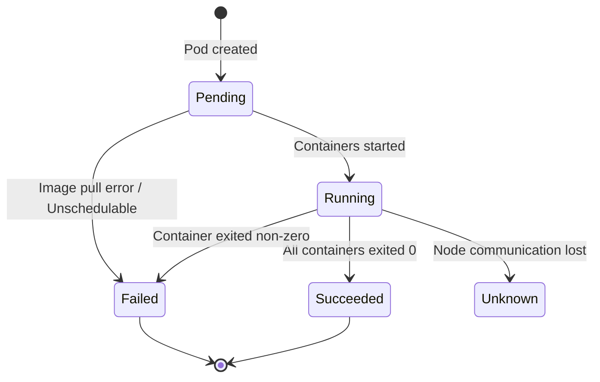

# Workloads & Scheduling

A workload is an application running on Kubernetes. You define the desired state (number of replicas, container image, resources), and Kubernetes controllers continuously reconcile the actual state to match.

---

## Pod Anatomy

A **Pod** is the smallest deployable unit in Kubernetes. It wraps one or more containers that share networking (same IP, localhost) and storage (shared volumes).

| Component | Description |
|-----------|-------------|
| **App container** | The main application process |
| **Init container** | Runs to completion *before* app containers start; used for setup tasks (migrations, config fetching) |
| **Sidecar container** | Long-running helper alongside the app (log shipper, service mesh proxy, metrics exporter) |
| **Pause container** | Hidden infra container that holds the pod's network namespace |
| **Shared volumes** | All containers in a pod can mount the same volumes |

```yaml
apiVersion: v1
kind: Pod
metadata:
  name: web-app
spec:
  initContainers:
    - name: db-migrate
      image: app:latest
      command: ["./migrate", "--up"]
  containers:
    - name: app
      image: app:latest
      ports:
        - containerPort: 8080
      volumeMounts:
        - name: shared-data
          mountPath: /data
    - name: log-shipper     # sidecar
      image: fluentbit:latest
      volumeMounts:
        - name: shared-data
          mountPath: /data
  volumes:
    - name: shared-data
      emptyDir: {}
```

!!! note "Native Sidecar Containers (K8s 1.28+)"
    Kubernetes 1.28 introduced native sidecar support via `restartPolicy: Always` on init containers. These start before app containers but keep running alongside them, and they shut down *after* the main containers — solving long-standing lifecycle ordering issues.

---

## Pod Lifecycle



| Phase | Meaning |
|-------|---------|
| **Pending** | Accepted by cluster but not all containers running (scheduling, image pull) |
| **Running** | At least one container is running or starting/restarting |
| **Succeeded** | All containers terminated successfully (exit code 0) |
| **Failed** | All containers terminated, at least one with non-zero exit |
| **Unknown** | Pod status cannot be determined (node lost) |

---

## Workload Controllers

| Controller | Purpose | Key Characteristics |
|------------|---------|---------------------|
| **Deployment** | Stateless apps | Manages ReplicaSets; supports rolling updates, rollbacks |
| **ReplicaSet** | Maintains N identical pods | Rarely used directly; managed by Deployments |
| **StatefulSet** | Stateful apps | Stable network identity, ordered deployment, persistent storage per pod |
| **DaemonSet** | One pod per node | Log agents, monitoring, node-level daemons |
| **Job** | Run-to-completion | Batch processing, one-off tasks |
| **CronJob** | Scheduled Jobs | Periodic tasks (backups, reports) |

---

## Deployment

The most common workload controller. Manages stateless applications with declarative updates.

```yaml
apiVersion: apps/v1
kind: Deployment
metadata:
  name: api-server
  labels:
    app: api-server
  annotations:
    kubernetes.io/change-cause: "Update to v2.3.1"  # shows in rollout history
spec:
  replicas: 3
  selector:
    matchLabels:
      app: api-server
  strategy:
    type: RollingUpdate
    rollingUpdate:
      maxSurge: 1          # max pods above desired count during update
      maxUnavailable: 0    # zero downtime
  template:
    metadata:
      labels:
        app: api-server
    spec:
      containers:
        - name: api
          image: api-server:2.3.1
          ports:
            - containerPort: 8080
          resources:
            requests:
              cpu: 250m
              memory: 256Mi
            limits:
              cpu: 500m
              memory: 512Mi
          readinessProbe:
            httpGet:
              path: /healthz
              port: 8080
            initialDelaySeconds: 5
            periodSeconds: 10
```

```bash
# Apply the deployment
kubectl apply -f deployment.yaml

# Check rollout status
kubectl rollout status deployment/api-server

# View rollout history
kubectl rollout history deployment/api-server

# Roll back to previous version
kubectl rollout undo deployment/api-server

# Roll back to a specific revision
kubectl rollout undo deployment/api-server --to-revision=2
```

---

## StatefulSet vs Deployment

| Aspect | Deployment | StatefulSet |
|--------|-----------|-------------|
| **Identity** | Pods are interchangeable (random names) | Pods have stable names: `web-0`, `web-1`, `web-2` |
| **Storage** | Shared or no persistent storage | Each pod gets its own PVC via `volumeClaimTemplates` |
| **Ordering** | Pods created/deleted in parallel | Pods created sequentially (0, 1, 2), deleted in reverse |
| **Network** | No stable hostname per pod | Stable DNS: `web-0.headless-svc.ns.svc.cluster.local` |
| **Use case** | Web servers, APIs, stateless microservices | Databases, ZooKeeper, Kafka, Elasticsearch |

```yaml
apiVersion: apps/v1
kind: StatefulSet
metadata:
  name: postgres
spec:
  serviceName: postgres-headless   # required headless service
  replicas: 3
  selector:
    matchLabels:
      app: postgres
  template:
    metadata:
      labels:
        app: postgres
    spec:
      containers:
        - name: postgres
          image: postgres:16
          ports:
            - containerPort: 5432
          volumeMounts:
            - name: pgdata
              mountPath: /var/lib/postgresql/data
  volumeClaimTemplates:           # each pod gets its own PVC
    - metadata:
        name: pgdata
      spec:
        accessModes: ["ReadWriteOnce"]
        resources:
          requests:
            storage: 10Gi
```

---

## DaemonSet

Ensures one pod runs on every node (or a subset). Common for cluster-wide agents.

```yaml
apiVersion: apps/v1
kind: DaemonSet
metadata:
  name: fluentbit
spec:
  selector:
    matchLabels:
      app: fluentbit
  template:
    metadata:
      labels:
        app: fluentbit
    spec:
      containers:
        - name: fluentbit
          image: fluent/fluent-bit:latest
          volumeMounts:
            - name: varlog
              mountPath: /var/log
              readOnly: true
      volumes:
        - name: varlog
          hostPath:
            path: /var/log
```

---

## Jobs and CronJobs

=== "Job"

    ```yaml
    apiVersion: batch/v1
    kind: Job
    metadata:
      name: db-backup
    spec:
      backoffLimit: 3              # retries on failure
      activeDeadlineSeconds: 600   # timeout
      template:
        spec:
          restartPolicy: Never     # required for Jobs
          containers:
            - name: backup
              image: backup-tool:latest
              command: ["./backup.sh"]
    ```

=== "CronJob"

    ```yaml
    apiVersion: batch/v1
    kind: CronJob
    metadata:
      name: nightly-backup
    spec:
      schedule: "0 2 * * *"                 # 2 AM daily
      concurrencyPolicy: Forbid             # skip if previous still running
      successfulJobsHistoryLimit: 3
      failedJobsHistoryLimit: 1
      jobTemplate:
        spec:
          template:
            spec:
              restartPolicy: OnFailure
              containers:
                - name: backup
                  image: backup-tool:latest
                  command: ["./backup.sh"]
    ```

| CronJob Field | Options | Default |
|---------------|---------|---------|
| `concurrencyPolicy` | `Allow`, `Forbid`, `Replace` | `Allow` |
| `startingDeadlineSeconds` | Seconds after missed schedule to still start | unlimited |
| `suspend` | `true` / `false` | `false` |

---

## Resource Requests and Limits

| Field | Meaning | Effect |
|-------|---------|--------|
| `requests.cpu` | Guaranteed CPU | Used by scheduler for placement; pod won't be scheduled if node lacks capacity |
| `requests.memory` | Guaranteed memory | Same — scheduler ensures node has enough |
| `limits.cpu` | Maximum CPU | Pod is **throttled** if it exceeds this |
| `limits.memory` | Maximum memory | Pod is **OOMKilled** if it exceeds this |

```yaml
resources:
  requests:
    cpu: 250m       # 0.25 CPU cores
    memory: 256Mi   # 256 MiB
  limits:
    cpu: 500m       # 0.5 CPU cores
    memory: 512Mi   # 512 MiB
```

!!! warning "Always Set Requests"
    Pods without resource requests are treated as **BestEffort** QoS — they are the first to be evicted under memory pressure. Setting requests equal to limits gives your pod **Guaranteed** QoS, the highest priority.

### QoS Classes

| QoS Class | Condition | Eviction Priority |
|-----------|-----------|-------------------|
| **Guaranteed** | requests == limits for all containers | Last to be evicted |
| **Burstable** | requests < limits (at least one set) | Evicted after BestEffort |
| **BestEffort** | No requests or limits set | First to be evicted |

---

## Pod Scheduling

### nodeSelector

Simplest form — schedule pods on nodes with matching labels.

```yaml
spec:
  nodeSelector:
    disktype: ssd
    region: us-east-1
```

### Node Affinity

More expressive than nodeSelector — supports `In`, `NotIn`, `Exists`, `Gt`, `Lt` operators and soft preferences.

```yaml
spec:
  affinity:
    nodeAffinity:
      requiredDuringSchedulingIgnoredDuringExecution:    # hard requirement
        nodeSelectorTerms:
          - matchExpressions:
              - key: topology.kubernetes.io/zone
                operator: In
                values: ["us-east-1a", "us-east-1b"]
      preferredDuringSchedulingIgnoredDuringExecution:   # soft preference
        - weight: 80
          preference:
            matchExpressions:
              - key: node-type
                operator: In
                values: ["compute-optimized"]
```

### Pod Affinity / Anti-Affinity

Control pod placement relative to other pods.

```yaml
spec:
  affinity:
    podAntiAffinity:
      requiredDuringSchedulingIgnoredDuringExecution:
        - labelSelector:
            matchLabels:
              app: api-server
          topologyKey: kubernetes.io/hostname   # one api-server per node
```

### Taints and Tolerations

**Taints** repel pods from nodes. **Tolerations** allow specific pods to schedule on tainted nodes.

```bash
# Taint a node
kubectl taint nodes gpu-node-1 gpu=true:NoSchedule
```

```yaml
# Pod tolerates the taint
spec:
  tolerations:
    - key: gpu
      operator: Equal
      value: "true"
      effect: NoSchedule
```

| Taint Effect | Behavior |
|-------------|----------|
| `NoSchedule` | New pods without toleration won't be scheduled |
| `PreferNoSchedule` | Soft version — scheduler tries to avoid but not guaranteed |
| `NoExecute` | Existing pods without toleration are evicted |

---

??? question "Interview Questions"

    **Q: What is the difference between a Pod and a container?**
    A Pod is a Kubernetes abstraction that wraps one or more containers sharing the same network namespace (IP, ports) and storage volumes. Containers within a pod communicate via localhost. The pod is the unit of scheduling — you can't schedule a bare container in Kubernetes.

    **Q: When would you use a StatefulSet over a Deployment?**
    When your application requires stable network identity (e.g., `db-0`, `db-1`), ordered startup/shutdown, or per-instance persistent storage. Examples: databases (PostgreSQL, MySQL), distributed systems (Kafka, ZooKeeper, Elasticsearch). If your app is stateless and instances are interchangeable, use a Deployment.

    **Q: What happens when a pod exceeds its memory limit?**
    The kernel's OOM killer terminates the container. Kubernetes then restarts it based on the pod's `restartPolicy`. If it exceeds CPU limits, it is throttled (not killed). This is why memory limits require more careful tuning than CPU limits.

    **Q: How do taints and tolerations differ from node affinity?**
    Node affinity is a pod-level preference — it attracts pods *toward* specific nodes. Taints are a node-level property that *repels* pods unless they have a matching toleration. They solve opposite problems: affinity says "I want to run here," taints say "you can't run here unless you're allowed."

    **Q: What is an init container and why would you use one?**
    An init container runs to completion before app containers start. Use cases include: running database migrations, waiting for a dependency to become available, downloading configuration files, or setting file permissions. If any init container fails, the pod restarts.

    **Q: Explain the difference between requests and limits.**
    Requests are guaranteed resources — the scheduler uses them to find a node with enough capacity. Limits are the maximum a container can use. CPU over-limit causes throttling; memory over-limit causes OOMKill. Best practice: always set requests, and set limits based on observed usage. Setting requests == limits gives the pod Guaranteed QoS.

!!! tip "Further Reading"
    - [Pods — Kubernetes docs](https://kubernetes.io/docs/concepts/workloads/pods/)
    - [Deployments](https://kubernetes.io/docs/concepts/workloads/controllers/deployment/)
    - [Resource Management for Pods](https://kubernetes.io/docs/concepts/configuration/manage-resources-containers/)
    - [Assigning Pods to Nodes](https://kubernetes.io/docs/concepts/scheduling-eviction/assign-pod-node/)
