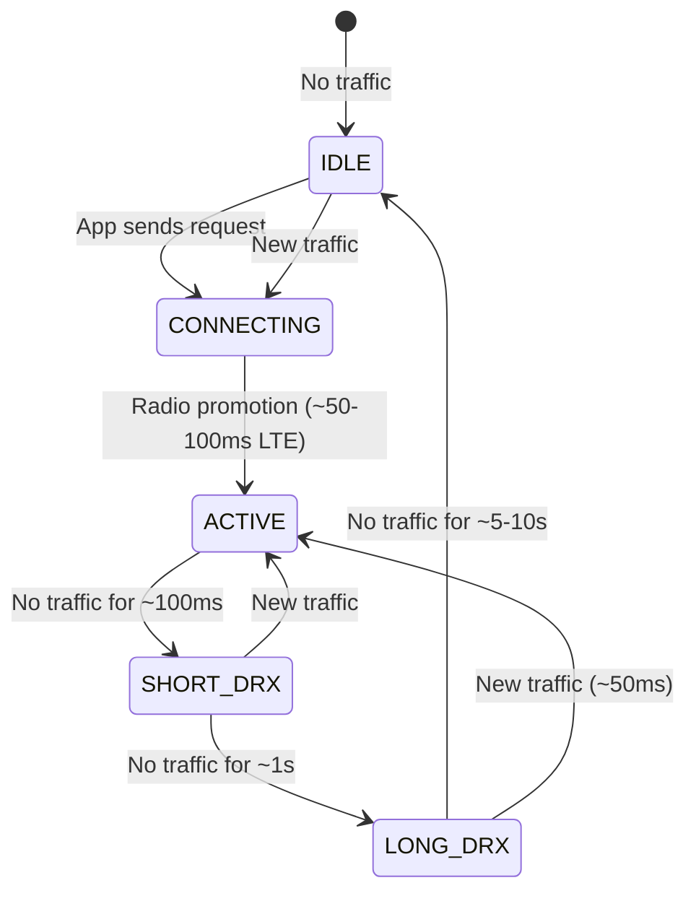
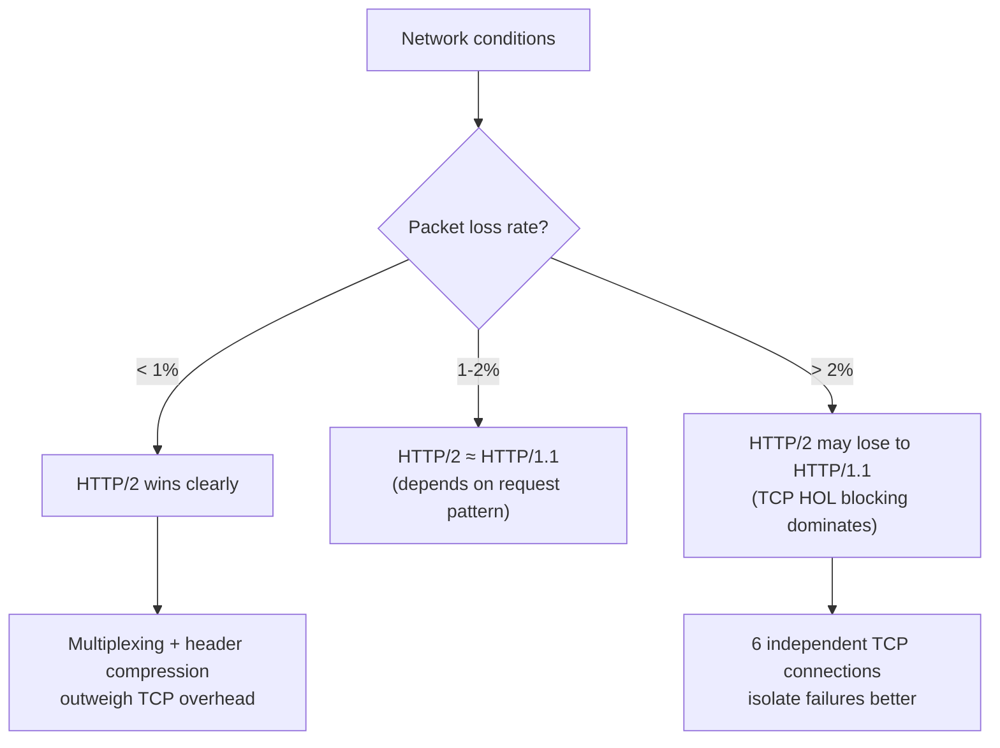
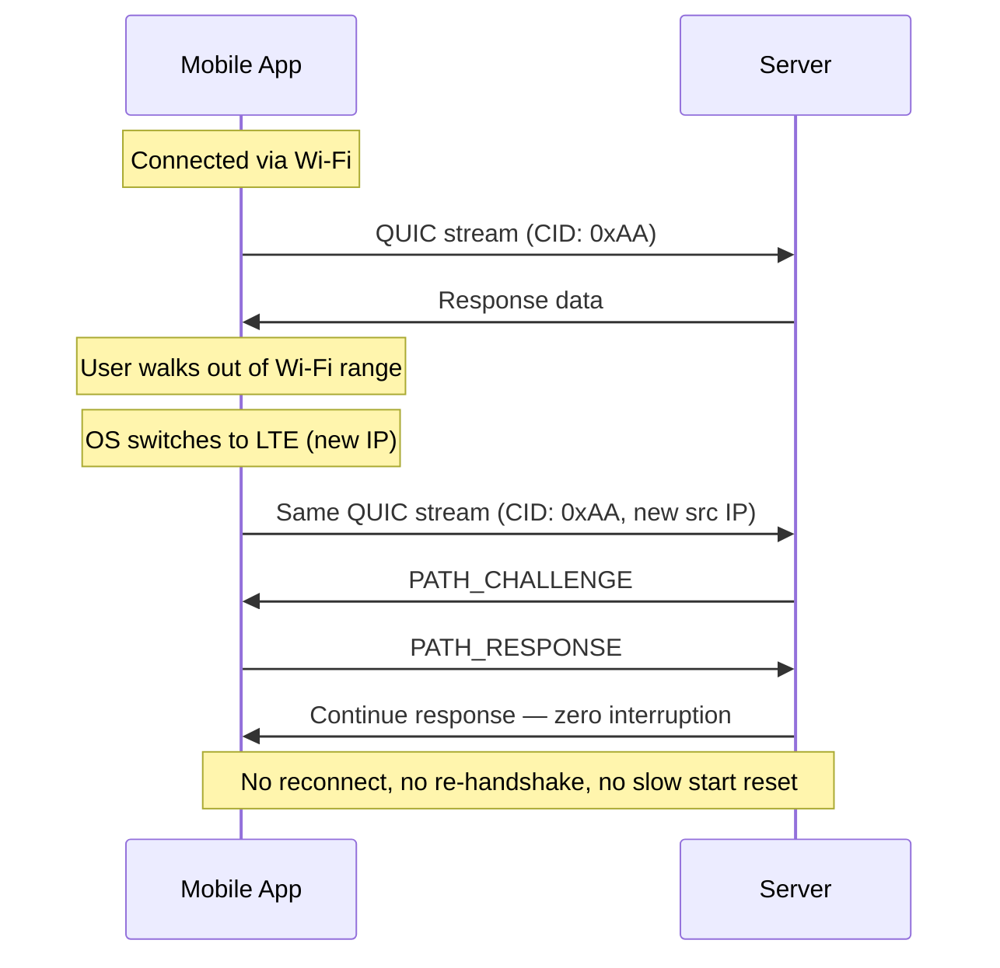
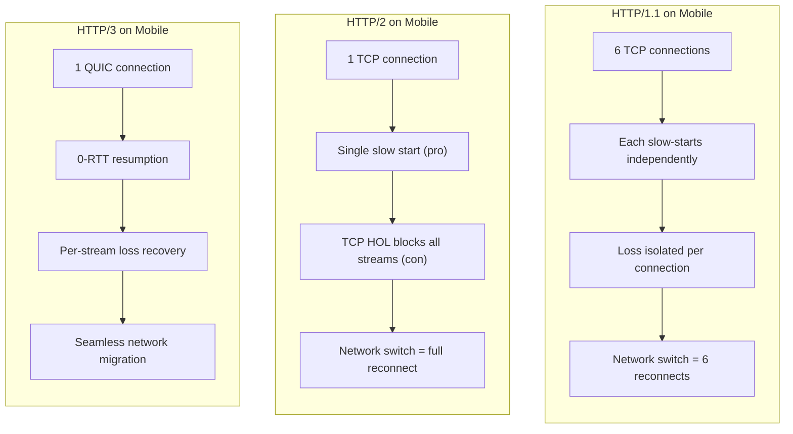

# HTTP on Mobile Networks

---

## Why Mobile Is Different

Mobile networks have fundamentally different characteristics than wired connections. The assumptions baked into TCP and HTTP — stable latency, low loss, persistent paths — break down on cellular networks.

| Property | Wired (fiber/cable) | Mobile (LTE/5G) |
|----------|-------------------|-----------------|
| **RTT** | 5-20ms | 30-100ms (LTE), 10-50ms (5G NR) |
| **Jitter** | Low (~1-2ms) | High (10-50ms swings) |
| **Packet loss** | < 0.1% | 1-5% (varies with signal) |
| **Bandwidth** | Stable | Fluctuates with signal, cell load, handoffs |
| **Connection persistence** | IP stays constant | IP changes on cell tower handoffs, Wi-Fi ↔ cellular |
| **Radio state** | Always on | Cycles through RRC states to save battery |

---

## The Radio Resource Control (RRC) Problem

Mobile radios cycle between power states to conserve battery. Transitioning from idle to active adds latency **before TCP even starts**.



| State | Latency to send | Power draw |
|-------|-----------------|------------|
| **ACTIVE** | 0ms (immediate) | High |
| **Short DRX** | ~20ms | Medium |
| **Long DRX** | ~50ms | Low |
| **IDLE** | 50-100ms (radio promotion) | Minimal |

!!! warning "Hidden Latency Tax"
    A "fast" API call on mobile may take 150ms+ before any TCP bytes flow: **50-100ms** for radio promotion + **30-80ms** RTT for TCP handshake. HTTP/3's 0-RTT resumption saves the handshake but not the radio promotion — the radio state machine is inescapable.

---

## How TCP Slow Start Hurts Mobile

Slow start's ramp-up delay is amplified by mobile's higher RTTs. Each RTT during slow start costs more wall-clock time.

| RTT | cwnd after 3 RTTs | Time spent in slow start |
|-----|-------------------|-------------------------|
| 10ms (wired) | 80 segments (112 KB) | 30ms |
| 50ms (5G) | 80 segments (112 KB) | 150ms |
| 80ms (LTE) | 80 segments (112 KB) | 240ms |
| 150ms (poor signal) | 80 segments (112 KB) | 450ms |

The cwnd growth is the same — but on mobile it takes **3-8x longer** to ramp up because each doubling step costs a higher RTT.

### Connection Reuse Is Critical

```mermaid
gantt
    title Loading 5 API responses (20 KB each) on LTE (80ms RTT)
    dateFormat X
    axisFormat %s ms

    section New connections (HTTP/1.1-style)
    Radio wakeup         :r1, 0, 80
    TCP+TLS (2 RTT)      :a1, 80, 160
    Slow start + data    :a2, 240, 80
    TCP+TLS              :b1, 320, 160
    Slow start + data    :b2, 480, 80
    TCP+TLS              :c1, 560, 160
    Slow start + data    :c2, 720, 80

    section Reused connection (HTTP/2)
    Radio wakeup         :r2, 0, 80
    TCP+TLS (2 RTT)      :d1, 80, 160
    All 5 responses      :d2, 240, 160
```



---

## When HTTP/2 Helps on Mobile

HTTP/2's benefits on mobile come from **connection reuse** and **header compression**, not just multiplexing.

### Where HTTP/2 Wins

| Benefit | Why it matters on mobile |
|---------|------------------------|
| **Single connection** | One slow start ramp-up instead of 6; cwnd stays warm across requests |
| **HPACK compression** | Mobile uplinks are slow (5-20 Mbps on LTE) — compressing repetitive headers saves real time |
| **Multiplexing** | Concurrent API calls don't queue behind each other at the HTTP layer |
| **Stream prioritization** | Critical resources (HTML, CSS) can be prioritized over images |

### Where HTTP/2 Hurts

| Problem | Why it's worse on mobile |
|---------|------------------------|
| **TCP HOL blocking** | Mobile's higher packet loss (1-5%) means more frequent stalls that block **all** streams |
| **Single connection = single failure point** | TCP retransmission timeout on mobile can be 200-400ms; affects everything |
| **Slow start restart after idle** | TCP resets cwnd after idle; mobile's bursty traffic patterns trigger this frequently |
| **No connection migration** | Wi-Fi ↔ cellular handoff kills the TCP connection — full reconnect + slow start |

### The Crossover Point



!!! note "In Practice, HTTP/2 Still Usually Wins"
    Even on lossy networks, HTTP/2's header compression and connection reuse typically outweigh the HOL blocking penalty for most real-world workloads. The regression is measurable in benchmarks but rarely catastrophic in apps — most mobile requests are small API calls that complete within the initial cwnd.

---

## When HTTP/3 (QUIC) Helps on Mobile

HTTP/3 addresses every TCP limitation that hurts mobile specifically.

### Mobile-Specific QUIC Advantages

| Feature | Mobile benefit |
|---------|---------------|
| **0-RTT resumption** | Skip TLS handshake on reconnect — critical after radio idle transitions |
| **No TCP HOL blocking** | Per-stream loss recovery — one lost packet doesn't stall other API calls |
| **Connection migration** | Seamless Wi-Fi ↔ cellular handoff via Connection IDs |
| **Userspace congestion control** | BBR or custom algorithms tuned for mobile — no OS kernel dependency |
| **Faster loss recovery** | QUIC's unique packet numbers eliminate retransmission ambiguity |

### Connection Migration in Action



With TCP (HTTP/1.1 or HTTP/2), this scenario requires:

1. Detect connection failure (timeout: 200ms-30s)
2. DNS resolution (50-200ms)
3. TCP handshake (1 RTT)
4. TLS handshake (1 RTT)
5. Slow start from zero
6. Re-send any in-flight requests

### Real-World Impact

Google's measurements from deploying QUIC on mobile (YouTube, Google Search, Chrome):

| Metric | Improvement |
|--------|-------------|
| Search latency (median) | 3-8% faster |
| Search latency (p99, worst connections) | **15-20% faster** |
| YouTube rebuffer rate | 15-18% reduction |
| Video startup time | 9% faster |
| Connection errors on network switch | ~0% (vs 2-5% with TCP) |

!!! tip "The Gains Are Largest at the Tail"
    QUIC's biggest improvements appear at p95-p99 — the worst network conditions where TCP struggles most. These are exactly the conditions mobile users experience during commutes, elevator rides, and cell tower handoffs.

---

## When HTTP/3 Doesn't Help

HTTP/3 is not universally better. Some scenarios see minimal or no improvement.

| Scenario | Why HTTP/3 doesn't help much |
|----------|------------------------------|
| **Stable Wi-Fi** | Low loss, stable IP — TCP works fine; QUIC adds CPU overhead |
| **Single small request** | 1-RTT vs 2-RTT saves 1 RTT, but radio promotion time dominates |
| **Bandwidth-bound transfers** | Large downloads are bottlenecked by bandwidth, not handshakes or HOL blocking |
| **UDP-hostile networks** | Corporate firewalls, some carrier NATs block or throttle UDP — falls back to TCP |
| **Server CPU-constrained** | QUIC in userspace uses 2-3x more CPU than kernel TCP at high throughput |

### Decision Matrix

| Network condition | Recommended protocol | Why |
|-------------------|---------------------|-----|
| Stable Wi-Fi, low latency | HTTP/2 | Proven, lower CPU, no UDP issues |
| LTE with good signal | HTTP/2 or HTTP/3 | Both work well; HTTP/3 edges ahead on reconnects |
| Weak/variable cellular | **HTTP/3** | 0-RTT, connection migration, no TCP HOL blocking |
| Frequent network switching | **HTTP/3** | Connection migration is the deciding factor |
| Enterprise / corporate network | HTTP/2 with HTTP/3 fallback | UDP often restricted |
| Latency-sensitive (gaming, real-time) | **HTTP/3** | Lower handshake latency, no HOL blocking |

---

## Practical Mobile Optimizations

### Client-Side Best Practices

```kotlin
// OkHttp: enable HTTP/2 + connection pooling
val client = OkHttpClient.Builder()
    .connectionPool(ConnectionPool(
        maxIdleConnections = 5,
        keepAliveDuration = 5, TimeUnit.MINUTES
    ))
    .protocols(listOf(Protocol.HTTP_2, Protocol.HTTP_1_1))
    .build()
```

| Practice | Effect |
|----------|--------|
| **Connection pooling** | Avoid repeated slow starts; keep cwnd warm |
| **Request batching** | Fewer connections, fewer radio promotions |
| **Prefetching** | Load data while radio is already active |
| **Compression** (gzip/brotli) | Less data = fewer slow start cycles needed |
| **Reduce DNS lookups** | Consolidate to fewer domains; use DNS-over-HTTPS |
| **Enable 0-RTT** (QUIC) | Skip TLS handshake on repeat connections |

### Server-Side Best Practices

| Practice | Effect |
|----------|--------|
| **Edge/CDN deployment** | Lower RTT → faster slow start ramp-up |
| **103 Early Hints** | Client starts loading subresources during server think time |
| **Increase initial window** (IW=10+) | More data in first flight |
| **BBR congestion control** | Better throughput on high-RTT, lossy paths |
| **Enable HTTP/3 with TCP fallback** | `Alt-Svc: h3=":443"` header + Happy Eyeballs |
| **Tune keepalive timers** | Keep connections alive through mobile idle periods |

---

## Protocol Stack Comparison for Mobile



---

??? question "Interview Questions"

    **Q: Why does TCP slow start hurt more on mobile than on wired networks?**
    Slow start doubles the congestion window each RTT. Mobile RTTs are 3-10x higher than wired (50-100ms vs 5-20ms), so each doubling step takes proportionally longer. A 100 KB resource that ramps up in 30ms on fiber takes 240ms+ on LTE — same number of RTTs, but each one costs more wall-clock time.

    **Q: What is the RRC state machine and how does it affect HTTP latency?**
    The Radio Resource Control state machine cycles the cellular radio between active and idle power states. Transitioning from idle to active takes 50-100ms on LTE before any data can be sent. This "radio promotion" latency is additive with TCP/TLS handshake time, making cold starts on mobile significantly slower than on always-connected wired networks.

    **Q: Can HTTP/2 be slower than HTTP/1.1 on mobile? When?**
    Yes, on high-loss networks (>2% packet loss). HTTP/1.1 opens 6 parallel TCP connections — a loss on one blocks only that connection. HTTP/2 multiplexes all streams onto one TCP connection, so a single lost segment blocks every stream. On lossy cellular links, this all-or-nothing stall pattern can degrade the user experience more than HTTP/1.1's independent connections.

    **Q: How does QUIC's connection migration work when a phone switches from Wi-Fi to cellular?**
    QUIC identifies connections by Connection IDs, not the IP:port 4-tuple. When the phone's IP changes, it sends packets from the new address with the same Connection ID. The server validates the new path with a challenge-response, and the connection continues without re-handshaking, re-negotiating TLS, or resetting the congestion window.

    **Q: Why is 0-RTT valuable on mobile specifically?**
    Mobile connections are frequently interrupted by radio idle transitions, network switches, and app backgrounding. 0-RTT lets the client send application data in its very first packet on reconnection, saving a full round trip. On mobile where RTTs are 50-100ms, this saves 50-100ms on every reconnection event — which may happen many times per user session.

    **Q: When should a mobile app NOT prefer HTTP/3?**
    On stable Wi-Fi (low loss, no migration needed), HTTP/2 performs similarly with less CPU overhead. On enterprise networks where UDP is blocked or throttled, HTTP/3 fails and requires TCP fallback. For large bandwidth-bound downloads, the bottleneck is throughput, not handshake latency or HOL blocking. Always implement graceful fallback to HTTP/2.

    **Q: What practical steps reduce mobile HTTP latency beyond protocol choice?**
    Connection pooling (avoid repeated slow starts), request batching (fewer radio promotions), edge/CDN deployment (lower RTT), DNS consolidation (fewer lookups), response compression (less data to slow-start through), and prefetching data while the radio is already active.

!!! tip "Further Reading"
    - [QUIC at Google — SIGCOMM 2017](https://dl.acm.org/doi/10.1145/3098822.3098842) — Google's real-world QUIC deployment results
    - [High Performance Browser Networking — Mobile Networks](https://hpbn.co/mobile-networks/) — Ilya Grigorik on RRC, latency, and optimization
    - [HTTP/3 for Everyone](https://http3-explained.haxx.se/) — Daniel Stenberg's practical guide
    - [Measuring QUIC vs TCP on Mobile](https://arxiv.org/abs/1905.03590) — academic analysis of QUIC on cellular networks
    - [Android Network Optimization](https://developer.android.com/develop/connectivity/network-tips) — Google's official guidance for reducing mobile network overhead
