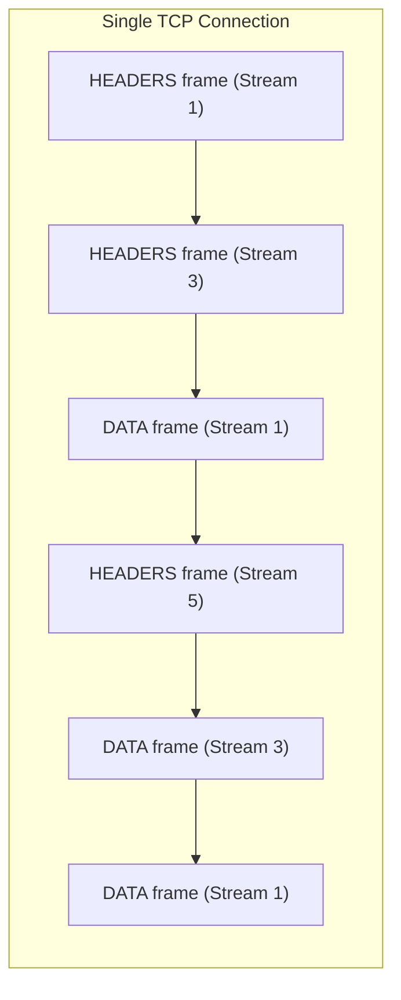
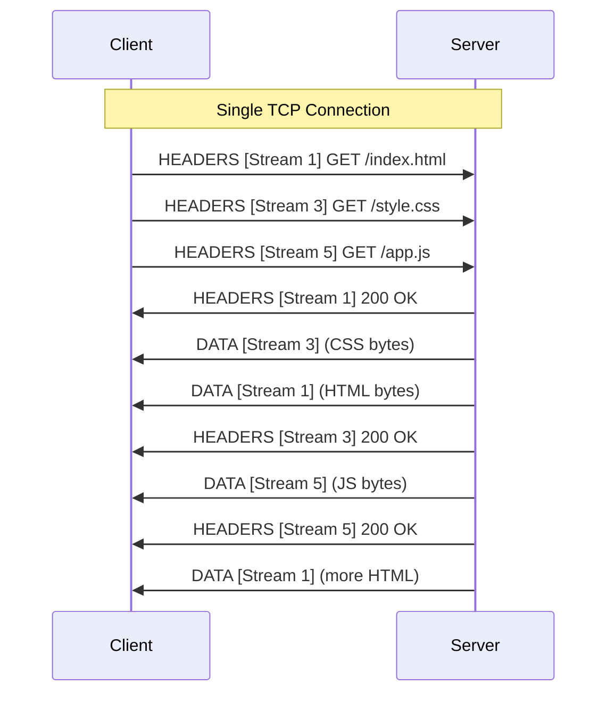
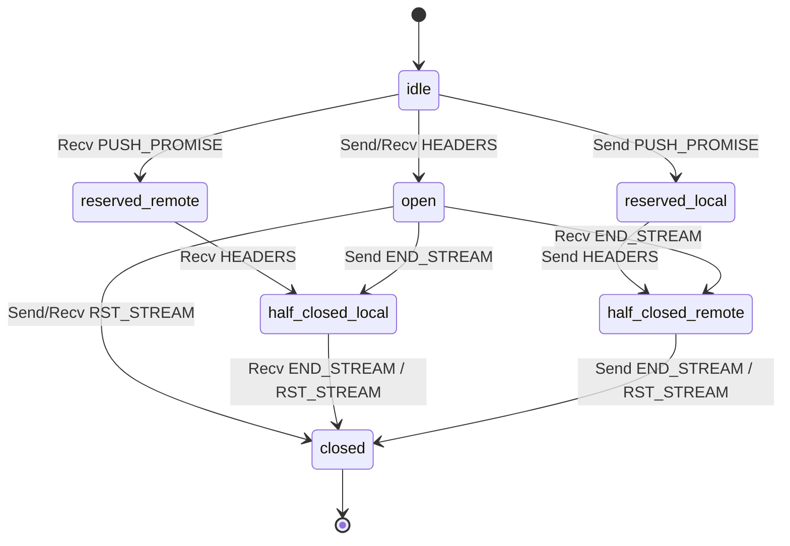
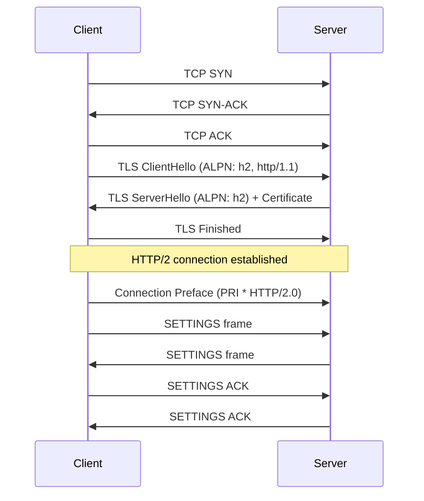
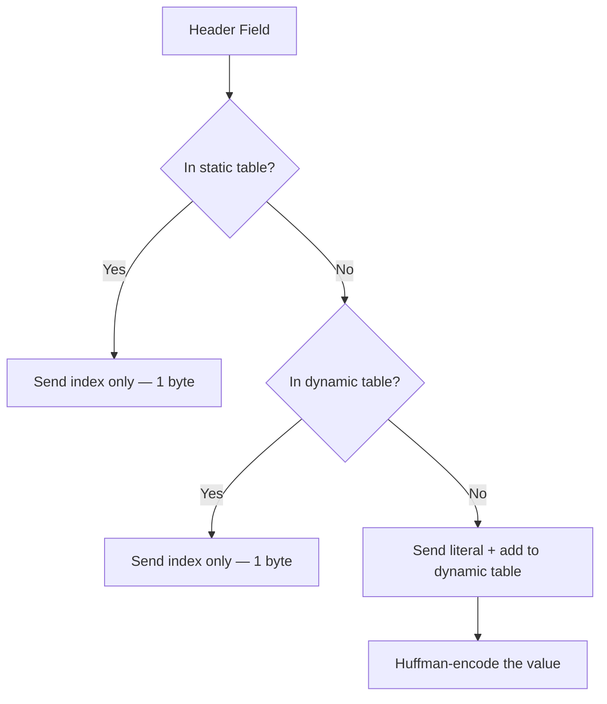
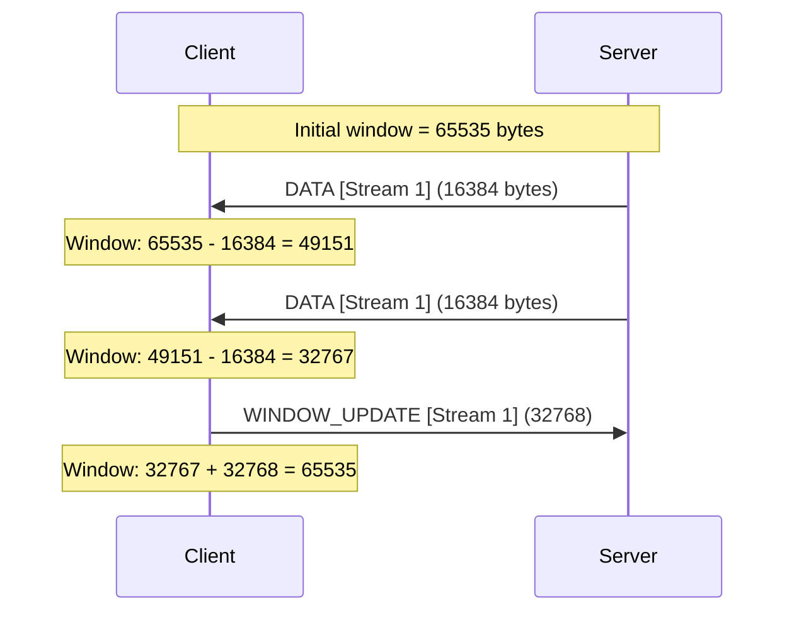
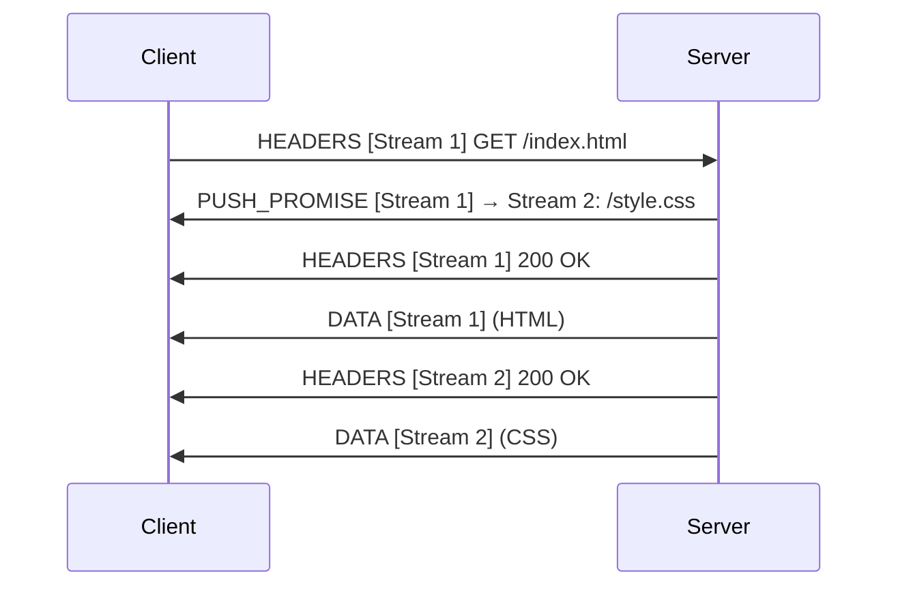
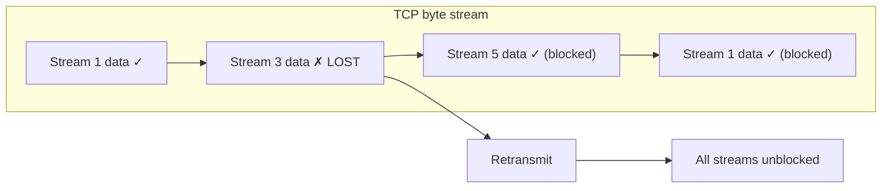

# HTTP/2

---

## Protocol Overview

HTTP/2 ([RFC 9113](https://www.rfc-editor.org/rfc/rfc9113)) is a **binary, multiplexed** protocol that solves HTTP/1.x's head-of-line blocking at the application layer. It introduces streams, header compression, and flow control — all while preserving HTTP semantics (methods, headers, status codes).

| Property | Detail |
|----------|--------|
| **Spec** | [RFC 9113](https://www.rfc-editor.org/rfc/rfc9113) (supersedes RFC 7540) |
| **Transport** | TCP + TLS (in practice — the spec allows cleartext `h2c`) |
| **Multiplexing** | Multiple concurrent streams over a single TCP connection |
| **Header compression** | HPACK ([RFC 7541](https://www.rfc-editor.org/rfc/rfc7541)) |
| **Server push** | Server can proactively send resources (rarely used) |
| **Negotiation** | TLS ALPN extension (`h2`) or HTTP Upgrade (`h2c`) |

---

## Binary Framing Layer

HTTP/2's most fundamental change: all communication is split into **frames** that are mapped to **streams**. This replaces the plaintext request/response model of HTTP/1.x.



### Frame Format

Every HTTP/2 frame has a fixed 9-byte header:

```
+-----------------------------------------------+
|                 Length (24)                     |
+---------------+---------------+---------------+
|   Type (8)    |   Flags (8)   |
+-+-------------+---------------+---------------+
|R|                 Stream ID (31)               |
+-+---------------------------------------------+
|                 Frame Payload (0...)           |
+-----------------------------------------------+
```

| Field | Size | Purpose |
|-------|------|---------|
| **Length** | 24 bits | Payload size (max 16 KB default, configurable to 16 MB) |
| **Type** | 8 bits | Frame type (HEADERS, DATA, SETTINGS, etc.) |
| **Flags** | 8 bits | Type-specific flags (END_STREAM, END_HEADERS, PADDED, PRIORITY) |
| **Stream ID** | 31 bits | Identifies which stream this frame belongs to (0 = connection-level) |

### Frame Types

| Type | ID | Purpose |
|------|----|---------|
| `DATA` | 0x0 | Request/response body payload |
| `HEADERS` | 0x1 | HTTP headers (compressed with HPACK) |
| `PRIORITY` | 0x2 | Stream priority (deprecated in RFC 9113) |
| `RST_STREAM` | 0x3 | Cancel a single stream without closing the connection |
| `SETTINGS` | 0x4 | Connection-level configuration (max streams, window size, etc.) |
| `PUSH_PROMISE` | 0x5 | Server push announcement |
| `PING` | 0x6 | Connection liveness check + RTT measurement |
| `GOAWAY` | 0x7 | Graceful connection shutdown |
| `WINDOW_UPDATE` | 0x8 | Flow control window adjustment |
| `CONTINUATION` | 0x9 | Continuation of HEADERS or PUSH_PROMISE that didn't fit |

---

## Stream Multiplexing

The signature feature of HTTP/2. Multiple **streams** (independent request-response pairs) share a single TCP connection, interleaved at the frame level.



### Stream States



### Stream ID Rules

| Rule | Detail |
|------|--------|
| Client-initiated streams | Odd IDs (1, 3, 5, ...) |
| Server-initiated streams (push) | Even IDs (2, 4, 6, ...) |
| Stream 0 | Connection control (SETTINGS, PING, GOAWAY) |
| IDs are never reused | Once closed, a stream ID is retired |
| Monotonically increasing | New streams must use a higher ID than any previously opened |

---

## Connection Setup

HTTP/2 over TLS uses the **ALPN** (Application-Layer Protocol Negotiation) extension during the TLS handshake to agree on `h2`.



### Connection Preface

The client sends a **magic octet sequence** followed by a SETTINGS frame:

```
PRI * HTTP/2.0\r\n\r\nSM\r\n\r\n
```

This exists to quickly fail against HTTP/1.1 servers that don't understand HTTP/2.

### Key SETTINGS Parameters

| Parameter | Default | Purpose |
|-----------|---------|---------|
| `HEADER_TABLE_SIZE` | 4096 | HPACK dynamic table size |
| `ENABLE_PUSH` | 1 | Whether server push is allowed |
| `MAX_CONCURRENT_STREAMS` | Unlimited | Max simultaneously open streams |
| `INITIAL_WINDOW_SIZE` | 65535 | Per-stream flow control window |
| `MAX_FRAME_SIZE` | 16384 | Maximum frame payload size |
| `MAX_HEADER_LIST_SIZE` | Unlimited | Max size of header block |

---

## HPACK Header Compression

HTTP/1.x sends headers as **uncompressed plaintext** on every request — often 500-800 bytes of repetitive data (`Cookie`, `User-Agent`, `Accept`). HPACK eliminates this redundancy.

### How HPACK Works



| Component | Description |
|-----------|-------------|
| **Static table** | 61 predefined entries (`:method: GET`, `:status: 200`, `content-type`, etc.) |
| **Dynamic table** | Per-connection table built from previously sent headers |
| **Huffman coding** | Byte-level compression of literal string values |
| **Indexing** | Headers seen before are sent as a single integer index |

### Compression Example

=== "First Request"

    ```
    :method: GET              → Index 2 (static)
    :path: /api/users         → Literal, add to dynamic table
    :authority: api.example.com → Literal, add to dynamic table
    authorization: Bearer xyz → Literal, add to dynamic table

    Compressed: ~20 bytes (vs ~200 plaintext)
    ```

=== "Second Request"

    ```
    :method: GET              → Index 2 (static)
    :path: /api/posts         → Literal (new path)
    :authority: api.example.com → Index 62 (dynamic — seen before!)
    authorization: Bearer xyz → Index 63 (dynamic — seen before!)

    Compressed: ~10 bytes
    ```

!!! warning "CRIME/BREACH Attacks"
    Compression oracles can leak secrets (like CSRF tokens) if an attacker controls part of the compressed data. HTTP/2 mitigates this by compressing headers separately from the body and using HPACK instead of general-purpose compression (like DEFLATE).

---

## Flow Control

HTTP/2 implements **per-stream and connection-level flow control** to prevent a fast sender from overwhelming a slow receiver.

| Property | Detail |
|----------|--------|
| **Scope** | Per-stream **and** per-connection |
| **Mechanism** | Credit-based: receiver grants a window; sender can't exceed it |
| **Default window** | 65,535 bytes (configurable via SETTINGS) |
| **WINDOW_UPDATE** | Frame sent by receiver to grant more credit |
| **DATA frames only** | Flow control applies only to DATA frames, not HEADERS or control frames |



---

## Server Push

The server can proactively send resources the client hasn't requested yet, using `PUSH_PROMISE`.



!!! note "Server Push Is Rarely Used"
    Chrome removed server push support in 2022. Problems: (1) the server doesn't know what's already cached; (2) push races with the client's own requests; (3) `103 Early Hints` achieves similar benefits more reliably.

---

## Head-of-Line Blocking — The Remaining Problem

HTTP/2 solves HOL blocking at the **HTTP layer** — streams are independent and can be interleaved. But it still runs over TCP, which delivers bytes **in order**. A single lost TCP segment blocks **all streams**.



| Layer | HTTP/1.1 | HTTP/2 |
|-------|----------|--------|
| **HTTP** | Blocked (sequential) | Solved (multiplexed streams) |
| **TCP** | Blocked (ordered delivery) | **Still blocked** (all streams share one TCP connection) |

This is the fundamental limitation that motivated HTTP/3's move to QUIC.

---

## Request Lifecycle Comparison

```mermaid
gantt
    title HTTP/1.1 vs HTTP/2 — Loading 6 Resources
    dateFormat X
    axisFormat %s

    section HTTP/1.1 (6 connections)
    TCP+TLS Conn 1  :a0, 0, 100
    GET /html        :a1, 100, 50
    TCP+TLS Conn 2  :b0, 0, 100
    GET /css         :b1, 100, 30
    TCP+TLS Conn 3  :c0, 0, 100
    GET /js          :c1, 100, 60
    GET /img1        :a2, 150, 40
    GET /img2        :b2, 130, 45
    GET /img3        :c2, 160, 35

    section HTTP/2 (1 connection)
    TCP+TLS          :d0, 0, 100
    GET /html        :d1, 100, 50
    GET /css         :d2, 100, 30
    GET /js          :d3, 100, 60
    GET /img1        :d4, 100, 40
    GET /img2        :d5, 100, 45
    GET /img3        :d6, 100, 35
```



---

??? question "Interview Questions"

    **Q: How does HTTP/2 achieve multiplexing over a single connection?**
    HTTP/2 introduces a binary framing layer where each frame carries a stream ID. Multiple streams (request-response pairs) interleave their frames on the same TCP connection. The receiver reassembles frames by stream ID.

    **Q: What is the difference between a frame and a stream in HTTP/2?**
    A **frame** is the smallest unit of communication — a typed, fixed-header binary message. A **stream** is a logical, bidirectional sequence of frames that represents a single request-response exchange. Multiple streams share one connection.

    **Q: How does HPACK header compression work?**
    HPACK uses three techniques: (1) a static table of 61 common headers; (2) a dynamic table built from previously sent headers; (3) Huffman encoding for literal values. Headers seen before are sent as a single-byte index instead of the full key-value pair.

    **Q: Does HTTP/2 solve head-of-line blocking?**
    Partially. It solves HTTP-layer HOL blocking — streams are independent and interleaved. But TCP-layer HOL blocking remains: a lost TCP segment blocks all streams until retransmission completes. This is why HTTP/3 uses QUIC over UDP.

    **Q: Why is server push being deprecated?**
    Server push has practical problems: the server doesn't know what the client has cached, pushes can race with client requests causing wasted bandwidth, and `103 Early Hints` provides similar benefits without these drawbacks. Chrome removed push support in 2022.

    **Q: What happens when you use domain sharding with HTTP/2?**
    It's counterproductive. HTTP/2 multiplexes all requests over a single connection per origin. Domain sharding forces the browser to open separate connections to each subdomain, preventing multiplexing and adding connection overhead.

    **Q: How does HTTP/2 flow control work?**
    Credit-based, at two levels: per-stream and per-connection. The receiver advertises a window size (default 65,535 bytes). The sender can only send that many DATA bytes before receiving a WINDOW_UPDATE frame granting more credit. This prevents fast senders from overwhelming slow receivers.

!!! tip "Further Reading"
    - [RFC 9113 — HTTP/2](https://www.rfc-editor.org/rfc/rfc9113) — the current HTTP/2 spec
    - [RFC 7541 — HPACK](https://www.rfc-editor.org/rfc/rfc7541) — header compression spec
    - [High Performance Browser Networking — HTTP/2](https://hpbn.co/http2/) — Ilya Grigorik's comprehensive guide
    - [HTTP/2 Explained](https://daniel.haxx.se/http2/) — Daniel Stenberg (curl author)
