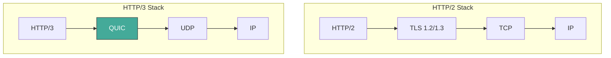
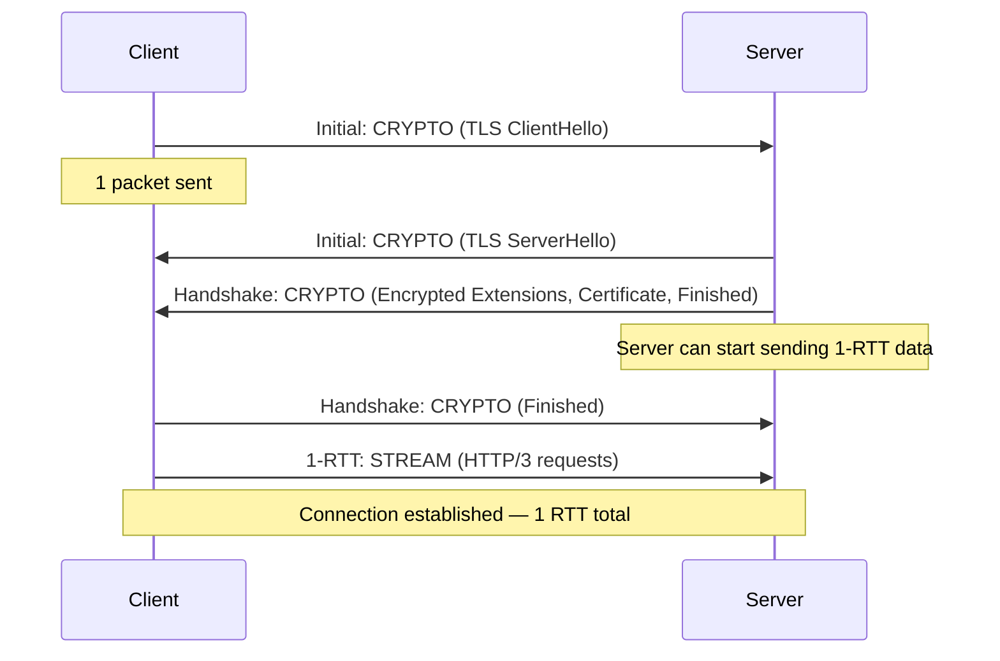
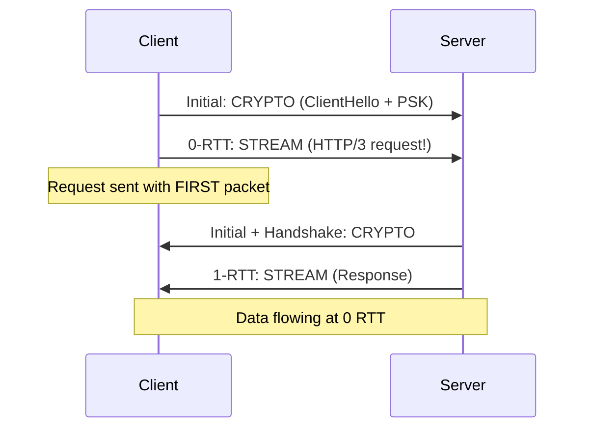
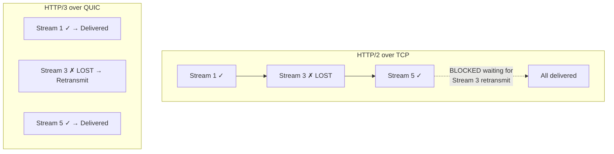
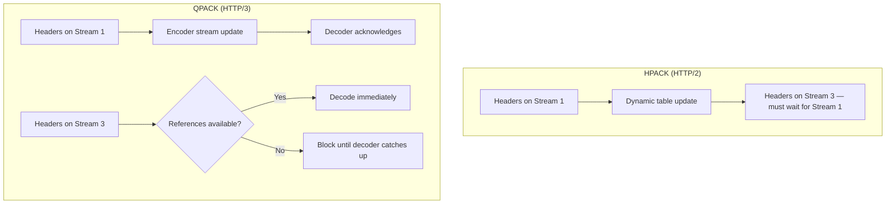
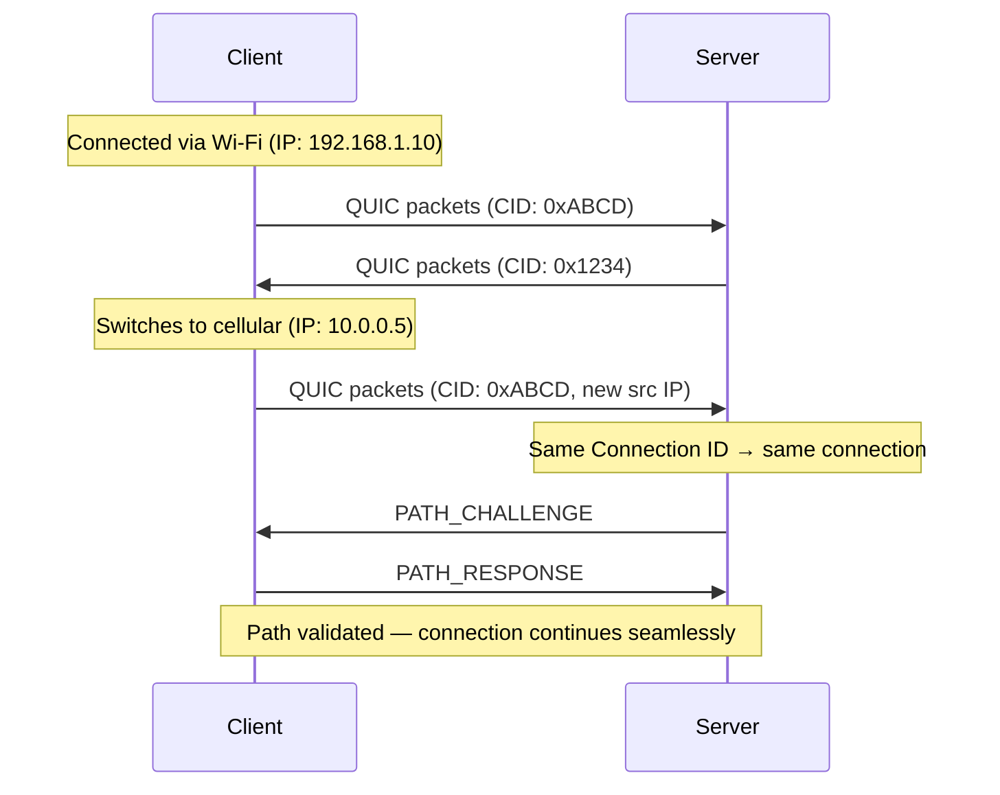
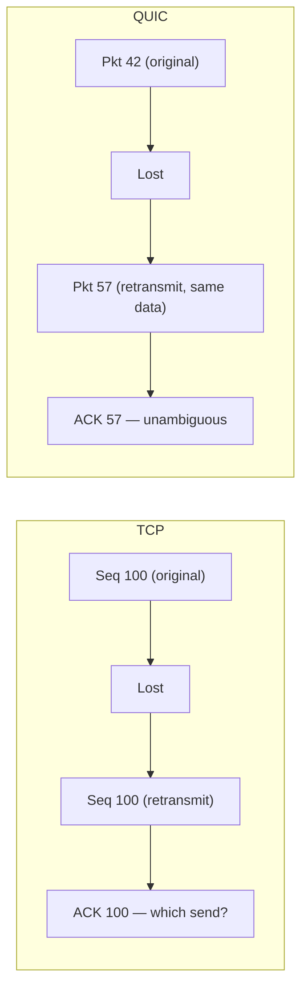
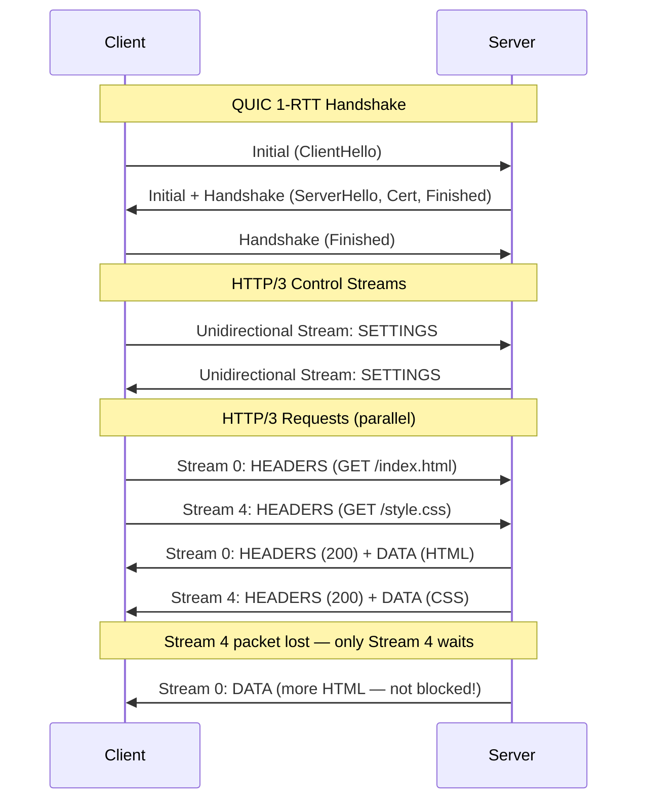
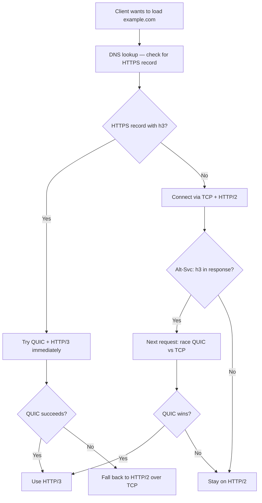

# HTTP/3

---

## Protocol Overview

HTTP/3 ([RFC 9114](https://www.rfc-editor.org/rfc/rfc9114)) replaces TCP with **QUIC** — a transport protocol built on UDP that provides multiplexed streams, built-in encryption, and independent loss recovery per stream. This eliminates TCP-level head-of-line blocking, the last major performance bottleneck inherited by HTTP/2.

| Property | Detail |
|----------|--------|
| **Spec** | [RFC 9114](https://www.rfc-editor.org/rfc/rfc9114) (HTTP/3), [RFC 9000](https://www.rfc-editor.org/rfc/rfc9000) (QUIC) |
| **Transport** | QUIC over UDP |
| **Encryption** | TLS 1.3 integrated into QUIC — always encrypted |
| **Multiplexing** | Independent QUIC streams — no HOL blocking |
| **Header compression** | QPACK ([RFC 9204](https://www.rfc-editor.org/rfc/rfc9204)) |
| **Connection migration** | Connections survive IP/network changes via Connection IDs |
| **Handshake** | 1-RTT (combined transport + TLS), 0-RTT on resumption |

---

## Why QUIC?

HTTP/2 solved multiplexing at the application layer, but TCP's ordered byte stream still caused head-of-line blocking. Rather than modifying TCP (which is ossified in OS kernels and middleboxes), QUIC builds a new transport on UDP.



| Problem in HTTP/2 | QUIC Solution |
|-------------------|---------------|
| TCP HOL blocking — one lost segment blocks all streams | Each QUIC stream has **independent** loss recovery |
| 2-3 RTT connection setup (TCP + TLS) | **1-RTT** handshake (transport + crypto combined) |
| Connection tied to IP:port 4-tuple | **Connection IDs** allow migration across networks |
| TCP ossification — middleboxes block protocol changes | QUIC encrypts transport headers — middleboxes can't interfere |
| TLS is optional in TCP | TLS 1.3 is **mandatory** in QUIC |

---

## QUIC Transport

QUIC is the transport layer that powers HTTP/3. It provides reliable, encrypted, multiplexed delivery over UDP.

### QUIC Packet Structure

```
+--------------------------------------------------+
| UDP Header (8 bytes)                              |
+--------------------------------------------------+
| QUIC Header                                       |
|   - Header Form (1 bit)                          |
|   - Connection ID                                 |
|   - Packet Number (encrypted)                     |
+--------------------------------------------------+
| QUIC Payload (encrypted)                          |
|   - Frame 1 (STREAM, ACK, CRYPTO, etc.)          |
|   - Frame 2                                       |
|   - ...                                           |
+--------------------------------------------------+
```

### Packet Types

| Type | When Used | Purpose |
|------|-----------|---------|
| **Initial** | Connection setup | Carries first CRYPTO frames (TLS ClientHello) |
| **Handshake** | Connection setup | Carries TLS handshake completion |
| **0-RTT** | Resumption | Early data before handshake completes |
| **1-RTT (Short Header)** | After handshake | All post-handshake application data |
| **Retry** | Server → Client | Address validation (anti-amplification) |

---

## Connection Setup

QUIC merges the transport and TLS handshakes into a single round trip.

### First Connection (1-RTT)



### Resumption (0-RTT)



### Handshake Latency Comparison

| Protocol | First Connection | Resumption |
|----------|-----------------|------------|
| HTTP/1.1 + TLS 1.2 | 3 RTT (TCP + TLS) | 2 RTT |
| HTTP/2 + TLS 1.3 | 2 RTT (TCP + TLS) | 2 RTT (TCP + 0-RTT TLS) |
| **HTTP/3 + QUIC** | **1 RTT** | **0 RTT** |

!!! warning "0-RTT Replay Attacks"
    0-RTT data is not protected against replay — an attacker can capture and resend the client's 0-RTT packet. Only use 0-RTT for **idempotent** requests (GET, HEAD). Servers must implement replay protection or limit 0-RTT to safe operations.

---

## Stream Multiplexing Without HOL Blocking

The key improvement over HTTP/2. Each QUIC stream has its own **independent** sequence number space and loss recovery. A lost packet on one stream doesn't block other streams.



### How It Works

| HTTP/2 (TCP) | HTTP/3 (QUIC) |
|--------------|----------------|
| All streams share one TCP byte stream | Each stream has its own QUIC byte stream |
| TCP sequence numbers are global | QUIC packet numbers are per-connection, but stream offsets are per-stream |
| One lost segment blocks everything | Lost data only blocks the affected stream |
| Retransmission is TCP's job — unaware of streams | QUIC retransmits per-stream, in new packets (never retransmits the same packet number) |

### QUIC Stream Types

| Stream Type | ID Pattern | Use in HTTP/3 |
|-------------|------------|---------------|
| Client-initiated, bidirectional | 0, 4, 8, ... | HTTP request-response pairs |
| Server-initiated, bidirectional | 1, 5, 9, ... | Not used by HTTP/3 |
| Client-initiated, unidirectional | 2, 6, 10, ... | Control stream, QPACK encoder/decoder |
| Server-initiated, unidirectional | 3, 7, 11, ... | Control stream, QPACK encoder/decoder, server push |

---

## QPACK Header Compression

HTTP/2's HPACK relies on ordered delivery — encoder and decoder must process headers in the same order. This is incompatible with QUIC's independent streams. QPACK solves this.



| Feature | HPACK (HTTP/2) | QPACK (HTTP/3) |
|---------|---------------|----------------|
| **Static table** | 61 entries | 99 entries (more modern headers) |
| **Dynamic table updates** | Inline in header block | Sent on a dedicated encoder stream |
| **Ordering dependency** | Strict — must decode in order | Flexible — can decode out of order with acknowledgments |
| **Blocking** | Never blocks (TCP guarantees order) | May briefly block if referencing unacknowledged entries |

---

## Connection Migration

TCP connections are identified by the 4-tuple (src IP, src port, dst IP, dst port). Changing networks (Wi-Fi → cellular) kills the connection. QUIC uses **Connection IDs** instead.



### Migration Flow

| Step | Action |
|------|--------|
| 1 | Client detects network change (new IP/port) |
| 2 | Client sends packets from new address with same Connection ID |
| 3 | Server receives packets, recognizes Connection ID |
| 4 | Server sends `PATH_CHALLENGE` frame to validate new path |
| 5 | Client responds with `PATH_RESPONSE` |
| 6 | Connection continues with updated path — no re-handshake needed |

!!! note "Connection ID Rotation"
    To prevent linkability across networks, QUIC rotates Connection IDs. The server provides a pool of new CIDs via `NEW_CONNECTION_ID` frames. The client uses a fresh CID after migration so observers can't correlate old and new paths.

---

## Congestion Control & Loss Recovery

QUIC implements congestion control in **userspace** (not the OS kernel), making it easier to iterate and deploy new algorithms.

| Aspect | TCP | QUIC |
|--------|-----|------|
| **Implementation** | OS kernel | Userspace (in the application) |
| **Algorithm** | Varies by OS (Cubic, BBR, Reno) | Application chooses (commonly Cubic or BBR) |
| **Loss detection** | Relies on sequence numbers (ambiguous on retransmission) | Unique packet numbers — never reused, no ambiguity |
| **ACK mechanism** | Cumulative ACKs + SACK | ACK frames with explicit ranges and timestamps |
| **ECN support** | OS-level, often disabled | First-class support in QUIC ACK frames |

### Unique Packet Numbers

TCP reuses sequence numbers on retransmission, creating ambiguity about which send is being acknowledged. QUIC packet numbers **always increase** — retransmitted data gets a new packet number.



---

## HTTP/3 Request Lifecycle



---

## Discovery & Negotiation

Clients discover HTTP/3 support via the `Alt-Svc` header or DNS HTTPS records. The browser initially connects over HTTP/2 (TCP), then upgrades.

### Alt-Svc Header

```http
HTTP/2 200 OK
Alt-Svc: h3=":443"; ma=86400
```

| Field | Meaning |
|-------|---------|
| `h3` | Protocol identifier for HTTP/3 |
| `":443"` | Port to use (usually same as HTTPS) |
| `ma=86400` | Max age — cache this for 24 hours |

### DNS HTTPS Record (SVCB)

```
example.com.  IN HTTPS  1 . alpn="h3,h2" port=443
```

### Connection Flow



!!! note "Happy Eyeballs v2"
    Browsers use a racing strategy: start a QUIC connection and a TCP connection simultaneously. Whichever completes first wins. This prevents QUIC failures (firewalls blocking UDP) from adding latency.

---

## HTTP/1.1 vs HTTP/2 vs HTTP/3

| Aspect | HTTP/1.1 | HTTP/2 | HTTP/3 |
|--------|----------|--------|--------|
| **Transport** | TCP | TCP | QUIC (UDP) |
| **Encryption** | Optional (HTTPS) | Practically required (TLS) | Always (TLS 1.3 built-in) |
| **First connection** | 2-3 RTT | 2 RTT | 1 RTT |
| **Resumption** | 1-2 RTT | 1-2 RTT | 0 RTT |
| **Multiplexing** | None | Yes (but TCP HOL blocking) | Yes (no HOL blocking) |
| **Header compression** | None | HPACK | QPACK |
| **Connection migration** | No | No | Yes (Connection IDs) |
| **Implemented in** | OS kernel | OS kernel / library | Userspace library |
| **Middlebox compatibility** | Universal | Good | Challenging (UDP may be blocked) |

---

## Deployment Considerations

| Challenge | Detail |
|-----------|--------|
| **UDP blocking** | Some networks/firewalls block or rate-limit UDP — always provide TCP fallback |
| **CPU cost** | QUIC in userspace currently uses more CPU than kernel TCP for the same throughput |
| **Ecosystem maturity** | Fewer battle-tested libraries compared to HTTP/2; debugging tools are catching up |
| **Load balancers** | Must understand Connection IDs to route packets correctly after migration |
| **MTU discovery** | QUIC handles PMTU discovery itself — firewalls must not block ICMP "Packet Too Big" |

---

??? question "Interview Questions"

    **Q: Why does HTTP/3 use UDP instead of TCP?**
    TCP is ossified — changing its behavior requires OS kernel updates and middlebox cooperation, which is practically impossible at internet scale. UDP provides a minimal, unreliable datagram layer on top of which QUIC implements its own reliable, multiplexed transport in userspace, where it can evolve freely.

    **Q: How does QUIC eliminate head-of-line blocking?**
    Each QUIC stream has independent sequence numbering and loss recovery. A lost packet only blocks the stream whose data it carried. Other streams continue receiving and processing data. In contrast, TCP's single ordered byte stream means one lost segment blocks all HTTP/2 streams.

    **Q: What is 0-RTT resumption and what are its risks?**
    When a client reconnects to a server it has visited before, it can send application data in the very first packet using a pre-shared key from the previous session. The risk is replay attacks — an attacker can capture and resend the 0-RTT packet. Only idempotent requests should use 0-RTT, and servers must implement replay mitigation.

    **Q: How does QUIC connection migration work?**
    QUIC connections are identified by Connection IDs, not the IP:port 4-tuple. When a client changes networks (e.g., Wi-Fi to cellular), it sends packets from its new IP with the same Connection ID. The server validates the new path with a challenge-response and continues the connection without re-handshaking.

    **Q: Why does HTTP/3 use QPACK instead of HPACK?**
    HPACK requires headers to be processed in strict order, which works with TCP's ordered delivery but conflicts with QUIC's independent streams. QPACK decouples dynamic table updates from header blocks by using a dedicated encoder stream, allowing out-of-order header decoding.

    **Q: How do clients discover HTTP/3 support?**
    Two mechanisms: (1) the `Alt-Svc` HTTP header in an HTTP/2 response advertises `h3` support; (2) DNS HTTPS/SVCB records can advertise `h3` directly, enabling QUIC on the first connection. Browsers use "Happy Eyeballs" to race QUIC and TCP connections, falling back to TCP if QUIC fails.

    **Q: What are the main deployment challenges for HTTP/3?**
    UDP may be blocked by firewalls or corporate networks, requiring TCP fallback. QUIC runs in userspace, currently using more CPU than kernel TCP. Load balancers must understand Connection IDs for routing. The ecosystem has fewer mature libraries and debugging tools compared to HTTP/2.

!!! tip "Further Reading"
    - [RFC 9114 — HTTP/3](https://www.rfc-editor.org/rfc/rfc9114) — the HTTP/3 specification
    - [RFC 9000 — QUIC](https://www.rfc-editor.org/rfc/rfc9000) — the QUIC transport specification
    - [RFC 9204 — QPACK](https://www.rfc-editor.org/rfc/rfc9204) — header compression for HTTP/3
    - [HTTP/3 Explained](https://http3-explained.haxx.se/) — Daniel Stenberg's guide
    - [Cloudflare: The Road to QUIC](https://blog.cloudflare.com/the-road-to-quic/) — real-world deployment experience
