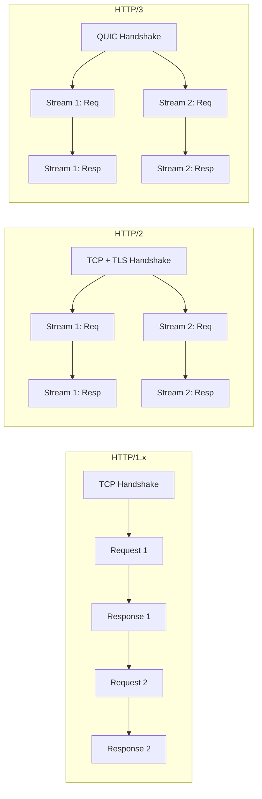

# HTTP Versions: How Requests Are Handled

---

## Overview

HTTP has evolved through three major versions, each fundamentally changing how requests travel between client and server. The core semantics (methods, headers, status codes) remain the same — what changes is the **transport mechanics**: how connections are opened, how requests are multiplexed, and how data reaches the wire.

---

## Version Comparison

| Aspect | HTTP/1.1 | HTTP/2 | HTTP/3 |
|--------|----------|--------|--------|
| **Year** | 1997 (RFC 2068) | 2015 (RFC 7540) | 2022 (RFC 9114) |
| **Transport** | TCP | TCP + TLS | QUIC (UDP + TLS 1.3) |
| **Multiplexing** | None — one request per connection at a time | Streams over a single TCP connection | Streams over independent QUIC streams |
| **Head-of-line blocking** | At HTTP layer **and** TCP layer | Solved at HTTP layer, **still at TCP** | Solved at both layers |
| **Header format** | Plaintext, repeated per request | Binary, HPACK compressed | Binary, QPACK compressed |
| **Server push** | Not supported | Supported (rarely used) | Supported (rarely used) |
| **Connection setup** | 1-RTT (TCP) + 2-RTT (TLS 1.2) | 1-RTT (TCP) + 1-RTT (TLS 1.3) | 1-RTT (or 0-RTT on resumption) |
| **Connection migration** | Not supported | Not supported | Supported (connection ID-based) |

---

## Sub-Topics

| Page | What It Covers |
|------|---------------|
| [HTTP/1.x](http1.md) | Persistent connections, pipelining, chunked encoding, and the head-of-line blocking problem that drove HTTP/2's design |
| [HTTP/2](http2.md) | Binary framing, stream multiplexing, HPACK header compression, flow control, and server push |
| [HTTP/3](http3.md) | QUIC transport, 0-RTT resumption, independent stream loss recovery, connection migration, and QPACK |

Start with HTTP/1.x to understand the constraints, then read HTTP/2 and HTTP/3 to see how each version addresses them.

!!! tip "Further Reading"
    - [RFC 9110 — HTTP Semantics](https://www.rfc-editor.org/rfc/rfc9110) — the version-independent spec shared by all three
    - [HTTP/2 vs HTTP/3 — Cloudflare](https://www.cloudflare.com/learning/performance/http2-vs-http3/)
    - [Web Almanac: HTTP](https://almanac.httparchive.org/en/2022/http) — adoption data and real-world usage
