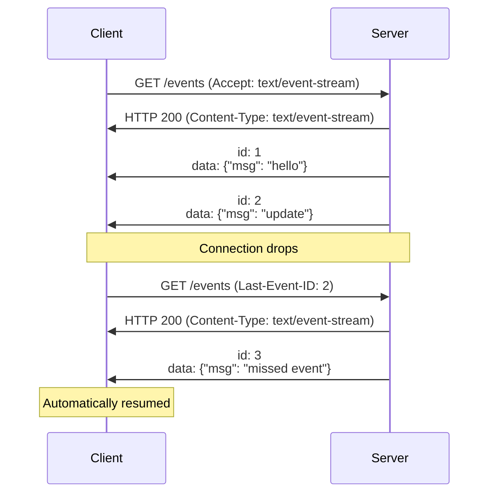
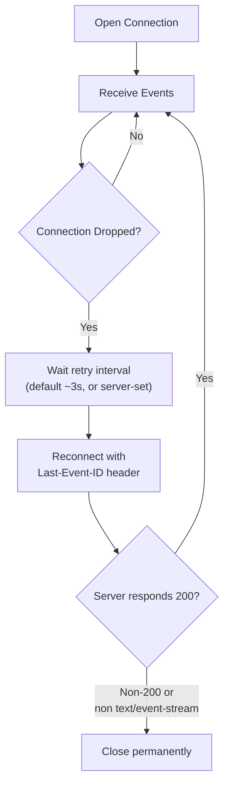
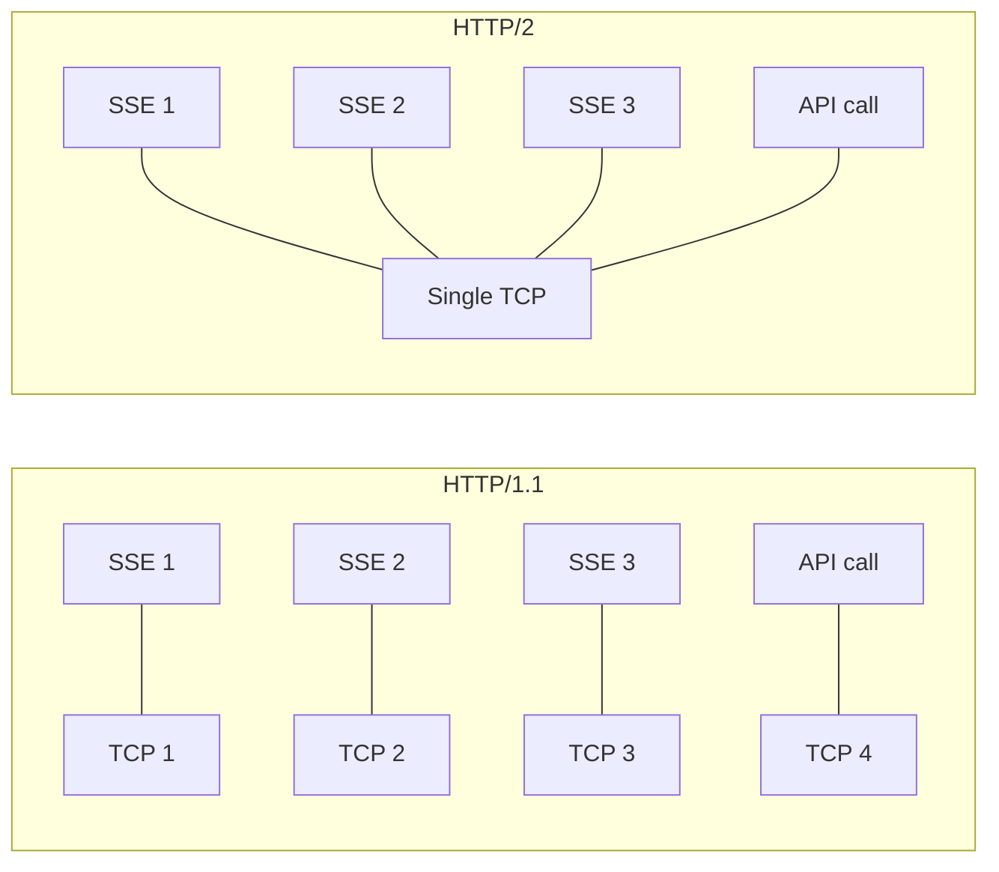
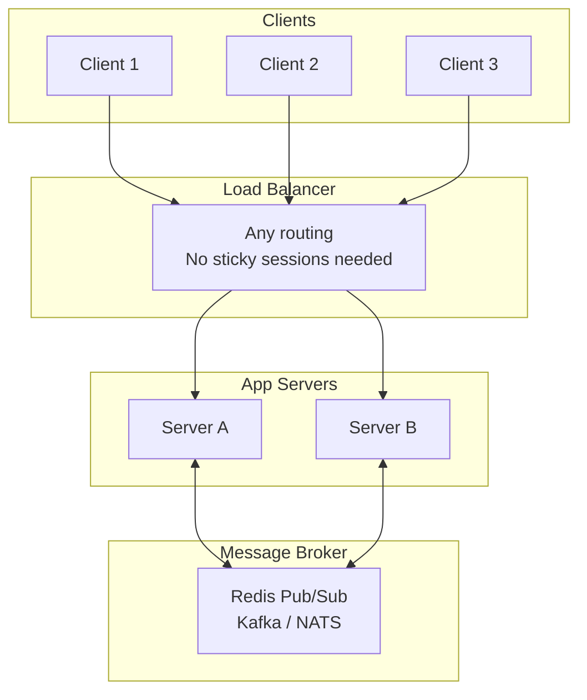

# Server-Sent Events (SSE)

---

## Protocol Overview

Server-Sent Events is a simple, HTTP-based protocol for **unidirectional server-to-client** streaming. Defined in the [HTML Living Standard](https://html.spec.whatwg.org/multipage/server-sent-events.html).

| Property | Detail |
|----------|--------|
| **Transport** | Standard HTTP (long-lived response) |
| **Direction** | Server → Client only |
| **Data type** | Text only (UTF-8) — binary must be Base64-encoded |
| **Reconnection** | Built-in automatic reconnect with `Last-Event-ID` |
| **Content type** | `text/event-stream` |
| **Spec** | [HTML Living Standard — Server-Sent Events](https://html.spec.whatwg.org/multipage/server-sent-events.html) |



---

## Event Stream Format

The wire format is plain text. Each event is a block of `field: value` lines, terminated by a blank line (`\n\n`).

### Fields

| Field | Purpose | Rules |
|-------|---------|-------|
| `data` | Event payload | Multiple `data:` lines are joined with `\n` |
| `event` | Event type name | Maps to `addEventListener(type, ...)` on the client |
| `id` | Event ID | Sent back as `Last-Event-ID` on reconnect |
| `retry` | Reconnection interval (ms) | Overrides the client's default retry timing |

### Examples

=== "Simple Event"

    ```
    data: Hello, world!

    ```

    Dispatched as a `message` event with `event.data = "Hello, world!"`.

=== "JSON Payload"

    ```
    event: price-update
    id: 42
    data: {"symbol": "AAPL", "price": 187.50}

    ```

    Dispatched to `addEventListener("price-update", ...)`.

=== "Multi-Line Data"

    ```
    data: first line
    data: second line
    data: third line

    ```

    `event.data = "first line\nsecond line\nthird line"`.

=== "Retry Override"

    ```
    retry: 5000
    id: 100
    data: {"status": "ok"}

    ```

    Client will wait 5 seconds before reconnecting if the connection drops.

### Comments

Lines starting with `:` are comments — ignored by the `EventSource` API but keep the connection alive.

```
: this is a comment, used as keep-alive

```

!!! note "Default Event Type"
    Events without an `event:` field are dispatched as `message` events on the `EventSource` object. Use named events to route different data types to different handlers.

---

## Client API (EventSource)

### Basic Usage

```javascript
const source = new EventSource("/events");

// Default "message" events (no "event:" field)
source.onmessage = (event) => {
    console.log("data:", event.data);
    console.log("id:", event.lastEventId);
};

// Named events
source.addEventListener("price-update", (event) => {
    const data = JSON.parse(event.data);
    updatePrice(data);
});

source.addEventListener("notification", (event) => {
    showNotification(JSON.parse(event.data));
});

// Error handling
source.onerror = (event) => {
    if (source.readyState === EventSource.CONNECTING) {
        console.log("reconnecting...");
    } else {
        console.error("connection failed");
        source.close();
    }
};
```

### ReadyState

| Value | Constant | Meaning |
|-------|----------|---------|
| `0` | `CONNECTING` | Connecting or reconnecting |
| `1` | `OPEN` | Connection established |
| `2` | `CLOSED` | Connection closed (will not reconnect) |

### With Credentials (CORS)

```javascript
const source = new EventSource("https://api.example.com/events", {
    withCredentials: true
});
```

!!! warning "EventSource Limitations"
    The native `EventSource` API is intentionally simple. It **cannot**:

    - Set custom headers (no `Authorization: Bearer ...`)
    - Send POST requests (always GET)
    - Send a request body
    - Control the retry interval programmatically (only the server can via `retry:`)

    For these use cases, use `fetch()` with a streaming reader (see below).

### Fetch-Based SSE Client

When `EventSource` is too limited, use `fetch()` with a `ReadableStream`:

```javascript
async function connectSSE(url, token) {
    const response = await fetch(url, {
        headers: {
            "Authorization": `Bearer ${token}`,
            "Accept": "text/event-stream",
        },
    });

    const reader = response.body.getReader();
    const decoder = new TextDecoder();
    let buffer = "";

    while (true) {
        const { done, value } = await reader.read();
        if (done) break;

        buffer += decoder.decode(value, { stream: true });
        const events = buffer.split("\n\n");
        buffer = events.pop(); // incomplete event stays in buffer

        for (const event of events) {
            const parsed = parseSSEEvent(event);
            if (parsed) handleEvent(parsed);
        }
    }
}

function parseSSEEvent(raw) {
    const result = { data: "", event: "message", id: "" };
    for (const line of raw.split("\n")) {
        if (line.startsWith("data: ")) result.data += line.slice(6) + "\n";
        else if (line.startsWith("event: ")) result.event = line.slice(7);
        else if (line.startsWith("id: ")) result.id = line.slice(4);
    }
    result.data = result.data.trimEnd();
    return result.data ? result : null;
}
```

---

## Reconnection

### Built-In Reconnection

The `EventSource` API handles reconnection automatically:



| Aspect | Behavior |
|--------|----------|
| **Default retry** | ~3 seconds (browser-dependent) |
| **Server override** | `retry:` field in the event stream |
| **Resumption** | `Last-Event-ID` header sent automatically |
| **Stops reconnecting** | `source.close()` called, or server returns non-200 / non `text/event-stream` |
| **No reconnection** | If the server sends HTTP 204 (No Content) |

### Custom Reconnection with Backoff

The native `EventSource` uses a fixed retry interval. For production systems, implement exponential backoff:

```javascript
function createSSE(url, { maxRetries = 10, baseDelay = 1000, maxDelay = 30000 } = {}) {
    let retries = 0;
    let source = null;

    function connect() {
        source = new EventSource(url);

        source.onopen = () => {
            retries = 0; // reset on success
        };

        source.onerror = () => {
            source.close();
            if (retries < maxRetries) {
                const delay = Math.min(baseDelay * 2 ** retries, maxDelay);
                const jitter = delay * (0.5 + Math.random() * 0.5);
                retries++;
                setTimeout(connect, jitter);
            }
        };

        source.onmessage = (event) => {
            handleEvent(event);
        };
    }

    connect();
    return { close: () => source?.close() };
}
```

!!! tip "When to Use Custom vs Built-In"
    The built-in reconnection is fine for simple use cases. Use custom reconnection when you need exponential backoff, max retry limits, logging, or fallback behavior (e.g., switching to polling after N failures).

---

## Event Resumption with Last-Event-ID

The killer feature of SSE — clients can resume from where they left off after a disconnect.

### How It Works

1. Server assigns an `id:` to each event
2. Client tracks the last received ID internally
3. On reconnect, client sends `Last-Event-ID: <last-id>` header
4. Server replays events since that ID

### Server-Side Buffering

For `Last-Event-ID` to work, the server must buffer recent events.

=== "In-Memory Buffer"

    ```javascript
    const EVENT_BUFFER_SIZE = 1000;
    const eventBuffer = [];
    let eventId = 0;

    function addEvent(data, type = "message") {
        eventId++;
        const event = { id: eventId, type, data, ts: Date.now() };
        eventBuffer.push(event);
        if (eventBuffer.length > EVENT_BUFFER_SIZE) {
            eventBuffer.shift();
        }
        return event;
    }

    function getEventsSince(lastId) {
        const idx = eventBuffer.findIndex((e) => e.id === lastId);
        if (idx === -1) return eventBuffer; // client too far behind — send all
        return eventBuffer.slice(idx + 1);
    }
    ```

=== "Redis Streams"

    ```javascript
    import Redis from "ioredis";
    const redis = new Redis();

    async function addEvent(stream, data) {
        return redis.xadd(stream, "MAXLEN", "~", "10000", "*", "data", JSON.stringify(data));
    }

    async function getEventsSince(stream, lastId) {
        const entries = await redis.xrange(stream, lastId === "0" ? "-" : lastId, "+");
        return entries.map(([id, fields]) => ({
            id,
            data: JSON.parse(fields[1]),
        }));
    }
    ```

!!! warning "Buffer Size Matters"
    If a client disconnects longer than your buffer retention, it will miss events. Choose buffer size based on your event rate and maximum expected disconnect duration. For critical data, use a persistent store (database, Kafka) instead of in-memory buffers.

---

## Server Implementation

=== "Node.js (Express)"

    ```javascript
    import express from "express";

    const app = express();
    const clients = new Set();

    app.get("/events", (req, res) => {
        res.set({
            "Content-Type": "text/event-stream",
            "Cache-Control": "no-cache",
            "Connection": "keep-alive",
            "X-Accel-Buffering": "no", // disable Nginx buffering
        });
        res.flushHeaders();

        // Replay missed events
        const lastId = parseInt(req.headers["last-event-id"] || "0", 10);
        for (const event of getEventsSince(lastId)) {
            res.write(`id: ${event.id}\nevent: ${event.type}\ndata: ${JSON.stringify(event.data)}\n\n`);
        }

        clients.add(res);

        // Keep-alive comment every 15s
        const keepAlive = setInterval(() => res.write(": heartbeat\n\n"), 15000);

        req.on("close", () => {
            clearInterval(keepAlive);
            clients.delete(res);
        });
    });

    function broadcast(data, type = "message") {
        const event = addEvent(data, type);
        const payload = `id: ${event.id}\nevent: ${type}\ndata: ${JSON.stringify(data)}\n\n`;
        for (const client of clients) {
            client.write(payload);
        }
    }

    app.listen(3000);
    ```

=== "Python (Flask)"

    ```python
    from flask import Flask, Response, request
    import json, time, queue, threading

    app = Flask(__name__)
    clients = []

    @app.route("/events")
    def events():
        q = queue.Queue()
        clients.append(q)

        last_id = int(request.headers.get("Last-Event-ID", 0))
        # replay missed events from buffer here...

        def generate():
            try:
                while True:
                    try:
                        event = q.get(timeout=15)
                        yield f"id: {event['id']}\nevent: {event['type']}\ndata: {json.dumps(event['data'])}\n\n"
                    except queue.Empty:
                        yield ": heartbeat\n\n"
            finally:
                clients.remove(q)

        return Response(generate(), mimetype="text/event-stream",
                        headers={"Cache-Control": "no-cache",
                                 "X-Accel-Buffering": "no"})
    ```

=== "Go (net/http)"

    ```go
    package main

    import (
        "fmt"
        "net/http"
        "time"
    )

    func sseHandler(w http.ResponseWriter, r *http.Request) {
        flusher, ok := w.(http.Flusher)
        if !ok {
            http.Error(w, "streaming unsupported", http.StatusInternalServerError)
            return
        }

        w.Header().Set("Content-Type", "text/event-stream")
        w.Header().Set("Cache-Control", "no-cache")
        w.Header().Set("Connection", "keep-alive")
        w.Header().Set("X-Accel-Buffering", "no")

        lastID := r.Header.Get("Last-Event-ID")
        // replay missed events since lastID...
        _ = lastID

        id := 0
        ticker := time.NewTicker(time.Second)
        defer ticker.Stop()

        for {
            select {
            case <-r.Context().Done():
                return
            case t := <-ticker.C:
                id++
                fmt.Fprintf(w, "id: %d\ndata: {\"time\": \"%s\"}\n\n", id, t.Format(time.RFC3339))
                flusher.Flush()
            }
        }
    }

    func main() {
        http.HandleFunc("/events", sseHandler)
        http.ListenAndServe(":3000", nil)
    }
    ```

---

## Keep-Alive

Long-lived HTTP connections can be dropped by intermediary proxies (often after 30–60 seconds of inactivity). SSE uses comment lines as keep-alive pings.

```javascript
// Server: send a comment every 15 seconds
const keepAlive = setInterval(() => {
    res.write(": heartbeat\n\n");
}, 15000);
```

Lines starting with `:` are comments — the `EventSource` API ignores them, but they prevent proxy timeouts.

| Intermediary | Default Timeout | Solution |
|-------------|----------------|----------|
| **Nginx** | 60s (`proxy_read_timeout`) | Set `proxy_read_timeout 3600s` + keep-alive comments |
| **AWS ALB** | 60s (`idle_timeout`) | Configure target group idle timeout + keep-alive |
| **Cloudflare** | 100s | Keep-alive comments < 100s interval |
| **HAProxy** | 50s (`timeout server`) | Increase `timeout tunnel` for SSE routes |

!!! warning "Nginx Buffering"
    Nginx buffers responses by default, which prevents SSE events from reaching the client immediately. Disable it:
    ```nginx
    location /events {
        proxy_pass http://backend;
        proxy_buffering off;
        proxy_cache off;
        proxy_set_header Connection '';
        proxy_http_version 1.1;
        chunked_transfer_encoding off;
    }
    ```
    Or set `X-Accel-Buffering: no` in the response headers.

---

## HTTP/2 and SSE

SSE benefits significantly from HTTP/2 multiplexing.

### HTTP/1.1 Browser Limit

Browsers limit HTTP/1.1 connections to **6 per domain**. Each SSE connection consumes one of these slots, potentially blocking other requests.

| Scenario | Connections Used |
|----------|-----------------|
| 1 SSE stream | 1 of 6 slots |
| 3 SSE streams (e.g., prices, alerts, chat) | 3 of 6 slots — only 3 left for API calls |
| User opens 6+ tabs with SSE | All slots consumed — app stops working |

### HTTP/2 Solution

HTTP/2 multiplexes all streams over a **single TCP connection**. Multiple SSE streams share the same connection without blocking each other.



!!! tip "Always Use HTTP/2 for SSE"
    If your infrastructure supports HTTP/2, SSE connections are essentially free in terms of connection overhead. This eliminates the main scaling argument against SSE.

---

## Authentication

### Cookie-Based (Native EventSource)

```javascript
// Browser sends cookies automatically
const source = new EventSource("/events", { withCredentials: true });
```

```javascript
// Server validates session cookie
app.get("/events", (req, res) => {
    if (!req.session?.userId) {
        return res.status(401).end();
    }
    // set up SSE stream...
});
```

### Token-Based (Fetch API)

Since `EventSource` can't set custom headers, use a fetch-based approach:

```javascript
async function connectSSE(url, token) {
    const response = await fetch(url, {
        headers: { "Authorization": `Bearer ${token}` },
    });

    if (!response.ok) throw new Error(`HTTP ${response.status}`);

    const reader = response.body.getReader();
    const decoder = new TextDecoder();
    let buffer = "";

    while (true) {
        const { done, value } = await reader.read();
        if (done) break;
        buffer += decoder.decode(value, { stream: true });
        // parse events from buffer...
    }
}
```

### Token in Query String

```javascript
const source = new EventSource(`/events?token=${shortLivedToken}`);
```

!!! warning "Token in URL"
    Query strings appear in server logs and proxy logs. Use short-lived, one-time tokens that are validated and expired immediately.

---

## Scaling

### Multi-Server Architecture



| Concern | Solution |
|---------|----------|
| **Sticky sessions** | Not strictly required — SSE reconnects cleanly to any server via `Last-Event-ID` |
| **Cross-server events** | Message broker fans events to all instances |
| **Connection limits** | HTTP/2 multiplexing significantly reduces connection overhead |
| **Graceful shutdown** | Close the response; `EventSource` reconnects automatically |
| **Event replay** | Shared event store (Redis Streams, database) for `Last-Event-ID` across servers |

!!! note "SSE Scaling Advantage"
    Unlike WebSocket, SSE doesn't require sticky sessions. When a client reconnects (to any server), the `Last-Event-ID` header enables seamless resumption from a shared event store. This simplifies load balancer configuration.

---

## SSE vs Alternatives

| Aspect | SSE | WebSocket | HTTP Polling |
|--------|-----|-----------|--------------|
| **Direction** | Server → Client | Bidirectional | Client → Server |
| **Reconnection** | Automatic | Manual | N/A |
| **Event resumption** | Built-in (`Last-Event-ID`) | Manual | Manual |
| **Proxy/CDN support** | Native HTTP | Often needs config | Native HTTP |
| **HTTP/2 multiplexing** | Yes | No (own TCP) | Yes |
| **Binary data** | No (text only) | Yes | Yes |
| **Browser connection limit** | 6/domain (HTTP/1.1), unlimited (HTTP/2) | Unlimited | 6/domain |
| **Complexity** | Low | Medium | Low |
| **Overhead per message** | ~20–50 bytes | 2–6 bytes | Full HTTP headers |

### When to Use SSE

=== "Good Fit"

    - **Live feeds** — news, social media, stock tickers
    - **Notifications** — alerts, system status updates
    - **Log streaming** — real-time log tailing
    - **Dashboard updates** — metrics, monitoring, analytics
    - **Progress tracking** — file upload/processing progress
    - **AI/LLM streaming** — token-by-token response streaming

=== "Poor Fit"

    - Bidirectional communication needed (use WebSocket)
    - Binary data streaming (use WebSocket)
    - High-frequency client-to-server messages (use WebSocket)
    - Updates less than once per minute (use polling)
    - Offline-first apps (use background sync + push)

---

## Common Patterns

### Typed Events with Routing

```javascript
// Server sends different event types
res.write(`event: user-joined\ndata: {"name": "Alice"}\n\n`);
res.write(`event: message\ndata: {"text": "Hello!"}\n\n`);
res.write(`event: user-left\ndata: {"name": "Bob"}\n\n`);
```

```javascript
// Client registers type-specific handlers
const source = new EventSource("/events");

source.addEventListener("user-joined", (e) => {
    addUser(JSON.parse(e.data));
});

source.addEventListener("message", (e) => {
    displayMessage(JSON.parse(e.data));
});

source.addEventListener("user-left", (e) => {
    removeUser(JSON.parse(e.data));
});
```

### LLM / AI Streaming Responses

SSE is the standard protocol for streaming AI model outputs (used by OpenAI, Anthropic, etc.):

```javascript
// Server: stream tokens as they're generated
app.post("/chat", async (req, res) => {
    res.set({
        "Content-Type": "text/event-stream",
        "Cache-Control": "no-cache",
    });
    res.flushHeaders();

    const stream = await llm.chat({
        messages: req.body.messages,
        stream: true,
    });

    for await (const chunk of stream) {
        res.write(`event: token\ndata: ${JSON.stringify({ text: chunk.text })}\n\n`);
    }

    res.write(`event: done\ndata: {}\n\n`);
    res.end();
});
```

```javascript
// Client: accumulate streamed tokens
const source = new EventSource("/chat");
let fullResponse = "";

source.addEventListener("token", (e) => {
    const { text } = JSON.parse(e.data);
    fullResponse += text;
    updateDisplay(fullResponse);
});

source.addEventListener("done", () => {
    source.close();
    finalizeResponse(fullResponse);
});
```

### Multiplexed Channels

Serve multiple logical streams over a single SSE connection:

```javascript
// Server: prefix events with a channel
broadcast("prices", { symbol: "AAPL", price: 187.5 });
broadcast("alerts", { level: "warning", msg: "High CPU" });

function broadcast(channel, data) {
    const payload = `event: ${channel}\ndata: ${JSON.stringify(data)}\n\n`;
    for (const client of clients) {
        client.write(payload);
    }
}
```

```javascript
// Client: subscribe to specific channels
source.addEventListener("prices", handlePriceUpdate);
source.addEventListener("alerts", handleAlert);
```

---

## Best Practices

### Server-Side

| Practice | Why |
|----------|-----|
| **Set `Cache-Control: no-cache`** | Prevents proxies from caching the event stream |
| **Set `X-Accel-Buffering: no`** | Disables Nginx response buffering |
| **Send keep-alive comments** every 15–30s | Prevents proxy timeout disconnections |
| **Buffer recent events** for `Last-Event-ID` | Enables reliable resumption after disconnect |
| **Use monotonic, sequential IDs** | Enables gap detection and ordered replay |
| **Flush after each event** | Ensures events reach the client immediately |
| **Clean up on client disconnect** | Listen for `req.on("close")` to free resources |
| **Limit concurrent connections per user** | Prevents resource exhaustion from multiple tabs |

### Client-Side

| Practice | Why |
|----------|-----|
| **Close connections on page unload** | `source.close()` in `beforeunload` to free server resources |
| **Use exponential backoff** for retries | Built-in retry is fixed-interval — not ideal under load |
| **Handle `readyState` transitions** | Distinguish between reconnecting (`CONNECTING`) and permanent failure |
| **Parse `Last-Event-ID` for gap detection** | Verify no events were missed after reconnection |
| **Use `fetch()` for custom headers** | When you need `Authorization` or other headers `EventSource` can't set |

### Message Design

| Practice | Why |
|----------|-----|
| **Use named event types** | Route events to specific handlers; cleaner than parsing a `type` field in data |
| **Include timestamps** | Ordering, dedup, and latency measurement |
| **Keep payloads small** | Send deltas, not full state — reduces bandwidth and parsing time |
| **Use JSON for structured data** | Universal parsing support; schema-validatable |

---

??? question "Interview Questions"

    **Q: What is SSE and how does it differ from WebSocket?**

    SSE (Server-Sent Events) is a unidirectional protocol where the server pushes events to the client over a standard HTTP connection. Unlike WebSocket, SSE is one-way (server → client only), uses standard HTTP (no upgrade needed), has built-in automatic reconnection with event replay via `Last-Event-ID`, and works natively with HTTP infrastructure (proxies, CDNs, load balancers). WebSocket is bidirectional and supports binary data, but requires a protocol upgrade and manual reconnection.

    **Q: How does SSE handle reconnection?**

    The `EventSource` API reconnects automatically when the connection drops. It waits for the retry interval (default ~3 seconds, configurable via `retry:` field), then sends a new GET request with `Last-Event-ID` set to the last received event ID. The server can use this ID to replay missed events. Reconnection stops if the server returns a non-200 status or a non-`text/event-stream` content type, or if `source.close()` is called.

    **Q: What is `Last-Event-ID` and why is it important?**

    `Last-Event-ID` is an HTTP header that the `EventSource` sends automatically on reconnection. It contains the `id:` value of the last event the client received. The server uses this to replay only the events the client missed during the disconnect. This enables at-most-once to at-least-once delivery semantics without application-level tracking. However, it only works if the server buffers recent events.

    **Q: What happens if the server doesn't buffer events for `Last-Event-ID`?**

    The server receives the `Last-Event-ID` header but can't do anything with it. The client reconnects successfully but misses all events that occurred during the disconnect. For reliable delivery, the server must maintain an event buffer — in-memory (bounded ring buffer), Redis Streams, Kafka, or a database-backed event log.

    **Q: What are the browser limitations of SSE on HTTP/1.1?**

    HTTP/1.1 browsers limit connections to 6 per domain. Each SSE connection consumes one slot. If a user opens multiple tabs or needs multiple SSE streams, these slots fill up quickly, blocking other HTTP requests. HTTP/2 solves this by multiplexing all streams over a single TCP connection, making SSE connections essentially free in terms of connection overhead.

    **Q: How does SSE compare to long polling?**

    Both achieve server-to-client push, but SSE maintains a single persistent connection while long polling creates a new HTTP request for each event. SSE has lower overhead (no repeated handshakes), built-in reconnection and event resumption, and better semantics for event streams. Long polling is useful when SSE isn't supported or when you need to work with HTTP/1.0 infrastructure.

    **Q: How would you authenticate SSE connections?**

    The native `EventSource` API only supports cookies (`withCredentials: true`) and URL query parameters. For token-based auth (Bearer tokens), use `fetch()` with streaming response body instead of `EventSource`. Alternatively, use a short-lived token in the URL that's validated and expired immediately server-side to avoid token leakage in logs.

    **Q: Why do you need keep-alive comments in SSE?**

    Intermediary proxies (Nginx, AWS ALB, Cloudflare) have idle timeouts that close inactive connections. SSE comment lines (`: heartbeat\n\n`) are ignored by the client API but generate network traffic that prevents proxies from considering the connection idle. Typical interval is 15–30 seconds.

    **Q: How do you scale SSE across multiple servers?**

    Use a message broker (Redis Pub/Sub, Kafka, NATS) to fan out events to all server instances. Unlike WebSocket, SSE doesn't strictly require sticky sessions — when a client reconnects (to any server), the `Last-Event-ID` header enables resumption from a shared event store. HTTP/2 further helps by multiplexing connections.

    **Q: When would you choose SSE over WebSocket?**

    When communication is server-to-client only (dashboards, notifications, live feeds), when you need automatic reconnection and event replay, when your infrastructure is HTTP-friendly (CDNs, reverse proxies), when events are text-based JSON, or when simplicity matters. SSE requires less code, less infrastructure configuration, and works with standard HTTP/2 multiplexing.

    **Q: Why is SSE popular for AI/LLM streaming?**

    LLM inference is inherently unidirectional — the client sends one request and the server streams tokens back one at a time. SSE fits this pattern perfectly: simple HTTP semantics, text-based events, and no need for bidirectional communication. The `text/event-stream` format makes it easy to parse incremental responses. OpenAI, Anthropic, and most AI API providers use SSE for their streaming endpoints.

    **Q: What is backpressure in SSE and how do you handle it?**

    Backpressure occurs when the server produces events faster than the client can consume them. The server's write buffer grows, eventually exhausting memory. Solutions: set a per-client buffer limit and disconnect slow consumers, use `res.write()` return value to detect backpressure, drop older events when the buffer is full, or implement an application-level flow-control protocol.

!!! tip "Further Reading"
    - [HTML Living Standard — Server-Sent Events](https://html.spec.whatwg.org/multipage/server-sent-events.html)
    - [MDN — EventSource API](https://developer.mozilla.org/en-US/docs/Web/API/EventSource)
    - [MDN — Using Server-Sent Events](https://developer.mozilla.org/en-US/docs/Web/API/Server-sent_events/Using_server-sent_events)
