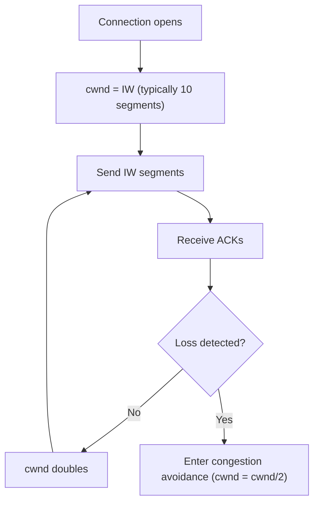
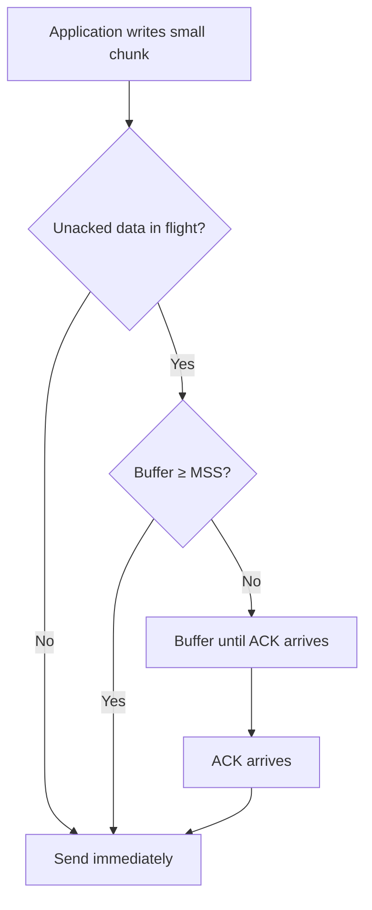
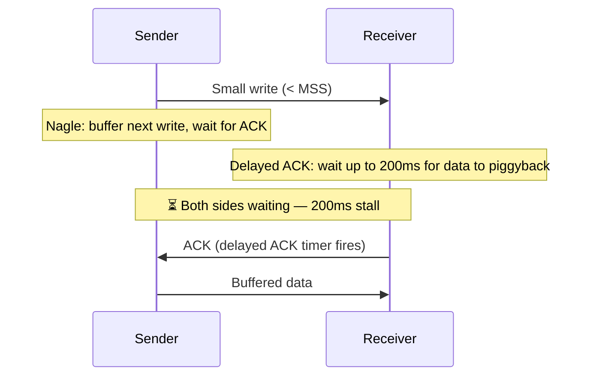
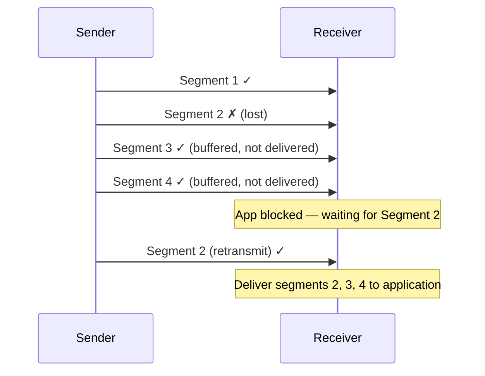
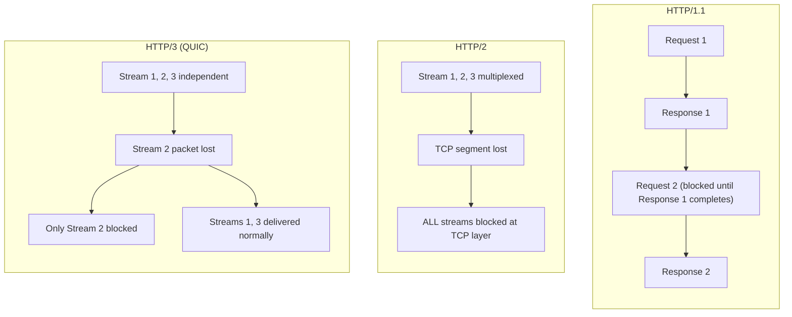
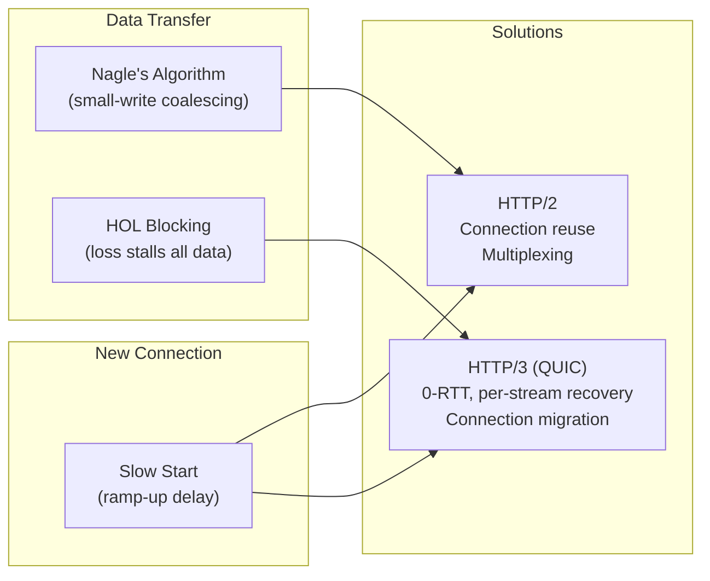

# TCP Internals

---

## Overview

TCP provides reliable, ordered byte-stream delivery — but the mechanisms that guarantee reliability introduce latency trade-offs that directly shape HTTP performance. Three TCP behaviors are critical to understand: **slow start** (ramp-up delay on new connections), **Nagle's algorithm** (small-packet coalescing), and **head-of-line blocking** (ordered delivery stalls).

| Mechanism | Purpose | Side Effect |
|-----------|---------|-------------|
| **Slow start** | Avoid congestion collapse on unknown paths | First few RTTs carry limited data |
| **Nagle's algorithm** | Reduce small-packet overhead | Adds latency to interactive/streaming workloads |
| **HOL blocking** | Guarantee ordered delivery | One lost segment stalls everything behind it |

---

## TCP Slow Start

Every new TCP connection begins conservatively — the sender has no idea how much bandwidth the path can handle. Slow start probes capacity by **doubling** the send rate each round trip until loss occurs or a threshold is reached.

### How It Works



| Term | Meaning |
|------|---------|
| **cwnd** | Congestion window — how many unACKed bytes the sender is allowed in flight |
| **IW** | Initial window — starting cwnd (Linux default: 10 segments = ~14 KB) |
| **ssthresh** | Slow start threshold — cwnd switches to linear growth above this |
| **RTT** | Round-trip time — each ACK round doubles cwnd during slow start |

### Growth Pattern

| RTT | cwnd (segments) | Data in flight |
|-----|----------------|----------------|
| 0 | 10 | 14 KB |
| 1 | 20 | 28 KB |
| 2 | 40 | 56 KB |
| 3 | 80 | 112 KB |
| 4 | 160 | 224 KB |

!!! warning "Impact on Short Connections"
    A typical API response under 14 KB fits in the initial window and completes in 1 RTT after the handshake. But a 100 KB response on a fresh connection takes **3-4 RTTs** of slow start before TCP can send at full speed — regardless of available bandwidth.

### Why This Matters for HTTP

```mermaid
gantt
    title Time to deliver 100 KB on a new TCP connection (80ms RTT)
    dateFormat X
    axisFormat %s ms

    section TCP + TLS 1.3
    TCP handshake (1 RTT)     :a1, 0, 80
    TLS handshake (1 RTT)     :a2, 80, 80
    Slow start RTT 1 (14 KB)  :a3, 160, 80
    Slow start RTT 2 (28 KB)  :a4, 240, 80
    Slow start RTT 3 (42 KB)  :a5, 320, 80
    Slow start RTT 4 (16 KB)  :a6, 400, 80
```



On a mobile network with 80ms RTT, the first 100 KB takes **~480ms** — most of which is handshake + slow start, not actual transfer time. With HTTP/1.1's 6 parallel connections, each connection slow-starts independently.

### Mitigations

| Technique | How it helps |
|-----------|-------------|
| **Connection reuse** (HTTP keep-alive, HTTP/2) | Avoids repeated slow starts — cwnd grows over time |
| **Larger initial window** (IW=10, RFC 6928) | Linux default since 3.0; sends 14 KB immediately |
| **TCP Fast Open** (TFO) | Sends data in the SYN packet, saving 1 RTT on reconnection |
| **HTTP/3 (QUIC) 0-RTT** | Sends application data in the first packet on resumption |
| **CDNs / edge servers** | Shorter RTT → fewer slow start cycles to fill the pipe |

---

## Nagle's Algorithm

Nagle's algorithm ([RFC 896](https://www.rfc-editor.org/rfc/rfc896)) reduces the number of small packets ("tinygrams") on the network. It was designed for interactive terminals sending single-character keystrokes, but it still ships enabled by default in most TCP stacks.

### The Rule

> If there is unACKed data in flight, buffer outgoing data until either:
>
> 1. The buffer reaches MSS (Maximum Segment Size, typically ~1460 bytes), **or**
> 2. All previously sent data has been acknowledged.



### Nagle vs No-Nagle

=== "Nagle Enabled (default)"

    ```
    App writes "H"     → Send immediately (nothing in flight)
    App writes "e"     → Buffer (waiting for ACK of "H")
    App writes "l"     → Buffer
    App writes "l"     → Buffer
    ACK for "H" arrives → Send "ell" as one segment
    App writes "o"     → Buffer (waiting for ACK of "ell")
    ACK arrives         → Send "o"

    Result: 3 packets instead of 5
    ```

=== "Nagle Disabled (TCP_NODELAY)"

    ```
    App writes "H"     → Send immediately
    App writes "e"     → Send immediately
    App writes "l"     → Send immediately
    App writes "l"     → Send immediately
    App writes "o"     → Send immediately

    Result: 5 packets, no added latency
    ```

### The Nagle + Delayed ACK Problem

**Delayed ACKs** (RFC 1122) let the receiver wait up to 200ms before sending an ACK, hoping to piggyback it on a response. Combined with Nagle, this creates a worst-case interaction:



| Scenario | Latency impact |
|----------|---------------|
| Nagle ON + Delayed ACK ON | Up to **200ms** stall per write-write-read pattern |
| Nagle OFF (`TCP_NODELAY`) | No coalescing delay, more small packets |
| Nagle ON + `TCP_QUICKACK` | Receiver ACKs immediately, Nagle releases sooner |

### When to Disable Nagle

| Disable (`TCP_NODELAY`) | Keep enabled |
|--------------------------|-------------|
| HTTP APIs and web servers | Bulk file transfers |
| Real-time protocols (games, VoIP) | Batch data pipelines |
| Interactive protocols (SSH, WebSockets) | Non-interactive streaming |
| Any request-response pattern with small writes | Single-write-per-message patterns |

!!! note "HTTP Libraries Handle This"
    Most HTTP libraries (OkHttp, curl, Go's `net/http`) set `TCP_NODELAY` by default. QUIC/HTTP/3 sidesteps this entirely — QUIC runs over UDP and manages its own packetization.

---

## Head-of-Line Blocking

Head-of-line (HOL) blocking occurs when the **first item in a queue** blocks everything behind it. In networking, it appears at multiple layers — and each layer of the HTTP stack has dealt with it differently.

### HOL Blocking at the TCP Layer

TCP guarantees **in-order byte delivery**. If segment N is lost, segments N+1, N+2, ... sit in the receiver's buffer and **cannot be delivered to the application** until segment N is retransmitted and received.



| Metric | Impact |
|--------|--------|
| **Stall duration** | 1 RTT minimum (detect loss + retransmit) |
| **At 1% packet loss, 80ms RTT** | ~80ms stall per loss event, blocking all data |
| **At 2% packet loss** | Stalls become frequent enough to dominate transfer time |

### HOL Blocking Across HTTP Versions



| Layer | HTTP/1.1 | HTTP/2 | HTTP/3 |
|-------|----------|--------|--------|
| **Application** | Blocked — sequential request-response | Solved — multiplexed streams | Solved — multiplexed streams |
| **Transport (TCP)** | Blocked — per-connection | **Blocked** — one TCP connection carries all streams | **Solved** — QUIC streams are independent |
| **Workaround** | Open 6 TCP connections (domain sharding) | None — fundamental to TCP | N/A — eliminated by design |

### Why HTTP/2 Can Be Worse Than HTTP/1.1 on Lossy Networks

With HTTP/1.1, browsers open **6 parallel TCP connections**. A lost segment on one connection only blocks that connection — the other 5 continue. With HTTP/2, all streams share **one TCP connection**, so one loss blocks everything.

| Scenario (2% packet loss) | HTTP/1.1 (6 connections) | HTTP/2 (1 connection) |
|----------------------------|--------------------------|------------------------|
| Loss blocks | 1 of 6 connections | All streams |
| Probability of at least one stall | Higher (6 chances) | Same per-byte |
| Impact per stall | 1/6 of traffic delayed | 100% of traffic delayed |
| Net effect | Stalls happen more often but hurt less | Stalls happen less often but hurt more |

!!! warning "This is why HTTP/2 can regress on mobile"
    On high-loss mobile networks (cellular handoffs, weak signal), HTTP/2's single-connection model can perform worse than HTTP/1.1's multiple connections. This was the strongest motivation for HTTP/3/QUIC's per-stream loss recovery.

---

## How These Mechanisms Interact



| TCP Problem | HTTP/2 fix | HTTP/3 fix |
|-------------|-----------|-----------|
| Slow start on every connection | Single long-lived connection — cwnd stays warm | 0-RTT resumption skips handshake; single connection persists across networks |
| Nagle latency | Moot — framing layer controls writes | Moot — QUIC over UDP, no Nagle |
| TCP HOL blocking | **Not fixed** — single TCP connection makes it worse | **Fixed** — independent QUIC streams |

---

??? question "Interview Questions"

    **Q: What is TCP slow start and why does it exist?**
    Slow start is a congestion control mechanism where a new TCP connection begins with a small congestion window (typically 10 segments / 14 KB) and doubles it each RTT. It exists to prevent a new connection from immediately flooding an unknown network path with traffic, which could cause congestion collapse.

    **Q: How does slow start affect web performance?**
    Short-lived connections never exit slow start — they spend their entire lifetime ramping up. A 100 KB response on a fresh connection with 80ms RTT takes 3-4 RTTs just to ramp up the send window, adding 240-320ms beyond the handshake. This is why connection reuse (HTTP keep-alive, HTTP/2) is critical.

    **Q: What is Nagle's algorithm and when should you disable it?**
    Nagle's algorithm buffers small writes until either the buffer reaches MSS or all prior data is ACKed, reducing the number of small packets on the network. It should be disabled (`TCP_NODELAY`) for request-response protocols, interactive applications, and real-time communication where latency matters more than packet efficiency.

    **Q: Explain the Nagle + Delayed ACK interaction.**
    When Nagle buffers a small write waiting for an ACK, and the receiver delays its ACK hoping to piggyback it on response data, both sides end up waiting — the sender for an ACK, the receiver for more data. This creates a stall of up to 200ms (the delayed ACK timer). It's the classic reason to set `TCP_NODELAY` on request-response workloads.

    **Q: What is head-of-line blocking and at which layers does it occur?**
    HOL blocking is when the first item in a queue prevents later items from progressing. In HTTP/1.1, it's at the application layer (sequential request-response). In HTTP/2, the application-layer HOL is solved via multiplexing, but TCP-layer HOL remains — a lost segment blocks all streams since TCP guarantees ordered delivery. HTTP/3/QUIC solves both layers by giving each stream independent loss recovery.

    **Q: Why can HTTP/2 perform worse than HTTP/1.1 on lossy networks?**
    HTTP/1.1 opens 6 parallel TCP connections — a loss on one blocks only that connection. HTTP/2 funnels all streams into one TCP connection, so a single lost segment blocks every stream. On high-loss networks (e.g., cellular), the single-connection model means every loss event stalls all in-flight requests simultaneously.

    **Q: How does QUIC solve TCP's head-of-line blocking?**
    Each QUIC stream has its own independent sequence number space and loss recovery. A lost packet only blocks the specific stream whose data it carried. Other streams continue being delivered to the application. This is fundamentally impossible with TCP, which maintains a single ordered byte stream.

!!! tip "Further Reading"
    - [RFC 5681 — TCP Congestion Control](https://www.rfc-editor.org/rfc/rfc5681) — slow start, congestion avoidance, fast retransmit
    - [RFC 896 — Congestion Control in IP/TCP](https://www.rfc-editor.org/rfc/rfc896) — Nagle's original paper
    - [RFC 6928 — Increasing TCP's Initial Window](https://www.rfc-editor.org/rfc/rfc6928) — IW=10 rationale
    - [High Performance Browser Networking — TCP](https://hpbn.co/building-blocks-of-tcp/) — Ilya Grigorik's deep dive
    - [It's the Latency, Stupid](http://www.stuartcheshire.org/rants/latency.html) — Stuart Cheshire on why bandwidth isn't the bottleneck
