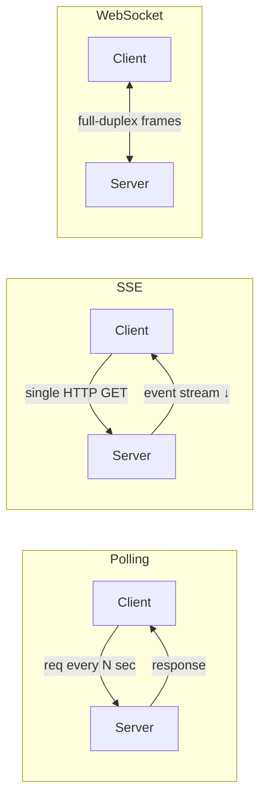
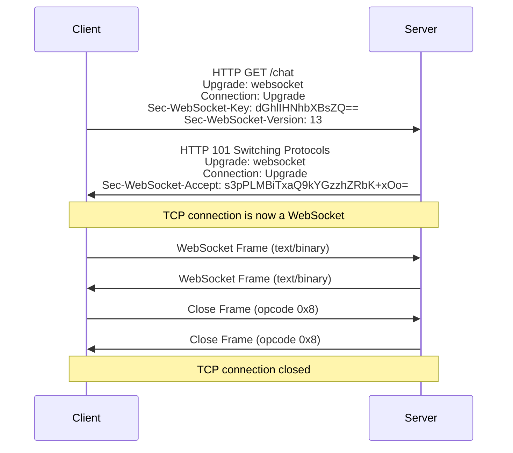
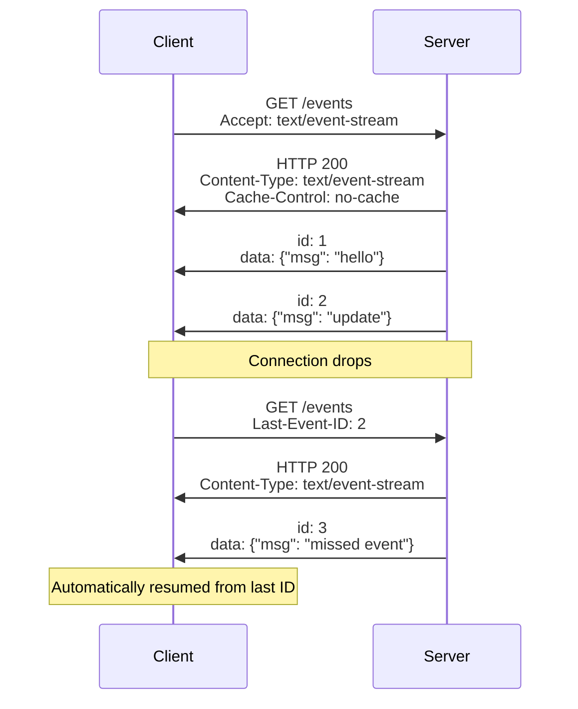
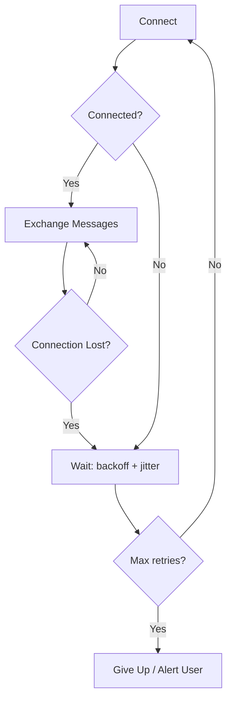
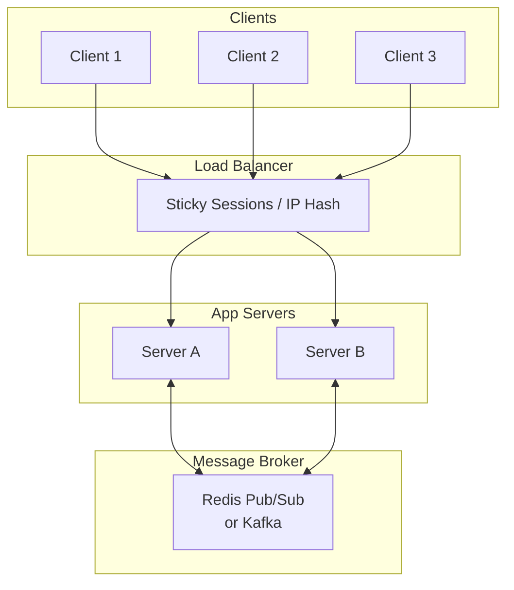

# WebSockets & Server-Sent Events

---

## Real-Time Communication Patterns

| Pattern | Direction | Transport | Reconnect | Use Case |
|---------|-----------|-----------|-----------|----------|
| **HTTP Polling** | Client → Server | Repeated HTTP requests | N/A (client-driven) | Simple dashboards, low-frequency updates |
| **Long Polling** | Client → Server (held open) | HTTP with delayed response | Client re-requests | Notifications, moderate-frequency updates |
| **SSE** | Server → Client | Single HTTP connection | Built-in auto-reconnect | Live feeds, stock tickers, log streaming |
| **WebSocket** | Bidirectional | Upgraded HTTP → persistent TCP | Manual (application-level) | Chat, gaming, collaborative editing |



---

## WebSockets

### Protocol Overview

WebSocket (`ws://` / `wss://`) provides full-duplex communication over a single TCP connection. Defined in [RFC 6455](https://datatracker.ietf.org/doc/html/rfc6455).

**Key characteristics:**

- Starts as an HTTP/1.1 upgrade request, then switches to the WebSocket protocol
- Both sides can send messages independently at any time
- Low overhead — 2-byte frame header vs. full HTTP headers per message
- Supports text (UTF-8) and binary frames
- Works through most proxies and load balancers (over TLS)

### Handshake



The `Sec-WebSocket-Accept` value is derived from the client's `Sec-WebSocket-Key` concatenated with a fixed GUID, SHA-1 hashed, then Base64-encoded. This prevents caching proxies from replaying old responses — it is **not** a security mechanism.

### Frame Structure

| Field | Size | Purpose |
|-------|------|---------|
| `FIN` | 1 bit | 1 = final fragment of this message |
| `Opcode` | 4 bits | 0x1 = text, 0x2 = binary, 0x8 = close, 0x9 = ping, 0xA = pong |
| `MASK` | 1 bit | 1 = payload is masked (required for client → server) |
| `Payload length` | 7 / 16 / 64 bits | Length of payload data |
| `Masking key` | 0 or 4 bytes | XOR key for client-to-server frames |
| `Payload` | Variable | Application data |

!!! note "Why Client Frames Are Masked"
    Client-to-server masking prevents cache poisoning attacks where an intermediary proxy might mistake WebSocket frames for HTTP responses and cache them. The masking key changes per frame, making the payload appear random to intermediaries.

### Control Frames

| Frame | Opcode | Purpose |
|-------|--------|---------|
| **Ping** | `0x9` | Heartbeat probe — receiver MUST reply with Pong |
| **Pong** | `0xA` | Response to Ping — carries the same payload |
| **Close** | `0x8` | Initiates graceful shutdown — includes a status code and optional reason |

### Close Status Codes

| Code | Meaning |
|------|---------|
| `1000` | Normal closure |
| `1001` | Going away (e.g., server shutting down, page navigating away) |
| `1006` | Abnormal closure (no close frame received — connection dropped) |
| `1008` | Policy violation |
| `1009` | Message too big |
| `1011` | Server encountered an unexpected error |
| `1012` | Server restarting |
| `1013` | Try again later (server overloaded) |

### Client Example (JavaScript)

```javascript
const ws = new WebSocket("wss://api.example.com/stream");

ws.onopen = () => {
    console.log("connected");
    ws.send(JSON.stringify({ type: "subscribe", channel: "prices" }));
};

ws.onmessage = (event) => {
    const data = JSON.parse(event.data);
    handleUpdate(data);
};

ws.onerror = (error) => {
    console.error("WebSocket error:", error);
};

ws.onclose = (event) => {
    console.log(`closed: code=${event.code} reason=${event.reason}`);
    if (event.code !== 1000) {
        scheduleReconnect();
    }
};
```

### Server Example (Node.js)

```javascript
import { WebSocketServer } from "ws";

const wss = new WebSocketServer({ port: 8080 });

wss.on("connection", (ws, req) => {
    console.log(`client connected from ${req.socket.remoteAddress}`);

    ws.on("message", (data) => {
        const msg = JSON.parse(data);
        // Echo to all other clients
        wss.clients.forEach((client) => {
            if (client !== ws && client.readyState === WebSocket.OPEN) {
                client.send(JSON.stringify(msg));
            }
        });
    });

    ws.on("close", (code, reason) => {
        console.log(`client disconnected: ${code}`);
    });

    // Server-side heartbeat
    const pingInterval = setInterval(() => {
        if (ws.readyState === WebSocket.OPEN) {
            ws.ping();
        }
    }, 30000);

    ws.on("close", () => clearInterval(pingInterval));
});
```

---

## Server-Sent Events (SSE)

### Protocol Overview

SSE is a simple, HTTP-based protocol for server-to-client streaming. Defined in the [HTML Living Standard](https://html.spec.whatwg.org/multipage/server-sent-events.html).

**Key characteristics:**

- Uses standard HTTP — works with existing infrastructure (proxies, CDNs, load balancers)
- Unidirectional — server pushes events to the client over a long-lived HTTP response
- Text-only (UTF-8) — binary data must be Base64-encoded
- Built-in reconnection with `Last-Event-ID` header for resumption
- Content type: `text/event-stream`

### Event Stream Format

Each event is a block of `field: value` lines separated by a blank line:

```
event: price-update
id: 42
retry: 3000
data: {"symbol": "AAPL", "price": 187.50}

event: price-update
id: 43
data: {"symbol": "GOOG", "price": 141.20}

```

| Field | Purpose |
|-------|---------|
| `data` | Event payload — multiple `data:` lines are joined with `\n` |
| `event` | Event type — maps to `addEventListener(type, ...)` on the client |
| `id` | Event ID — sent back as `Last-Event-ID` on reconnect |
| `retry` | Reconnection interval in milliseconds — overrides the client default |

!!! note "Default Event Type"
    Events without an `event:` field are dispatched as `message` events on the `EventSource` object.

### SSE Connection Flow



### Client Example (JavaScript)

```javascript
const source = new EventSource("/events");

// Default "message" events
source.onmessage = (event) => {
    console.log("data:", event.data);
    console.log("id:", event.lastEventId);
};

// Named events
source.addEventListener("price-update", (event) => {
    const data = JSON.parse(event.data);
    updatePrice(data);
});

source.onerror = (event) => {
    if (source.readyState === EventSource.CONNECTING) {
        console.log("reconnecting...");
    } else {
        console.error("connection failed");
        source.close();
    }
};
```

### Server Example (Node.js)

```javascript
import express from "express";

const app = express();

app.get("/events", (req, res) => {
    res.set({
        "Content-Type": "text/event-stream",
        "Cache-Control": "no-cache",
        "Connection": "keep-alive",
    });
    res.flushHeaders();

    // Resume from where the client left off
    const lastId = parseInt(req.headers["last-event-id"] || "0", 10);
    let eventId = lastId;

    const interval = setInterval(() => {
        eventId++;
        res.write(`id: ${eventId}\n`);
        res.write(`data: ${JSON.stringify({ time: Date.now() })}\n\n`);
    }, 1000);

    req.on("close", () => {
        clearInterval(interval);
    });
});

app.listen(3000);
```

### Server Example (Python / Flask)

```python
from flask import Flask, Response
import json, time

app = Flask(__name__)

@app.route("/events")
def events():
    def generate():
        event_id = 0
        while True:
            event_id += 1
            data = json.dumps({"time": time.time()})
            yield f"id: {event_id}\ndata: {data}\n\n"
            time.sleep(1)

    return Response(generate(), mimetype="text/event-stream",
                    headers={"Cache-Control": "no-cache"})
```

---

## Retry & Reconnection

### SSE: Built-In Reconnection

The `EventSource` API handles reconnection automatically:

1. Connection drops → browser waits for the retry interval (default ~3 seconds)
2. Browser sends a new `GET` request with `Last-Event-ID` header
3. Server uses the ID to replay missed events

```
retry: 5000
id: 100
data: {"status": "ok"}

```

The `retry: 5000` directive tells the client to wait 5 seconds before reconnecting. The server controls the reconnection timing.

| Aspect | Behavior |
|--------|----------|
| **Default retry** | ~3 seconds (browser-dependent) |
| **Server override** | `retry:` field in the event stream |
| **Resumption** | `Last-Event-ID` header sent automatically |
| **When it stops** | Calling `source.close()` or server returning non-200 / non `text/event-stream` |

!!! warning "Event Buffering Required"
    For `Last-Event-ID` resumption to work, the server must buffer recent events. If the server is stateless or has no event log, reconnecting clients miss events that occurred during the disconnect. Use a bounded in-memory buffer, a message broker (Redis Streams, Kafka), or a database-backed event log.

### Custom SSE Reconnection with Backoff

The native `EventSource` API has limited reconnection control. For production use, implement a custom reconnection wrapper:

```javascript
function createSSE(url, { maxRetries = 10, baseDelay = 1000, maxDelay = 30000 } = {}) {
    let retries = 0;
    let source = null;

    function connect() {
        source = new EventSource(url);

        source.onopen = () => {
            retries = 0; // reset on successful connection
        };

        source.onerror = () => {
            source.close();
            if (retries < maxRetries) {
                const delay = Math.min(baseDelay * 2 ** retries, maxDelay);
                const jitter = delay * (0.5 + Math.random() * 0.5);
                retries++;
                setTimeout(connect, jitter);
            }
        };

        source.onmessage = (event) => {
            handleEvent(event);
        };
    }

    connect();
    return { close: () => source?.close() };
}
```

### WebSocket: Manual Reconnection

WebSocket has **no built-in reconnection**. The application must detect disconnects and reconnect explicitly.



### WebSocket Reconnection with Exponential Backoff

```javascript
class ReconnectingWebSocket {
    constructor(url, options = {}) {
        this.url = url;
        this.maxRetries = options.maxRetries ?? 10;
        this.baseDelay = options.baseDelay ?? 1000;
        this.maxDelay = options.maxDelay ?? 30000;
        this.retries = 0;
        this.handlers = { message: null, open: null, close: null };
        this.connect();
    }

    connect() {
        this.ws = new WebSocket(this.url);

        this.ws.onopen = () => {
            this.retries = 0;
            this.handlers.open?.();
        };

        this.ws.onmessage = (event) => {
            this.handlers.message?.(event);
        };

        this.ws.onclose = (event) => {
            this.handlers.close?.(event);
            if (event.code !== 1000 && this.retries < this.maxRetries) {
                this.scheduleReconnect();
            }
        };

        this.ws.onerror = () => {
            this.ws.close();
        };
    }

    scheduleReconnect() {
        const delay = Math.min(this.baseDelay * 2 ** this.retries, this.maxDelay);
        const jitter = delay * (0.5 + Math.random() * 0.5);
        this.retries++;
        setTimeout(() => this.connect(), jitter);
    }

    send(data) {
        if (this.ws.readyState === WebSocket.OPEN) {
            this.ws.send(data);
        }
    }

    close() {
        this.maxRetries = 0; // prevent reconnection
        this.ws.close(1000, "client closing");
    }
}
```

### Heartbeat / Keep-Alive

Both protocols need heartbeats to detect dead connections — TCP alone may not detect a silently dropped connection for minutes.

=== "WebSocket Ping/Pong"

    ```javascript
    // Server-side heartbeat (Node.js with 'ws' library)
    wss.on("connection", (ws) => {
        ws.isAlive = true;
        ws.on("pong", () => { ws.isAlive = true; });
    });

    setInterval(() => {
        wss.clients.forEach((ws) => {
            if (!ws.isAlive) return ws.terminate();
            ws.isAlive = false;
            ws.ping();
        });
    }, 30000);
    ```

    The WebSocket protocol has native Ping (`0x9`) and Pong (`0xA`) control frames. Browsers handle Pong responses automatically — no application code needed on the client.

=== "SSE Comment Keep-Alive"

    ```javascript
    // Server sends a comment line as keep-alive
    setInterval(() => {
        res.write(": heartbeat\n\n");
    }, 15000);
    ```

    Lines starting with `:` are comments — the `EventSource` API ignores them, but they keep the TCP connection alive and prevent intermediary proxies from timing out.

---

## WebSocket vs SSE Comparison

| Aspect | WebSocket | SSE |
|--------|-----------|-----|
| **Direction** | Bidirectional | Server → Client only |
| **Protocol** | `ws://` / `wss://` (upgrade from HTTP) | Standard HTTP |
| **Data format** | Text + Binary | Text only (UTF-8) |
| **Reconnection** | Manual | Automatic with `Last-Event-ID` |
| **Event IDs** | Not built-in | Built-in (`id:` field) |
| **Max connections** | Limited by server resources | HTTP/1.1: 6 per domain (browser limit); HTTP/2: multiplexed |
| **Proxy/CDN support** | Often requires configuration | Works out of the box |
| **Browser support** | All modern browsers | All modern browsers (no IE) |
| **Overhead per message** | 2-6 bytes frame header | ~20-50 bytes (field names + newlines) |
| **HTTP/2 multiplexing** | No (uses its own TCP connection) | Yes (shares the HTTP/2 connection) |
| **Authentication** | During handshake only (headers/cookies) or in-band messages | Standard HTTP headers on every reconnect |

### When to Use Which

=== "Use SSE When"

    - Server-to-client only (live feeds, notifications, dashboards)
    - You need automatic reconnection and event replay
    - Infrastructure is HTTP-friendly (CDNs, reverse proxies, load balancers)
    - Events are text-based (JSON payloads)
    - Simplicity matters — SSE requires less code and infrastructure

=== "Use WebSocket When"

    - Bidirectional communication is required (chat, collaborative editing)
    - You need to send binary data (audio/video streams, file transfers)
    - Low latency per message matters (gaming, real-time trading)
    - High message frequency in both directions
    - You need sub-protocols (e.g., STOMP, MQTT over WebSocket)

=== "Use Neither When"

    - Updates are infrequent (< once per minute) — simple polling is simpler and cheaper
    - You need request-response semantics — use standard HTTP
    - Offline-first apps — use background sync + push notifications

---

## Best Practices

### Connection Management

| Practice | Why |
|----------|-----|
| **Exponential backoff with jitter** on reconnect | Prevents thundering herd when a server restarts and thousands of clients reconnect simultaneously |
| **Cap the max retry delay** (e.g., 30s) | Keeps the user experience responsive — unbounded backoff feels broken |
| **Reset retry counter on successful connection** | A successful connection means the transient issue is resolved |
| **Limit max retries**, then surface the error to the user | Don't silently retry forever — let the user know and offer a manual retry |
| **Use heartbeats / ping-pong** | Detect dead connections faster than TCP keepalive (which can take minutes) |
| **Close connections gracefully** | Send proper close frames; clean up server resources |

### Message Design

| Practice | Why |
|----------|-----|
| **Use JSON with a `type` field** for routing | `{"type": "price_update", "data": {...}}` lets clients dispatch to the right handler |
| **Include timestamps** in events | Enables ordering, deduplication, and latency measurement |
| **Assign monotonic event IDs** | Enables gap detection and replay on reconnect |
| **Keep payloads small** | Large payloads increase latency and memory pressure — send deltas, not full state |
| **Compress when possible** | WebSocket supports `permessage-deflate` extension; SSE benefits from HTTP-level gzip |

### Server-Side

| Practice | Why |
|----------|-----|
| **Limit concurrent connections per user** | Prevents resource exhaustion from leaked connections (e.g., user opens many tabs) |
| **Buffer recent events** for SSE resumption | `Last-Event-ID` is useless if the server has no event history |
| **Use a message broker** (Redis Pub/Sub, Kafka) between app servers | Each server instance sees all events — clients get updates regardless of which server they connect to |
| **Implement backpressure** | If a client can't consume fast enough, buffer up to a limit then drop or disconnect |
| **Monitor connection counts and message rates** | Detect connection leaks, abuse, or capacity issues early |

### Security

| Practice | Why |
|----------|-----|
| **Always use `wss://` and HTTPS** | Prevents eavesdropping and MITM; required for modern browsers on mixed-content pages |
| **Authenticate during the handshake** | WebSocket: use cookies or a token in the URL / first message. SSE: standard HTTP auth headers |
| **Validate all incoming messages** server-side | WebSocket accepts client data — treat it as untrusted input |
| **Set `Origin` checks** on WebSocket servers | Prevents cross-site WebSocket hijacking (CSWSH) |
| **Rate-limit messages** per connection | Prevents a single client from flooding the server |

### Scaling



| Concern | Solution |
|---------|----------|
| **Sticky sessions** | WebSocket connections must stay on the same server — use IP hash or cookie-based affinity at the load balancer |
| **Cross-server messaging** | A message broker (Redis Pub/Sub, Kafka, NATS) fans out events to all server instances |
| **Connection limits** | A single server can hold ~10k-100k connections depending on memory — scale horizontally and monitor |
| **Graceful shutdown** | On deploy, send close frame with code `1012` (server restarting) so clients reconnect to a new instance |
| **HTTP/2 for SSE** | Multiplexes SSE streams over a single TCP connection — avoids the 6-connection-per-domain browser limit |

---

??? question "Interview Questions"

    **Q: What is the difference between WebSocket and SSE?**

    WebSocket provides full-duplex, bidirectional communication over a single TCP connection — both client and server can send messages at any time. SSE is unidirectional — only the server pushes events to the client over a standard HTTP connection. SSE has built-in reconnection and event ID tracking; WebSocket requires manual reconnection logic. SSE works with standard HTTP infrastructure; WebSocket requires an upgrade handshake and may need special proxy configuration.

    **Q: How does the WebSocket handshake work?**

    The client sends an HTTP/1.1 GET request with `Upgrade: websocket` and `Connection: Upgrade` headers, along with a `Sec-WebSocket-Key`. The server responds with HTTP 101 Switching Protocols and a `Sec-WebSocket-Accept` value derived from the client's key. After this handshake, the TCP connection is repurposed for bidirectional WebSocket frames — no more HTTP.

    **Q: How does SSE handle reconnection?**

    The `EventSource` API reconnects automatically when the connection drops. It waits for the retry interval (default ~3s, configurable via `retry:` field) then sends a new GET request with the `Last-Event-ID` header set to the last received event ID. The server can use this ID to replay missed events. The client resets its retry timer on a successful connection.

    **Q: How would you implement reliable reconnection for WebSocket?**

    Use exponential backoff with jitter to prevent thundering herd on server restart. Reset the retry counter on successful connection. Cap the max delay (e.g., 30 seconds) and set a max retry limit. On reconnect, re-authenticate and re-subscribe to channels. Track the last received message ID client-side and request a replay from the server after reconnecting.

    **Q: What is the thundering herd problem and how does jitter help?**

    When a server restarts, all connected clients detect the disconnect simultaneously and try to reconnect at the same time. With fixed-interval retries, they all hit the server in lockstep every retry cycle. Adding random jitter (e.g., 50-100% of the delay) spreads reconnection attempts over time, reducing the spike load on the recovering server.

    **Q: How do you detect dead WebSocket connections?**

    Use the WebSocket Ping/Pong mechanism. The server sends Ping frames at regular intervals (e.g., every 30 seconds). If a Pong is not received before the next Ping, the connection is considered dead and is terminated. TCP keepalive alone is insufficient — it can take minutes to detect a silently dropped connection, especially through NATs and firewalls.

    **Q: How do you scale WebSocket connections across multiple servers?**

    Use sticky sessions (IP hash or cookie-based affinity) at the load balancer so each WebSocket connection stays on the same server. Use a message broker (Redis Pub/Sub, Kafka, NATS) to fan out events across server instances — when Server A receives an event, it publishes to the broker, and Server B pushes it to its connected clients. On deploy, send close frames with code 1012 (server restarting) for graceful connection migration.

    **Q: Why might you choose SSE over WebSocket?**

    When communication is server-to-client only (dashboards, notifications, live feeds). SSE works over standard HTTP, so it passes through proxies, CDNs, and load balancers without special configuration. It has built-in reconnection and event resumption via `Last-Event-ID`. On HTTP/2, multiple SSE streams multiplex over a single TCP connection. It requires less code and infrastructure than WebSocket.

    **Q: What is backpressure and why does it matter for real-time connections?**

    Backpressure occurs when the server produces events faster than a client can consume them. Without handling it, the server's per-client buffer grows unboundedly, eventually exhausting memory. Solutions: buffer up to a fixed limit then drop oldest events, disconnect slow clients, or use flow-control mechanisms. Monitoring per-client buffer depth is critical for production systems.

!!! tip "Further Reading"
    - [RFC 6455 — The WebSocket Protocol](https://datatracker.ietf.org/doc/html/rfc6455)
    - [HTML Living Standard — Server-Sent Events](https://html.spec.whatwg.org/multipage/server-sent-events.html)
    - [MDN — WebSocket API](https://developer.mozilla.org/en-US/docs/Web/API/WebSocket)
    - [MDN — EventSource API](https://developer.mozilla.org/en-US/docs/Web/API/EventSource)
    - [OWASP — WebSocket Security](https://cheatsheetseries.owasp.org/cheatsheets/WebSockets_Cheat_Sheet.html)
