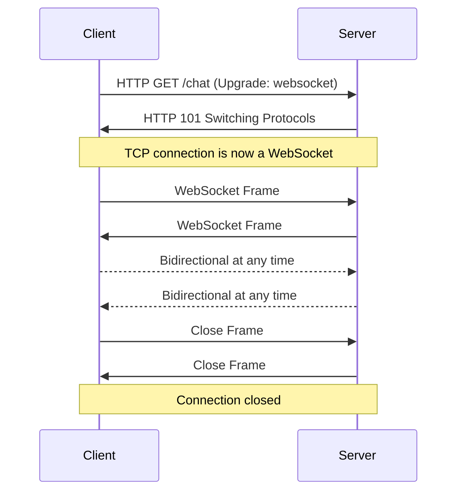
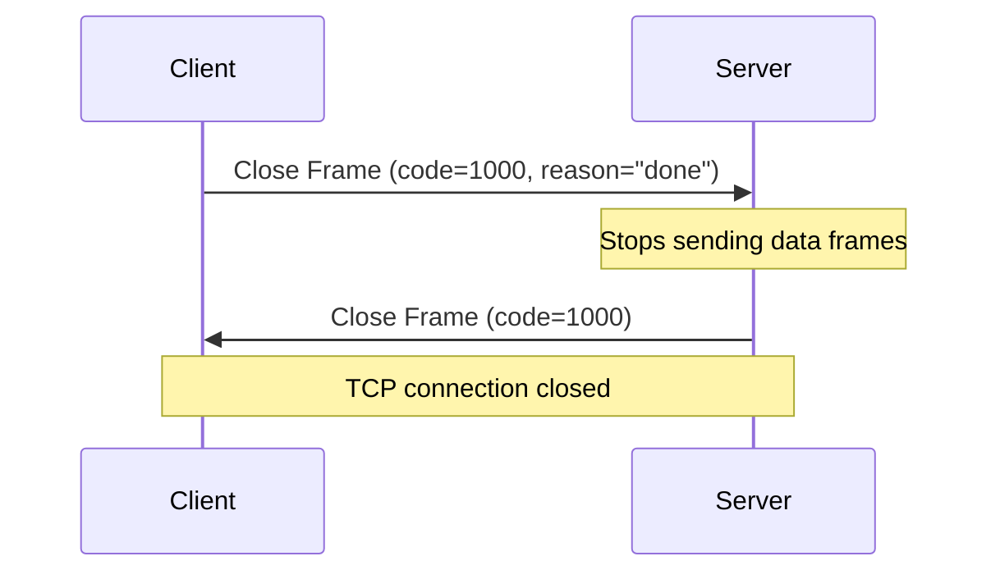
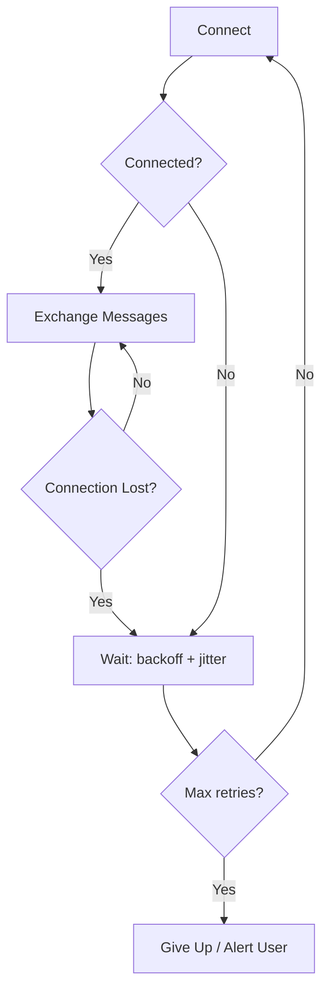
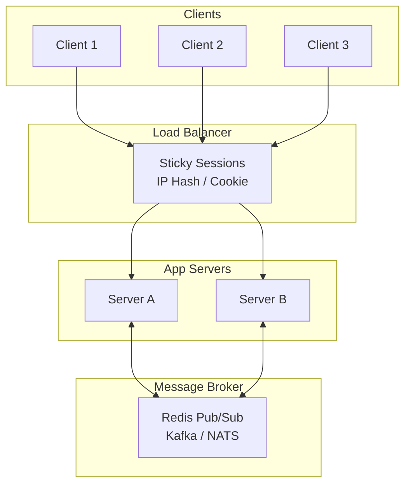

# WebSockets

---

## Protocol Overview

WebSocket (`ws://` / `wss://`) provides **full-duplex, bidirectional** communication over a single TCP connection. Defined in [RFC 6455](https://datatracker.ietf.org/doc/html/rfc6455).

| Property | Detail |
|----------|--------|
| **Transport** | Persistent TCP connection (upgraded from HTTP/1.1) |
| **Direction** | Bidirectional — both sides send independently |
| **Data types** | Text (UTF-8) and binary frames |
| **Overhead** | 2–6 byte frame header vs. full HTTP headers per message |
| **Port** | 80 (`ws://`) or 443 (`wss://`) — same as HTTP/HTTPS |
| **Spec** | [RFC 6455](https://datatracker.ietf.org/doc/html/rfc6455) |



---

## The Handshake

The WebSocket connection starts with an HTTP/1.1 upgrade request. This ensures compatibility with existing HTTP infrastructure.

### Client Request

```http
GET /chat HTTP/1.1
Host: api.example.com
Upgrade: websocket
Connection: Upgrade
Sec-WebSocket-Key: dGhlIHNhbXBsZQ==
Sec-WebSocket-Version: 13
Sec-WebSocket-Protocol: chat, superchat
Sec-WebSocket-Extensions: permessage-deflate
Origin: https://example.com
```

### Server Response

```http
HTTP/1.1 101 Switching Protocols
Upgrade: websocket
Connection: Upgrade
Sec-WebSocket-Accept: s3pPLMBiTxaQ9kYGzzhZRbK+xOo=
Sec-WebSocket-Protocol: chat
Sec-WebSocket-Extensions: permessage-deflate
```

### Handshake Headers

| Header | Direction | Purpose |
|--------|-----------|---------|
| `Upgrade: websocket` | Both | Signals protocol switch |
| `Connection: Upgrade` | Both | Tells intermediaries to pass upgrade |
| `Sec-WebSocket-Key` | Client → Server | Random Base64-encoded 16-byte nonce |
| `Sec-WebSocket-Accept` | Server → Client | SHA-1 hash of key + GUID, Base64-encoded |
| `Sec-WebSocket-Version` | Client → Server | Must be `13` |
| `Sec-WebSocket-Protocol` | Both | Sub-protocol negotiation (e.g., `chat`, `graphql-ws`) |
| `Sec-WebSocket-Extensions` | Both | Extension negotiation (e.g., `permessage-deflate`) |
| `Origin` | Client → Server | Used for CSWSH prevention |

### Accept Key Derivation

```
Sec-WebSocket-Accept = Base64(SHA-1(Sec-WebSocket-Key + "258EAFA5-E914-47DA-95CA-5AB5DC4B46D3"))
```

!!! note "Not a Security Mechanism"
    The `Sec-WebSocket-Accept` derivation prevents caching proxies from replaying old HTTP responses as WebSocket frames. It does **not** authenticate the server — use `wss://` (TLS) for that.

---

## Frame Structure

After the handshake, all communication uses WebSocket frames — lightweight binary envelopes.

```
 0                   1                   2                   3
 0 1 2 3 4 5 6 7 8 9 0 1 2 3 4 5 6 7 8 9 0 1 2 3 4 5 6 7 8 9 0 1
+-+-+-+-+-------+-+-------------+-------------------------------+
|F|R|R|R| opcode|M| Payload len |    Extended payload length    |
|I|S|S|S|  (4)  |A|     (7)     |         (16/64)               |
|N|V|V|V|       |S|             |   (if payload len==126/127)   |
| |1|2|3|       |K|             |                               |
+-+-+-+-+-------+-+-------------+-------------------------------+
|     Extended payload length continued, if payload len == 127  |
+-------------------------------+-------------------------------+
|                               | Masking-key, if MASK set to 1 |
+-------------------------------+-------------------------------+
| Masking-key (continued)       |          Payload Data         |
+-------------------------------+-------------------------------+
|                     Payload Data continued ...                |
+---------------------------------------------------------------+
```

| Field | Size | Purpose |
|-------|------|---------|
| `FIN` | 1 bit | `1` = final fragment of this message |
| `RSV1-3` | 3 bits | Reserved for extensions (e.g., RSV1 used by `permessage-deflate`) |
| `Opcode` | 4 bits | Frame type (see below) |
| `MASK` | 1 bit | `1` = payload is masked (required client → server) |
| `Payload length` | 7 / 7+16 / 7+64 bits | 0–125 inline; 126 = next 2 bytes; 127 = next 8 bytes |
| `Masking key` | 0 or 4 bytes | XOR key for client-to-server frames |
| `Payload` | Variable | Application data |

### Opcodes

| Opcode | Type | Description |
|--------|------|-------------|
| `0x0` | Continuation | Fragment of a multi-frame message |
| `0x1` | Text | UTF-8 encoded text data |
| `0x2` | Binary | Binary data |
| `0x8` | Close | Initiates graceful shutdown |
| `0x9` | Ping | Heartbeat probe |
| `0xA` | Pong | Heartbeat response |

### Message Fragmentation

Large messages can be split across multiple frames:

```
Frame 1: FIN=0, opcode=0x1 (text), payload="Hello "
Frame 2: FIN=0, opcode=0x0 (continuation), payload="beautiful "
Frame 3: FIN=1, opcode=0x0 (continuation), payload="world!"
→ Reassembled message: "Hello beautiful world!"
```

!!! note "Why Client Frames Are Masked"
    Client-to-server masking prevents **cache poisoning attacks** where an intermediary proxy might mistake WebSocket frames for HTTP responses and cache them. The masking key changes per frame, making the payload appear random to intermediaries. Server-to-client frames are **not** masked.

---

## Control Frames

Control frames manage connection state. They MUST NOT be fragmented and have a max payload of 125 bytes.

### Ping / Pong

The heartbeat mechanism for detecting dead connections.

| Rule | Detail |
|------|--------|
| Any side can send Ping | Usually server → client |
| Receiver MUST reply with Pong | Carrying the same payload |
| Browsers handle Pong automatically | No client-side JS needed |
| Unsolicited Pong is allowed | Can be used as a unidirectional heartbeat |

### Close

Initiates a graceful shutdown. The close handshake ensures both sides agree to disconnect.



### Close Status Codes

| Code | Name | Meaning |
|------|------|---------|
| `1000` | Normal Closure | Clean shutdown |
| `1001` | Going Away | Server shutting down, page navigating away |
| `1002` | Protocol Error | Malformed frame received |
| `1003` | Unsupported Data | Received data type not supported |
| `1005` | No Status Received | Reserved — no status code was present |
| `1006` | Abnormal Closure | Reserved — connection dropped without close frame |
| `1007` | Invalid Payload | Text frame contained non-UTF-8 data |
| `1008` | Policy Violation | Generic policy error |
| `1009` | Message Too Big | Message exceeds server's size limit |
| `1010` | Mandatory Extension | Client expected extension the server didn't negotiate |
| `1011` | Internal Error | Server encountered an unexpected condition |
| `1012` | Service Restart | Server restarting — client should reconnect |
| `1013` | Try Again Later | Server overloaded — temporary condition |
| `1014` | Bad Gateway | Server acting as gateway received invalid response |
| `1015` | TLS Handshake Failure | Reserved — TLS handshake failed |

!!! warning "Codes 1005, 1006, 1015"
    These are **reserved** — they appear in the `CloseEvent` but must never be sent in a Close frame. Code `1006` is the most common indicator of a network issue (connection dropped without a close handshake).

---

## Sub-Protocols & Extensions

### Sub-Protocols

Negotiated via `Sec-WebSocket-Protocol` header. Define message format and semantics on top of WebSocket.

| Sub-Protocol | Use Case |
|-------------|----------|
| `graphql-ws` / `graphql-transport-ws` | GraphQL subscriptions |
| `mqtt` | IoT messaging over WebSocket |
| `stomp` | Message broker communication |
| `wamp` | RPC + Pub/Sub pattern |
| `ocpp1.6` / `ocpp2.0.1` | EV charging station protocol |

```javascript
const ws = new WebSocket("wss://api.example.com/graphql", "graphql-transport-ws");
// Server selects one protocol from the list the client offers
```

### Extensions

Negotiated via `Sec-WebSocket-Extensions` header. Modify the WebSocket wire format itself.

| Extension | Purpose |
|-----------|---------|
| `permessage-deflate` | Per-message compression using zlib |

`permessage-deflate` can reduce text payload size by 60–80%, but adds CPU overhead. Use it for text-heavy protocols; skip it for already-compressed binary data.

---

## Client API (Browser)

### Connection Lifecycle

```javascript
const ws = new WebSocket("wss://api.example.com/stream");

ws.binaryType = "arraybuffer"; // or "blob" (default)

ws.onopen = () => {
    console.log("connected");
    ws.send(JSON.stringify({ type: "subscribe", channel: "prices" }));
};

ws.onmessage = (event) => {
    const data = JSON.parse(event.data);
    handleUpdate(data);
};

ws.onerror = (error) => {
    console.error("WebSocket error:", error);
};

ws.onclose = (event) => {
    console.log(`closed: code=${event.code} reason=${event.reason} clean=${event.wasClean}`);
    if (event.code !== 1000) {
        scheduleReconnect();
    }
};
```

### ReadyState

| Value | Constant | Meaning |
|-------|----------|---------|
| `0` | `CONNECTING` | Handshake in progress |
| `1` | `OPEN` | Connection established |
| `2` | `CLOSING` | Close frame sent, waiting for response |
| `3` | `CLOSED` | Connection closed |

### Sending Data

```javascript
// Text
ws.send(JSON.stringify({ type: "message", text: "hello" }));

// Binary
const buffer = new ArrayBuffer(8);
ws.send(buffer);

// Blob
const blob = new Blob(["binary data"], { type: "application/octet-stream" });
ws.send(blob);

// Check buffered amount before sending (backpressure)
if (ws.bufferedAmount === 0) {
    ws.send(largePayload);
} else {
    queueForLater(largePayload);
}
```

---

## Server Implementation

=== "Node.js (ws)"

    ```javascript
    import { WebSocketServer } from "ws";

    const wss = new WebSocketServer({ port: 8080 });

    wss.on("connection", (ws, req) => {
        console.log(`client connected from ${req.socket.remoteAddress}`);

        ws.on("message", (data, isBinary) => {
            const msg = isBinary ? data : JSON.parse(data.toString());
            // Broadcast to all other clients
            wss.clients.forEach((client) => {
                if (client !== ws && client.readyState === 1) {
                    client.send(JSON.stringify(msg));
                }
            });
        });

        ws.on("close", (code, reason) => {
            console.log(`disconnected: ${code} ${reason}`);
        });

        ws.on("error", (err) => {
            console.error("client error:", err);
        });
    });
    ```

=== "Python (websockets)"

    ```python
    import asyncio
    import websockets
    import json

    CLIENTS = set()

    async def handler(websocket):
        CLIENTS.add(websocket)
        try:
            async for message in websocket:
                data = json.loads(message)
                # Broadcast to all other clients
                for client in CLIENTS - {websocket}:
                    await client.send(json.dumps(data))
        finally:
            CLIENTS.discard(websocket)

    async def main():
        async with websockets.serve(handler, "localhost", 8080):
            await asyncio.Future()  # run forever

    asyncio.run(main())
    ```

=== "Go (gorilla/websocket)"

    ```go
    package main

    import (
        "log"
        "net/http"
        "github.com/gorilla/websocket"
    )

    var upgrader = websocket.Upgrader{
        CheckOrigin: func(r *http.Request) bool {
            return r.Header.Get("Origin") == "https://example.com"
        },
    }

    func handler(w http.ResponseWriter, r *http.Request) {
        conn, err := upgrader.Upgrade(w, r, nil)
        if err != nil {
            log.Println("upgrade error:", err)
            return
        }
        defer conn.Close()

        for {
            msgType, msg, err := conn.ReadMessage()
            if err != nil {
                log.Println("read error:", err)
                break
            }
            err = conn.WriteMessage(msgType, msg) // echo
            if err != nil {
                break
            }
        }
    }

    func main() {
        http.HandleFunc("/ws", handler)
        log.Fatal(http.ListenAndServe(":8080", nil))
    }
    ```

---

## Reconnection

WebSocket has **no built-in reconnection**. The application must detect disconnects and reconnect explicitly.



### Exponential Backoff with Jitter

```javascript
class ReconnectingWebSocket {
    constructor(url, options = {}) {
        this.url = url;
        this.maxRetries = options.maxRetries ?? 10;
        this.baseDelay = options.baseDelay ?? 1000;
        this.maxDelay = options.maxDelay ?? 30000;
        this.retries = 0;
        this.handlers = { message: null, open: null, close: null };
        this.connect();
    }

    connect() {
        this.ws = new WebSocket(this.url);

        this.ws.onopen = () => {
            this.retries = 0;
            this.handlers.open?.();
        };

        this.ws.onmessage = (event) => {
            this.handlers.message?.(event);
        };

        this.ws.onclose = (event) => {
            this.handlers.close?.(event);
            if (event.code !== 1000 && this.retries < this.maxRetries) {
                this.scheduleReconnect();
            }
        };

        this.ws.onerror = () => {
            this.ws.close();
        };
    }

    scheduleReconnect() {
        const delay = Math.min(this.baseDelay * 2 ** this.retries, this.maxDelay);
        const jitter = delay * (0.5 + Math.random() * 0.5);
        this.retries++;
        setTimeout(() => this.connect(), jitter);
    }

    send(data) {
        if (this.ws.readyState === WebSocket.OPEN) {
            this.ws.send(data);
        }
    }

    close() {
        this.maxRetries = 0;
        this.ws.close(1000, "client closing");
    }
}
```

### State Recovery After Reconnect

A new WebSocket connection has no memory of the previous session. The client must:

1. **Re-authenticate** — send credentials or a session token
2. **Re-subscribe** — re-join channels or topics
3. **Request missed messages** — track the last received message ID and request a replay

```javascript
ws.onopen = () => {
    ws.send(JSON.stringify({ type: "auth", token: sessionToken }));
    ws.send(JSON.stringify({ type: "subscribe", channels: activeChannels }));
    ws.send(JSON.stringify({ type: "replay", since: lastMessageId }));
};
```

!!! warning "Thundering Herd"
    When a server restarts, all clients detect the disconnect simultaneously. Without jitter, they all reconnect at the same time, overwhelming the recovering server. Always add random jitter (50–100% of delay) to spread reconnections.

---

## Heartbeat / Keep-Alive

TCP alone may not detect a silently dropped connection for minutes (especially through NATs and firewalls). WebSocket uses protocol-level Ping/Pong frames.

### Server-Side Heartbeat

```javascript
wss.on("connection", (ws) => {
    ws.isAlive = true;
    ws.on("pong", () => { ws.isAlive = true; });
});

const interval = setInterval(() => {
    wss.clients.forEach((ws) => {
        if (!ws.isAlive) return ws.terminate();
        ws.isAlive = false;
        ws.ping();
    });
}, 30000);

wss.on("close", () => clearInterval(interval));
```

### Application-Level Heartbeat

Some environments (e.g., certain proxies) strip WebSocket control frames. Use application-level heartbeats as a fallback:

```javascript
// Client
setInterval(() => {
    if (ws.readyState === WebSocket.OPEN) {
        ws.send(JSON.stringify({ type: "ping", ts: Date.now() }));
    }
}, 25000);

// Server
ws.on("message", (data) => {
    const msg = JSON.parse(data);
    if (msg.type === "ping") {
        ws.send(JSON.stringify({ type: "pong", ts: msg.ts }));
        return;
    }
    // handle other messages...
});
```

| Approach | Pros | Cons |
|----------|------|------|
| Protocol Ping/Pong | Zero app logic; browser auto-replies | Some proxies strip control frames |
| Application-level ping | Works everywhere; can carry latency data | Uses payload bandwidth; requires code on both sides |

---

## Security

### Authentication

WebSocket doesn't support custom headers during the handshake from browser JS. Common patterns:

=== "Cookie-Based"

    ```javascript
    // Browser already has the session cookie — it's sent automatically
    const ws = new WebSocket("wss://api.example.com/stream");
    // Server validates the cookie during the upgrade request
    ```

    ```javascript
    // Server (Node.js)
    wss.on("connection", (ws, req) => {
        const session = parseCookie(req.headers.cookie);
        if (!session.valid) {
            ws.close(1008, "unauthorized");
        }
    });
    ```

=== "Token in URL"

    ```javascript
    // Short-lived token in query string
    const ws = new WebSocket(`wss://api.example.com/stream?token=${shortLivedToken}`);
    ```

    !!! warning "Token Exposure"
        Query strings appear in server logs, proxy logs, and the `Referer` header. Use short-lived, one-time tokens and validate + expire them immediately on the server.

=== "Token in First Message"

    ```javascript
    const ws = new WebSocket("wss://api.example.com/stream");
    ws.onopen = () => {
        ws.send(JSON.stringify({ type: "auth", token: bearerToken }));
    };
    ```

    ```javascript
    // Server: reject messages until authenticated
    ws.on("message", (data) => {
        if (!ws.authenticated) {
            const msg = JSON.parse(data);
            if (msg.type === "auth" && validateToken(msg.token)) {
                ws.authenticated = true;
            } else {
                ws.close(1008, "unauthorized");
            }
            return;
        }
        // handle authenticated messages...
    });
    ```

### Cross-Site WebSocket Hijacking (CSWSH)

A malicious page can open a WebSocket to your server — the browser will send cookies automatically.

```javascript
// Server: validate the Origin header
wss.on("connection", (ws, req) => {
    const origin = req.headers.origin;
    if (!allowedOrigins.includes(origin)) {
        ws.close(1008, "origin not allowed");
    }
});
```

### Security Checklist

| Practice | Why |
|----------|-----|
| **Always use `wss://`** | Prevents eavesdropping, MITM, and mixed-content blocks |
| **Validate `Origin` header** | Prevents CSWSH |
| **Authenticate during handshake** | Reject unauthorized connections before they consume resources |
| **Validate all incoming messages** | Client data is untrusted — validate schema, types, and bounds |
| **Rate-limit per connection** | Prevents a single client from flooding the server |
| **Set max message size** | Prevents memory exhaustion from oversized payloads |
| **Use `permessage-deflate` carefully** | Compression of attacker-controlled data can leak info (CRIME-style attacks) |

---

## Scaling

### Architecture



### Key Concerns

| Concern | Solution |
|---------|----------|
| **Sticky sessions** | WebSocket connections must stay on the same server — use IP hash or cookie-based affinity |
| **Cross-server messaging** | Publish events to a broker (Redis Pub/Sub, Kafka, NATS); each server fans out to its local clients |
| **Connection limits** | Single server handles ~10k–100k connections depending on memory; scale horizontally |
| **Graceful shutdown** | Send close frame `1012` (service restart) so clients reconnect to a new instance |
| **Connection tracking** | Maintain a connection registry (user → server mapping) for targeted message delivery |

### Backpressure

When the server produces events faster than a client can consume:

| Strategy | Behavior |
|----------|----------|
| **Buffer + drop oldest** | Fixed-size per-client buffer; drop old events when full |
| **Disconnect slow clients** | Terminate connections that fall too far behind |
| **Client-side `bufferedAmount`** | Check `ws.bufferedAmount` before sending to detect TCP backpressure |
| **Flow control messages** | Application-level pause/resume protocol |

```javascript
// Server: disconnect slow clients
const MAX_BUFFER = 1024 * 1024; // 1MB

function safeSend(ws, data) {
    if (ws.bufferedAmount > MAX_BUFFER) {
        ws.terminate(); // client too slow
        return;
    }
    ws.send(data);
}
```

---

## Message Design Patterns

### Typed Messages

```javascript
// Use a "type" field for routing
{ "type": "subscribe",     "channel": "prices" }
{ "type": "unsubscribe",   "channel": "prices" }
{ "type": "price_update",  "data": { "symbol": "AAPL", "price": 187.50 }, "ts": 1715000000 }
{ "type": "error",         "code": "RATE_LIMITED", "message": "too many requests" }
```

### Request-Response over WebSocket

```javascript
// Client: attach a request ID
const id = crypto.randomUUID();
ws.send(JSON.stringify({ id, type: "get_user", userId: "123" }));

// Track pending requests
const pending = new Map();
pending.set(id, { resolve, reject, timeout: setTimeout(() => reject("timeout"), 5000) });

// Server: echo back the request ID
ws.on("message", (data) => {
    const msg = JSON.parse(data);
    if (pending.has(msg.id)) {
        clearTimeout(pending.get(msg.id).timeout);
        pending.get(msg.id).resolve(msg.data);
        pending.delete(msg.id);
    }
});
```

### Best Practices

| Practice | Why |
|----------|-----|
| **Include timestamps** in events | Enables ordering, dedup, and latency measurement |
| **Assign monotonic IDs** | Gap detection and replay after reconnect |
| **Keep payloads small** | Send deltas, not full state — reduces latency and memory |
| **Use `permessage-deflate`** for text | 60–80% reduction in payload size for JSON-heavy protocols |
| **Validate schemas** on both sides | Prevents protocol drift and catches malformed messages early |

---

## WebSocket vs HTTP/2 Streams

| Aspect | WebSocket | HTTP/2 Server Push |
|--------|-----------|-------------------|
| **Direction** | True bidirectional | Server push only (and deprecated in most browsers) |
| **Multiplexing** | Single TCP connection per WS | Multiple streams over one TCP connection |
| **Framing** | Own frame format | HTTP/2 frames |
| **Browser API** | `WebSocket` | `fetch` / `EventSource` |
| **Proxy support** | Often needs configuration | Built into HTTP/2 stack |

!!! note "HTTP/2 and WebSocket"
    [RFC 8441](https://datatracker.ietf.org/doc/html/rfc8441) defines bootstrapping WebSocket over HTTP/2 via the `CONNECT` method, allowing WebSocket connections to share an HTTP/2 multiplexed connection. Browser support is limited.

---

## Common Use Cases

| Use Case | Why WebSocket |
|----------|--------------|
| **Chat / messaging** | Both sides send messages freely; low latency |
| **Collaborative editing** | Real-time cursor positions, document changes |
| **Online gaming** | Bidirectional game state updates at high frequency |
| **Real-time trading** | Price feeds + order placement over one connection |
| **Live location tracking** | Device sends GPS; server broadcasts to viewers |
| **IoT device control** | Commands to devices + telemetry back to server |

---

??? question "Interview Questions"

    **Q: How does the WebSocket handshake work?**

    The client sends an HTTP/1.1 GET request with `Upgrade: websocket` and `Connection: Upgrade` headers, along with a random `Sec-WebSocket-Key`. The server responds with HTTP 101 Switching Protocols and a `Sec-WebSocket-Accept` value derived by concatenating the client's key with a fixed GUID (`258EAFA5-E914-47DA-95CA-5AB5DC4B46D3`), SHA-1 hashing it, and Base64-encoding the result. After this handshake, the TCP connection is repurposed for bidirectional WebSocket frames.

    **Q: Why are client-to-server frames masked?**

    Masking prevents cache poisoning attacks. Without masking, an attacker could craft WebSocket frames that look like valid HTTP responses to an intermediary proxy, causing it to cache malicious content. The 4-byte masking key changes per frame, making the payload appear random to intermediaries. This is a protocol-level defense, not an encryption mechanism.

    **Q: What is the difference between `ws://` and `wss://`?**

    `ws://` sends data in cleartext; `wss://` wraps the connection in TLS (like HTTPS). Always use `wss://` in production — it prevents eavesdropping, MITM attacks, and avoids mixed-content blocks in browsers. Most corporate proxies will also block unencrypted WebSocket traffic.

    **Q: How do you detect dead WebSocket connections?**

    Use the WebSocket Ping/Pong mechanism. The server sends Ping frames at regular intervals (e.g., every 30 seconds). If a Pong is not received before the next Ping, the connection is considered dead and terminated. TCP keepalive alone is insufficient — it can take minutes to detect a silently dropped connection, especially through NATs and firewalls.

    **Q: How would you implement reliable WebSocket reconnection?**

    Use exponential backoff with jitter to prevent thundering herd on server restart. Reset the retry counter on successful connection. Cap the max delay (e.g., 30 seconds) and set a max retry limit. On reconnect, re-authenticate, re-subscribe to channels, and request a replay of missed messages using the last received message ID. After exceeding max retries, surface the error to the user.

    **Q: What is the thundering herd problem?**

    When a server restarts, all connected clients detect the disconnect simultaneously and try to reconnect at the same time, creating a massive traffic spike. With fixed-interval retries, they all hit the server in lockstep every cycle. Adding random jitter (e.g., 50–100% of the backoff delay) spreads reconnections over time, reducing peak load on the recovering server.

    **Q: How do you scale WebSocket across multiple servers?**

    Use sticky sessions (IP hash or cookie-based affinity) at the load balancer so each connection stays on the same server. Use a message broker (Redis Pub/Sub, Kafka, NATS) to fan out events across instances — when Server A receives an event, it publishes to the broker, and Server B pushes it to its connected clients. On deploy, send close frames with code `1012` for graceful migration.

    **Q: What is Cross-Site WebSocket Hijacking (CSWSH)?**

    A malicious webpage can open a WebSocket connection to a vulnerable server, and the browser will attach cookies automatically. If the server only checks cookies for authentication (without validating the `Origin` header), the attacker's page can interact with the WebSocket as the authenticated user. Prevention: validate the `Origin` header server-side, use CSRF tokens, or authenticate via in-band tokens rather than cookies alone.

    **Q: How does WebSocket handle backpressure?**

    At the TCP level, if the receiver's buffer is full, the sender's `send()` will block (or buffer). At the application level, monitor `ws.bufferedAmount` on the client, implement per-client server-side buffers with size limits, and disconnect clients that fall too far behind. For high-throughput systems, use application-level flow control (pause/resume messages).

    **Q: When would you choose WebSocket over SSE?**

    When bidirectional communication is required (chat, collaborative editing), when you need to send binary data (audio/video streams), when both client and server send at high frequency, or when you need sub-protocols like STOMP or MQTT. If you only need server-to-client streaming of text data, SSE is simpler and works better with HTTP infrastructure.

    **Q: What are WebSocket sub-protocols and when would you use them?**

    Sub-protocols define message format and semantics on top of WebSocket. Negotiated via the `Sec-WebSocket-Protocol` header during the handshake. Examples: `graphql-transport-ws` for GraphQL subscriptions, `mqtt` for IoT messaging, `stomp` for message broker communication. Use them when you need a standardized message format that both client and server libraries can agree on.

!!! tip "Further Reading"
    - [RFC 6455 — The WebSocket Protocol](https://datatracker.ietf.org/doc/html/rfc6455)
    - [RFC 8441 — Bootstrapping WebSockets with HTTP/2](https://datatracker.ietf.org/doc/html/rfc8441)
    - [MDN — WebSocket API](https://developer.mozilla.org/en-US/docs/Web/API/WebSocket)
    - [OWASP — WebSocket Security](https://cheatsheetseries.owasp.org/cheatsheets/WebSockets_Cheat_Sheet.html)
