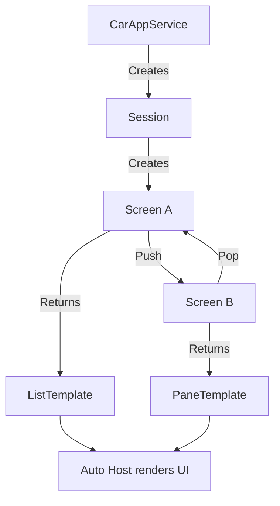

# Android for Cars App Library

The **Cars App Library** (`androidx.car.app`) enables template-based apps for Android Auto and Android Automotive OS. Unlike media/messaging (which piggyback on existing APIs), the Cars App Library provides a dedicated framework for navigation, POI, IoT, and other app categories.

## Core Concepts



| Concept | Role |
|---|---|
| `CarAppService` | Entry point — the host binds to this Service |
| `Session` | Represents a single connection to the car display |
| `Screen` | A single "page" in your app; returns a `Template` |
| `ScreenManager` | Manages a back stack of `Screen` objects |
| `Template` | Predefined UI layout the host renders (list, grid, map, etc.) |

## CarAppService

```kotlin
class MyCarAppService : CarAppService() {
    override fun createHostValidator(): HostValidator {
        return HostValidator.ALLOW_ALL_HOSTS_VALIDATOR // Use specific hosts in production
    }

    override fun onCreateSession(): Session {
        return MySession()
    }
}
```

```xml
<service
    android:name=".MyCarAppService"
    android:exported="true">
    <intent-filter>
        <action android:name="androidx.car.app.CarAppService" />
        <category android:name="androidx.car.app.category.NAVIGATION" />
    </intent-filter>
</service>
```

### App Categories

Declare one in your intent filter:

| Category | Value |
|---|---|
| Navigation | `androidx.car.app.category.NAVIGATION` |
| Point of Interest | `androidx.car.app.category.POI` |
| IoT | `androidx.car.app.category.IOT` |

## Session

```kotlin
class MySession : Session() {
    override fun onCreateScreen(intent: Intent): Screen {
        return MainScreen(carContext)
    }

    override fun onNewIntent(intent: Intent) {
        // Handle deep links while session is active
    }
}
```

## Screen and Templates

Each `Screen` returns exactly one `Template` from `onGetTemplate()`. The host calls this whenever it needs to render.

```kotlin
class MainScreen(carContext: CarContext) : Screen(carContext) {
    override fun onGetTemplate(): Template {
        val itemList = ItemList.Builder()
            .addItem(
                Row.Builder()
                    .setTitle("Navigate to Work")
                    .addText("123 Main St")
                    .setOnClickListener { screenManager.push(DetailScreen(carContext)) }
                    .build()
            )
            .addItem(
                Row.Builder()
                    .setTitle("Recent Destinations")
                    .setBrowsable(true)
                    .setOnClickListener { screenManager.push(RecentsScreen(carContext)) }
                    .build()
            )
            .build()

        return ListTemplate.Builder()
            .setTitle("My Navigation")
            .setSingleList(itemList)
            .setHeaderAction(Action.APP_ICON)
            .build()
    }
}
```

## Available Templates

| Template | Use Case | Max Items |
|---|---|---|
| `ListTemplate` | Scrollable rows with text, icons, toggles | 6 (non-scrollable) or 100 (scrollable) |
| `GridTemplate` | Grid of image + text tiles | 6 |
| `PaneTemplate` | Detail view with actions and rows | 4 rows, 2 actions |
| `MessageTemplate` | Simple message with up to 2 actions | — |
| `LongMessageTemplate` | Scrollable text (terms, disclaimers) | — |
| `SearchTemplate` | Search bar with results list | — |
| `NavigationTemplate` | Map + maneuver instructions (nav apps only) | — |
| `PlaceListNavigationTemplate` | Map + list of places | — |
| `MapWithContentTemplate` | Map with an overlay content area | — |
| `SignInTemplate` | Sign-in form (username/password, PIN, OAuth) | — |
| `TabTemplate` | Tabbed container for other templates | 4 tabs |

!!! warning "Template Restrictions"
    - Max **screen depth**: 5 screens on the back stack
    - Max **template steps**: a task flow can use at most 5 unique template types before resetting
    - Some templates require specific app categories (e.g., `NavigationTemplate` requires navigation)

## Navigation Apps

Navigation apps get access to the `NavigationTemplate`, which draws on the map surface and shows turn-by-turn instructions.

### Drawing on the Map

```kotlin
class NavigationScreen(carContext: CarContext) : Screen(carContext) {
    private val surfaceRenderer = MySurfaceRenderer()

    override fun onGetTemplate(): Template {
        return NavigationTemplate.Builder()
            .setNavigationInfo(
                RoutingInfo.Builder()
                    .setCurrentStep(
                        Step.Builder("Main St")
                            .setManeuver(
                                Maneuver.Builder(Maneuver.TYPE_TURN_NORMAL_RIGHT)
                                    .setIcon(CarIcon.Builder(
                                        IconCompat.createWithResource(carContext, R.drawable.ic_turn_right)
                                    ).build())
                                    .build()
                            )
                            .build(),
                        Distance.create(150.0, Distance.UNIT_METERS)
                    )
                    .build()
            )
            .setMapActionStrip(
                ActionStrip.Builder()
                    .addAction(
                        Action.Builder()
                            .setIcon(CarIcon.Builder(
                                IconCompat.createWithResource(carContext, R.drawable.ic_recenter)
                            ).build())
                            .setOnClickListener { surfaceRenderer.recenter() }
                            .build()
                    )
                    .build()
            )
            .build()
    }
}
```

### SurfaceCallback for Map Rendering

```kotlin
class MySurfaceRenderer : SurfaceCallback {
    private var surface: Surface? = null
    private var visibleArea: Rect? = null

    override fun onSurfaceAvailable(surfaceContainer: SurfaceContainer) {
        surface = surfaceContainer.surface
        renderMap()
    }

    override fun onVisibleAreaChanged(visibleArea: Rect) {
        this.visibleArea = visibleArea
        renderMap()
    }

    override fun onSurfaceDestroyed(surfaceContainer: SurfaceContainer) {
        surface = null
    }

    private fun renderMap() {
        val canvas = surface?.lockCanvas(null) ?: return
        // Draw your map on the canvas
        // Respect visibleArea to avoid drawing under UI overlays
        surface?.unlockCanvasAndPost(canvas)
    }
}
```

## Handling User Input

### Click Listeners

```kotlin
Row.Builder()
    .setTitle("Gas Station")
    .setOnClickListener {
        screenManager.push(StationDetailScreen(carContext, stationId))
    }
    .build()
```

### Search

```kotlin
class SearchScreen(carContext: CarContext) : Screen(carContext) {
    private var searchResults: List<Place> = emptyList()

    override fun onGetTemplate(): Template {
        return SearchTemplate.Builder(
            object : SearchTemplate.SearchCallback {
                override fun onSearchTextChanged(searchText: String) {
                    searchResults = repository.search(searchText)
                    invalidate() // triggers onGetTemplate() again
                }

                override fun onSearchSubmitted(searchText: String) {
                    // Final search
                }
            }
        )
            .setItemList(buildResultsList())
            .setShowKeyboardByDefault(false)
            .build()
    }
}
```

### Sign-In

```kotlin
override fun onGetTemplate(): Template {
    return SignInTemplate.Builder(
        InputSignInMethod.Builder(
            object : InputSignInMethod.InputCallback {
                override fun onInputSubmitted(text: String) {
                    authenticate(text)
                }
            }
        )
            .setInputType(InputSignInMethod.INPUT_TYPE_PASSWORD)
            .build()
    )
        .setTitle("Sign In")
        .setHeaderAction(Action.BACK)
        .build()
}
```

## Screen Navigation

```kotlin
// Push a new screen
screenManager.push(DetailScreen(carContext))

// Pop current screen (go back)
screenManager.pop()

// Pop to root
screenManager.popToRoot()

// Replace the entire back stack
screenManager.popToRoot()
screenManager.push(NewFlowScreen(carContext))
```

## Refreshing Content

Call `invalidate()` on a `Screen` to trigger `onGetTemplate()` again. The host re-renders with updated data.

```kotlin
class StationsScreen(carContext: CarContext) : Screen(carContext) {
    private var stations: List<Station> = emptyList()

    init {
        // Observe data changes
        lifecycleScope.launch {
            stationRepository.nearbyStations.collect { updated ->
                stations = updated
                invalidate()
            }
        }
    }

    override fun onGetTemplate(): Template {
        // Build template using current stations list
    }
}
```

!!! note "Refresh Limits"
    The host may throttle `invalidate()` calls. Don't call it more frequently than once per second. For animations, use the map `Surface` directly.

## Permissions

Request permissions via `CarContext`:

```kotlin
val permissions = listOf(Manifest.permission.ACCESS_FINE_LOCATION)
screenManager.push(
    RequestPermissionScreen(carContext, permissions) { granted ->
        if (granted) {
            screenManager.push(NavigationScreen(carContext))
        }
    }
)
```

## Gradle Setup

```kotlin
dependencies {
    implementation("androidx.car.app:app:1.4.0")

    // For Android Auto only
    implementation("androidx.car.app:app-projected:1.4.0")

    // For Android Automotive OS only
    implementation("androidx.car.app:app-automotive:1.4.0")

    // For testing
    testImplementation("androidx.car.app:app-testing:1.4.0")
}
```

??? question "Common Interview Questions"

    **Q: Why does the Cars App Library use templates instead of custom UI?**
    Templates enforce driver safety constraints at the platform level. The host controls layout, font sizes, touch targets, and interaction timing. This guarantees consistent UX across car displays of varying sizes and input modalities, and ensures apps can't create distracting interfaces.

    **Q: What's the difference between `Session` and `Screen`?**
    `Session` represents the lifecycle of a connection to the car display — it's created when the user launches your app on Auto and destroyed when they leave. `Screen` is a single page within that session, managed on a back stack. One `Session` has many `Screen`s.

    **Q: How do you handle the template step limit?**
    Each unique template type in a user flow counts as a "step." After 5 steps, the host may reset the flow. Design shallow navigation — if you need complex workflows, use `ListTemplate` with sub-items rather than deep screen chains. `NavigationTemplate` and `MapWithContentTemplate` are exempt from the step count.

    **Q: Can you share logic between the phone app and the car app?**
    Yes. `CarAppService` runs on the phone, so it has access to all your existing repositories, databases, and network layers. The `Screen` classes only handle template construction — keep business logic in shared modules.

    **Q: How does the Cars App Library handle both Android Auto and AAOS?**
    The core library (`app`) is platform-agnostic. You add `app-projected` for Auto (phone projects to car) or `app-automotive` for AAOS (runs directly on car hardware). Same `Screen` and `Template` code works on both — the host implementation differs.

!!! tip "Further Reading"
    - [Android for Cars App Library](https://developer.android.com/training/cars/apps)
    - [Car app design guidelines](https://developers.google.com/cars/design)
    - [Template restrictions reference](https://developer.android.com/training/cars/apps#template-restrictions)
    - [Cars App Library samples](https://github.com/android/car-samples)
