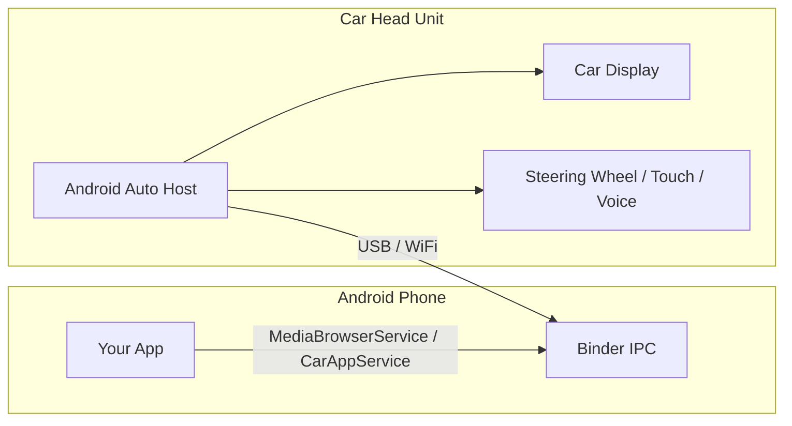

# Android Auto

**Android Auto** extends Android apps to the car's infotainment display. Apps run on the phone but render UI on the car head unit through a **host–client** architecture. The host (car display) manages rendering and driver interaction, while the client (your app) provides data and handles business logic.

## Architecture Overview



The host enforces **driver distraction guidelines** — all UI is templated and controlled by the host. You cannot draw arbitrary UI on the car screen.

## Supported App Categories

| Category | API Surface | Example |
|---|---|---|
| **Media** | `MediaBrowserServiceCompat` + `MediaSessionCompat` | Music, podcasts, audiobooks |
| **Messaging** | `NotificationCompat.MessagingStyle` | Chat, SMS |
| **Navigation** | Android for Cars App Library (`CarAppService`) | Turn-by-turn navigation |
| **Point of Interest** | Android for Cars App Library (`CarAppService`) | Parking, charging stations |
| **IoT** | Android for Cars App Library (`CarAppService`) | Smart home, vehicle status |

## Sub-Topics

| Page | What It Covers |
|---|---|
| [Media Apps](media-apps.md) | `MediaBrowserService`, `MediaSession`, browse trees, playback controls |
| [Messaging Apps](messaging-apps.md) | `MessagingStyle` notifications, voice replies, conversation API |
| [Cars App Library](cars-app-library.md) | Template-based UI, `Screen`, `CarAppService`, navigation and POI apps |
| [Testing & Tools](testing.md) | Desktop Head Unit (DHU), quality guidelines, debugging |

## Minimum Requirements

| Requirement | Value |
|---|---|
| Min SDK | API 23 (Media/Messaging) or API 26 (Cars App Library) |
| AndroidX dependency | `androidx.car.app:app:1.4+` (Cars App Library) |
| Play Store | App must pass Android Auto review |
| Manifest declaration | `com.google.android.gms.car.application` metadata |

```xml
<!-- AndroidManifest.xml -->
<meta-data
    android:name="com.google.android.gms.car.application"
    android:resource="@xml/automotive_app_desc" />
```

```xml
<!-- res/xml/automotive_app_desc.xml -->
<automotiveApp>
    <uses name="media" />   <!-- or "notification", "template" -->
</automotiveApp>
```

!!! warning "Android Auto vs Android Automotive OS"
    **Android Auto** projects the phone to the car display (phone is required). **Android Automotive OS (AAOS)** is a full Android OS embedded in the car — no phone needed. The Cars App Library supports both, but media/messaging APIs have differences on AAOS.

??? question "Common Interview Questions"

    **Q: How does Android Auto differ from Android Automotive OS?**
    Android Auto requires a phone connected to the car; it projects a simplified UI. AAOS is a standalone Android system built into the car's head unit. The Cars App Library abstracts both, but AAOS apps can also use the full Android SDK.

    **Q: Why can't you draw custom UI on Android Auto?**
    Driver distraction regulations require standardized, glanceable interfaces. The host controls all rendering through templates to enforce these guidelines. Your app provides data; the host decides layout and interaction timing.

    **Q: What happens if the phone disconnects mid-session?**
    The Auto host gracefully terminates the session. Media playback continues on the phone if the `MediaSession` is active. Navigation apps lose the car display but can fall back to the phone screen.

!!! tip "Further Reading"
    - [Android for Cars overview](https://developer.android.com/cars)
    - [Build media apps for cars](https://developer.android.com/training/cars/media)
    - [Android for Cars App Library](https://developer.android.com/training/cars/apps)
    - [Car app quality guidelines](https://developer.android.com/docs/quality-guidelines/car-app-quality)
