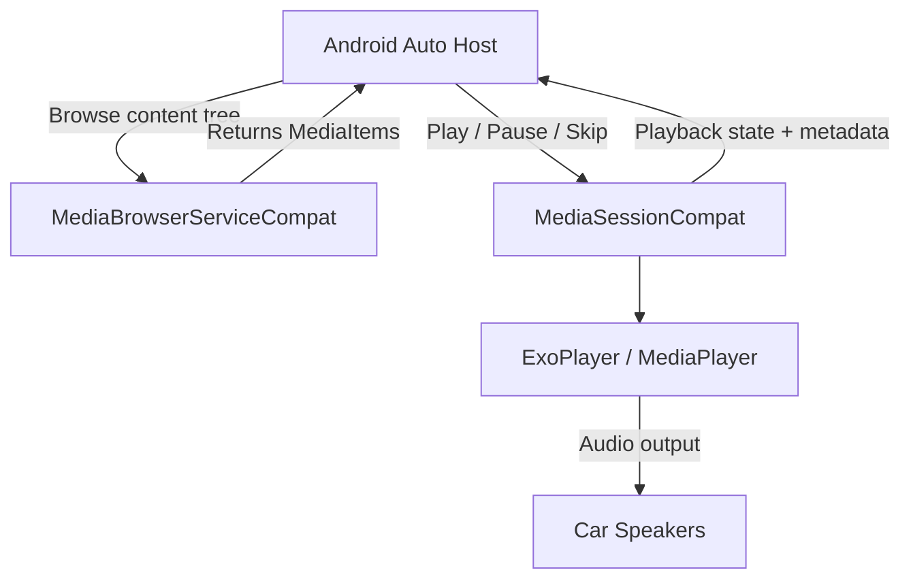
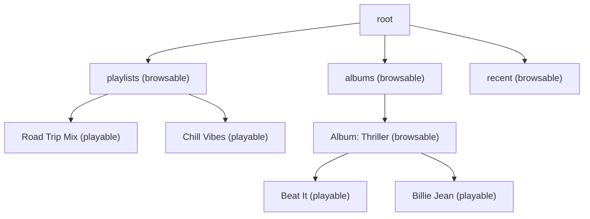

# Media Apps for Android Auto

Media apps are the most common Android Auto integration. They use `MediaBrowserServiceCompat` to expose a content hierarchy and `MediaSessionCompat` to handle playback controls — the same APIs used for media notifications and Wear OS.

## Architecture



The host calls `onGetRoot()` to discover your content tree, `onLoadChildren()` to browse it, and sends transport commands through the `MediaSession` callback.

## MediaBrowserServiceCompat

### onGetRoot — Gate Access

Called when a client connects. Return a `BrowserRoot` to allow browsing or `null` to reject.

```kotlin
class MusicService : MediaBrowserServiceCompat() {

    override fun onGetRoot(
        clientPackageName: String,
        clientUid: Int,
        rootHints: Bundle?
    ): BrowserRoot? {
        // Allow Android Auto and your own app
        if (clientPackageName == "com.google.android.projection.gearhead" ||
            clientPackageName == packageName) {
            return BrowserRoot("root", null)
        }
        return null
    }
}
```

!!! warning "Package Validation"
    Always validate the caller's package name and signature. Malicious apps can attempt to connect to your `MediaBrowserService`. Use `PackageValidator` from the UAMP sample for robust validation.

### onLoadChildren — Serve the Browse Tree

Returns a list of `MediaItem` objects for a given parent ID. Each item is either **browsable** (a folder) or **playable** (a track).

```kotlin
override fun onLoadChildren(
    parentId: String,
    result: Result<MutableList<MediaBrowserCompat.MediaItem>>
) {
    result.detach() // async loading

    serviceScope.launch {
        val items = when (parentId) {
            "root" -> listOf(
                createBrowsableItem("playlists", "Playlists", R.drawable.ic_playlist),
                createBrowsableItem("albums", "Albums", R.drawable.ic_album),
                createBrowsableItem("recent", "Recently Played", R.drawable.ic_recent)
            )
            "playlists" -> repository.getPlaylists().map { it.toMediaItem() }
            else -> repository.getTracksForParent(parentId).map { it.toMediaItem() }
        }
        result.sendResult(items.toMutableList())
    }
}

private fun createBrowsableItem(
    id: String, title: String, iconRes: Int
): MediaBrowserCompat.MediaItem {
    val desc = MediaDescriptionCompat.Builder()
        .setMediaId(id)
        .setTitle(title)
        .setIconUri(Uri.parse("android.resource://$packageName/$iconRes"))
        .build()
    return MediaBrowserCompat.MediaItem(desc, MediaBrowserCompat.MediaItem.FLAG_BROWSABLE)
}
```

### Browse Tree Structure



!!! tip "Content Style Guidelines"
    - Keep the tree **shallow** — max 3–4 levels deep
    - Provide **artwork URIs** for every item (the host displays album art prominently)
    - Include a **"Recently Played"** root category — Auto surfaces it for quick access
    - Limit browsable children to **reasonable counts** — long lists frustrate drivers

## MediaSessionCompat

### Setting Up the Session

```kotlin
private lateinit var mediaSession: MediaSessionCompat

override fun onCreate() {
    super.onCreate()
    mediaSession = MediaSessionCompat(this, "MusicService").apply {
        setCallback(mediaSessionCallback)
        isActive = true
    }
    sessionToken = mediaSession.sessionToken
}
```

### Handling Playback Commands

```kotlin
private val mediaSessionCallback = object : MediaSessionCompat.Callback() {

    override fun onPlay() {
        player.play()
        updatePlaybackState(PlaybackStateCompat.STATE_PLAYING)
    }

    override fun onPause() {
        player.pause()
        updatePlaybackState(PlaybackStateCompat.STATE_PAUSED)
    }

    override fun onSkipToNext() {
        queue.skipToNext()
        prepareAndPlay(queue.current)
    }

    override fun onPlayFromMediaId(mediaId: String, extras: Bundle?) {
        val track = repository.getTrack(mediaId)
        prepareAndPlay(track)
    }

    override fun onPlayFromSearch(query: String, extras: Bundle?) {
        // Voice search: "Play jazz music"
        val results = repository.search(query)
        if (results.isNotEmpty()) {
            queue.replaceWith(results)
            prepareAndPlay(results.first())
        }
    }
}
```

### Updating Metadata and Playback State

The host uses these to render the Now Playing screen.

```kotlin
private fun updateMetadata(track: Track) {
    mediaSession.setMetadata(
        MediaMetadataCompat.Builder()
            .putString(MediaMetadataCompat.METADATA_KEY_MEDIA_ID, track.id)
            .putString(MediaMetadataCompat.METADATA_KEY_TITLE, track.title)
            .putString(MediaMetadataCompat.METADATA_KEY_ARTIST, track.artist)
            .putString(MediaMetadataCompat.METADATA_KEY_ALBUM_ART_URI, track.artUri)
            .putLong(MediaMetadataCompat.METADATA_KEY_DURATION, track.durationMs)
            .build()
    )
}

private fun updatePlaybackState(state: Int) {
    mediaSession.setPlaybackState(
        PlaybackStateCompat.Builder()
            .setState(state, player.currentPosition, 1.0f)
            .setActions(
                PlaybackStateCompat.ACTION_PLAY or
                PlaybackStateCompat.ACTION_PAUSE or
                PlaybackStateCompat.ACTION_SKIP_TO_NEXT or
                PlaybackStateCompat.ACTION_SKIP_TO_PREVIOUS or
                PlaybackStateCompat.ACTION_PLAY_FROM_SEARCH
            )
            .build()
    )
}
```

## Custom Actions

Add extra buttons to the Now Playing screen (e.g., thumbs up, shuffle).

```kotlin
private fun updatePlaybackState(state: Int) {
    val customAction = PlaybackStateCompat.CustomAction.Builder(
        "ACTION_TOGGLE_SHUFFLE",
        "Shuffle",
        R.drawable.ic_shuffle
    ).build()

    mediaSession.setPlaybackState(
        PlaybackStateCompat.Builder()
            .setState(state, player.currentPosition, 1.0f)
            .addCustomAction(customAction)
            .setActions(/* ... */)
            .build()
    )
}

// In the callback:
override fun onCustomAction(action: String, extras: Bundle?) {
    when (action) {
        "ACTION_TOGGLE_SHUFFLE" -> queue.toggleShuffle()
    }
}
```

!!! note "Custom Action Limits"
    Android Auto displays a **maximum of 4 custom actions** in the Now Playing view. Prioritize the most important controls.

## Voice Search Integration

Android Auto routes voice queries like "Play [artist/song/genre]" to `onPlayFromSearch()`. Parse the extras bundle for structured hints.

```kotlin
override fun onPlayFromSearch(query: String, extras: Bundle?) {
    val artist = extras?.getString(MediaStore.EXTRA_MEDIA_ARTIST)
    val album = extras?.getString(MediaStore.EXTRA_MEDIA_ALBUM)
    val title = extras?.getString(MediaStore.EXTRA_MEDIA_TITLE)

    val results = when {
        artist != null -> repository.getByArtist(artist)
        album != null -> repository.getByAlbum(album)
        title != null -> repository.getByTitle(title)
        query.isNotEmpty() -> repository.search(query)
        else -> repository.getRecentlyPlayed()
    }

    if (results.isNotEmpty()) {
        queue.replaceWith(results)
        prepareAndPlay(results.first())
    }
}
```

## Manifest Configuration

```xml
<service
    android:name=".MusicService"
    android:exported="true">
    <intent-filter>
        <action android:name="android.media.browse.MediaBrowserService" />
    </intent-filter>
</service>

<meta-data
    android:name="com.google.android.gms.car.application"
    android:resource="@xml/automotive_app_desc" />
```

## Media3 Migration

Google recommends migrating to **Media3** (`androidx.media3`), which unifies `MediaBrowserService`, `MediaSession`, and `ExoPlayer` into a single library.

| Legacy | Media3 Equivalent |
|---|---|
| `MediaBrowserServiceCompat` | `MediaLibraryService` |
| `MediaSessionCompat` | `MediaSession` |
| `MediaSessionCompat.Callback` | `MediaSession.Callback` |
| `ExoPlayer` (standalone) | `androidx.media3.exoplayer.ExoPlayer` |
| `PlaybackStateCompat` | Managed automatically by `MediaSession` |

```kotlin
// Media3 approach
class MusicService : MediaLibraryService() {
    private lateinit var player: ExoPlayer
    private lateinit var session: MediaLibrarySession

    override fun onCreate() {
        super.onCreate()
        player = ExoPlayer.Builder(this).build()
        session = MediaLibrarySession.Builder(this, player, callback).build()
    }

    override fun onGetSession(controllerInfo: MediaSession.ControllerInfo) = session
}
```

??? question "Common Interview Questions"

    **Q: Why use `MediaBrowserService` instead of a regular Service?**
    `MediaBrowserService` provides a standardized content discovery protocol. Clients (Auto, Wear, Assistant) can browse your content tree without knowing your app's internal structure. A regular Service would require custom IPC for each client.

    **Q: How does Android Auto handle audio focus?**
    The host manages audio focus on the car. Your app should still request `AudioFocus` on the phone side. When another app (e.g., navigation voice) needs focus, your `MediaSession` receives `onPause()`. Proper audio focus handling prevents media and navigation prompts from overlapping.

    **Q: What's the difference between `onPlayFromMediaId` and `onPlayFromSearch`?**
    `onPlayFromMediaId` is triggered when a user taps a specific item in the browse tree — you get the exact media ID. `onPlayFromSearch` is triggered by voice — you get a free-text query and optional structured extras (artist, album). You must implement search logic yourself.

    **Q: How do you support queue management on Auto?**
    Set the queue via `mediaSession.setQueue(queueItems)` and handle `onSkipToQueueItem(id)` in your callback. The host displays the queue and lets the driver tap to jump to a specific track.

!!! tip "Further Reading"
    - [Build media apps for cars](https://developer.android.com/training/cars/media)
    - [Universal Android Music Player (UAMP)](https://github.com/android/uamp)
    - [Media3 migration guide](https://developer.android.com/guide/topics/media/media3/getting-started/migration-guide)
