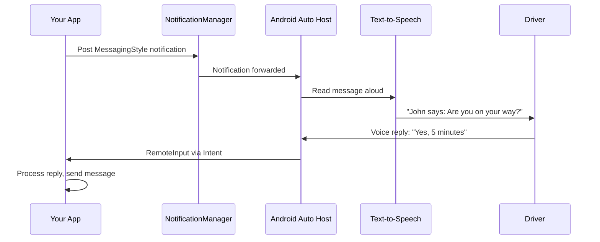

# Messaging Apps for Android Auto

Messaging apps integrate with Android Auto through the **notification system** — not a custom UI. You post `MessagingStyle` notifications, and the Auto host reads them aloud via text-to-speech and captures voice replies. No Cars App Library needed.

## How It Works



The entire interaction is **hands-free** — the driver never touches the screen to read or reply.

## MessagingStyle Notification

The core requirement: your notification must use `NotificationCompat.MessagingStyle` and include a `RemoteInput` action for replies.

```kotlin
fun showMessageNotification(context: Context, message: ChatMessage) {
    val person = Person.Builder()
        .setName(message.senderName)
        .setIcon(IconCompat.createWithBitmap(message.senderAvatar))
        .setKey(message.senderId)
        .build()

    val messagingStyle = NotificationCompat.MessagingStyle(
        Person.Builder().setName("Me").build()
    )
        .setConversationTitle(message.groupName) // null for 1:1
        .addMessage(
            message.text,
            message.timestamp,
            person
        )

    val replyAction = buildReplyAction(context, message.conversationId)
    val markReadAction = buildMarkReadAction(context, message.conversationId)

    val notification = NotificationCompat.Builder(context, CHANNEL_MESSAGES)
        .setSmallIcon(R.drawable.ic_message)
        .setStyle(messagingStyle)
        .addAction(replyAction)
        .addAction(markReadAction)
        .setCategory(NotificationCompat.CATEGORY_MESSAGE)
        .setShortcutId(message.conversationId)
        .build()

    NotificationManagerCompat.from(context)
        .notify(message.conversationId.hashCode(), notification)
}
```

## Reply Action with RemoteInput

```kotlin
private fun buildReplyAction(context: Context, conversationId: String): NotificationCompat.Action {
    val remoteInput = RemoteInput.Builder("key_reply")
        .setLabel("Reply")
        .build()

    val replyIntent = Intent(context, ReplyReceiver::class.java).apply {
        putExtra("conversation_id", conversationId)
    }
    val replyPendingIntent = PendingIntent.getBroadcast(
        context,
        conversationId.hashCode(),
        replyIntent,
        PendingIntent.FLAG_MUTABLE or PendingIntent.FLAG_UPDATE_CURRENT
    )

    return NotificationCompat.Action.Builder(
        R.drawable.ic_reply,
        "Reply",
        replyPendingIntent
    )
        .addRemoteInput(remoteInput)
        .setSemanticAction(NotificationCompat.Action.SEMANTIC_ACTION_REPLY)
        .setShowsUserInterface(false)
        .build()
}
```

## Processing Voice Replies

```kotlin
class ReplyReceiver : BroadcastReceiver() {
    override fun onReceive(context: Context, intent: Intent) {
        val conversationId = intent.getStringExtra("conversation_id") ?: return
        val reply = RemoteInput.getResultsFromIntent(intent)
            ?.getCharSequence("key_reply")
            ?.toString() ?: return

        // Send the reply through your messaging backend
        CoroutineScope(Dispatchers.IO).launch {
            MessageRepository.sendMessage(conversationId, reply)

            // Update the notification to show the sent reply
            updateNotificationWithReply(context, conversationId, reply)
        }
    }
}
```

!!! warning "Update After Reply"
    After processing a voice reply, you **must** update or cancel the notification. If you don't, Auto shows a spinner indefinitely. Post an updated `MessagingStyle` notification that includes the user's reply as a new message.

## Mark as Read Action

```kotlin
private fun buildMarkReadAction(context: Context, conversationId: String): NotificationCompat.Action {
    val markReadIntent = Intent(context, MarkReadReceiver::class.java).apply {
        putExtra("conversation_id", conversationId)
    }
    val pendingIntent = PendingIntent.getBroadcast(
        context,
        conversationId.hashCode() + 1,
        markReadIntent,
        PendingIntent.FLAG_IMMUTABLE or PendingIntent.FLAG_UPDATE_CURRENT
    )

    return NotificationCompat.Action.Builder(
        R.drawable.ic_mark_read,
        "Mark as Read",
        pendingIntent
    )
        .setSemanticAction(NotificationCompat.Action.SEMANTIC_ACTION_MARK_AS_READ)
        .setShowsUserInterface(false)
        .build()
}
```

## Notification Channel Setup

```kotlin
private fun createNotificationChannel(context: Context) {
    val channel = NotificationChannel(
        CHANNEL_MESSAGES,
        "Messages",
        NotificationManager.IMPORTANCE_HIGH
    ).apply {
        description = "Incoming messages"
    }
    context.getSystemService(NotificationManager::class.java)
        .createNotificationChannel(channel)
}
```

## Required Checklist

| Requirement | Why |
|---|---|
| `MessagingStyle` notification | Auto only surfaces notifications with this style |
| `RemoteInput` on reply action | Enables voice reply capture |
| `SEMANTIC_ACTION_REPLY` | Tells Auto which action is the reply button |
| `SEMANTIC_ACTION_MARK_AS_READ` | Lets Auto dismiss without replying |
| `CATEGORY_MESSAGE` | Auto filters by this category |
| `setShowsUserInterface(false)` | Reply must work without launching an Activity |
| `PendingIntent.FLAG_MUTABLE` | Required for `RemoteInput` on API 31+ |
| Update notification after reply | Prevents infinite loading spinner |

## Group Conversations

For group chats, set a conversation title and use distinct `Person` objects.

```kotlin
val style = NotificationCompat.MessagingStyle(me)
    .setConversationTitle("Project Team")
    .setGroupConversation(true)
    .addMessage("Meeting at 3?", timestamp1, alice)
    .addMessage("Works for me", timestamp2, bob)
    .addMessage("Same here", timestamp3, carol)
```

## Manifest Configuration

```xml
<!-- res/xml/automotive_app_desc.xml -->
<automotiveApp>
    <uses name="notification" />
</automotiveApp>
```

```xml
<!-- AndroidManifest.xml -->
<receiver android:name=".ReplyReceiver" android:exported="false" />
<receiver android:name=".MarkReadReceiver" android:exported="false" />

<meta-data
    android:name="com.google.android.gms.car.application"
    android:resource="@xml/automotive_app_desc" />
```

??? question "Common Interview Questions"

    **Q: Why doesn't Android Auto let messaging apps render custom UI?**
    Driver safety. Reading text on a screen is dangerous while driving. Auto forces all message content through TTS (text-to-speech) and uses voice input for replies. This ensures the driver's eyes stay on the road.

    **Q: How does Auto decide which notifications to show?**
    Auto filters for notifications with `MessagingStyle` and `CATEGORY_MESSAGE`. Regular notifications (even high-priority ones) are suppressed on the car display to minimize distraction.

    **Q: What happens if the user replies but the network is down?**
    Your `BroadcastReceiver` receives the reply regardless of network state. You should queue the message locally and retry delivery. Update the notification to show the reply was sent (or indicate it's pending) — don't leave the spinner active.

    **Q: Can a messaging app show images or rich media on Auto?**
    Limited. You can include a `Person` icon (avatar) and the notification's large icon. Inline images, stickers, or formatted text are stripped. The host only reads plain text aloud.

!!! tip "Further Reading"
    - [Build messaging apps for Android Auto](https://developer.android.com/training/cars/messaging)
    - [MessagingStyle documentation](https://developer.android.com/reference/androidx/core/app/NotificationCompat.MessagingStyle)
    - [Conversation notifications guide](https://developer.android.com/develop/ui/views/notifications/conversations)
