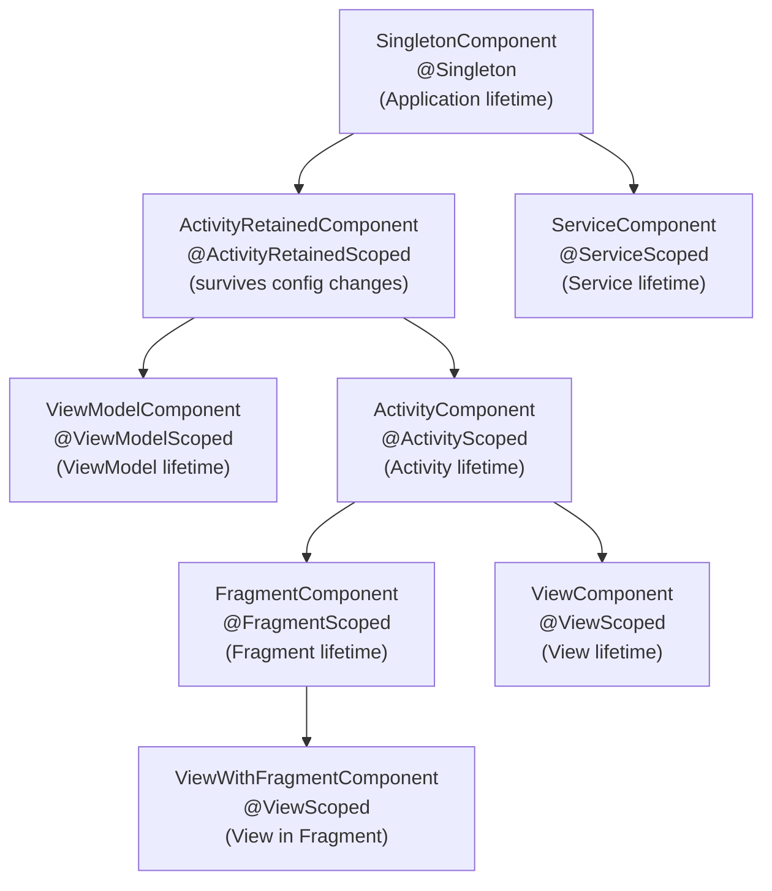

# Dependency Injection (Dagger & Hilt)

## Why DI?

- **Decoupling** — classes don't create their own dependencies, making them reusable and swappable
- **Testability** — inject fakes/mocks without modifying production code
- **Lifecycle management** — the DI framework controls when objects are created and destroyed (scoping)
- **Single source of truth** — dependency graph is defined once, not scattered across constructors

---

## Service Locator vs Dependency Injection

Two approaches to decoupling object creation from object usage. They solve the same problem differently.

| Aspect | Service Locator (Koin) | Dependency Injection (Dagger/Hilt) |
|--------|------------------------|------------------------------------|
| **Resolution** | Runtime — classes **ask** the locator for dependencies | Compile-time — dependencies are **provided** to the class |
| **Graph validation** | Crashes at runtime if a binding is missing | Fails at compile time with clear error messages |
| **Hidden dependencies** | Classes depend on the locator itself (implicit) | Dependencies are explicit in the constructor signature |
| **Performance** | Reflection-based (Koin uses Kotlin DSL, still runtime) | Code generation — zero reflection at runtime |
| **Learning curve** | Lower — simple DSL | Higher — annotation processing, generated code |

```kotlin
// Service Locator (Koin) — class reaches out for its dependency
class UserRepository : KoinComponent {
    private val api: ApiService by inject()  // hidden dependency
}

// Dependency Injection (Dagger/Hilt) — dependency is handed in
class UserRepository @Inject constructor(
    private val api: ApiService  // explicit, visible in constructor
)
```

!!! tip "Rule of thumb"
    If your project has 50+ classes with dependencies, compile-time validation (Dagger/Hilt) saves hours of debugging missing bindings in production. For small apps or KMP targets where Dagger isn't available, Koin is a pragmatic choice.

---

## Singleton in Kotlin

=== "object keyword"

    ```kotlin
    object AppConfig {
        val baseUrl = "https://api.example.com"
    }
    ```

    Thread-safe, lazily initialized by the JVM class loader. Cannot have constructor parameters.

=== "Double-Check Locking"

    ```kotlin
    class DatabaseDriver private constructor(config: DbConfig) {
        companion object {
            @Volatile
            private var instance: DatabaseDriver? = null

            fun getInstance(config: DbConfig): DatabaseDriver {
                return instance ?: synchronized(this) {
                    instance ?: DatabaseDriver(config).also { instance = it }
                }
            }
        }
    }
    ```

    Use when you need constructor parameters. `@Volatile` ensures visibility across threads; `synchronized` prevents double creation.

---

## Dagger Core Concepts

### Annotation Roles

| Role | Annotations | Purpose |
|------|-------------|---------|
| **Consumer** | `@Inject` (constructor, field, method) | "I need this dependency" |
| **Producer** | `@Module`, `@Provides`, `@Binds` | "Here's how to create it" |
| **Connector** | `@Component` | "I wire consumers to producers" |

### Dependency Resolution Flow

```
1. Class requests dependency via @Inject
2. Component looks for a match:
   a. Constructor with @Inject on the requested type? → use it
   b. @Provides method in a Module? → call it
   c. @Binds mapping in a Module? → resolve the implementation
3. If the dependency itself has dependencies, recurse
4. Scoped? → cache the instance for the component's lifetime
```

### Avoiding @Provides — Constructor Injection

If you annotate a class constructor with `@Inject`, Dagger can create instances automatically without a `@Provides` method. This is the preferred approach for classes you own.

```kotlin
class UserRepository @Inject constructor(
    private val api: ApiService,
    private val dao: UserDao
)
```

!!! note "When @Provides is required"
    - **Third-party classes** you don't own (Retrofit, OkHttpClient, Room database)
    - **Interfaces** — Dagger can't know which implementation to pick (use `@Binds` instead when possible)
    - **Configured instances** — objects that need builder/configuration steps

---

## @Binds vs @Provides

=== "@Binds"

    ```kotlin
    @Module
    @InstallIn(SingletonComponent::class)
    abstract class RepositoryModule {
        @Binds
        abstract fun bindUserRepo(impl: UserRepositoryImpl): UserRepository
    }
    ```

    - Must be an **abstract function** in an **abstract class** (or interface)
    - Takes exactly one parameter (the implementation) and returns the bound type
    - **Generates no code** — Dagger just records the mapping in its graph. No factory class is created
    - More efficient than `@Provides` because there's no wrapper function call at runtime

=== "@Provides"

    ```kotlin
    @Module
    @InstallIn(SingletonComponent::class)
    object NetworkModule {
        @Provides
        @Singleton
        fun provideRetrofit(okHttpClient: OkHttpClient): Retrofit {
            return Retrofit.Builder()
                .baseUrl("https://api.example.com")
                .client(okHttpClient)
                .addConverterFactory(GsonConverterFactory.create())
                .build()
        }
    }
    ```

    - Can be in a concrete class or `object` (prefer `object` to avoid unnecessary instantiation)
    - Required when you need to call constructors, builders, or configure the object
    - Dagger generates a factory class that calls this method

!!! warning "Mixing @Binds and @Provides"
    You cannot have both `@Binds` (abstract) and `@Provides` (concrete) methods in the same module class. Split them into separate modules, or make the `@Provides` methods `companion object` members inside the abstract class:

    ```kotlin
    @Module
    @InstallIn(SingletonComponent::class)
    abstract class DataModule {
        @Binds
        abstract fun bindRepo(impl: UserRepositoryImpl): UserRepository

        companion object {
            @Provides
            fun provideDatabase(@ApplicationContext context: Context): AppDatabase {
                return Room.databaseBuilder(context, AppDatabase::class.java, "db").build()
            }
        }
    }
    ```

---

## Scoping

### @Singleton and Custom Scopes

`@Singleton` doesn't magically make something a singleton. It means: **create one instance per component that carries this scope**.

```kotlin
@Singleton
@Component(modules = [AppModule::class])
interface ApplicationComponent { ... }

// This instance lives as long as ApplicationComponent lives
@Singleton
class AnalyticsTracker @Inject constructor(...)
```

Without a scope annotation, Dagger creates a **new instance every time** the dependency is requested.

### Custom Scopes

Define your own scope when the predefined ones don't fit.

```kotlin
@Scope
@Retention(AnnotationRetention.RUNTIME)
annotation class ActivityScope

@ActivityScope
@Component(dependencies = [ApplicationComponent::class])
interface ActivityComponent {
    fun inject(activity: MainActivity)
}

@ActivityScope
class ActivityNavigator @Inject constructor(...)
// One instance per ActivityComponent
```

---

## Component Contracts (Raw Dagger)

When a child component depends on a parent, the parent must **explicitly expose** dependencies the child needs. This is the "contract."

```kotlin
@Singleton
@Component(modules = [AppModule::class])
interface ApplicationComponent {
    // Expose to child components
    fun apiService(): ApiService
    fun database(): AppDatabase
}

@ActivityScope
@Component(dependencies = [ApplicationComponent::class])
interface ActivityComponent {
    fun inject(activity: MainActivity)
}
```

---

## Field Injection (Raw Dagger)

Used for framework classes where you don't control the constructor (Activity, Fragment, Service).

```kotlin
class MainActivity : AppCompatActivity() {

    @Inject
    lateinit var userRepository: UserRepository

    override fun onCreate(savedInstanceState: Bundle?) {
        // Manual injection — raw Dagger only
        (applicationContext as MyApp).appComponent.inject(this)
        super.onCreate(savedInstanceState)
    }
}
```

!!! warning "With Hilt, you never do this manually"
    `@AndroidEntryPoint` handles injection automatically. You just declare `@Inject lateinit var` fields and Hilt injects them before `onCreate()` / `onAttach()`. No `DaggerComponent.inject(this)` call needed.

---

## @Qualifiers / @Named

Used when the dependency graph has multiple bindings of the same type.

```kotlin
@Module
@InstallIn(SingletonComponent::class)
object NetworkModule {
    @Provides
    @Named("auth")
    fun provideAuthClient(): OkHttpClient {
        return OkHttpClient.Builder()
            .addInterceptor(AuthInterceptor())
            .build()
    }

    @Provides
    @Named("logging")
    fun provideLoggingClient(): OkHttpClient {
        return OkHttpClient.Builder()
            .addInterceptor(HttpLoggingInterceptor())
            .build()
    }
}

class ApiService @Inject constructor(
    @Named("auth") private val client: OkHttpClient
)
```

!!! tip "Prefer custom qualifiers over @Named"
    `@Named` uses strings — typos are caught at runtime. Custom qualifiers catch errors at compile time:

    ```kotlin
    @Qualifier
    @Retention(AnnotationRetention.BINARY)
    annotation class AuthClient

    @Qualifier
    @Retention(AnnotationRetention.BINARY)
    annotation class LoggingClient
    ```

---

## Dagger Hilt

Hilt wraps Dagger with Android-specific defaults: predefined components, automatic component creation/destruction, and zero boilerplate for Android classes.

### Component Hierarchy



Dependencies flow **downward**. A `@FragmentScoped` class can depend on `@ActivityScoped` or `@Singleton` bindings, but not the reverse.

### Setup

```kotlin
// 1. Application — required entry point
@HiltAndroidApp
class MyApp : Application()

// 2. Activity — enables injection for this Activity
@AndroidEntryPoint
class MainActivity : AppCompatActivity() {
    @Inject lateinit var analytics: AnalyticsTracker
    // analytics is injected automatically — no manual inject() call
}

// 3. Fragment — host Activity MUST also have @AndroidEntryPoint
@AndroidEntryPoint
class HomeFragment : Fragment() {
    @Inject lateinit var formatter: DateFormatter
}
```

### Modules with Hilt

```kotlin
@Module
@InstallIn(SingletonComponent::class)
object NetworkModule {
    @Provides
    @Singleton
    fun provideRetrofit(okHttpClient: OkHttpClient): Retrofit {
        return Retrofit.Builder()
            .baseUrl(BuildConfig.BASE_URL)
            .client(okHttpClient)
            .addConverterFactory(MoshiConverterFactory.create())
            .build()
    }
}
```

`@InstallIn` tells Hilt **which component** (and therefore which lifecycle) this module's bindings belong to.

---

## Hilt ViewModel Injection

### Basic Setup

```kotlin
@HiltViewModel
class HomeViewModel @Inject constructor(
    private val getUsersUseCase: GetUsersUseCase,
    private val savedStateHandle: SavedStateHandle
) : ViewModel() {
    // SavedStateHandle is automatically provided by Hilt
}
```

=== "Compose"

    ```kotlin
    @Composable
    fun HomeScreen(
        viewModel: HomeViewModel = hiltViewModel()
    ) {
        val state by viewModel.state.collectAsStateWithLifecycle()
        // ...
    }
    ```

=== "Fragment (ViewBinding)"

    ```kotlin
    @AndroidEntryPoint
    class HomeFragment : Fragment() {
        private val viewModel: HomeViewModel by viewModels()
    }
    ```

### @AssistedInject — Runtime Parameters

When a ViewModel needs parameters that aren't in the DI graph (e.g., a user ID passed from navigation):

```kotlin
@HiltViewModel(assistedFactory = DetailViewModel.Factory::class)
class DetailViewModel @AssistedInject constructor(
    @Assisted private val userId: String,
    private val userRepository: UserRepository
) : ViewModel() {

    @AssistedFactory
    interface Factory {
        fun create(userId: String): DetailViewModel
    }
}
```

```kotlin
// In Compose
@Composable
fun DetailScreen(userId: String) {
    val viewModel = hiltViewModel<DetailViewModel, DetailViewModel.Factory> { factory ->
        factory.create(userId)
    }
}
```

!!! note "When to use @AssistedInject"
    Use it when the ViewModel needs a value that's only known at runtime (navigation args, clicked item ID). For values from SavedStateHandle, you can often use `savedStateHandle.get<String>("key")` instead.

---

## Multibinding

Collect multiple implementations into a `Set` or `Map` without the consumer knowing about individual bindings.

### @IntoSet

```kotlin
@Module
@InstallIn(SingletonComponent::class)
abstract class AnalyticsModule {
    @Binds @IntoSet
    abstract fun bindFirebase(impl: FirebaseAnalytics): AnalyticsService

    @Binds @IntoSet
    abstract fun bindMixpanel(impl: MixpanelAnalytics): AnalyticsService
}

class AnalyticsManager @Inject constructor(
    private val services: Set<@JvmSuppressWildcards AnalyticsService>
) {
    fun logEvent(event: String) {
        services.forEach { it.log(event) }  // fires to all providers
    }
}
```

### @IntoMap

Map bindings associate each implementation with a key. Useful for plugin-style architectures.

```kotlin
@Module
@InstallIn(SingletonComponent::class)
abstract class WorkerModule {
    @Binds
    @IntoMap
    @StringKey("sync_worker")
    abstract fun bindSyncWorker(factory: SyncWorker.Factory): WorkerFactory

    @Binds
    @IntoMap
    @StringKey("upload_worker")
    abstract fun bindUploadWorker(factory: UploadWorker.Factory): WorkerFactory
}

class AppWorkerFactory @Inject constructor(
    private val workers: Map<String, @JvmSuppressWildcards Provider<WorkerFactory>>
) : WorkerFactory() {
    override fun createWorker(...): ListenableWorker? {
        return workers[workerClassName]?.get()?.create(appContext, params)
    }
}
```

Available key annotations: `@StringKey`, `@IntKey`, `@LongKey`, `@ClassKey`, or define custom map keys with `@MapKey`.

!!! tip "@JvmSuppressWildcards"
    Kotlin generics compile to wildcard types in Java (`Set<? extends AnalyticsService>`). Dagger can't match this. `@JvmSuppressWildcards` forces the exact type (`Set<AnalyticsService>`).

---

## @EntryPoint — Injecting Where Hilt Doesn't Reach

Hilt can only inject into classes it manages (`@AndroidEntryPoint` activities, fragments, services, etc.). For other classes, use `@EntryPoint`.

```kotlin
// Define the entry point interface
@EntryPoint
@InstallIn(SingletonComponent::class)
interface AnalyticsEntryPoint {
    fun analyticsTracker(): AnalyticsTracker
}

// Use it in a ContentProvider (Hilt doesn't support ContentProvider directly)
class MyContentProvider : ContentProvider() {
    override fun onCreate(): Boolean {
        val entryPoint = EntryPointAccessors.fromApplication(
            context!!.applicationContext,
            AnalyticsEntryPoint::class.java
        )
        val tracker = entryPoint.analyticsTracker()
        return true
    }
}
```

Common use cases for `@EntryPoint`:

- **ContentProvider** — created before `Application.onCreate()`, so Hilt isn't ready for `@AndroidEntryPoint`
- **Custom Views** not inflated by Hilt-aware Activities
- **Third-party libraries** that create objects via their own factories (WorkManager custom factories, Glide modules)

---

## Testing with Hilt

```kotlin
@HiltAndroidTest
@UninstallModules(NetworkModule::class)
class UserViewModelTest {

    @get:Rule
    val hiltRule = HiltAndroidRule(this)

    @BindValue
    val fakeRepo: UserRepository = FakeUserRepository()

    @Inject
    lateinit var viewModel: UserViewModel

    @Before
    fun setup() {
        hiltRule.inject()
    }

    @Test
    fun `loads users on init`() = runTest {
        // viewModel uses FakeUserRepository automatically
    }
}
```

- `@UninstallModules` removes the real module so you can replace bindings
- `@BindValue` binds a test field directly into the Hilt graph
- `@HiltAndroidRule` must be applied before other rules that need injection

---

## Common Pitfalls

!!! warning "Scope mismatch"
    A `@Singleton` scoped class **cannot** depend on an `@ActivityScoped` class. Dependencies can only flow downward in the component hierarchy. Hilt catches this at compile time.

!!! warning "Missing @AndroidEntryPoint on host Activity"
    If a Fragment uses `@AndroidEntryPoint`, its host Activity **must also** have `@AndroidEntryPoint`. Missing it causes a cryptic runtime crash: `ClassCastException: Activity cannot be cast to GeneratedComponentManager`.

!!! warning "Injection timing"
    - **Activity**: fields are injected in `super.onCreate()` — access them **after** `super.onCreate()`
    - **Fragment**: fields are injected in `onAttach()` — access them from `onAttach()` onward

!!! tip "Debugging the dependency graph"
    - Check generated code in `build/generated/source/kapt/` (or `ksp/`) — Dagger generates readable factory classes
    - Use `@Component` dependency graph dumps: add `dagger.fullBindingGraphValidation=WARNING` to gradle.properties
