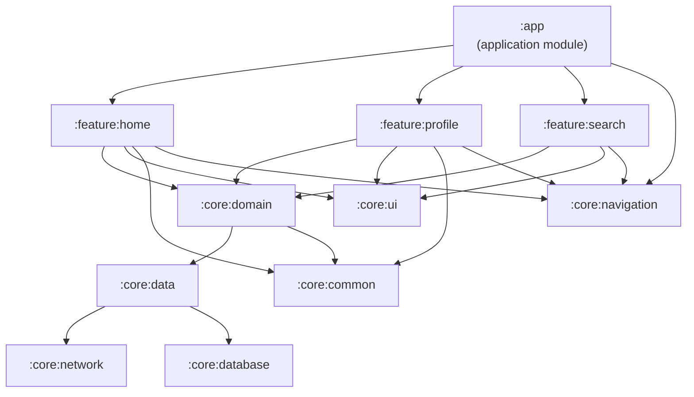
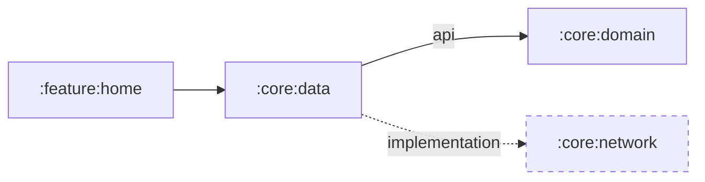

# Modularization

Breaking a monolithic app into independent Gradle modules. The single most impactful architectural decision for large Android codebases.

---

## Why Modularize?

| Benefit | How |
|---------|-----|
| **Build speed** | Only changed modules recompile. Unchanged modules use Gradle cache |
| **Incremental compilation** | Module boundaries let Gradle skip recompilation of unaffected modules entirely. A change in `:feature:home` doesn't recompile `:feature:profile` |
| **Team scalability** | Teams own modules, fewer merge conflicts, clear code ownership |
| **Strict boundaries** | Compile-time enforcement — can't accidentally depend on internal code |
| **Reusability** | Shared modules across apps (design system, networking) |
| **Testability** | Test modules in isolation, faster test cycles |

!!! warning "The real reason"
    In a 500K+ LOC monolith, a single-line change triggers a full rebuild (3-10 min). With modules, the same change rebuilds one module (~20 sec). At scale, this is the difference between shipping and not shipping.

---

## Module Types

### Application Module vs Library Module vs Kotlin/JVM Module

| Type | Gradle Plugin | Use For |
|------|---------------|---------|
| **Application module** | `com.android.application` | The `:app` module — produces the APK/AAB. Only one per app |
| **Android library module** | `com.android.library` | Modules that need Android APIs (UI, Context, resources) |
| **Kotlin/JVM module** | `org.jetbrains.kotlin.jvm` | Pure Kotlin — no Android dependencies at all. Domain layer, shared models, utilities |

!!! tip "Prefer Kotlin/JVM modules"
    Every module that doesn't need Android APIs should be a pure Kotlin/JVM module. Benefits: faster compilation (no AAPT, no resource merging), usable in KMP, enforces that domain logic stays framework-free.

### Recommended Module Structure



| Module | Contains | Type | Depends On |
|--------|----------|------|------------|
| `:app` | Application class, navigation graph, DI wiring | Application | All feature modules, `:core:navigation` |
| `:feature:*` | UI + ViewModel for one feature | Android Library | `:core:domain`, `:core:ui`, `:core:navigation` |
| `:core:domain` | Use cases, repository interfaces, domain models | **Kotlin/JVM** | `:core:common` (nothing Android) |
| `:core:data` | Repository implementations, mappers | Android Library | `:core:network`, `:core:database` |
| `:core:network` | Retrofit setup, API interfaces, DTOs | Android Library | — |
| `:core:database` | Room setup, DAOs, entities | Android Library | — |
| `:core:ui` | Design system, shared composables, theme | Android Library | — |
| `:core:common` | Shared utilities, extension functions, base classes | Kotlin/JVM | — |
| `:core:navigation` | Route definitions, Navigator interface | Kotlin/JVM | — |
| `:core:testing` | Shared test fakes, test utilities, custom rules | Kotlin/JVM | — |

### :core:common — Shared Utilities

Extensions, Result wrappers, dispatchers provider, logging abstraction — things every module needs but that don't belong to a specific domain.

```kotlin
// :core:common
interface DispatcherProvider {
    val main: CoroutineDispatcher
    val io: CoroutineDispatcher
    val default: CoroutineDispatcher
}

fun <T> Flow<T>.asResult(): Flow<Result<T>> = map { Result.success(it) }
    .catch { emit(Result.failure(it)) }
```

### :core:testing — Shared Test Utilities

Fakes, test rules, and builders used across module test suites. Avoids duplicating test infrastructure.

```kotlin
// :core:testing
class FakeUserRepository : UserRepository {
    private val users = MutableStateFlow<List<User>>(emptyList())

    override fun observeUsers(): Flow<List<User>> = users
    override suspend fun getUser(id: String): User = users.value.first { it.id == id }

    // Test control
    fun emit(list: List<User>) { users.value = list }
}

class MainDispatcherRule(
    private val dispatcher: TestDispatcher = UnconfinedTestDispatcher()
) : TestWatcher() {
    override fun starting(description: Description) {
        Dispatchers.setMain(dispatcher)
    }
    override fun finished(description: Description) {
        Dispatchers.resetMain()
    }
}
```

---

## Dependency Rules

**The dependency arrow points inward.** Outer layers know about inner layers, never the reverse.

- Feature modules **never** depend on each other directly
- `:core:domain` has **zero Android dependencies** (pure Kotlin/JVM module)
- `:core:data` implements interfaces defined in `:core:domain`

```kotlin
// In :core:domain (pure Kotlin)
interface UserRepository {
    suspend fun getUser(id: String): User
}

// In :core:data (Android module)
class UserRepositoryImpl @Inject constructor(
    private val api: UserApi,
    private val dao: UserDao
) : UserRepository {
    override suspend fun getUser(id: String): User {
        return dao.getUser(id) ?: api.getUser(id).also { dao.insert(it) }
    }
}
```

### Circular Dependency Prevention

Gradle will fail if module A depends on B and B depends on A. This is a sign of poor module boundaries.

**Common cause:** two feature modules need shared types.

**Solution:** extract the shared types into a `:core` module that both depend on.

```
// BAD — circular
:feature:home → :feature:profile  (needs ProfileData)
:feature:profile → :feature:home  (needs HomeEvent)

// GOOD — extract shared contract
:feature:home → :core:domain  (ProfileData lives here)
:feature:profile → :core:domain  (HomeEvent lives here)
```

!!! tip "Detect cycles early"
    Add `configurations.all { resolutionStrategy.failOnNonReproducibleResolution() }` and use `./gradlew :app:dependencies` regularly to audit the graph.

---

## api vs implementation Dependency Scope

This is critical for build performance and encapsulation.

```kotlin
// :core:data/build.gradle.kts
dependencies {
    api(project(":core:domain"))          // exposed to consumers of :core:data
    implementation(project(":core:network"))  // hidden from consumers
}
```



| Scope | Transitive? | When to Use |
|-------|-------------|-------------|
| `implementation` | No — consumers of your module **cannot** see this dependency | Default choice. Hides internal details, enables independent recompilation |
| `api` | Yes — consumers can see and use classes from this dependency | Only when your module's public API exposes types from the dependency |

**Why it matters for builds:** When an `implementation` dependency changes, only the declaring module recompiles. When an `api` dependency changes, the declaring module AND all its consumers recompile.

```kotlin
// :core:data exposes UserRepository (from :core:domain) in its public API
// So :core:domain must be "api", not "implementation"
class UserRepositoryImpl : UserRepository { ... }
//                          ^^^^^^^^^^^^^^ type from :core:domain

// But :core:data uses Retrofit internally — no Retrofit types in public API
// So :core:network should be "implementation"
```

!!! warning "Leaking transitive dependencies"
    Using `api` everywhere defeats the purpose of modularization. Every `api` dependency becomes a transitive dependency — changes ripple through the entire graph. Default to `implementation` and only promote to `api` when the compiler forces you.

---

## Navigation Between Features

Feature modules can't reference each other's classes. Three approaches:

=== "Interface-Based Navigation (Recommended)"

    Define a `Navigator` interface in `:core:navigation`. Each feature module declares its entry points. The `:app` module provides the implementation.

    ```kotlin
    // :core:navigation — pure Kotlin module
    interface AppNavigator {
        fun navigateToProfile(userId: String)
        fun navigateToSearch(query: String)
        fun navigateBack()
    }

    // Route constants
    object Routes {
        const val HOME = "home"
        const val PROFILE = "profile/{userId}"
        fun profile(userId: String) = "profile/$userId"
    }
    ```

    ```kotlin
    // :app — the only module that knows all features
    class AppNavigatorImpl(
        private val navController: NavController
    ) : AppNavigator {
        override fun navigateToProfile(userId: String) {
            navController.navigate(Routes.profile(userId))
        }
        override fun navigateToSearch(query: String) { /* ... */ }
        override fun navigateBack() { navController.popBackStack() }
    }
    ```

    ```kotlin
    // :feature:home — depends on :core:navigation, NOT on :feature:profile
    class HomeViewModel @Inject constructor(
        private val navigator: AppNavigator
    ) : ViewModel() {
        fun onUserClicked(userId: String) {
            navigator.navigateToProfile(userId)  // no dependency on :feature:profile
        }
    }
    ```

=== "Route-Based Navigation (Compose)"

    Define routes as constants in a shared module. Each feature registers its own NavGraph.

    ```kotlin
    // :core:navigation
    object Routes {
        const val HOME = "home"
        const val PROFILE = "profile/{userId}"
        fun profile(userId: String) = "profile/$userId"
    }

    // :feature:home — navigates without knowing :feature:profile
    navController.navigate(Routes.profile("123"))
    ```

=== "Deep Link Navigation"

    Each feature declares deep links. Navigate via URI — no compile-time dependency.

    ```kotlin
    navController.navigate(Uri.parse("myapp://profile/123"))
    ```

---

## Gradle Configuration

### Convention Plugins

Avoid duplicating `build.gradle` config across 30+ modules. Convention plugins define shared build logic once.

#### Directory Structure

```
project-root/
├── build-logic/
│   ├── convention/
│   │   ├── build.gradle.kts          ← plugin project build file
│   │   └── src/main/kotlin/
│   │       ├── AndroidApplicationConventionPlugin.kt
│   │       ├── AndroidLibraryConventionPlugin.kt
│   │       ├── AndroidFeatureConventionPlugin.kt
│   │       ├── AndroidComposeConventionPlugin.kt
│   │       └── KotlinLibraryConventionPlugin.kt
│   └── settings.gradle.kts           ← declares this as an included build
├── app/
├── feature/
├── core/
├── gradle/
│   └── libs.versions.toml
└── settings.gradle.kts               ← includeBuild("build-logic")
```

```kotlin
// build-logic/settings.gradle.kts
dependencyResolutionManagement {
    repositories {
        google()
        mavenCentral()
    }
    versionCatalogs {
        create("libs") {
            from(files("../gradle/libs.versions.toml"))
        }
    }
}

rootProject.name = "build-logic"
include(":convention")
```

```kotlin
// build-logic/convention/build.gradle.kts
plugins {
    `kotlin-dsl`
}

dependencies {
    compileOnly(libs.android.gradle.plugin)
    compileOnly(libs.kotlin.gradle.plugin)
    compileOnly(libs.compose.gradle.plugin)
}

gradlePlugin {
    plugins {
        register("androidApplication") {
            id = "myapp.android.application"
            implementationClass = "AndroidApplicationConventionPlugin"
        }
        register("androidFeature") {
            id = "myapp.android.feature"
            implementationClass = "AndroidFeatureConventionPlugin"
        }
        register("kotlinLibrary") {
            id = "myapp.kotlin.library"
            implementationClass = "KotlinLibraryConventionPlugin"
        }
    }
}
```

#### Example Convention Plugin

```kotlin
// AndroidFeatureConventionPlugin.kt
class AndroidFeatureConventionPlugin : Plugin<Project> {
    override fun apply(target: Project) = with(target) {
        pluginManager.apply("com.android.library")
        pluginManager.apply("org.jetbrains.kotlin.android")
        pluginManager.apply("myapp.android.compose")
        pluginManager.apply("dagger.hilt.android.plugin")

        extensions.configure<LibraryExtension> {
            compileSdk = 35
            defaultConfig.minSdk = 26
            buildFeatures.compose = true
        }

        dependencies {
            add("implementation", project(":core:domain"))
            add("implementation", project(":core:ui"))
            add("implementation", project(":core:navigation"))
            add("testImplementation", project(":core:testing"))
        }
    }
}
```

#### Usage in Feature Modules

```kotlin
// feature/home/build.gradle.kts
plugins {
    id("myapp.android.feature")  // all shared config applied
}

dependencies {
    // only feature-specific dependencies here
    implementation(libs.coil.compose)
}
```

### Version Catalogs

Centralize dependency versions in `gradle/libs.versions.toml`.

```toml
[versions]
compose-bom = "2024.12.01"
hilt = "2.51.1"
kotlin = "2.0.21"
room = "2.6.1"

[libraries]
compose-bom = { module = "androidx.compose:compose-bom", version.ref = "compose-bom" }
hilt-android = { module = "com.google.dagger:hilt-android", version.ref = "hilt" }
room-runtime = { module = "androidx.room:room-runtime", version.ref = "room" }
room-compiler = { module = "androidx.room:room-compiler", version.ref = "room" }

[plugins]
android-application = { id = "com.android.application", version = "8.7.3" }
kotlin-android = { id = "org.jetbrains.kotlin.android", version.ref = "kotlin" }
hilt = { id = "com.google.dagger.hilt.android", version.ref = "hilt" }
```

---

## DI in a Multi-Module World

With Hilt, each module installs its own bindings. No central wiring needed.

```kotlin
// :core:data — binds implementations to interfaces
@Module
@InstallIn(SingletonComponent::class)
abstract class DataModule {
    @Binds
    abstract fun bindUserRepository(impl: UserRepositoryImpl): UserRepository
}

// :feature:home — installs feature-specific bindings
@Module
@InstallIn(ViewModelComponent::class)
object HomeModule {
    @Provides
    fun provideHomeConfig(): HomeConfig = HomeConfig(pageSize = 20)
}
```

Hilt aggregates all `@InstallIn` modules at compile time across all modules. The `:app` module (which depends on everything) triggers the final codegen that wires the complete graph.

---

## Build Performance and Module Graph

### Incremental Compilation Benefits

Module boundaries define the **compilation units** for Gradle. When a file in `:feature:home` changes:

- `:feature:home` recompiles
- `:core:domain` does **not** recompile (it doesn't depend on `:feature:home`)
- `:feature:profile` does **not** recompile (features don't depend on each other)
- `:app` may re-link but doesn't recompile all feature code

The more modules you have, the more parallelism Gradle can exploit (multiple modules compile concurrently on different CPU cores).

### Visualizing the Module Graph

Use the **Gradle Module Dependency Graph** plugin to visualize your module structure:

```kotlin
// settings.gradle.kts or root build.gradle.kts
plugins {
    id("com.savvasdalkitsis.module-dependency-graph") version "0.12"
}
```

```bash
# Generate the graph
./gradlew graphModules

# Output: build/reports/dependency-graph/project.dot
# Convert to PNG:
dot -Tpng build/reports/dependency-graph/project.dot -o module-graph.png
```

!!! tip "Audit module dependencies regularly"
    ```bash
    # Check what a module actually depends on
    ./gradlew :feature:home:dependencies --configuration implementation

    # Find unused dependencies
    # Use the dependency-analysis-gradle-plugin
    ./gradlew buildHealth
    ```

---

## Practical Guidance

!!! tip "When to modularize"
    - Start with 3 modules: `:app`, `:core`, `:feature`. Split further when pain emerges
    - Don't modularize for the sake of it — modularize when build times hurt or team boundaries need enforcement
    - A module should represent a **cohesive unit**: a feature, a technical concern, or a shared library

!!! warning "Common mistakes"
    - **Too many tiny modules**: each module has overhead (Gradle configuration time, Hilt codegen). 50+ modules is fine; 500+ modules needs careful Gradle tuning
    - **`api` everywhere**: defeats the purpose. Default to `implementation`
    - **Shared God module**: a `:common` module that everything depends on becomes a bottleneck — changes to it recompile everything. Keep it minimal
    - **Feature modules depending on each other**: breaks isolation. Extract shared logic to `:core`

---

## Interview Q&A

??? question "Why should you modularize an Android app?"
    Modularization improves build speed (only changed modules recompile), enforces architectural boundaries at compile time, enables team scalability with clear code ownership, and improves testability by allowing modules to be tested in isolation. In large codebases (500K+ LOC), it can reduce rebuild times from minutes to seconds.

??? question "What is the difference between api and implementation dependency scope in Gradle?"
    `implementation` hides the dependency from consumers of your module — changes to it only recompile the declaring module. `api` exposes the dependency transitively — changes recompile both the declaring module and all its consumers. Default to `implementation` and only use `api` when your module's public API exposes types from the dependency.

??? question "How do feature modules navigate to each other without direct dependencies?"
    Define a `Navigator` interface or route constants in a shared `:core:navigation` module. Feature modules depend on that shared module, not on each other. The `:app` module (which knows all features) provides the navigation implementation. This keeps features decoupled and independently compilable.

??? question "What is a convention plugin and why use it?"
    A convention plugin is a Gradle plugin defined in a `build-logic` included build that encapsulates shared build configuration (compile SDK, min SDK, Compose setup, common dependencies). Instead of duplicating `build.gradle.kts` config across 30+ modules, each module applies a single plugin ID like `myapp.android.feature` to get all shared settings.

??? question "Why should the domain layer be a pure Kotlin/JVM module?"
    A pure Kotlin/JVM module compiles faster (no AAPT, no resource merging), can be shared in Kotlin Multiplatform projects, and enforces that business logic has zero Android framework dependencies. This makes domain logic testable with plain JUnit — no Robolectric or instrumentation tests needed.

!!! tip "Further Reading"
    - [Guide to Android app modularization](https://developer.android.com/topic/modularization) — Official modularization guide
    - [Now in Android app](https://github.com/android/nowinandroid) — Google's reference multi-module architecture sample
    - [Gradle convention plugins](https://docs.gradle.org/current/samples/sample_convention_plugins.html) — Gradle docs on convention plugins
    - [Dependency management in multi-module projects](https://developer.android.com/build/dependencies) — Official guide on api vs implementation
