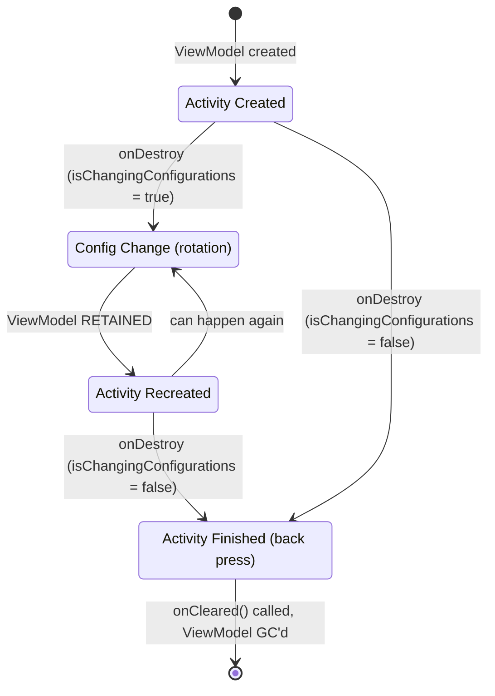

# ViewModel Internals

## Core Properties

- **Holds UI state** — the single source of truth for what the screen displays
- **Survives configuration changes** — screen rotation, locale change, dark mode toggle do NOT destroy it
- **Scoped to a lifecycle owner** — Activity, Fragment, or NavBackStackEntry. Shared between multiple Fragments in the same Activity if scoped to the Activity
- **No View references** — ViewModel must never hold a reference to Activity, Fragment, Context, or View (causes memory leaks)

---

## ViewModel Lifecycle



**Key rule**: ViewModel is destroyed only when the owning lifecycle is **finished for good** — not during configuration changes.

---

## How ViewModel is Created

```kotlin
// Modern Kotlin delegates
val viewModel: MyViewModel by viewModels()

// Explicit (legacy)
val viewModel = ViewModelProvider(this).get(MyViewModel::class.java)

// With custom factory
val viewModel: MyViewModel by viewModels { MyViewModel.Factory }
```

### Under the Hood

```
ViewModelProvider(owner, factory)
    │
    ├── owner.viewModelStore  ← get the HashMap of cached ViewModels
    │       │
    │       └── map.get(key)  ← key = "androidx.lifecycle.ViewModelProvider.DefaultKey:com.example.MyViewModel"
    │               │
    │               ├── found → return cached instance
    │               └── not found → factory.create(modelClass)
    │                                   │
    │                                   └── store in map, return new instance
```

---

## Internals — The Retention Chain

### ViewModelStoreOwner

Both `ComponentActivity` and `Fragment` implement `ViewModelStoreOwner`, which has a single method:

```kotlin
interface ViewModelStoreOwner {
    val viewModelStore: ViewModelStore
}
```

### ViewModelStore

A wrapper around a `HashMap`:

```kotlin
class ViewModelStore {
    private val map = HashMap<String, ViewModel>()

    fun put(key: String, viewModel: ViewModel) { map[key] = viewModel }
    fun get(key: String): ViewModel? = map[key]

    fun clear() {
        for (vm in map.values) { vm.clear() }  // calls onCleared() on each
        map.clear()
    }
}
```

### How ViewModelStore Survives Configuration Changes

The retention chain from bottom to top:

```
ActivityThread (singleton, lives for entire app process)
  └── mActivities: ArrayMap<IBinder, ActivityClientRecord>
        └── ActivityClientRecord
              └── lastNonConfigurationInstances: NonConfigurationInstances
                    └── activity: Activity.NonConfigurationInstances
                          └── viewModelStore: ViewModelStore
                              └── map: HashMap<String, ViewModel>
```

**What happens during a configuration change:**

1. `ActivityThread` calls `performDestroyActivity()` on the old Activity
2. Before destruction, `retainNonConfigurationInstances()` pulls out the `ViewModelStore` and saves it in the `ActivityClientRecord`
3. The old Activity is destroyed and GC'd (but `ActivityClientRecord` stays in `ActivityThread`)
4. `ActivityThread` creates a new Activity and attaches the same `ActivityClientRecord`
5. The new Activity calls `getLastNonConfigurationInstances()` to retrieve the saved `ViewModelStore`
6. `ViewModelProvider` finds the existing ViewModel in the store — no recreation

!!! info "Why this works"
    `ActivityThread` is a per-process singleton. Configuration changes destroy and recreate the Activity object, but `ActivityThread` keeps the `ActivityClientRecord` alive across the transition. The `ViewModelStore` piggybacks on this retention mechanism.

---

## onCleared()

Called when the `ViewModelStore` is cleared — which happens when the owning Activity finishes for real (not config change) or when the owning Fragment is permanently removed.

```kotlin
class HomeViewModel @Inject constructor(
    private val locationTracker: LocationTracker
) : ViewModel() {

    override fun onCleared() {
        super.onCleared()
        locationTracker.stop()  // cleanup resources
    }
}
```

**Triggers:**

- User presses back (Activity finishes)
- `activity.finish()` is called
- Fragment is removed from backstack permanently
- Navigation pops the NavBackStackEntry

**Does NOT trigger:**

- Configuration change (rotation, locale, dark mode)
- Process death (use SavedStateHandle for that)

---

## viewModelScope

Every ViewModel gets a `viewModelScope` extension property. It's a `CoroutineScope` that's automatically cancelled in `onCleared()`.

```kotlin
class HomeViewModel : ViewModel() {
    init {
        viewModelScope.launch {
            // This coroutine is cancelled when ViewModel is cleared
            repository.observeUsers().collect { users ->
                _state.update { it.copy(users = users) }
            }
        }
    }
}
```

### Internal Configuration

```kotlin
// From ViewModel.kt source
val ViewModel.viewModelScope: CoroutineScope
    get() = CloseableCoroutineScope(
        SupervisorJob() + Dispatchers.Main.immediate
    )
```

- **`SupervisorJob()`** — failure of one child coroutine doesn't cancel siblings
- **`Dispatchers.Main.immediate`** — dispatches to main thread, but if already on main thread, executes immediately (no re-dispatch)
- **Cancelled in `onCleared()`** — the `CloseableCoroutineScope` is registered as a `Closeable` in the ViewModel and closed during cleanup

!!! tip "Don't create your own scope"
    Use `viewModelScope` for all ViewModel coroutines. If you need a different dispatcher, switch with `withContext(Dispatchers.IO)` inside the launched coroutine. Creating a custom scope means you must manage cancellation yourself.

---

## ViewModel Creation with Factory

### Legacy Factory

One factory class per ViewModel — verbose.

```kotlin
class HomeViewModel(private val repository: UserRepository) : ViewModel() {
    class Factory(private val repository: UserRepository) : ViewModelProvider.Factory {
        override fun <T : ViewModel> create(modelClass: Class<T>): T {
            return HomeViewModel(repository) as T
        }
    }
}

// Usage
val viewModel: HomeViewModel by viewModels { HomeViewModel.Factory(repository) }
```

### CreationExtras (Modern Approach)

The `viewModelFactory` DSL eliminates the need for one factory class per ViewModel.

```kotlin
class HomeViewModel(
    private val repository: UserRepository,
    private val savedStateHandle: SavedStateHandle
) : ViewModel() {

    companion object {
        val Factory: ViewModelProvider.Factory = viewModelFactory {
            initializer {
                val app = this[APPLICATION_KEY] as MyApplication
                val handle = createSavedStateHandle()
                HomeViewModel(app.repository, handle)
            }
        }
    }
}

// Usage
val viewModel: HomeViewModel by viewModels { HomeViewModel.Factory }
```

Available `CreationExtras` keys:

| Key | Provides |
|-----|----------|
| `APPLICATION_KEY` | The Application instance |
| `VIEW_MODEL_STORE_OWNER_KEY` | The ViewModelStoreOwner |
| `SAVED_STATE_REGISTRY_OWNER_KEY` | The SavedStateRegistryOwner |
| `DEFAULT_ARGS_KEY` | Arguments bundle (for SavedStateHandle) |

!!! note "With Hilt — no factory needed"
    `@HiltViewModel` + `@Inject constructor` eliminates factories entirely. Hilt generates the factory and wires dependencies automatically.

---

## SavedStateHandle

ViewModel survives configuration changes but **not process death**. `SavedStateHandle` bridges that gap by persisting key-value data into the `Bundle` saved by `onSaveInstanceState()`.

```kotlin
@HiltViewModel
class SearchViewModel @Inject constructor(
    private val savedStateHandle: SavedStateHandle
) : ViewModel() {

    // Survives both config change AND process death
    val query = savedStateHandle.getStateFlow("query", "")

    fun setQuery(q: String) {
        savedStateHandle["query"] = q
    }
}
```

### What to Store Where

| Storage | Survives Config Change | Survives Process Death | Size Limit | Use For |
|---------|----------------------|----------------------|------------|---------|
| ViewModel fields | Yes | No | Unlimited | Fetched data, computed UI state, loading flags |
| SavedStateHandle | Yes | Yes | ~512KB total | User input, scroll position, selected tab, search query |
| Room / DataStore | Yes | Yes | Unlimited | Persistent app data, settings, cached API responses |

!!! warning "TransactionTooLargeException"
    The total Bundle size across all activities is limited to roughly **512KB** (1MB Binder transaction limit, shared with other data). Storing large lists, bitmaps, or serialized objects in `SavedStateHandle` or `onSaveInstanceState()` will crash with `TransactionTooLargeException`. Store only IDs and small values — fetch the actual data after restoration.

---

## ViewModel in Compose

### viewModel() — Scoped to the Nearest ViewModelStoreOwner

```kotlin
@Composable
fun HomeScreen(
    viewModel: HomeViewModel = viewModel()  // scoped to Activity or NavBackStackEntry
) {
    val state by viewModel.state.collectAsStateWithLifecycle()
}
```

### hiltViewModel() — With Hilt Injection

```kotlin
@Composable
fun HomeScreen(
    viewModel: HomeViewModel = hiltViewModel()  // Hilt creates with injected deps
) {
    val state by viewModel.state.collectAsStateWithLifecycle()
}
```

### Scoping Rules in Compose Navigation

The `ViewModelStoreOwner` determines the ViewModel's scope:

```kotlin
NavHost(navController, startDestination = "home") {
    composable("home") {
        // viewModel() here is scoped to this NavBackStackEntry
        // It's destroyed when "home" is popped from backstack
        HomeScreen()
    }

    navigation(startDestination = "list", route = "feature") {
        composable("list") {
            // Scoped to "feature" nav graph — shared across "list" and "detail"
            val sharedViewModel: FeatureViewModel = hiltViewModel(
                viewModelStoreOwner = it.findNavGraphViewModelStoreOwner("feature")
            )
            ListScreen(sharedViewModel)
        }
        composable("detail/{id}") {
            val sharedViewModel: FeatureViewModel = hiltViewModel(
                viewModelStoreOwner = it.findNavGraphViewModelStoreOwner("feature")
            )
            DetailScreen(sharedViewModel)
        }
    }
}
```

!!! tip "Sharing ViewModel between destinations"
    Scope the ViewModel to a **nested navigation graph** (not the root). All destinations within that graph share the same ViewModel instance. The ViewModel is cleared when the entire nested graph is popped.

### ViewModel Scoped to Activity (from Compose)

```kotlin
@Composable
fun AnyScreen() {
    // Activity-scoped ViewModel — survives navigation but lives until Activity finishes
    val activityViewModel: SharedViewModel = hiltViewModel(
        viewModelStoreOwner = LocalContext.current as ComponentActivity
    )
}
```

Use sparingly. Activity-scoped ViewModels stay in memory for the entire Activity lifetime.

---

## Interview Q&A

??? question "How does ViewModel survive configuration changes?"
    The `ViewModelStore` (a HashMap of ViewModels) is saved in the `ActivityClientRecord` inside `ActivityThread` before the Activity is destroyed. When the new Activity is created after rotation, it retrieves the same `ViewModelStore` from the `ActivityClientRecord`. The ViewModel is only destroyed when the Activity finishes for good (back press, `finish()`), which triggers `onCleared()`.

??? question "What is the difference between SavedStateHandle and ViewModel fields?"
    ViewModel fields survive configuration changes but are lost on process death. SavedStateHandle persists data into the saved instance state Bundle, surviving both configuration changes and process death. Use ViewModel fields for fetched data and computed state; use SavedStateHandle for user input, scroll position, and selected tabs (small values only — the Bundle has a ~512KB limit).

??? question "What is viewModelScope and why should you use it?"
    `viewModelScope` is a CoroutineScope built into every ViewModel, configured with `SupervisorJob() + Dispatchers.Main.immediate`. It is automatically cancelled when `onCleared()` is called. You should use it instead of creating custom scopes because it handles cancellation automatically and prevents coroutine leaks tied to the ViewModel's lifecycle.

??? question "How do you share a ViewModel between Fragments or Compose destinations?"
    In Fragments, scope the ViewModel to the host Activity using `by activityViewModels()`. In Compose Navigation, scope it to a nested navigation graph by passing the graph's `ViewModelStoreOwner` to `hiltViewModel()`. The ViewModel lives as long as the shared scope (Activity or nested nav graph) is alive.

??? question "When is onCleared() called and when is it NOT called?"
    `onCleared()` is called when the owning lifecycle finishes permanently — user presses back, `finish()` is called, Fragment is removed from backstack, or NavBackStackEntry is popped. It is NOT called during configuration changes (rotation, locale, dark mode) or process death. For process death cleanup, use SavedStateHandle to restore state instead.

!!! tip "Further Reading"
    - [ViewModel overview](https://developer.android.com/topic/libraries/architecture/viewmodel) — Official ViewModel guide
    - [Saved State module for ViewModel](https://developer.android.com/topic/libraries/architecture/viewmodel/viewmodel-savedstate) — SavedStateHandle documentation
    - [State and Jetpack Compose](https://developer.android.com/develop/ui/compose/state) — State management in Compose with ViewModel
    - [Architecture: The ViewModel](https://medium.com/androiddevelopers/viewmodels-a-simple-example-ed5ac416317e) — Android Developers blog deep dive
