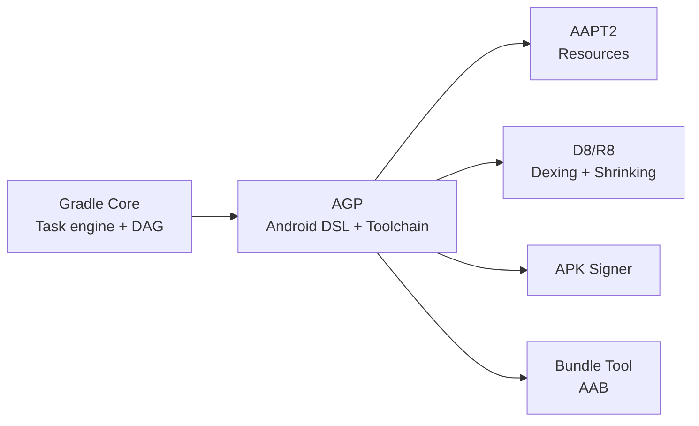
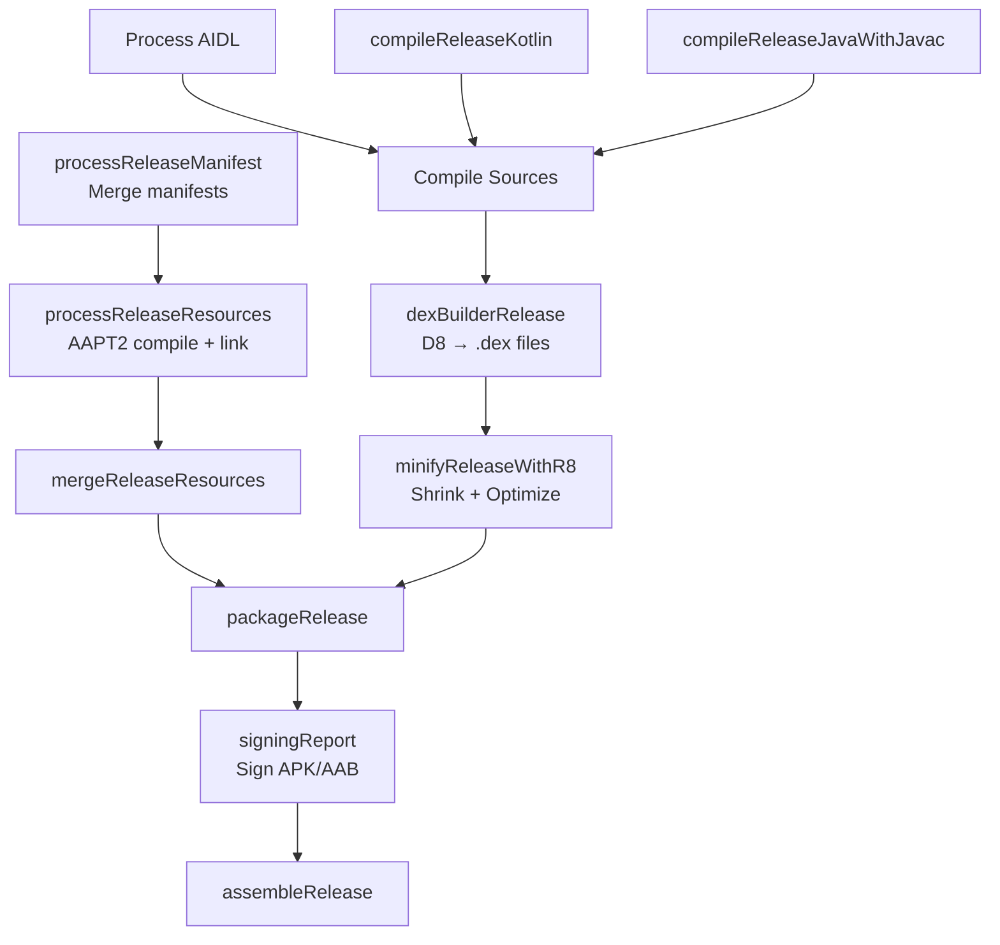

# Android Gradle Plugin (AGP)

The Android Gradle Plugin is the bridge between Gradle and the Android build toolchain. It provides the `android {}` DSL block, manages compilation, resource processing, dexing, shrinking, and APK/AAB packaging. AGP versions are tightly coupled with Android Studio, Gradle, and JDK versions — keeping them aligned is critical for build stability.

---

## AGP vs Gradle

| Aspect | Gradle | Android Gradle Plugin (AGP) |
|--------|--------|-----------------------------|
| **What it is** | General-purpose build automation tool | Android-specific Gradle plugin |
| **Provides** | Task engine, dependency resolution, caching | `android {}` DSL, resource merging, dexing, APK signing |
| **Versioning** | Independent (e.g., 8.10) | Tied to Android Studio (e.g., 8.7.3) |
| **Artifact** | `gradle-wrapper.jar` + distribution | `com.android.tools.build:gradle` |



---

## Version Compatibility Matrix

AGP, Gradle, JDK, and Android Studio versions must be compatible. Mismatches cause cryptic build failures.

| AGP Version | Minimum Gradle | Minimum JDK | Android Studio |
|-------------|---------------|-------------|----------------|
| **8.7.x** | 8.9 | 17 | Ladybug Feature Drop |
| **8.6.x** | 8.7 | 17 | Ladybug |
| **8.5.x** | 8.7 | 17 | Koala Feature Drop |
| **8.4.x** | 8.6 | 17 | Koala |
| **8.3.x** | 8.4 | 17 | Jellyfish |
| **8.2.x** | 8.2 | 17 | Iguana |
| **8.1.x** | 8.0 | 17 | Hedgehog |
| **8.0.x** | 8.0 | 17 | Flamingo |
| **7.4.x** | 7.5 | 11 | Flamingo |

!!! warning "Always check the official compatibility table"
    Google updates this matrix with each AGP release. Before upgrading, check the [AGP release notes](https://developer.android.com/build/releases/gradle-plugin) for the exact minimum Gradle and JDK versions.

---

## Applying AGP

AGP is applied via the `plugins {}` block. Modern projects use a version catalog for centralized version management.

=== "Version Catalog (Recommended)"

    ```toml
    # gradle/libs.versions.toml
    [versions]
    agp = "8.7.3"

    [plugins]
    android-application = { id = "com.android.application", version.ref = "agp" }
    android-library = { id = "com.android.library", version.ref = "agp" }
    ```

    ```kotlin
    // Root build.gradle.kts
    plugins {
        alias(libs.plugins.android.application) apply false
        alias(libs.plugins.android.library) apply false
    }

    // App module build.gradle.kts
    plugins {
        alias(libs.plugins.android.application)
    }
    ```

=== "Direct Declaration"

    ```kotlin
    // Root build.gradle.kts
    plugins {
        id("com.android.application") version "8.7.3" apply false
        id("com.android.library") version "8.7.3" apply false
    }

    // App module build.gradle.kts
    plugins {
        id("com.android.application")
    }
    ```

### Plugin Types

| Plugin ID | Purpose |
|-----------|---------|
| `com.android.application` | Produces an APK/AAB — used for the main app module |
| `com.android.library` | Produces an AAR — used for reusable library modules |
| `com.android.test` | Standalone test module for instrumentation tests |
| `com.android.dynamic-feature` | On-demand feature modules (Play Feature Delivery) |

---

## The `android {}` DSL Block

AGP's primary contribution — a structured DSL for Android-specific build configuration.

```kotlin
android {
    namespace = "com.example.myapp"
    compileSdk = 35

    defaultConfig {
        applicationId = "com.example.myapp"
        minSdk = 26
        targetSdk = 35
        versionCode = 1
        versionName = "1.0.0"
        testInstrumentationRunner = "androidx.test.runner.AndroidJUnitRunner"
    }

    buildFeatures {
        compose = true
        buildConfig = true
        viewBinding = true
    }

    compileOptions {
        sourceCompatibility = JavaVersion.VERSION_17
        targetCompatibility = JavaVersion.VERSION_17
    }

    kotlinOptions {
        jvmTarget = "17"
    }
}
```

### Key DSL Properties

| Property | Scope | Purpose |
|----------|-------|---------|
| `namespace` | Module | Package for generated R and BuildConfig classes (replaced `package` in manifest since AGP 7.3) |
| `compileSdk` | Module | API level used for compilation — access to newer APIs |
| `minSdk` | defaultConfig | Minimum Android version supported |
| `targetSdk` | defaultConfig | API level the app is designed and tested against |
| `applicationId` | defaultConfig | Unique app identifier on the Play Store |
| `buildFeatures` | Module | Toggle Compose, ViewBinding, BuildConfig generation, etc. |

!!! tip "namespace vs applicationId"
    `namespace` controls the R class package and code generation. `applicationId` uniquely identifies the app on the device/Play Store. They can differ — this is how product flavors produce different app IDs from the same codebase.

---

## AGP Build Pipeline

AGP registers a complex task graph during configuration. Here's the high-level pipeline for an `assembleRelease` build:



### Key AGP Tasks

| Task | What It Does |
|------|-------------|
| `compileReleaseKotlin` | Compiles Kotlin source to JVM bytecode |
| `processReleaseResources` | AAPT2 processes XML resources into flat binary format |
| `mergeReleaseResources` | Merges resources from all source sets and dependencies |
| `dexBuilderRelease` | D8 converts Java bytecode to Dalvik bytecode (.dex) |
| `minifyReleaseWithR8` | R8 shrinks, optimizes, and obfuscates code |
| `packageRelease` | Assembles APK/AAB from dex files, resources, and native libs |
| `bundleRelease` | Produces an AAB (Android App Bundle) for Play Store |

---

## AGP Variant API

The Variant API lets you programmatically customize the build per-variant. It replaced the older `applicationVariants.all {}` API.

```kotlin
androidComponents {
    onVariants(selector().withBuildType("release")) { variant ->
        variant.outputs.forEach { output ->
            output.versionCode.set(calculateVersionCode())
        }
    }

    beforeVariants(selector().all()) { variant ->
        // Disable unnecessary variants
        if (variant.name.contains("staging") && variant.buildType == "release") {
            variant.enable = false
        }
    }
}
```

| Hook | Timing | Use Case |
|------|--------|----------|
| `beforeVariants` | Before variant objects are finalized | Disable variants, modify flavor combinations |
| `onVariants` | After variants are created | Modify outputs, version codes, add custom tasks |
| `finalizeDsl` | After DSL is evaluated, before variant creation | Last chance to modify DSL values programmatically |

---

## Upgrading AGP

### Upgrade Assistant

Android Studio includes an **AGP Upgrade Assistant** that automates most migration steps:

**Android Studio → Tools → AGP Upgrade Assistant**

It handles:

- Updating the AGP version in build scripts
- Migrating deprecated DSL properties
- Updating `gradle-wrapper.properties` for Gradle compatibility
- Flagging breaking changes that need manual fixes

### Manual Upgrade Steps

1. Check the [compatibility matrix](#version-compatibility-matrix) for the target AGP version
2. Upgrade Gradle first if needed:
   ```bash
   ./gradlew wrapper --gradle-version 8.10
   ```
3. Update AGP version in the version catalog:
   ```toml
   [versions]
   agp = "8.7.3"
   ```
4. Sync and fix deprecation warnings
5. Run a full build and test suite

### Common Breaking Changes by Major Version

| Version | Notable Change |
|---------|---------------|
| **8.0** | Minimum JDK 17, Kotlin DSL default, BuildConfig generation off by default, `namespace` required in build files |
| **8.1** | Configuration cache stable, baseline profiles built-in |
| **8.2** | Kotlin Multiplatform support improvements |
| **8.4** | Dependency locking improvements, new Lint APIs |
| **8.7** | Declarative Gradle (experimental), improved R8 shrinking |

!!! warning "Deprecation cycle"
    AGP follows a deprecation cycle: deprecated in version N, removed in version N+2. Fix deprecation warnings immediately — they become build failures two versions later.

---

## Convention Plugins with AGP

For multi-module projects, convention plugins centralize shared AGP configuration. This avoids duplicating `android {}` blocks across modules.

```kotlin
// build-logic/convention/src/main/kotlin/AndroidLibraryConventionPlugin.kt
class AndroidLibraryConventionPlugin : Plugin<Project> {
    override fun apply(target: Project) {
        with(target) {
            pluginManager.apply("com.android.library")
            pluginManager.apply("org.jetbrains.kotlin.android")

            extensions.configure<LibraryExtension> {
                compileSdk = 35
                defaultConfig.minSdk = 26

                compileOptions {
                    sourceCompatibility = JavaVersion.VERSION_17
                    targetCompatibility = JavaVersion.VERSION_17
                }
            }

            extensions.configure<KotlinAndroidProjectExtension> {
                compilerOptions {
                    jvmTarget.set(JvmTarget.JVM_17)
                }
            }
        }
    }
}
```

```kotlin
// feature/home/build.gradle.kts
plugins {
    id("myapp.android.library")  // convention plugin
    alias(libs.plugins.hilt)
}

android {
    namespace = "com.example.feature.home"
}
```

!!! tip "Related"
    For a complete guide on convention plugins and build-logic modules, see [Modularization](../architecture-patterns/modularization.md).

---

## AGP & R8/ProGuard

AGP integrates R8 (the default shrinker since AGP 3.4) for code shrinking, optimization, and obfuscation in release builds.

| Feature | R8 (Default) | ProGuard (Legacy) |
|---------|-------------|-------------------|
| **Shrinking** | Removes unused code | Removes unused code |
| **Optimization** | Inlines methods, removes dead branches | Similar optimizations |
| **Obfuscation** | Renames classes/methods | Renames classes/methods |
| **Desugaring** | Built-in Java 8+ desugaring | Separate step |
| **Performance** | Single pass (compile → dex → shrink) | Multi-pass |

```kotlin
android {
    buildTypes {
        release {
            isMinifyEnabled = true       // enable R8 code shrinking
            isShrinkResources = true     // remove unused resources
            proguardFiles(
                getDefaultProguardFile("proguard-android-optimize.txt"),
                "proguard-rules.pro"
            )
        }
    }
}
```

---

??? question "Interview Questions"

    **Q: What is AGP and how does it relate to Gradle?**

    AGP is an Android-specific Gradle plugin that provides the `android {}` DSL, manages the Android build toolchain (AAPT2, D8/R8, APK signing), and integrates with Android Studio. Gradle provides the underlying task engine and dependency resolution; AGP adds Android-specific build logic on top.

    **Q: What's the difference between `compileSdk`, `minSdk`, and `targetSdk`?**

    `compileSdk` determines which Android APIs are available at compile time. `minSdk` is the minimum Android version the app supports (lower versions can't install it). `targetSdk` indicates the API level the app has been tested against — Android uses it to apply backward-compatible behaviors.

    **Q: What's the difference between `namespace` and `applicationId`?**

    `namespace` sets the package for generated R class and BuildConfig. `applicationId` uniquely identifies the app on the device and Play Store. They can differ, which is how product flavors produce distinct app IDs while sharing the same generated code package.

    **Q: How does the AGP Variant API work?**

    The Variant API provides `beforeVariants` (disable/filter variants), `onVariants` (customize outputs, version codes), and `finalizeDsl` (last-chance DSL modification) hooks. It replaces the older `applicationVariants.all {}` pattern and integrates with Gradle's lazy configuration model.

    **Q: What is R8 and how does AGP use it?**

    R8 is the default code shrinker/optimizer/obfuscator since AGP 3.4. It replaces ProGuard and D8 as a single-pass tool: it compiles Java bytecode to dex while simultaneously shrinking, optimizing, and obfuscating. Enabled via `isMinifyEnabled = true` in the release build type.

    **Q: What should you check before upgrading AGP?**

    Check the compatibility matrix for minimum Gradle and JDK versions. Use Android Studio's AGP Upgrade Assistant for automated migration. Fix all deprecation warnings first — AGP removes deprecated APIs two major versions after deprecation. Always run a full build and test suite after upgrading.
