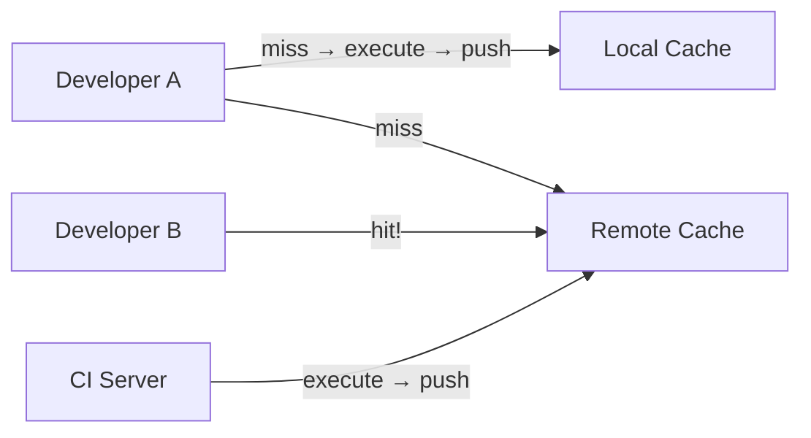

# Build Performance

A slow build loop kills productivity. This page covers everything Gradle offers to make builds faster — caching, parallelism, configuration avoidance, and profiling.

---

## Performance Levers Overview

| Technique | Saves | Scope |
|-----------|-------|-------|
| **Incremental compilation** | Re-compiles only changed files | Single module |
| **Up-to-date checks** | Skips tasks whose inputs/outputs haven't changed | Single task |
| **Build cache** | Restores task outputs from cache (local or remote) | Across builds/machines |
| **Configuration cache** | Skips re-evaluation of build scripts | Configuration phase |
| **Parallel execution** | Runs independent tasks/modules concurrently | Multi-module projects |
| **Configuration avoidance** | Delays task creation until needed | Configuration phase |

---

## Build Cache

Stores task outputs keyed by a hash of the task's inputs. If the same inputs appear again (even on a different machine), the output is fetched from cache instead of re-executing.

```properties
# gradle.properties
org.gradle.caching=true
```

### Local Cache

Enabled by default when caching is on. Stored in `~/.gradle/caches/build-cache-1/`.

### Remote Cache

Shared across the team via a remote cache server (Gradle Enterprise, or custom HTTP backend):

```kotlin
// settings.gradle.kts
buildCache {
    local {
        isEnabled = true
    }
    remote<HttpBuildCache> {
        url = uri("https://cache.example.com/cache/")
        isPush = System.getenv("CI") != null  // only CI pushes to remote cache
        credentials {
            username = System.getenv("CACHE_USER") ?: ""
            password = System.getenv("CACHE_PASS") ?: ""
        }
    }
}
```



!!! tip "Cache hit rate"
    Run `./gradlew assembleDebug --scan` and check the build scan for cache hit rate. A healthy project should see 60-80%+ cache hits on CI for incremental builds.

---

## Configuration Cache

Caches the result of the **Configuration phase** — the task graph itself. Subsequent builds skip evaluating `build.gradle.kts` files entirely.

```properties
# gradle.properties
org.gradle.configuration-cache=true
```

| Without Config Cache | With Config Cache |
|---------------------|-------------------|
| Every build evaluates all `build.gradle.kts` files | First build evaluates and caches the task graph |
| Configuration scales with module count | Subsequent builds load cached graph in milliseconds |
| 50-module project: 3-8s config phase | 50-module project: <500ms config phase |

!!! warning "Compatibility requirements"
    Not all plugins support the configuration cache. Common issues:
    
    - Accessing `Project` at execution time (must use `providers` instead)
    - Using `Task.project` inside task actions
    - Non-serializable objects stored in task state
    
    Run `./gradlew --configuration-cache-problems=warn` to identify violations without failing the build.

---

## Parallel Execution

Runs tasks from different modules concurrently. Independent modules compile in parallel across available CPU cores.

```properties
# gradle.properties
org.gradle.parallel=true

# Number of parallel workers (defaults to CPU count)
org.gradle.workers.max=8
```



```mermaid
gantt
    title Parallel Build Execution
    dateFormat X
    axisFormat %s

    section :core:domain
    compileKotlin    :0, 3
    
    section :core:network
    compileKotlin    :0, 4
    
    section :core:ui
    compileKotlin    :0, 5
    
    section :feature:home
    compileKotlin    :5, 8
    
    section :feature:profile
    compileKotlin    :5, 7
    
    section :app
    compileKotlin    :8, 10
```

Modules with no dependency relationship compile simultaneously. The more parallel paths in your module graph, the faster the build.

---

## Configuration Avoidance API

Avoid creating and configuring tasks that won't execute. Uses lazy `Provider` and `TaskProvider` instead of eagerly resolved values.

```kotlin
// BAD — eagerly creates and configures task (runs during configuration)
tasks.create("generateDocs") {
    // configured immediately, even if task never runs
}

// GOOD — lazy registration (configured only when task is needed)
tasks.register("generateDocs") {
    // configured only if this task is part of the execution graph
}
```

```kotlin
// BAD — eagerly resolves value during configuration
val output = tasks.getByName("compile").outputs.files

// GOOD — lazy provider, resolved only during execution
val output = tasks.named("compile").flatMap { it.outputs.files }
```

---

## Gradle Daemon

A long-lived background process that avoids JVM startup and class loading on every build.

```properties
# gradle.properties
# Keep daemon alive for 3 hours (default is 3h, but can be tuned)
org.gradle.daemon.idletimeout=10800000

# JVM heap for the daemon
org.gradle.jvmargs=-Xmx4g -XX:+HeapDumpOnOutOfMemoryError \
    -Dfile.encoding=UTF-8
```

```bash
# Check daemon status
./gradlew --status

# Stop all daemons
./gradlew --stop
```

!!! warning "Daemon memory"
    If your build OOMs or gets slow over time, the daemon may need more heap. Increase `-Xmx` in `org.gradle.jvmargs`. Signs of memory pressure: `GC overhead limit exceeded`, increasingly slow builds without code changes.

---

## Profiling Builds

### Build Scans

The most powerful profiling tool. Generates a detailed web report of your build.

```bash
./gradlew assembleDebug --scan
```

A build scan shows:
- Total build time breakdown (configuration, task execution, overhead)
- Per-task execution time, cache hit/miss, up-to-date status
- Dependency resolution time
- Critical path (the longest chain of sequential tasks)

### Profile Report

Local HTML report without uploading data:

```bash
./gradlew assembleDebug --profile
# Output: build/reports/profile/profile-<timestamp>.html
```

### Measuring Configuration Time

```bash
# Just run configuration (no tasks)
./gradlew help

# With timing
./gradlew help --scan
```

---

## Common Optimizations

### Non-Transitive R Classes

By default, each module's R class includes all resources from its transitive dependencies — creating massive R files that slow compilation.

```properties
# gradle.properties
android.nonTransitiveRClass=true
```

With non-transitive R classes, each module's R class only contains its own resources. Access parent resources via their owning module's R class.

### Avoid Dynamic Versions

```kotlin
// BAD — forces Gradle to check for new versions every build (24h cache default)
implementation("com.squareup.retrofit2:retrofit:2.+")
implementation("com.squareup.retrofit2:retrofit:latest.release")

// GOOD — deterministic, cacheable
implementation("com.squareup.retrofit2:retrofit:2.11.0")
// Or use version catalog
implementation(libs.retrofit)
```

### Optimize Annotation Processing

```kotlin
// Use KSP instead of KAPT where possible (2-3x faster)
ksp(libs.room.compiler)
ksp(libs.hilt.compiler)

// If stuck with KAPT, enable incremental processing
kapt {
    correctErrorTypes = true
    useBuildCache = true
}
```

### Module Granularity vs Configuration Overhead

| Approach | Build Speed | Configuration Time |
|----------|------------|-------------------|
| Few large modules | Slow incremental (recompiles too much) | Fast config |
| Many small modules | Fast incremental (minimal recompilation) | Slower config (more scripts to evaluate) |
| **Sweet spot** | Modules aligned to feature/layer boundaries | Use configuration cache to mitigate |

### File System Watching

Gradle watches the file system for changes between builds, avoiding full input scanning:

```properties
# Enabled by default since Gradle 7.0
org.gradle.vfs.watch=true
```

---

## Optimization Checklist

```properties
# gradle.properties — recommended production settings
org.gradle.parallel=true
org.gradle.caching=true
org.gradle.configuration-cache=true
org.gradle.vfs.watch=true
org.gradle.jvmargs=-Xmx4g -XX:+HeapDumpOnOutOfMemoryError

android.nonTransitiveRClass=true

kotlin.incremental=true
ksp.useKSP2=true
```

| If build is slow because of... | Fix |
|-------------------------------|-----|
| Full recompilation on small changes | Modularize — break into smaller modules |
| Long configuration phase | Enable configuration cache, use `tasks.register` (lazy) |
| Cache misses | Audit non-deterministic inputs (timestamps, absolute paths) |
| Annotation processing | Migrate KAPT → KSP |
| Large R classes | Enable `nonTransitiveRClass` |
| Dependency resolution | Pin versions, avoid dynamic versions |
| CI builds from scratch | Set up remote build cache |

---

??? question "Interview Questions"

    **Q: How does the Gradle build cache work?**

    The build cache stores task outputs keyed by a hash of the task's inputs (source files, configuration, dependencies). On subsequent builds, if the input hash matches a cached entry, the output is restored instead of re-executing. Works locally (disk) and remotely (shared server for teams).

    **Q: What's the difference between UP-TO-DATE and FROM-CACHE?**

    UP-TO-DATE means local file system comparison shows inputs/outputs unchanged since the last execution. FROM-CACHE means the output was fetched from the build cache using an input hash — the task may never have run in this workspace. UP-TO-DATE is faster (no hash computation or cache lookup).

    **Q: How does parallel execution help?**

    Gradle runs tasks from independent modules concurrently on different CPU cores. The more parallel paths in your dependency graph (modules that don't depend on each other), the more parallelism Gradle can exploit. Critical path length determines minimum build time.

    **Q: What is configuration avoidance?**

    Using `tasks.register` instead of `tasks.create` to lazily create tasks. Eagerly created tasks are configured on every build even if they never execute. Lazy registration defers creation and configuration until the task is actually needed in the execution graph.

    **Q: What are non-transitive R classes?**

    By default, a module's R class aggregates resource IDs from all its transitive dependencies, creating large generated files. Non-transitive R classes restrict each module's R class to only its own resources, reducing compilation work and improving build speed.

    **Q: How do you diagnose a slow build?**

    Run `./gradlew assembleDebug --scan` for a build scan — it shows per-task timing, cache hit rates, critical path, and configuration time. Locally, `--profile` generates an HTML report. Focus on the critical path (longest sequential chain) since that's the theoretical minimum build time.

!!! tip "Further Reading"
    - [Gradle Performance Guide](https://docs.gradle.org/current/userguide/performance.html)
    - [Android Build Performance](https://developer.android.com/build/optimize-your-build)
    - [Gradle Build Scans](https://scans.gradle.com/)
