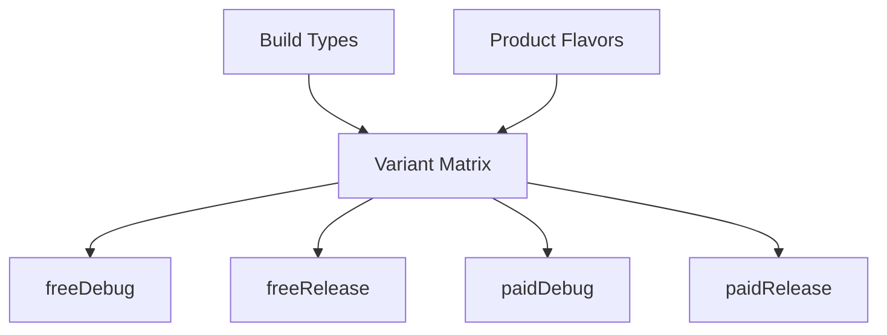

# Build Variants

Build variants let you produce different versions of your app from a single codebase — debug vs release, free vs paid, staging vs production. Gradle combines build types and product flavors into a variant matrix.

---

## Variant = Build Type x Product Flavor



| Component | Purpose | Examples |
|-----------|---------|----------|
| **Build Type** | How the app is built (debug info, optimization, signing) | `debug`, `release`, `benchmark` |
| **Product Flavor** | What the app contains (features, branding, endpoints) | `free`/`paid`, `staging`/`production` |
| **Build Variant** | The combination that produces an actual APK/AAB | `freeDebug`, `paidRelease` |

---

## Build Types

```kotlin
android {
    buildTypes {
        debug {
            isDebuggable = true
            isMinifyEnabled = false
            applicationIdSuffix = ".debug"
            versionNameSuffix = "-debug"
        }

        release {
            isDebuggable = false
            isMinifyEnabled = true
            isShrinkResources = true
            proguardFiles(
                getDefaultProguardFile("proguard-android-optimize.txt"),
                "proguard-rules.pro"
            )
            signingConfig = signingConfigs.getByName("release")
        }

        create("benchmark") {
            initWith(buildTypes.getByName("release"))
            signingConfig = signingConfigs.getByName("debug")
            matchingFallbacks += listOf("release")
            isDebuggable = false
            // Proguard enabled but with benchmark-specific rules
            proguardFiles("benchmark-rules.pro")
        }
    }
}
```

| Property | debug | release |
|----------|-------|---------|
| `isDebuggable` | `true` | `false` |
| `isMinifyEnabled` | `false` | `true` |
| `isShrinkResources` | `false` | `true` |
| Signing | Auto-generated debug keystore | Requires explicit signing config |
| ProGuard/R8 | Disabled | Enabled |

---

## Product Flavors

Flavors are grouped by **flavor dimensions**. Each dimension represents an axis of variation.

```kotlin
android {
    flavorDimensions += listOf("tier", "environment")

    productFlavors {
        // Tier dimension
        create("free") {
            dimension = "tier"
            applicationIdSuffix = ".free"
            buildConfigField("boolean", "IS_PREMIUM", "false")
            buildConfigField("int", "MAX_DOWNLOADS", "5")
        }
        create("paid") {
            dimension = "tier"
            applicationIdSuffix = ".paid"
            buildConfigField("boolean", "IS_PREMIUM", "true")
            buildConfigField("int", "MAX_DOWNLOADS", "Integer.MAX_VALUE")
        }

        // Environment dimension
        create("staging") {
            dimension = "environment"
            buildConfigField("String", "BASE_URL", "\"https://staging.api.example.com\"")
        }
        create("production") {
            dimension = "environment"
            buildConfigField("String", "BASE_URL", "\"https://api.example.com\"")
        }
    }
}
```

This produces **8 variants**: `freeStagingDebug`, `freeStagingRelease`, `freeProductionDebug`, `freeProductionRelease`, `paidStagingDebug`, `paidStagingRelease`, `paidProductionDebug`, `paidProductionRelease`.

### Variant Filter

Remove variants you don't need to reduce configuration time:

```kotlin
androidComponents {
    beforeVariants(selector().all()) { variant ->
        // Don't need staging + paid combination
        if (variant.productFlavors.containsAll(
                listOf("tier" to "paid", "environment" to "staging")
            )) {
            variant.enable = false
        }
    }
}
```

---

## Source Sets

Each variant can have its own source set for variant-specific code and resources.

```
app/src/
├── main/              ← shared across all variants
│   ├── kotlin/
│   ├── res/
│   └── AndroidManifest.xml
├── debug/             ← debug build type only
│   ├── kotlin/
│   └── res/
├── release/           ← release build type only
├── free/              ← free flavor only
│   ├── kotlin/
│   └── res/
├── paid/              ← paid flavor only
├── freeDebug/         ← specific variant combination
└── paidRelease/       ← specific variant combination
```

**Source set merge priority** (higher overrides lower):

1. Build variant (`freeDebug`)
2. Build type (`debug`)
3. Product flavor (`free`)
4. Main (`main`)

!!! warning "Manifest merging"
    Each source set can have its own `AndroidManifest.xml`. They merge bottom-up with priority rules. Use `tools:replace` or `tools:remove` to handle conflicts explicitly.

---

## Signing Configs

```kotlin
android {
    signingConfigs {
        create("release") {
            storeFile = file(System.getenv("KEYSTORE_PATH") ?: "release.keystore")
            storePassword = System.getenv("KEYSTORE_PASSWORD") ?: ""
            keyAlias = System.getenv("KEY_ALIAS") ?: ""
            keyPassword = System.getenv("KEY_PASSWORD") ?: ""
        }
    }

    buildTypes {
        release {
            signingConfig = signingConfigs.getByName("release")
        }
    }
}
```

!!! warning "Never commit keystore credentials"
    Store passwords in environment variables or a local `keystore.properties` file excluded from version control. CI/CD systems should inject these as secrets.

```kotlin
// Alternative: load from local properties file
val keystoreProperties = Properties().apply {
    val file = rootProject.file("keystore.properties")
    if (file.exists()) load(file.inputStream())
}

signingConfigs {
    create("release") {
        storeFile = file(keystoreProperties["storeFile"] as String)
        storePassword = keystoreProperties["storePassword"] as String
        keyAlias = keystoreProperties["keyAlias"] as String
        keyPassword = keystoreProperties["keyPassword"] as String
    }
}
```

---

## BuildConfig Fields

Inject compile-time constants that differ per variant:

```kotlin
android {
    defaultConfig {
        buildConfigField("String", "API_VERSION", "\"v2\"")
        buildConfigField("long", "BUILD_TIMESTAMP", "${System.currentTimeMillis()}L")
    }

    buildTypes {
        debug {
            buildConfigField("boolean", "ENABLE_LOGGING", "true")
        }
        release {
            buildConfigField("boolean", "ENABLE_LOGGING", "false")
        }
    }
}
```

```kotlin
// Usage in code
if (BuildConfig.ENABLE_LOGGING) {
    Timber.plant(Timber.DebugTree())
}
val baseUrl = BuildConfig.BASE_URL
```

!!! tip "BuildConfig generation"
    Since AGP 8.0, BuildConfig generation is disabled by default. Enable it explicitly:
    ```kotlin
    android {
        buildFeatures {
            buildConfig = true
        }
    }
    ```

---

## Variant-Aware Dependencies

Target dependencies to specific variants:

```kotlin
dependencies {
    // All variants
    implementation(libs.retrofit)

    // Build type specific
    debugImplementation(libs.leakcanary)
    releaseImplementation(libs.firebase.crashlytics)

    // Flavor specific
    "freeImplementation"(libs.ads.sdk)
    "paidImplementation"(libs.premium.features)

    // Variant specific
    "freeDebugImplementation"(libs.debug.ads.mock)
}
```

---

## Resource Overlays

Flavors can override resources from `main`:

```
app/src/main/res/values/strings.xml     → app_name = "MyApp"
app/src/free/res/values/strings.xml     → app_name = "MyApp Free"
app/src/paid/res/values/strings.xml     → app_name = "MyApp Pro"
```

Resources in flavor source sets **override** matching resources in `main`. This works for strings, drawables, layouts — any resource type.

---

??? question "Interview Questions"

    **Q: What's the difference between a build type and a product flavor?**

    Build types define **how** the app is built (debug symbols, optimization, signing). Product flavors define **what** the app contains (features, branding, API endpoints). Variants are the cross-product of both.

    **Q: How does source set priority work?**

    Variant-specific (`freeDebug`) > Build type (`debug`) > Flavor (`free`) > Main (`main`). Code is additive (combined), resources are override-based (higher priority wins for same resource name).

    **Q: How do you handle different API endpoints for staging vs production?**

    Use product flavors with a `buildConfigField` for the base URL, or use source sets with different config files. BuildConfig fields are type-safe and available at compile time. Alternatively, use a `resValue` to inject it as an Android resource.

    **Q: What's `matchingFallbacks` for?**

    When a library module doesn't have a matching build type (e.g., your app has `benchmark` but the library only has `debug` and `release`), `matchingFallbacks` tells Gradle which build type to use from the library instead.

    **Q: How do you reduce configuration overhead with many flavors?**

    Use `androidComponents.beforeVariants` to disable variant combinations you don't need. Each disabled variant skips configuration of its entire task graph.
