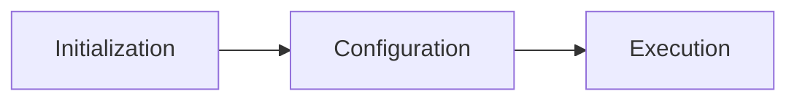
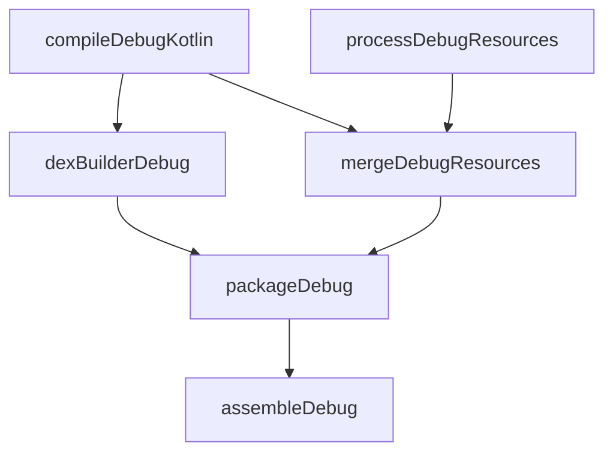

# Gradle Fundamentals

How Gradle actually works under the hood — the build lifecycle, project model, script syntax, and wrapper mechanism.

---

## Build Lifecycle

Every Gradle build goes through three distinct phases:



| Phase | What Happens | Performance Impact |
|-------|-------------|-------------------|
| **Initialization** | Evaluates `settings.gradle.kts`, determines which projects participate in the build | Scales with number of modules |
| **Configuration** | Evaluates all `build.gradle.kts` files, builds the task DAG (Directed Acyclic Graph) | Runs for ALL modules even if you're building one. Expensive code here slows every build |
| **Execution** | Runs only the tasks in the computed dependency chain | Only tasks that are out-of-date actually execute (up-to-date checking) |

!!! warning "Configuration phase trap"
    Code in the `build.gradle.kts` body runs during **configuration** — on every single build invocation, even `./gradlew help`. Never put expensive operations (network calls, file I/O, shell commands) directly in the build script body. Use `provider {}` or task actions instead.

```kotlin
// BAD — runs during configuration phase (every build)
val gitHash = "git rev-parse --short HEAD".execute()

// GOOD — runs only during execution, only when this task runs
val gitHash = providers.exec {
    commandLine("git", "rev-parse", "--short", "HEAD")
}.standardOutput.asText.map { it.trim() }
```

---

## Project Structure

```
my-app/
├── settings.gradle.kts          ← project-level: module list, repos, version catalogs
├── build.gradle.kts             ← root build: plugin declarations, subproject config
├── gradle.properties            ← JVM args, feature flags
├── gradle/
│   ├── wrapper/
│   │   ├── gradle-wrapper.jar
│   │   └── gradle-wrapper.properties  ← pins Gradle version
│   └── libs.versions.toml       ← version catalog
├── app/
│   ├── build.gradle.kts         ← application module config
│   └── src/
│       ├── main/
│       ├── debug/
│       └── release/
└── feature/
    └── home/
        ├── build.gradle.kts     ← library module config
        └── src/
```

### settings.gradle.kts

```kotlin
pluginManagement {
    repositories {
        google()
        mavenCentral()
        gradlePluginPortal()
    }
}

dependencyResolutionManagement {
    repositoriesMode.set(RepositoriesMode.FAIL_ON_PROJECT_REPOS)
    repositories {
        google()
        mavenCentral()
    }
}

rootProject.name = "MyApp"
include(":app")
include(":feature:home")
include(":core:domain")
```

### Root build.gradle.kts

```kotlin
plugins {
    alias(libs.plugins.android.application) apply false
    alias(libs.plugins.kotlin.android) apply false
    alias(libs.plugins.hilt) apply false
}
```

### Module build.gradle.kts

```kotlin
plugins {
    alias(libs.plugins.android.application)
    alias(libs.plugins.kotlin.android)
    alias(libs.plugins.hilt)
}

android {
    namespace = "com.example.myapp"
    compileSdk = 35

    defaultConfig {
        applicationId = "com.example.myapp"
        minSdk = 26
        targetSdk = 35
        versionCode = 1
        versionName = "1.0.0"
    }
}

dependencies {
    implementation(libs.androidx.core.ktx)
    implementation(libs.hilt.android)
    ksp(libs.hilt.compiler)
}
```

---

## Groovy vs Kotlin DSL

| Aspect | Groovy (`.gradle`) | Kotlin DSL (`.gradle.kts`) |
|--------|-------------------|---------------------------|
| **Type safety** | Dynamic — errors at runtime | Static — errors at compile time |
| **IDE support** | Limited autocomplete | Full autocomplete, navigation, refactoring |
| **String quotes** | Single `'` or double `"` | Double `"` only |
| **Property assignment** | `compileSdk 35` | `compileSdk = 35` |
| **Method calls** | Parentheses optional | Parentheses required |
| **Build performance** | Slightly faster first compile | Slower first compile, cached afterward |
| **Industry trend** | Legacy | Default for new projects since AGP 8.0+ |

=== "Kotlin DSL"

    ```kotlin
    android {
        compileSdk = 35
        defaultConfig {
            minSdk = 26
            targetSdk = 35
        }
        buildTypes {
            release {
                isMinifyEnabled = true
                proguardFiles(
                    getDefaultProguardFile("proguard-android-optimize.txt"),
                    "proguard-rules.pro"
                )
            }
        }
    }
    ```

=== "Groovy"

    ```groovy
    android {
        compileSdk 35
        defaultConfig {
            minSdk 26
            targetSdk 35
        }
        buildTypes {
            release {
                minifyEnabled true
                proguardFiles getDefaultProguardFile('proguard-android-optimize.txt'),
                    'proguard-rules.pro'
            }
        }
    }
    ```

---

## Gradle Wrapper

The wrapper ensures everyone on the team (and CI) uses the exact same Gradle version — no "works on my machine" issues.

```bash
# Check current version
./gradlew --version

# Upgrade wrapper (generates new wrapper files)
./gradlew wrapper --gradle-version 8.10
```

**Files committed to VCS:**

| File | Purpose |
|------|---------|
| `gradlew` / `gradlew.bat` | Shell/batch scripts to bootstrap Gradle |
| `gradle/wrapper/gradle-wrapper.properties` | Specifies the Gradle distribution URL and version |
| `gradle/wrapper/gradle-wrapper.jar` | Bootstrap JAR that downloads the correct Gradle |

```properties
# gradle-wrapper.properties
distributionUrl=https\://services.gradle.org/distributions/gradle-8.10-bin.zip
distributionBase=GRADLE_USER_HOME
distributionPath=wrapper/dists
```

!!! tip "Use `-all` distribution for IDE support"
    Change `gradle-8.10-bin.zip` to `gradle-8.10-all.zip` to include Gradle source code — enables better IDE navigation and autocomplete for build scripts.

---

## Task DAG

Gradle models the build as a **Directed Acyclic Graph** of tasks. Each task has inputs, outputs, and dependencies on other tasks.



```bash
# View the task graph for a specific task
./gradlew assembleDebug --dry-run

# List all available tasks
./gradlew tasks --all

# Run with detailed task execution info
./gradlew assembleDebug --scan
```

### Task Outcomes

| Outcome | Meaning |
|---------|---------|
| `EXECUTED` | Task action ran |
| `UP-TO-DATE` | Inputs/outputs unchanged since last run — skipped |
| `FROM-CACHE` | Output restored from build cache — skipped |
| `SKIPPED` | Task disabled via `onlyIf` or excluded |
| `NO-SOURCE` | Task has no input files to process |

---

## gradle.properties

Project-wide properties and JVM configuration for the Gradle daemon.

```properties
# JVM memory for the Gradle daemon
org.gradle.jvmargs=-Xmx4g -XX:+HeapDumpOnOutOfMemoryError

# Enable parallel module compilation
org.gradle.parallel=true

# Enable configuration cache
org.gradle.configuration-cache=true

# Enable build cache
org.gradle.caching=true

# AndroidX
android.useAndroidX=true

# Non-transitive R classes (smaller R files, faster builds)
android.nonTransitiveRClass=true

# Kotlin incremental compilation
kotlin.incremental=true

# Use KSP2 (faster annotation processing)
ksp.useKSP2=true
```

---

??? question "Interview Questions"

    **Q: What are the three phases of a Gradle build?**

    Initialization (determines participating projects), Configuration (evaluates all build scripts and builds task DAG), Execution (runs required tasks). Key insight: configuration runs for ALL modules even for a single-module task.

    **Q: Why use Kotlin DSL over Groovy?**

    Type safety (compile-time errors vs runtime), full IDE support (autocomplete, navigation, refactoring), and it's the default for new Android projects. Trade-off: slightly slower first-time script compilation.

    **Q: What is the Gradle wrapper and why is it important?**

    The wrapper (`gradlew`) pins and distributes a specific Gradle version with the project. Ensures reproducible builds across all environments without requiring a pre-installed Gradle. The wrapper JAR bootstraps the download of the correct version.

    **Q: What's the difference between UP-TO-DATE and FROM-CACHE?**

    UP-TO-DATE means the task's inputs/outputs haven't changed since the last local run (checked via file hashes). FROM-CACHE means the output was fetched from the build cache (local or remote) based on input hash — the task may never have run locally before.

    **Q: Why shouldn't you put expensive operations in the build script body?**

    The build script body executes during the Configuration phase, which runs on every build invocation including `./gradlew help`. Expensive operations (network, file I/O) there slow down every single build. Use `providers` or task actions to defer to execution time.
