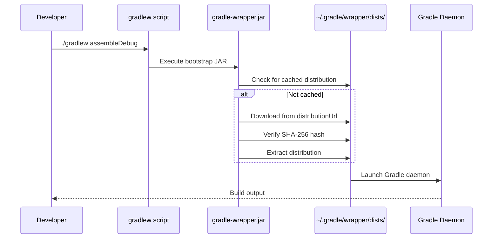

# Gradle Wrapper

The Gradle Wrapper is a script that bootstraps and pins a specific Gradle version for a project. It eliminates the need for a pre-installed Gradle distribution, guarantees reproducible builds across all environments (local dev, CI, other team members), and provides a controlled upgrade path.

---

## How It Works



1. Developer runs `./gradlew <task>`
2. The shell script (`gradlew`) invokes the bootstrap JAR (`gradle-wrapper.jar`)
3. The JAR reads `gradle-wrapper.properties` for the distribution URL
4. If the specified Gradle version isn't cached locally, it downloads and extracts it
5. Gradle launches (or reuses) a daemon process and executes the build

---

## Wrapper Files

| File | Committed to VCS? | Purpose |
|------|-------------------|---------|
| `gradlew` | Yes | Unix/macOS shell script to invoke the wrapper |
| `gradlew.bat` | Yes | Windows batch script equivalent |
| `gradle/wrapper/gradle-wrapper.jar` | Yes | Bootstrap JAR that downloads Gradle |
| `gradle/wrapper/gradle-wrapper.properties` | Yes | Configuration — Gradle version, distribution URL, hash |

```
project-root/
├── gradlew                          ← entry point (chmod +x)
├── gradlew.bat                      ← Windows entry point
└── gradle/
    └── wrapper/
        ├── gradle-wrapper.jar       ← ~60 KB bootstrap JAR
        └── gradle-wrapper.properties
```

!!! warning "Always commit wrapper files"
    All four files must be in version control. Without `gradle-wrapper.jar`, the wrapper can't bootstrap — CI and new team members will fail immediately. Some `.gitignore` templates aggressively exclude `.jar` files; add an exception for the wrapper JAR.

    ```gitignore
    # .gitignore
    *.jar
    !gradle/wrapper/gradle-wrapper.jar
    ```

---

## gradle-wrapper.properties

```properties
distributionBase=GRADLE_USER_HOME
distributionPath=wrapper/dists
distributionUrl=https\://services.gradle.org/distributions/gradle-8.10-bin.zip
distributionSha256Sum=5b9c5eb3f9fc2c94abaea57d90bd78747ca117ddbbf96c859d3741181a12bf2a
networkTimeout=10000
validateDistributionUrl=true
zipStoreBase=GRADLE_USER_HOME
zipStorePath=wrapper/dists
```

| Property | Purpose |
|----------|---------|
| `distributionUrl` | URL to download the Gradle distribution zip |
| `distributionSha256Sum` | SHA-256 hash for integrity verification |
| `distributionBase` | Base directory for storing distributions (`GRADLE_USER_HOME` = `~/.gradle`) |
| `distributionPath` | Subdirectory under base for extracted distributions |
| `networkTimeout` | Download timeout in milliseconds |
| `validateDistributionUrl` | Reject non-HTTPS URLs (security hardening, Gradle 8.2+) |

### Distribution Types

| Type | URL suffix | Contents | Use Case |
|------|-----------|----------|----------|
| **bin** | `gradle-8.10-bin.zip` | Binaries only (~140 MB) | CI and most builds |
| **all** | `gradle-8.10-all.zip` | Binaries + source + docs (~270 MB) | Local dev — enables IDE autocomplete and navigation in build scripts |

!!! tip "Use `-all` for development, `-bin` for CI"
    The `-all` distribution includes Gradle source code, which Android Studio uses for autocomplete and navigation inside `build.gradle.kts` files. CI doesn't need this — use `-bin` to save download time and disk.

---

## Common Operations

### Check Current Version

```bash
./gradlew --version
```

### Upgrade Gradle Version

```bash
./gradlew wrapper --gradle-version 8.10
```

This updates:

- `gradle-wrapper.properties` → new `distributionUrl`
- `gradle-wrapper.jar` → updated bootstrap JAR
- `gradlew` / `gradlew.bat` → updated launcher scripts

!!! warning "Run the wrapper task twice"
    The first run uses the **old** wrapper to generate new wrapper files. Run it a second time to verify the new version bootstraps correctly:
    ```bash
    ./gradlew wrapper --gradle-version 8.10
    ./gradlew --version  # confirm new version
    ```

### Upgrade with SHA-256 Verification

```bash
./gradlew wrapper \
    --gradle-version 8.10 \
    --distribution-type all \
    --gradle-distribution-sha256-sum 5b9c5eb3f9fc2c94abaea57d90bd78747ca117ddbbf96c859d3741181a12bf2a
```

### Generate Wrapper from Scratch

If a project doesn't have a wrapper (rare), install Gradle locally and run:

```bash
gradle wrapper --gradle-version 8.10
```

---

## Distribution Caching

Gradle distributions are cached in `~/.gradle/wrapper/dists/` and shared across all projects using the same version.

```
~/.gradle/wrapper/dists/
├── gradle-8.10-bin/
│   └── <hash>/
│       └── gradle-8.10/        ← extracted distribution
├── gradle-8.9-all/
│   └── <hash>/
│       └── gradle-8.9/
```

| Scenario | Behavior |
|----------|----------|
| Version already cached | No download — instant startup |
| New version | Downloads once, cached for all future builds |
| Corrupted cache | Delete the version directory and re-run `./gradlew` |
| CI builds | Cache `~/.gradle/wrapper/dists/` between runs to avoid repeated downloads |

```bash
# Clear cached distribution for a specific version
rm -rf ~/.gradle/wrapper/dists/gradle-8.10-bin/

# Clear all cached distributions
rm -rf ~/.gradle/wrapper/dists/
```

---

## Security Considerations

The wrapper JAR executes arbitrary code from a URL specified in `gradle-wrapper.properties`. This makes it a supply-chain attack vector if not handled carefully.

### SHA-256 Verification

```properties
# Always pin the hash in gradle-wrapper.properties
distributionSha256Sum=5b9c5eb3f9fc2c94abaea57d90bd78747ca117ddbbf96c859d3741181a12bf2a
```

Without this, a tampered distribution at the URL would be accepted silently. The hash is checked before extraction.

### Wrapper JAR Validation

Gradle provides the [Wrapper Validation GitHub Action](https://github.com/gradle/actions/tree/main/wrapper-validation) to verify that committed `gradle-wrapper.jar` files are genuine:

```yaml
# .github/workflows/wrapper-validation.yml
name: Validate Gradle Wrapper
on: [push, pull_request]
jobs:
  validation:
    runs-on: ubuntu-latest
    steps:
      - uses: actions/checkout@v4
      - uses: gradle/actions/wrapper-validation@v4
```

!!! warning "Review wrapper JAR changes in PRs"
    A malicious contributor could replace `gradle-wrapper.jar` with a compromised version. Always use the Wrapper Validation action in CI, and review any PR that modifies the wrapper JAR.

### URL Validation

Since Gradle 8.2, `validateDistributionUrl=true` rejects non-HTTPS distribution URLs:

```properties
validateDistributionUrl=true
```

---

## CI/CD Best Practices

### Cache the Distribution

=== "GitHub Actions"

    ```yaml
    - uses: actions/setup-java@v4
      with:
        distribution: temurin
        java-version: 17

    - uses: gradle/actions/setup-gradle@v4
      # Automatically caches Gradle distributions, build cache, and dependencies
    ```

=== "Generic CI"

    ```yaml
    cache:
      paths:
        - ~/.gradle/wrapper/dists/
        - ~/.gradle/caches/
      key: gradle-${{ hashFiles('gradle/wrapper/gradle-wrapper.properties') }}
    ```

### Ensure Wrapper Consistency

```bash
# In CI, verify the wrapper version matches expectations
EXPECTED_VERSION="8.10"
ACTUAL_VERSION=$(./gradlew --version | grep "^Gradle" | awk '{print $2}')
if [ "$ACTUAL_VERSION" != "$EXPECTED_VERSION" ]; then
    echo "ERROR: Expected Gradle $EXPECTED_VERSION but got $ACTUAL_VERSION"
    exit 1
fi
```

---

## Troubleshooting

| Problem | Cause | Fix |
|---------|-------|-----|
| `gradlew: Permission denied` | Missing execute bit | `chmod +x gradlew` |
| `Could not GET distribution` | Network issue or wrong URL | Check `distributionUrl`, proxy settings, and corporate firewall |
| `SHA-256 hash mismatch` | Corrupted download or wrong hash | Delete cached distribution, verify the hash from the official Gradle releases page |
| `Could not determine java version` | Wrong JDK on PATH | Set `JAVA_HOME` or use a JDK manager (sdkman, asdf) |
| `Wrapper JAR missing` | Not committed to VCS | Restore from another checkout or regenerate: `gradle wrapper --gradle-version X.Y` |
| `Lock file exists` | Another Gradle process running | Wait for it to finish or delete `~/.gradle/wrapper/dists/<version>/<hash>/*.lck` |

---

??? question "Interview Questions"

    **Q: What is the Gradle Wrapper and why should every project use it?**

    The wrapper (`gradlew`) is a script + bootstrap JAR that pins and downloads a specific Gradle version per project. It ensures reproducible builds across all environments without requiring anyone to pre-install Gradle. Without it, builds break when team members or CI have different Gradle versions installed.

    **Q: What files does the wrapper consist of and which should be committed?**

    Four files: `gradlew` (Unix script), `gradlew.bat` (Windows script), `gradle/wrapper/gradle-wrapper.jar` (bootstrap JAR), and `gradle/wrapper/gradle-wrapper.properties` (config). All four must be committed to VCS. The JAR is essential — without it, the wrapper can't bootstrap.

    **Q: What's the difference between `-bin` and `-all` distribution types?**

    `-bin` contains only Gradle binaries (~140 MB). `-all` includes source code and documentation (~270 MB). Use `-all` locally for IDE autocomplete in build scripts. Use `-bin` in CI to save time and disk.

    **Q: How do you secure the Gradle Wrapper against supply-chain attacks?**

    Three layers: (1) Set `distributionSha256Sum` in `gradle-wrapper.properties` to verify the downloaded distribution. (2) Use the Gradle Wrapper Validation GitHub Action to verify committed JAR files are genuine. (3) Enable `validateDistributionUrl=true` to reject non-HTTPS URLs.

    **Q: How do you upgrade the Gradle version in a project?**

    Run `./gradlew wrapper --gradle-version X.Y`. This updates `gradle-wrapper.properties` and the bootstrap files. Check the AGP compatibility matrix first — AGP has minimum Gradle version requirements. Run `./gradlew --version` afterward to confirm.

    **Q: Where does the wrapper cache downloaded distributions?**

    In `~/.gradle/wrapper/dists/`, organized by version and hash. This cache is shared across all local projects using the same Gradle version. In CI, caching this directory avoids repeated downloads.
