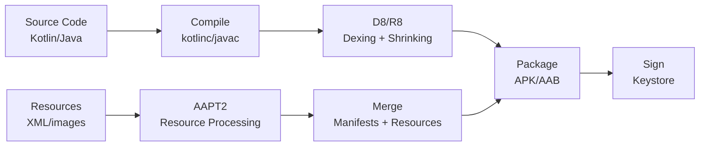

# Gradle & Build System

Gradle is the build automation tool for Android projects. It handles compilation, dependency resolution, resource processing, APK/AAB packaging, and everything in between. Understanding Gradle deeply is the difference between a 30-second build and a 10-minute one.

---

## Sub-Topics

| Topic | What It Covers |
|-------|---------------|
| [Gradle Fundamentals](gradle-fundamentals.md) | Build lifecycle, project structure, Groovy vs KTS, Gradle wrapper, settings and build files |
| [Build Variants](build-variants.md) | Build types, product flavors, variant matrix, signing configs, variant-aware dependencies |
| [Dependency Management](dependency-management.md) | Dependency configurations, version catalogs, BOMs, resolution strategies, dependency locking |
| [Build Performance](build-performance.md) | Build cache, configuration cache, parallel execution, profiling, and optimization techniques |

---

## How Android Builds Work (High Level)

---

## Key Gradle Files

| File | Purpose |
|------|---------|
| `settings.gradle.kts` | Declares which modules are in the project, plugin repositories, version catalogs |
| `build.gradle.kts` (root) | Project-wide config — plugin declarations, common repository setup |
| `build.gradle.kts` (module) | Module-specific build config — plugins, android block, dependencies |
| `gradle.properties` | JVM args, Gradle feature flags, project-wide properties |
| `gradle/libs.versions.toml` | Centralized dependency version catalog |
| `gradle/wrapper/gradle-wrapper.properties` | Pins the Gradle version for the project |

!!! tip "Related"
    For multi-module build architecture including convention plugins and module dependency graphs, see [Modularization](../architecture-patterns/modularization.md).
