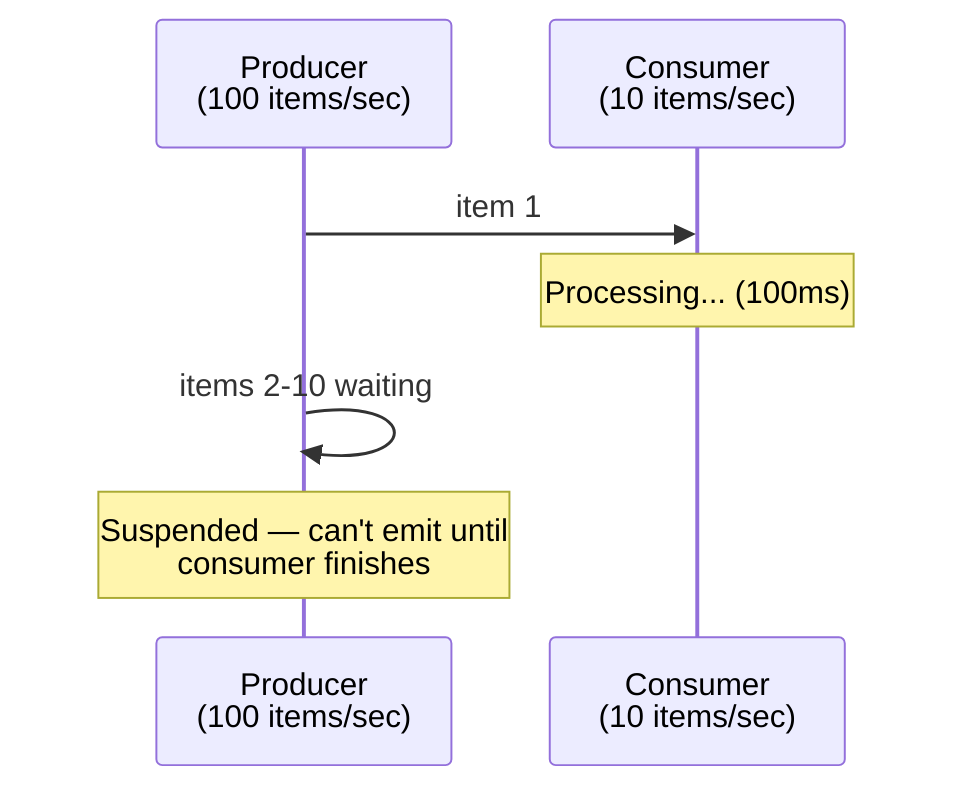
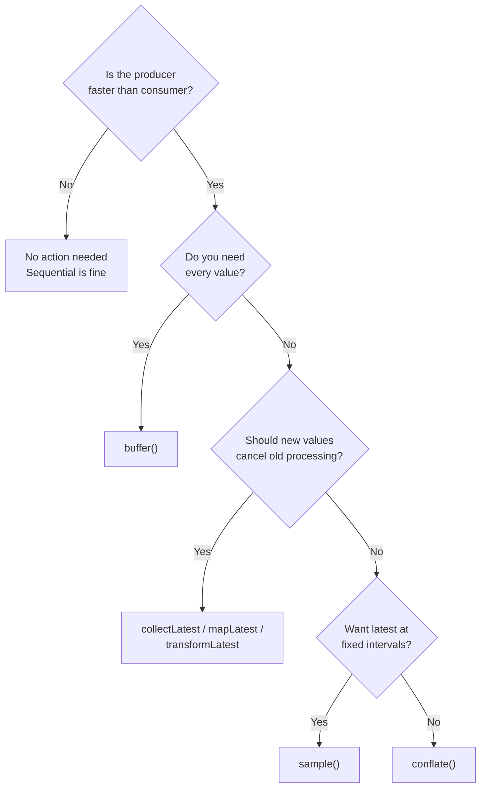
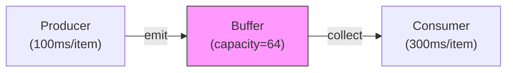
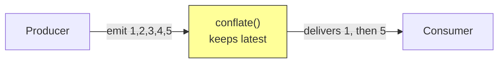
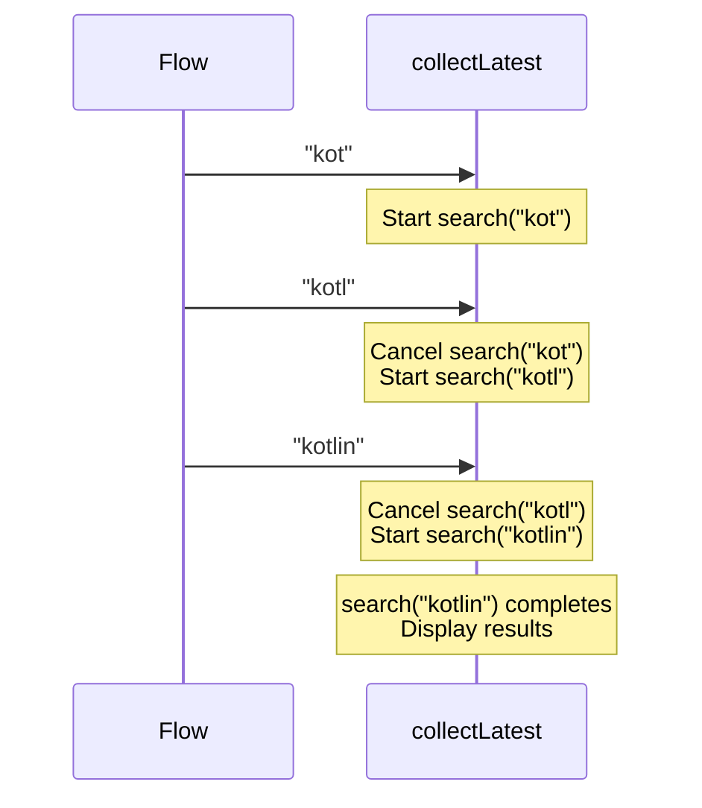
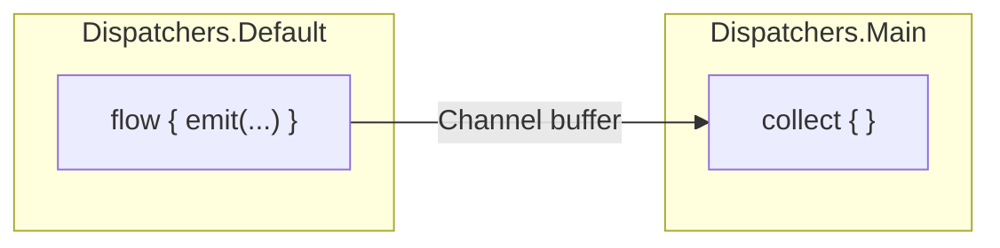

# Backpressure in Kotlin Flow

---

## What Is Backpressure?

Backpressure occurs when a **producer emits data faster than the consumer can process it**. Without a strategy, either the producer blocks (waiting for the consumer), memory grows unbounded (buffering everything), or data is lost silently.



In Kotlin Flow, backpressure is handled **by suspension** — the producer coroutine suspends on `emit()` until the collector is ready. This is safe by default but can be a bottleneck.

---

## Default Behavior: Sequential Execution

With no operators, Flow is fully sequential — `emit()` suspends until the collector's lambda finishes.

```kotlin
flow {
    repeat(100) {
        emit(it)                    // suspends until collect {} returns
        println("Emitted $it")
    }
}
.collect {
    delay(100)                      // slow consumer
    println("Processed $it")
}
// Output: Emitted 0, Processed 0, Emitted 1, Processed 1, ...
// Total time ≈ 100 * 100ms = 10 seconds
```

| Aspect | Behavior |
|--------|----------|
| **Memory** | Constant — one item at a time |
| **Throughput** | Bottlenecked by the slower side |
| **Data loss** | None |
| **Use case** | When processing order and completeness matter |

---

## Backpressure Strategies

### Decision Flowchart



---

### 1. `buffer()` — Decouple Producer and Consumer

Creates a **channel** between producer and consumer. The producer runs ahead without waiting for the consumer.

```kotlin
flow {
    repeat(5) { i ->
        delay(100)              // produces every 100ms
        emit(i)
    }
}
.buffer(capacity = 64)         // producer runs concurrently
.collect { value ->
    delay(300)                  // slow consumer
    println("Processed $value")
}
// Total time ≈ 5 * 300ms = 1.5s (not 5 * 400ms = 2s)
```



| Parameter | Effect |
|-----------|--------|
| `Channel.BUFFERED` (default 64) | Fixed-size buffer |
| `Channel.UNLIMITED` | Unbounded — risk OOM on sustained overproduction |
| `Channel.CONFLATED` | Keep only the latest (same as `conflate()`) |
| `Channel.RENDEZVOUS` (0) | No buffer — same as default sequential behavior |

!!! warning "buffer() Doesn't Prevent Overload"
    If the producer is *permanently* faster than the consumer, the buffer eventually fills. With `BUFFERED`, the producer suspends when full. With `UNLIMITED`, you risk `OutOfMemoryError`. Buffer buys time for **bursts**, not sustained rate mismatch.

---

### 2. `conflate()` — Keep Only the Latest

Drops intermediate values when the consumer is busy. The consumer always gets the **most recent** emission.

```kotlin
flow {
    repeat(100) { i ->
        emit(i)
        delay(10)               // fast producer
    }
}
.conflate()
.collect { value ->
    delay(100)                  // slow consumer
    println("Processed $value") // prints 0, ~10, ~20, ... (skips intermediates)
}
```



| Aspect | Behavior |
|--------|----------|
| **Data loss** | Yes — intermediate values are dropped |
| **Memory** | Constant — one slot |
| **Latency** | Minimal — always the freshest value |
| **Use case** | UI state, sensor data, progress indicators |

---

### 3. `collectLatest` — Cancel Stale Work

When a new value arrives, **cancels** the in-progress collector block and restarts with the new value.

```kotlin
searchQuery
    .debounce(300)
    .collectLatest { query ->
        val results = api.search(query)     // cancelled if new query arrives
        displayResults(results)
    }
```



Related operators with the same cancellation semantics:

| Operator | What It Does |
|----------|-------------|
| `collectLatest { }` | Cancels previous collector block |
| `mapLatest { }` | Cancels previous transformation |
| `transformLatest { }` | Cancels previous transform block (can emit multiple values) |
| `flatMapLatest { }` | Cancels previous inner flow |

!!! tip "collectLatest vs conflate"
    `conflate()` lets the consumer finish its current work, then gives it the latest value. `collectLatest` **cancels** ongoing work immediately. Use `collectLatest` when stale results are useless (search), `conflate` when you just want to skip ahead (UI ticks).

---

### 4. `sample()` — Time-Based Emission

Emits the **most recent value** at a fixed time interval. Values between intervals are dropped.

```kotlin
sensorReadings
    .sample(100.milliseconds)   // at most 10 updates/second
    .collect { updateUI(it) }
```

| Aspect | Behavior |
|--------|----------|
| **Rate** | Fixed, predictable |
| **Data loss** | Yes — only latest per interval survives |
| **Use case** | UI refresh rate limiting, telemetry batching |

---

## Comparison Table

| Strategy | Data Loss | Memory | Cancels Work | Best For |
|----------|-----------|--------|-------------|----------|
| **Sequential** (default) | None | O(1) | No | Ordered processing, DB writes |
| **buffer(n)** | None (until full) | O(n) | No | Burst absorption, parallel pipeline |
| **conflate()** | Intermediate values | O(1) | No | UI state, latest-wins semantics |
| **collectLatest** | In-progress work | O(1) | Yes | Search, network calls |
| **sample(t)** | Between intervals | O(1) | No | Rate limiting, sensor data |

---

## Real-World Android Patterns

### SSE + Conflate for Live Prices

```kotlin
sseClient.connect("wss://api.example.com/prices")
    .map { Json.decodeFromString<Price>(it.data) }
    .conflate()                         // screen refreshes at 60fps max
    .flowOn(Dispatchers.IO)
    .collect { price -> updateTicker(price) }
```

### Search with Debounce + collectLatest

```kotlin
class SearchViewModel(private val api: SearchApi) : ViewModel() {
    private val _query = MutableStateFlow("")

    val results: StateFlow<SearchState> = _query
        .debounce(300)
        .distinctUntilChanged()
        .transformLatest { query ->
            if (query.isBlank()) {
                emit(SearchState.Idle)
                return@transformLatest
            }
            emit(SearchState.Loading)
            val results = api.search(query)
            emit(SearchState.Success(results))
        }
        .stateIn(viewModelScope, SharingStarted.WhileSubscribed(5_000), SearchState.Idle)

    fun onQueryChanged(text: String) { _query.value = text }
}
```

### Database Write Queue with Buffer

```kotlin
analyticsEvents
    .buffer(Channel.UNLIMITED)          // never lose analytics events
    .chunked(50)                        // batch writes
    .collect { batch ->
        database.analyticsDao().insertAll(batch)
    }
```

### Sensor Data with Sample

```kotlin
accelerometerFlow()
    .sample(16.milliseconds)            // cap at ~60 readings/sec
    .map { (x, y, z) -> computeOrientation(x, y, z) }
    .distinctUntilChanged()
    .collect { orientation -> rotateUI(orientation) }
```

---

## Combining Strategies

Strategies compose — apply multiple operators for fine-grained control:

```kotlin
locationUpdates                          // GPS: up to 100 updates/sec
    .conflate()                          // only latest position matters
    .map { computeRoute(it) }            // expensive computation
    .buffer(3)                           // absorb computation-time bursts
    .flowOn(Dispatchers.Default)
    .collect { route -> drawRoute(route) }
```

Order matters:

```kotlin
flow
    .buffer(10)     // first: absorb producer bursts into 10-slot buffer
    .conflate()     // then: if consumer is still behind, keep only latest from buffer
    .collect { }
```

---

## flowOn and Implicit Buffering

`flowOn` changes the dispatcher for upstream operators and **introduces a buffer** at the boundary. This is implicit backpressure management.

```kotlin
flow { emit(heavyComputation()) }
    .flowOn(Dispatchers.Default)    // runs on Default, buffers into channel
    .collect { updateUI(it) }       // runs on Main
```



!!! note "flowOn = Context Switch + Buffer"
    Every `flowOn` call inserts a channel between upstream and downstream. Two consecutive `flowOn` calls create two buffers. This is usually fine, but be aware of the memory implications in high-throughput scenarios.

---

## Custom Backpressure with Channels

For advanced scenarios, use a Channel directly for full control:

```kotlin
val events = Channel<Event>(
    capacity = 64,
    onBufferOverflow = BufferOverflow.DROP_OLDEST,
    onUndeliveredElement = { event ->
        log("Dropped event: $event")
    }
)

// Producer — never suspends, drops oldest if full
launch {
    while (isActive) {
        events.trySend(receiveFromNetwork())
    }
}

// Consumer
launch {
    for (event in events) {
        process(event)
    }
}
```

| BufferOverflow | Behavior |
|---------------|----------|
| `SUSPEND` | Producer suspends when buffer full (default) |
| `DROP_OLDEST` | Evicts oldest item, producer never suspends |
| `DROP_LATEST` | Discards new item, producer never suspends |

---

## Common Mistakes

### 1. Unbounded Buffer in a Long-Running Flow

```kotlin
// BAD — OOM risk if producer consistently outpaces consumer
eventStream
    .buffer(Channel.UNLIMITED)
    .collect { slowProcess(it) }

// GOOD — bounded buffer with overflow strategy
eventStream
    .buffer(64, onBufferOverflow = BufferOverflow.DROP_OLDEST)
    .collect { slowProcess(it) }
```

### 2. Conflating When Every Item Matters

```kotlin
// BAD — losing payment events
paymentEvents.conflate().collect { processPayment(it) }

// GOOD — buffer to handle bursts, process every event
paymentEvents.buffer(128).collect { processPayment(it) }
```

### 3. Using collectLatest for Side Effects

```kotlin
// BAD — previous DB write gets cancelled mid-transaction
events.collectLatest { event ->
    database.withTransaction {
        dao.insert(event)       // may be cancelled!
    }
}

// GOOD — use buffer + regular collect for non-cancellable work
events.buffer().collect { event ->
    database.withTransaction {
        dao.insert(event)
    }
}
```

### 4. Ignoring Backpressure in callbackFlow

```kotlin
// BAD — trySend drops items silently when buffer full
callbackFlow {
    sensor.registerListener { reading ->
        trySend(reading)        // returns ChannelResult, but ignored
    }
    awaitClose { sensor.unregisterListener() }
}

// GOOD — explicit overflow strategy
callbackFlow {
    sensor.registerListener { reading ->
        trySend(reading)
    }
    awaitClose { sensor.unregisterListener() }
}.buffer(capacity = 64, onBufferOverflow = BufferOverflow.DROP_OLDEST)
```

---

## Backpressure in Reactive Streams vs Flow

| Aspect | RxJava | Kotlin Flow |
|--------|--------|-------------|
| **Default** | No backpressure (`Observable`), or request-based (`Flowable`) | Suspension-based |
| **Mechanism** | Subscriber requests N items | Producer suspends on `emit()` |
| **Unbounded problem** | `MissingBackpressureException` | Producer just suspends |
| **Overflow strategy** | `onBackpressureDrop/Buffer/Latest` | `buffer/conflate/collectLatest` |
| **Thread boundary** | `observeOn` adds a fixed buffer | `flowOn` adds a buffered channel |

!!! tip "Why Flow's Model Is Simpler"
    RxJava's `Flowable` requires explicit request counting (`request(n)`). Flow leverages coroutine suspension — the producer simply suspends when the consumer isn't ready. No request counting, no `MissingBackpressureException`. The mental model is: **emit waits, collect proceeds**.

---

??? question "Interview Questions"

    **Q: What is backpressure and how does Kotlin Flow handle it by default?**

    Backpressure is the problem of a producer emitting faster than a consumer can process. Kotlin Flow handles it via coroutine suspension — `emit()` is a suspending function that waits until the collector's lambda returns. This means the producer naturally slows to the consumer's pace. No data is lost and memory is constant, but throughput is limited to the slower side.

    **Q: What's the difference between buffer(), conflate(), and collectLatest?**

    `buffer(n)` decouples producer and consumer with a channel — the producer runs ahead into a fixed-size buffer, preserving all values. `conflate()` keeps only the latest value, dropping intermediates when the consumer is busy — best for UI state. `collectLatest` cancels the current collector block when a new value arrives and restarts — best for search or network calls where stale work is useless.

    **Q: When would you use conflate() vs sample()?**

    Both drop data, but differently. `conflate()` emits the latest value as soon as the consumer is ready — timing depends on consumer speed. `sample(interval)` emits the latest value at fixed time intervals regardless of consumer speed. Use `conflate` when you want the freshest value ASAP; use `sample` when you need a predictable, fixed update rate (e.g., 60fps UI updates).

    **Q: How does flowOn create implicit buffering?**

    `flowOn` switches the upstream to a different dispatcher by inserting a channel (buffer) at the boundary. Upstream emissions go into this channel on the specified dispatcher; the downstream collector reads from it on its own dispatcher. This buffer allows producer and consumer to run concurrently on different threads, but also means each `flowOn` call adds a buffering point.

    **Q: What happens if you use Channel.UNLIMITED buffer in a long-running flow?**

    If the producer is consistently faster than the consumer, items accumulate without bound, eventually causing `OutOfMemoryError`. `UNLIMITED` is safe only for short bursts or when you're certain the consumer can keep up on average. For sustained rate mismatches, use a bounded buffer with an overflow strategy like `DROP_OLDEST`.

    **Q: Why is collectLatest dangerous for side effects like database writes?**

    `collectLatest` cancels the current collector block (via `CancellationException`) when a new value arrives. If the block is performing a database transaction, the cancellation can interrupt it mid-write, leading to partial or lost data. For non-cancellable side effects, use `buffer()` with regular `collect` to ensure each item is fully processed.

    **Q: How does Flow backpressure compare to RxJava's approach?**

    RxJava has two models: `Observable` (no backpressure — can throw `MissingBackpressureException`) and `Flowable` (request-based — subscriber explicitly requests N items). Flow uses coroutine suspension — `emit()` naturally suspends when the collector isn't ready. This eliminates request counting and the common `MissingBackpressureException` pitfall. The tradeoff: Flow's model is simpler but less granular than Flowable's request-based control.

    **Q: How would you handle backpressure for SSE events on Android?**

    It depends on the event type. For UI state updates (prices, scores), use `conflate()` so the UI always shows the latest. For critical events (transactions, notifications), use `buffer(n)` to absorb bursts and process every event. For SSE-backed search/autocomplete, use `collectLatest` to cancel stale API calls. Combine strategies when needed — e.g., `conflate().flowOn(IO)` for sensor-like SSE data.

!!! tip "Further Reading"
    - [Kotlin Flow documentation — Buffering](https://kotlinlang.org/docs/flow.html#buffering)
    - [StateFlow and SharedFlow](https://developer.android.com/kotlin/flow/stateflow-and-sharedflow)
    - [Flow under the hood — Roman Elizarov](https://www.youtube.com/watch?v=tYcqn48SMT8)
    - [Flow & Channel Best Practices](flow-channel-best-practices.md)
