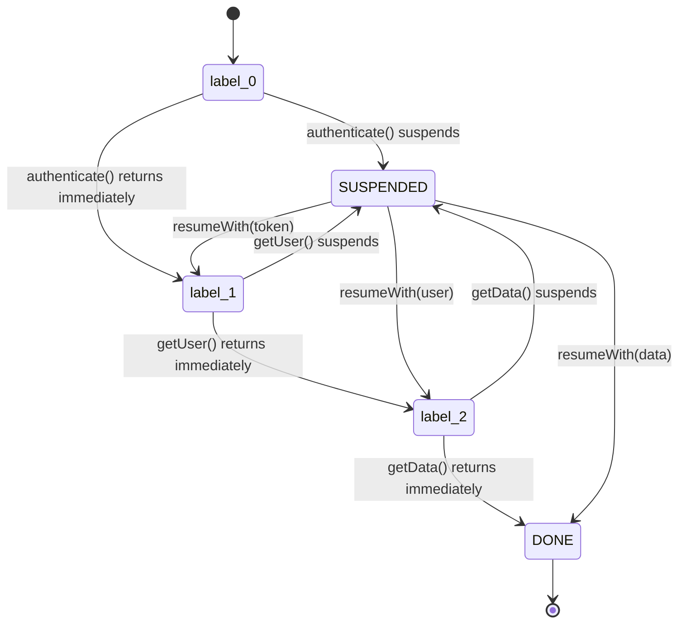
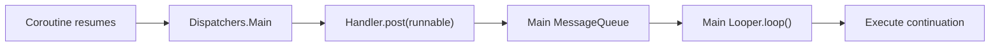
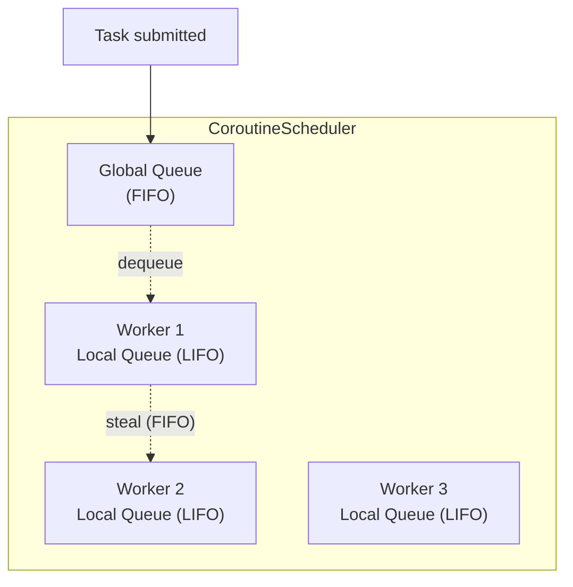
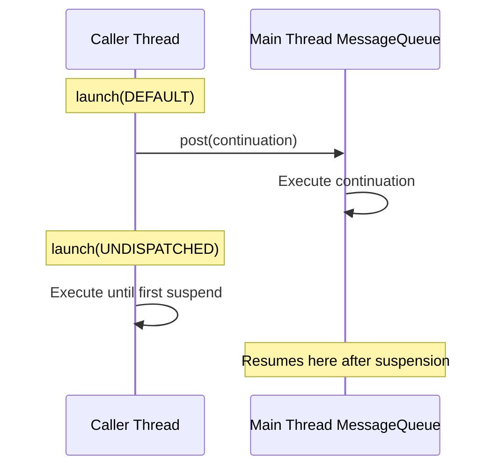
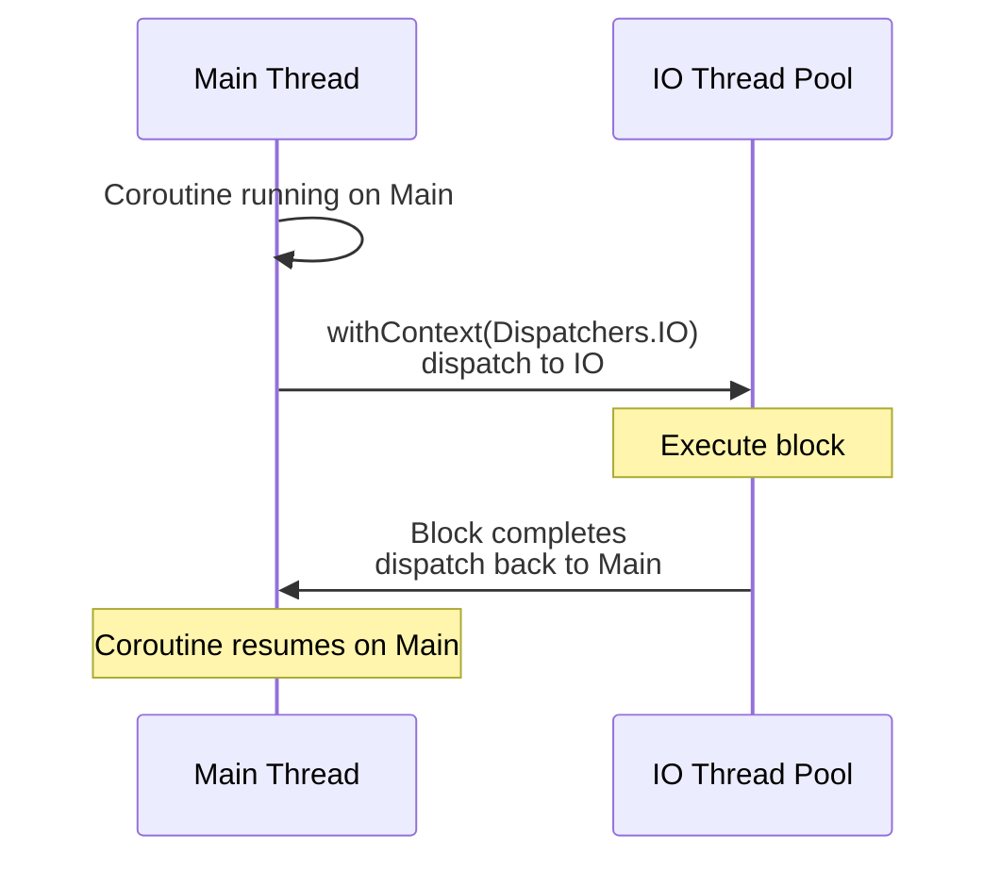
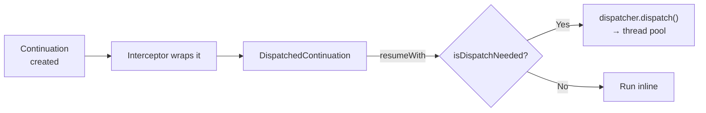
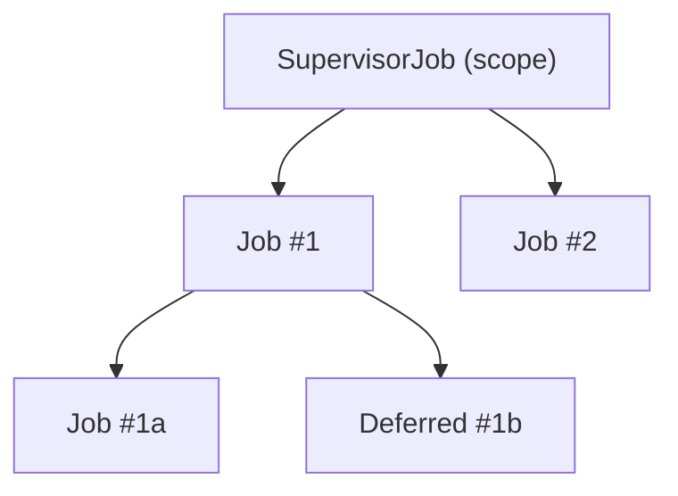
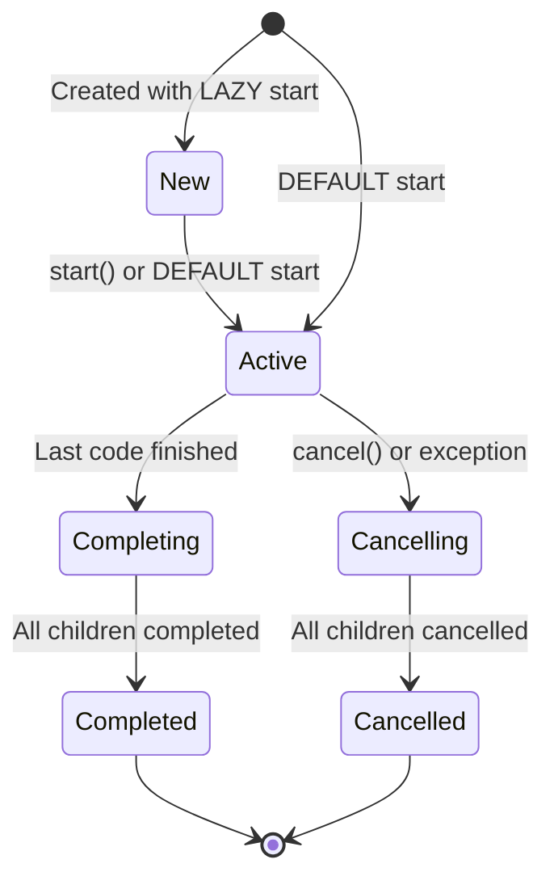

# Coroutine Internals

How Kotlin coroutines work under the hood — from compiler transformations to thread dispatch mechanics.

---

## CPS Transformation

The compiler transforms every `suspend` function by adding a `Continuation<T>` parameter:

```kotlin
// Source
suspend fun fetchUser(id: String): User

// Compiled (simplified)
fun fetchUser(id: String, continuation: Continuation<User>): Any?
```

The return type becomes `Any?` because the function can return:

| Return Value | Meaning |
|---|---|
| `COROUTINE_SUSPENDED` | Function suspended — result comes later via `continuation.resumeWith()` |
| Actual result (`User`) | Function completed synchronously (fast-path optimization) |

---

## State Machine

Each `suspend` function compiles into a state machine. The continuation object stores the **label** (current state) and all **local variables** that span suspension points.

```kotlin
// Source
suspend fun loadData(): Data {
    val token = authenticate()   // suspension point 0
    val user = getUser(token)    // suspension point 1
    val data = getData(user.id)  // suspension point 2
    return data
}
```



### Generated Code (Simplified)

```kotlin
fun loadData(continuation: Continuation<Data>): Any? {
    val sm = continuation as? LoadDataSM ?: LoadDataSM(continuation)

    when (sm.label) {
        0 -> {
            sm.label = 1
            val result = authenticate(sm)
            if (result == COROUTINE_SUSPENDED) return COROUTINE_SUSPENDED
            sm.token = result as String
        }
        1 -> {
            sm.token = sm.result as String
            sm.label = 2
            val result = getUser(sm.token, sm)
            if (result == COROUTINE_SUSPENDED) return COROUTINE_SUSPENDED
            sm.user = result as User
        }
        2 -> {
            sm.user = sm.result as User
            sm.label = 3
            val result = getData(sm.user.id, sm)
            if (result == COROUTINE_SUSPENDED) return COROUTINE_SUSPENDED
            return result
        }
        3 -> return sm.result
    }
}
```

!!! note "Zero Allocation Per Suspension"
    One continuation object is created when the coroutine starts and reused for all suspension points. No new objects are allocated when the coroutine suspends or resumes — the state machine just updates its `label` field.

---

## How Dispatchers Work

### Dispatchers.Main: The Handler Bridge

`Dispatchers.Main` on Android is a `HandlerDispatcher` backed by `Handler(Looper.getMainLooper())`.



When a coroutine needs to resume on the main thread:

1. The continuation is wrapped in a `DispatchedContinuation`
2. `dispatcher.dispatch()` calls `handler.post(runnable)`
3. The `Runnable` enters the main thread's `MessageQueue`
4. The main `Looper` dequeues and executes it

```kotlin
// Simplified internal implementation
internal class HandlerDispatcher(
    private val handler: Handler
) : CoroutineDispatcher() {

    override fun dispatch(context: CoroutineContext, block: Runnable) {
        handler.post(block)  // post to main MessageQueue
    }

    override fun scheduleResumeAfterDelay(
        timeMillis: Long, continuation: CancellableContinuation<Unit>
    ) {
        handler.postDelayed(block, timeMillis)  // delay() uses Handler.postDelayed
    }
}
```

!!! tip "delay() on Main"
    When you call `delay(1000)` on `Dispatchers.Main`, it uses `Handler.postDelayed()` — no thread is blocked. The continuation is posted as a delayed message to the `MessageQueue`.

### Dispatchers.Main.immediate

Skips the `Handler.post()` roundtrip when already on the main thread:

```kotlin
override fun isDispatchNeeded(context: CoroutineContext): Boolean {
    return Looper.myLooper() != Looper.getMainLooper()
    // Returns false if already on main thread → run inline
}
```

| Dispatcher | Already on main thread | On background thread |
|---|---|---|
| `Dispatchers.Main` | Posts to MessageQueue (1 frame delay) | Posts to MessageQueue |
| `Dispatchers.Main.immediate` | Runs **inline** (no delay) | Posts to MessageQueue |

This is why `viewModelScope` and `lifecycleScope` use `Main.immediate` — most UI code originates on the main thread, so skipping the dispatch eliminates unnecessary latency.

```kotlin
// Dispatchers.Main — always posts, runs on next Looper iteration
withContext(Dispatchers.Main) {
    textView.text = "Hello"  // runs after Handler.post roundtrip
}

// Dispatchers.Main.immediate — runs now if already on main
withContext(Dispatchers.Main.immediate) {
    textView.text = "Hello"  // runs immediately, no dispatch
}
```

---

### Dispatchers.Default and IO: CoroutineScheduler

Both `Default` and `IO` share the same **CoroutineScheduler** — a work-stealing thread pool.



**Architecture:**

| Component | Role |
|---|---|
| **Global queue** | Holds tasks not yet assigned to a worker (FIFO) |
| **Worker local queue** | Each thread has its own queue — new tasks go here first (LIFO for CPU, FIFO for blocking) |
| **Work stealing** | Idle workers steal from other workers' queues (FIFO order — steal oldest first) |
| **Parking** | Workers with no work are parked (LockSupport.park) to avoid busy-waiting |

### Task Classification

The scheduler classifies each task:

| Classification | Dispatcher | Thread Limit | Behavior |
|---|---|---|---|
| `CPU_BOUND` | `Dispatchers.Default` | Core count | Worker counts toward CPU limit |
| `PROBABLY_BLOCKING` | `Dispatchers.IO` | max(64, cores) | Can create extra "blocking" threads |

### How Default and IO Share Threads

```kotlin
withContext(Dispatchers.Default) {
    // Running on Worker-3, classified as CPU_BOUND
    withContext(Dispatchers.IO) {
        // STILL on Worker-3! Thread is re-classified as PROBABLY_BLOCKING
        // No thread switch — just a task reclassification
        networkCall()
    }
    // Back to CPU_BOUND classification on Worker-3
}
```

When switching between `Default` and `IO`, the scheduler often **reuses the same thread** — it just changes the task's classification. This avoids the context-switch overhead of a real thread handoff.

!!! note "When Thread Switches Do Happen"
    A thread switch occurs when: (1) all CPU slots are occupied and you dispatch to `Default`, or (2) the current thread is needed elsewhere. The scheduler makes the decision transparently.

---

## Coroutine Start Modes

| Mode | Behavior | First Code Execution |
|---|---|---|
| `DEFAULT` | Dispatched to target dispatcher | After dispatch (next loop iteration) |
| `LAZY` | Doesn't start until `start()`, `join()`, or `await()` | On explicit trigger |
| `UNDISPATCHED` | Starts immediately in the caller's thread | Inline, right now |
| `ATOMIC` | Like DEFAULT but cannot be cancelled before first suspension | After dispatch |

### UNDISPATCHED: Skip the Initial Dispatch

```kotlin
// DEFAULT — always dispatches first
scope.launch(Dispatchers.Main) {
    // Runs after Handler.post() roundtrip
    updateUI()  // ← delayed by one message loop iteration
}

// UNDISPATCHED — runs immediately until first suspension
scope.launch(Dispatchers.Main, start = CoroutineStart.UNDISPATCHED) {
    updateUI()          // ← runs NOW, in the caller's thread
    val data = fetch()  // suspends → resumes on Dispatchers.Main
    updateUI(data)      // runs on Main after resume
}
```



---

## How withContext Switches Threads

`withContext` does not create a new coroutine — it switches the **context** of the current one.



Internally:

1. **Saves** the current continuation state
2. **Intercepts** the continuation with the new dispatcher
3. **Dispatches** the block to the new dispatcher's thread pool
4. On completion, **dispatches back** to the original dispatcher

!!! tip "Same Dispatcher Optimization"
    If the target dispatcher is the same as the current one (e.g., `withContext(Dispatchers.IO)` from IO), no thread switch occurs. The framework detects this and runs inline, only creating a new `Job` for structured concurrency.

---

## Interceptors and DispatchedContinuation

Every coroutine has a `ContinuationInterceptor` in its context — usually a `CoroutineDispatcher`. The interception chain:



`DispatchedContinuation` wraps the original continuation and routes every `resumeWith()` call through the dispatcher:

```kotlin
// Simplified
internal class DispatchedContinuation<T>(
    val dispatcher: CoroutineDispatcher,
    val continuation: Continuation<T>
) : Continuation<T> {

    override fun resumeWith(result: Result<T>) {
        if (dispatcher.isDispatchNeeded(context)) {
            dispatcher.dispatch(context, DispatchedTask(result))
        } else {
            continuation.resumeWith(result)  // run inline
        }
    }
}
```

This is the mechanism that makes coroutines **thread-agile** — the same coroutine can suspend on one thread and resume on another, determined entirely by the dispatcher.

---

## Event Loop for runBlocking

`runBlocking` creates its own **event loop** on the current thread:

```kotlin
fun <T> runBlocking(
    context: CoroutineContext, 
    block: suspend CoroutineScope.() -> T
): T {
    val eventLoop = ThreadLocalEventLoop.currentOrNull() ?: BlockingEventLoop(currentThread)
    // Block the thread, processing dispatched tasks until the coroutine completes
    while (!coroutine.isCompleted) {
        eventLoop.processNextEvent()    // process one task
        // If no tasks: park the thread (LockSupport.park)
    }
    return coroutine.getResult()
}
```

!!! warning "runBlocking on Main Thread = ANR"
    `runBlocking` takes over the current thread's event loop. On the main thread, this **blocks the main Looper** — no framework messages (input, lifecycle, rendering) are processed. Even `delay()` inside `runBlocking` on main will cause an ANR if another event is pending.

---

## Structured Concurrency Internals

### Job Tree

Every `launch` or `async` creates a new `Job` that becomes a **child** of the scope's `Job`:

```kotlin
val scope = CoroutineScope(SupervisorJob() + Dispatchers.Main)

scope.launch {          // child Job #1
    launch { }          // grandchild Job #1a
    async { }           // grandchild Job #1b
}
scope.launch { }        // child Job #2
```



### How the Tree is Maintained

| Operation | Mechanism |
|---|---|
| **Registration** | `parent.attachChild(child)` — adds to parent's `children` list |
| **Completion** | `child.parentCancelled()` / `parent.childCompleted()` — bidirectional signals |
| **Waiting** | Parent's `Job.join()` suspends until all children complete |
| **Cancellation** | `Job.cancel()` iterates `children` and calls `cancel()` on each |
| **Failure** | Child calls `parent.childCancelled(exception)` — parent decides whether to propagate |

### Job States



| State | isActive | isCompleted | isCancelled |
|---|---|---|---|
| New | false | false | false |
| Active | true | false | false |
| Completing | true | false | false |
| Completed | false | true | false |
| Cancelling | false | false | true |
| Cancelled | false | true | true |

---

## How delay() Works on Each Dispatcher

`delay()` is dispatcher-aware — it uses the most efficient mechanism available:

| Dispatcher | delay() Implementation |
|---|---|
| `Dispatchers.Main` | `Handler.postDelayed()` — no thread blocked |
| `Dispatchers.Default` / `IO` | `CoroutineScheduler` delayed queue — thread is freed |
| `runBlocking` | `BlockingEventLoop` scheduled task — thread parked with `LockSupport.parkNanos()` |

In all cases, `delay()` **never blocks a thread** (except in `runBlocking` where the thread is already blocked). The continuation is scheduled for later resumption.

---

## Coroutine Memory Layout

A coroutine's memory footprint:

| Component | Size | Notes |
|---|---|---|
| Continuation (state machine) | ~100-200 bytes | Label + local variables as fields |
| `Job` | ~100 bytes | State + children list |
| `DispatchedContinuation` | ~50 bytes | Wrapper for dispatcher routing |
| **Total per coroutine** | **~300-500 bytes** | vs. **~1 MB** per thread (OS stack) |

This is why you can create millions of coroutines but only thousands of threads.

---

??? question "How does Dispatchers.Main actually post work to the main thread?"
    It wraps a `Handler(Looper.getMainLooper())`. When a coroutine resumes on `Dispatchers.Main`, the continuation is wrapped as a `Runnable` and posted via `Handler.post()` to the main thread's `MessageQueue`, where the main `Looper` dequeues and executes it.

??? question "Why do viewModelScope and lifecycleScope use Main.immediate?"
    `Main.immediate` checks `isDispatchNeeded()` — if already on the main thread, it runs the code inline without posting to the `MessageQueue`. This eliminates one frame of latency. Since most UI operations originate on the main thread, this avoids unnecessary dispatch overhead.

??? question "What happens when you switch from Dispatchers.Default to Dispatchers.IO?"
    Often nothing visible — no thread switch occurs. Both share the same `CoroutineScheduler`. The worker thread's task classification changes from `CPU_BOUND` to `PROBABLY_BLOCKING`, which allows the scheduler to create additional threads beyond the core count if needed.

??? question "How are coroutines lightweight compared to threads?"
    A thread allocates a ~1 MB OS stack. A coroutine's state is a heap object (~300-500 bytes) — the continuation/state machine plus the `Job`. On suspension, the thread is completely released; no stack frame is held. One thread can run thousands of coroutines sequentially.

??? question "What is the difference between DEFAULT and UNDISPATCHED start?"
    `DEFAULT` schedules the coroutine on the target dispatcher — there's a dispatch cost before any code runs. `UNDISPATCHED` executes immediately in the caller's thread up to the first suspension point, then resumes on the target dispatcher. This eliminates the initial dispatch overhead.

??? question "How does the state machine preserve local variables across suspension?"
    Local variables that span suspension points are **lifted** into fields on the continuation object. When the coroutine suspends, these fields retain the values. When it resumes, the state machine reads them back and continues from the correct label. Variables used within a single state (between two suspension points) stay as JVM locals.

??? question "What happens if you call runBlocking inside a coroutine on Dispatchers.Main?"
    Deadlock. `runBlocking` blocks the main thread waiting for its child coroutines. If those children need to dispatch to `Dispatchers.Main`, they can't — the main thread is blocked by `runBlocking`. The main Looper never processes their posted `Runnable`s, and neither side can make progress.

!!! tip "Further Reading"
    - [KotlinConf 2017: Deep Dive into Coroutines — Roman Elizarov](https://www.youtube.com/watch?v=YrrUCSi72E8)
    - [Coroutines design document (KEEP)](https://github.com/Kotlin/KEEP/blob/master/proposals/coroutines.md)
    - [CoroutineScheduler source code](https://github.com/Kotlin/kotlinx.coroutines/blob/master/kotlinx-coroutines-core/jvm/src/scheduling/CoroutineScheduler.kt)
    - [Dispatchers.Main implementation for Android](https://github.com/Kotlin/kotlinx.coroutines/blob/master/ui/kotlinx-coroutines-android/src/HandlerDispatcher.kt)
