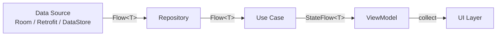
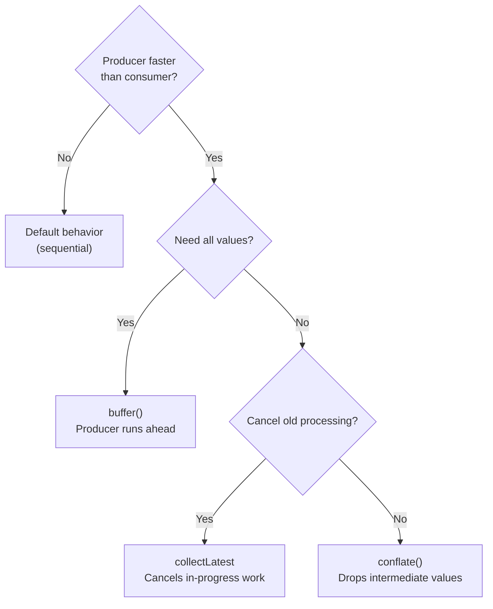

# Flow & Channel Best Practices

Architectural patterns, anti-patterns, and practical guidance for using Flow and Channel in Android apps.

---

## Architecture: Where Flows Belong



| Layer | Exposes | Why |
|---|---|---|
| **Data Source** | `Flow<T>` (cold) | On-demand, no wasted resources |
| **Repository** | `Flow<T>` (cold) | Combines/transforms data sources, stays reactive |
| **ViewModel** | `StateFlow<T>` (hot) | Lifecycle-scoped, survives config changes, holds current state |
| **UI** | Collects with lifecycle awareness | Only active when visible |

!!! tip "Rule of Thumb"
    Keep flows **cold** as long as possible. Convert to `StateFlow` at the ViewModel boundary — that's where lifecycle scoping and state caching matter.

---

## StateFlow: UI State Holder

### The Pattern

```kotlin
class ProfileViewModel(
    private val repository: ProfileRepository
) : ViewModel() {

    val uiState: StateFlow<ProfileUiState> = repository.observeProfile()
        .map { ProfileUiState.Success(it) as ProfileUiState }
        .catch { emit(ProfileUiState.Error(it.message)) }
        .stateIn(
            scope = viewModelScope,
            started = SharingStarted.WhileSubscribed(5_000),
            initialValue = ProfileUiState.Loading
        )
}

sealed interface ProfileUiState {
    data object Loading : ProfileUiState
    data class Success(val profile: Profile) : ProfileUiState
    data class Error(val message: String?) : ProfileUiState
}
```

### Common StateFlow Mistakes

| Mistake | Problem | Fix |
|---|---|---|
| Exposing `MutableStateFlow` | Consumers can modify state | Expose via `.asStateFlow()` |
| Calling `stateIn` inside a function | New sharing coroutine on every call | Store as a `val` property |
| `data class` with `var` fields | `StateFlow` uses `equals()` — won't emit | Use only `val` constructor params |
| Missing initial value | StateFlow requires one | Use a sealed class with `Loading` state |

```kotlin
// BAD — creates new sharing on every call
fun getUsers(): StateFlow<List<User>> = repository.observeUsers()
    .stateIn(viewModelScope, SharingStarted.WhileSubscribed(5_000), emptyList())

// GOOD — single shared instance
val users: StateFlow<List<User>> = repository.observeUsers()
    .stateIn(viewModelScope, SharingStarted.WhileSubscribed(5_000), emptyList())
```

### WhileSubscribed Timeout

The `5_000` ms timeout keeps the upstream flow alive during configuration changes (rotation typically takes 1-2 seconds) but stops collection when the user navigates away.

| SharingStarted | Use Case |
|---|---|
| `WhileSubscribed(5_000)` | Most UI state — stops when screen is gone |
| `Lazily` | State that's expensive to restart, no need to stop |
| `Eagerly` | State needed immediately on app start |

---

## One-Time Events: Channel vs SharedFlow

### Channel (Recommended for Most Cases)

```kotlin
class CheckoutViewModel : ViewModel() {
    private val _events = Channel<UiEvent>(Channel.BUFFERED)
    val events = _events.receiveAsFlow()

    fun onPurchase() {
        viewModelScope.launch {
            repository.purchase()
            _events.send(UiEvent.ShowConfirmation)
        }
    }
}
```

### SharedFlow (replay=0)

```kotlin
class AnalyticsViewModel : ViewModel() {
    private val _events = MutableSharedFlow<AnalyticsEvent>(
        extraBufferCapacity = 64,
        onBufferOverflow = BufferOverflow.DROP_OLDEST
    )
    val events = _events.asSharedFlow()
}
```

### Decision Matrix

| Criterion | Channel | SharedFlow(replay=0) |
|---|---|---|
| **Delivery** | Exactly once (to one collector) | To all active collectors |
| **No collector?** | Buffered, delivered when collector appears | **Lost** (unless buffered) |
| **Multiple collectors** | Fan-out (each event to one random collector) | Broadcast (each event to all) |
| **Config change survival** | Yes (buffered) | Depends on buffer config |

| Use Case | Recommended |
|---|---|
| Navigation commands | `Channel` |
| Snackbar / Toast | `Channel` |
| Analytics broadcast | `SharedFlow` with buffer |
| UI state | `StateFlow` (not events) |

---

## Lifecycle-Aware Collection

### In Activities / Fragments

```kotlin
// Single flow
lifecycleScope.launch {
    repeatOnLifecycle(Lifecycle.State.STARTED) {
        viewModel.uiState.collect { render(it) }
    }
}

// Multiple flows — launch concurrently inside repeatOnLifecycle
lifecycleScope.launch {
    repeatOnLifecycle(Lifecycle.State.STARTED) {
        launch { viewModel.uiState.collect { render(it) } }
        launch { viewModel.events.collect { handleEvent(it) } }
    }
}
```

### In Jetpack Compose

```kotlin
@Composable
fun ProfileScreen(viewModel: ProfileViewModel) {
    val state by viewModel.uiState.collectAsStateWithLifecycle()

    LaunchedEffect(Unit) {
        viewModel.events.collect { event ->
            when (event) {
                is UiEvent.ShowSnackbar -> snackbarHostState.showSnackbar(event.message)
                is UiEvent.Navigate -> navController.navigate(event.route)
            }
        }
    }
}
```

!!! warning "Don't Use collectAsState"
    `collectAsState()` (without `WithLifecycle`) keeps collecting when the app is in the background. Always use `collectAsStateWithLifecycle()` for state, and `LaunchedEffect` for events.

---

## Anti-Patterns

### 1. Collecting Without Lifecycle Awareness

```kotlin
// BAD — collects in background, wastes battery (e.g., GPS stays active)
lifecycleScope.launch {
    viewModel.locationUpdates.collect { updateMap(it) }
}

// GOOD — stops when app is backgrounded
lifecycleScope.launch {
    repeatOnLifecycle(Lifecycle.State.STARTED) {
        viewModel.locationUpdates.collect { updateMap(it) }
    }
}
```

### 2. GlobalScope for Flow Collection

```kotlin
// BAD — never cancelled, leaks resources
GlobalScope.launch {
    repository.observe().collect { /* ... */ }
}

// GOOD — cancelled when ViewModel clears
viewModelScope.launch {
    repository.observe().collect { /* ... */ }
}
```

### 3. Using withContext Inside flow { }

```kotlin
// BAD — violates flow context preservation, throws IllegalStateException
fun users(): Flow<User> = flow {
    withContext(Dispatchers.IO) {  // CRASH
        emit(fetchUser())
    }
}

// GOOD — use flowOn for upstream context switching
fun users(): Flow<User> = flow {
    emit(fetchUser())
}.flowOn(Dispatchers.IO)
```

### 4. Wrapping Flow in Another Flow Unnecessarily

```kotlin
// BAD — extra layer with no benefit
fun getUsers(): Flow<List<User>> = flow {
    emitAll(dao.observeUsers())
}

// GOOD — return the source directly
fun getUsers(): Flow<List<User>> = dao.observeUsers()
```

### 5. Blocking Calls Inside flow { } on Main

```kotlin
// BAD — blocks the collecting coroutine's thread
fun data(): Flow<Data> = flow {
    val result = blockingHttpCall()  // blocks thread!
    emit(result)
}

// GOOD — switch context for blocking work
fun data(): Flow<Data> = flow {
    val result = blockingHttpCall()
    emit(result)
}.flowOn(Dispatchers.IO)
```

### 6. Catching Exceptions in the Wrong Place

```kotlin
// BAD — catch doesn't protect the collector
flow
    .catch { emit(fallback) }
    .collect { throw RuntimeException("not caught!") }

// GOOD — catch protects upstream; wrap collector in try-catch if needed
flow
    .catch { emit(fallback) }
    .collect {
        try { process(it) } catch (e: Exception) { handleError(e) }
    }
```

---

## Channel Patterns

### Producer-Consumer with Fan-Out

```kotlin
val tasks = Channel<Task>(Channel.BUFFERED)

// Single producer
launch {
    taskList.forEach { tasks.send(it) }
    tasks.close()
}

// Multiple consumers — each task processed by exactly one worker
repeat(4) { workerId ->
    launch {
        for (task in tasks) {
            process(workerId, task)
        }
    }
}
```

### Fan-In: Multiple Producers

```kotlin
val events = Channel<Event>(Channel.BUFFERED)

// Multiple producers → single channel
launch { networkEvents.collect { events.send(it) } }
launch { sensorEvents.collect { events.send(it) } }
launch { timerEvents.collect { events.send(it) } }

// Single consumer
for (event in events) {
    handleEvent(event)
}
```

### Thread-Safe State with Channel

Use a Channel to serialize access to mutable state without locks:

```kotlin
sealed interface CounterCommand {
    data object Increment : CounterCommand
    class GetCount(val response: CompletableDeferred<Int>) : CounterCommand
}

class CounterActor(scope: CoroutineScope) {
    private val commands = Channel<CounterCommand>(Channel.BUFFERED)

    init {
        scope.launch {
            var count = 0
            for (cmd in commands) {
                when (cmd) {
                    is CounterCommand.Increment -> count++
                    is CounterCommand.GetCount -> cmd.response.complete(count)
                }
            }
        }
    }

    suspend fun increment() = commands.send(CounterCommand.Increment)

    suspend fun getCount(): Int {
        val response = CompletableDeferred<Int>()
        commands.send(CounterCommand.GetCount(response))
        return response.await()
    }
}
```

---

## Testing Flows

### With Turbine

[Turbine](https://github.com/cashapp/turbine) is the standard library for testing Flows.

```kotlin
@Test
fun `emits loading then success`() = runTest {
    val viewModel = ProfileViewModel(FakeRepository())

    viewModel.uiState.test {
        assertEquals(ProfileUiState.Loading, awaitItem())
        assertEquals(ProfileUiState.Success(fakeProfile), awaitItem())
        cancelAndConsumeRemainingEvents()
    }
}

@Test
fun `search debounces input`() = runTest {
    val viewModel = SearchViewModel(FakeApi())

    viewModel.searchResults.test {
        assertEquals(SearchState.Idle, awaitItem())
        viewModel.onQueryChanged("kot")
        viewModel.onQueryChanged("kotl")
        viewModel.onQueryChanged("kotlin")
        // Only "kotlin" triggers a search after debounce
        assertEquals(SearchState.Loading, awaitItem())
        assertEquals(SearchState.Success(results), awaitItem())
    }
}
```

### Testing StateFlow Without Turbine

```kotlin
@Test
fun `loads data on init`() = runTest {
    val viewModel = MyViewModel(FakeRepository())

    // backgroundScope keeps collection alive for the test duration
    val states = mutableListOf<UiState>()
    backgroundScope.launch(UnconfinedTestDispatcher(testScheduler)) {
        viewModel.uiState.toList(states)
    }

    runCurrent()
    assertEquals(listOf(UiState.Loading, UiState.Success(data)), states)
}
```

### Testing Channel Events

```kotlin
@Test
fun `purchase sends confirmation event`() = runTest {
    val viewModel = CheckoutViewModel(FakeRepository())

    viewModel.events.test {
        viewModel.onPurchase()
        assertEquals(UiEvent.ShowConfirmation, awaitItem())
    }
}
```

---

## Performance Guidelines

| Guideline | Why |
|---|---|
| Use `flowOn` instead of `withContext` inside `flow {}` | `flowOn` creates a proper buffered channel between contexts |
| Use `conflate()` for rapid UI updates | Drops intermediate values — collector always gets the latest |
| Use `WhileSubscribed(5_000)` for `stateIn` | Stops upstream when UI is gone, survives config changes |
| Use `buffer()` when producer outpaces consumer | Prevents producer from suspending on each emission |
| Use `distinctUntilChanged()` on derived state | Avoids redundant UI recomposition/rendering |
| Limit `flatMapMerge` concurrency | Default is 16 — can overwhelm network/DB resources |
| Prefer `transformLatest` over `flatMapLatest` + `flow {}` | Fewer allocations, same cancellation semantics |

### Choosing the Right Backpressure Strategy



---

??? question "Should I use StateFlow or LiveData?"
    `StateFlow`. It integrates with coroutines, supports `flowOn`/operators, works in non-Android modules, and doesn't require lifecycle owners in the ViewModel layer. Use `collectAsStateWithLifecycle()` in Compose or `repeatOnLifecycle` in Views for lifecycle awareness.

??? question "How do I handle one-time events (navigation, snackbar)?"
    Use a `Channel(Channel.BUFFERED)` exposed as `receiveAsFlow()`. Events are consumed exactly once and survive brief collector absence (like configuration changes). Avoid `SharedFlow(replay=0)` for critical events — they're lost if no collector is active.

??? question "When should I use shareIn vs stateIn?"
    Use `stateIn` when you need a **current value** (UI state) — it requires an initial value and deduplicates via `equals()`. Use `shareIn` when you need a **stream of events** with configurable replay and no mandatory initial value.

??? question "Why does flowOn only affect upstream operators?"
    `flowOn` creates a **channel** between the upstream (everything above `flowOn`) and the downstream. The upstream runs on the specified dispatcher and emits into the channel. The downstream (including `collect`) runs on whatever dispatcher the collector's coroutine uses. This design preserves context isolation.

??? question "What happens if I call stateIn inside a function instead of storing it as a property?"
    Each call creates a **new** sharing coroutine with its own upstream collection. You get duplicate work, duplicate network/database calls, and each collector sees independent state. Always store `stateIn`/`shareIn` results as class properties.

??? question "How do I collect multiple flows without nesting?"
    Use `repeatOnLifecycle` with multiple `launch` blocks, or use `combine`/`merge` to unify flows before collecting. In Compose, use multiple `collectAsStateWithLifecycle()` calls — Compose handles the lifecycle automatically.

??? question "When should I use Channel vs Flow?"
    **Flow** for reactive data streams (database observations, UI state, search results). **Channel** for point-to-point communication (one-time events, producer-consumer queues, work distribution). If multiple consumers should each receive every value, use `SharedFlow`. If each value should be processed by exactly one consumer, use `Channel`.

!!! tip "Further Reading"
    - [StateFlow and SharedFlow — Android Developers](https://developer.android.com/kotlin/flow/stateflow-and-sharedflow)
    - [repeatOnLifecycle API design story — Manuel Vivo](https://medium.com/androiddevelopers/repeatonlifecycle-api-design-story-8670d76a09e4)
    - [Turbine — Flow testing library](https://github.com/cashapp/turbine)
    - [A safer way to collect flows — Android Developers](https://medium.com/androiddevelopers/a-safer-way-to-collect-flows-from-android-uis-23080b1f8bda)
