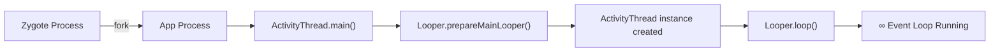
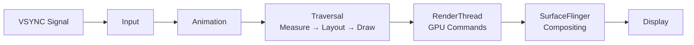
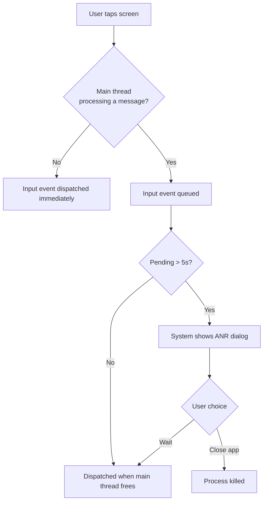

# Android Main Thread

## How the Main Thread is Created



When an app launches, Zygote forks a new process. The entry point is `ActivityThread.main()`:

```java
// ActivityThread.java (simplified)
public static void main(String[] args) {
    Looper.prepareMainLooper();          // 1. Create main Looper + MessageQueue

    ActivityThread thread = new ActivityThread();
    thread.attach(false);                // 2. Bind to AMS via Binder

    Looper.loop();                       // 3. Start infinite event loop
    // Never reaches here
    throw new RuntimeException("Main thread loop unexpectedly exited");
}
```

The main thread is a regular thread with a `Looper` — what makes it special is that **all UI operations and framework callbacks** are dispatched to its `MessageQueue`.

---

## What Runs on the Main Thread

| Category | Examples |
|---|---|
| **Lifecycle callbacks** | `onCreate`, `onStart`, `onResume`, `onPause`, `onStop`, `onDestroy` |
| **UI rendering** | Measure, layout, draw passes |
| **Input events** | Touch, click, key, gesture events |
| **BroadcastReceiver** | `onReceive()` |
| **Service callbacks** | `onStartCommand()`, `onBind()` (not the background work itself) |
| **View operations** | `invalidate()`, `requestLayout()`, animations |
| **Handler posts** | Runnables posted to the main Looper |
| **Coroutine dispatches** | Code running on `Dispatchers.Main` |

!!! note "Everything is a Message"
    Every lifecycle callback, touch event, and UI update is a `Message` in the main thread's `MessageQueue`. When you call `startActivity()`, the system sends a message to your app's main Looper saying "launch this Activity." The `ActivityThread.H` handler processes these system messages.

---

## The Rendering Pipeline



The **Choreographer** schedules rendering work on VSYNC signals. Each frame follows this sequence on the main thread:

1. **Input** — process queued touch and input events
2. **Animation** — compute animated property values (`ObjectAnimator`, `ValueAnimator`)
3. **Traversal** — walk the view tree: `measure()` → `layout()` → `draw()`

After draw, the **RenderThread** (separate from main) issues GPU commands. If the main thread is busy when VSYNC fires, the frame is skipped — the user sees **jank**.

### Frame Budget

| Refresh Rate | Frame Budget | Common Devices |
|---|---|---|
| 60 Hz | 16.67 ms | Budget/mid-range phones |
| 90 Hz | 11.11 ms | Many modern phones |
| 120 Hz | 8.33 ms | Flagships, tablets |

!!! warning "The Budget is Tighter Than You Think"
    The frame budget is the total time including input + animation + traversal. A single `SharedPreferences.apply()` commit or JSON parse on the main thread can blow the budget at 120 Hz.

---

## ANR (Application Not Responding)

An ANR occurs when the main thread is blocked and cannot process pending events within the system timeout.

| Component | Timeout |
|---|---|
| Input event dispatch (touch, key) | **5 seconds** |
| `BroadcastReceiver.onReceive()` | **10 seconds** (foreground) / 60s (background) |
| `Service.startForeground()` | **10 seconds** (Android 12+) |
| `ContentProvider` operations | No fixed timeout, but blocks main thread → input ANR |



### Common ANR Causes

| Cause | Why It Blocks |
|---|---|
| Network call on main thread | Waits for DNS + TCP + response |
| Database query on main thread | Disk I/O + query execution |
| Heavy file I/O | Disk read/write latency |
| Synchronous Binder IPC | Blocks waiting for remote process |
| Lock contention | Main thread waits for lock held by background thread |
| Deadlock | Main thread and background thread wait for each other forever |
| `BitmapFactory.decodeFile()` | Disk read + memory allocation + decode |

### StrictMode: Catching Violations in Debug

```kotlin
if (BuildConfig.DEBUG) {
    StrictMode.setThreadPolicy(
        StrictMode.ThreadPolicy.Builder()
            .detectDiskReads()
            .detectDiskWrites()
            .detectNetwork()
            .penaltyLog()
            .penaltyDeath()    // crash immediately on violation
            .build()
    )
    StrictMode.setVmPolicy(
        StrictMode.VmPolicy.Builder()
            .detectLeakedClosableObjects()
            .detectActivityLeaks()
            .penaltyLog()
            .build()
    )
}
```

---

## Communicating with the Main Thread

| Method | Context Required | When to Use |
|---|---|---|
| `Handler(Looper.getMainLooper()).post { }` | None | From any thread, any context |
| `Activity.runOnUiThread { }` | Activity reference | Inside or called from an Activity |
| `View.post { }` | View reference | When you need the view to be laid out first |
| `withContext(Dispatchers.Main)` | Coroutine | From a suspend function |
| `Dispatchers.Main.immediate` | Coroutine | Skip dispatch if already on main thread |

### View.post() vs Handler.post()

```kotlin
// View.post — runs after the view is attached and measured
override fun onCreate(savedInstanceState: Bundle?) {
    super.onCreate(savedInstanceState)
    setContentView(R.layout.activity_main)

    textView.post {
        val width = textView.width  // guaranteed valid dimensions
        val height = textView.height
    }
}

// Handler.post — posts directly to the main MessageQueue
val handler = Handler(Looper.getMainLooper())
handler.post {
    // runs on the next main Looper iteration, view may not be measured yet
    textView.text = "Updated"
}
```

`View.post()` is attached to the view's `Handler`, which means it runs **after** the view's pending layout/measure pass. Use it in `onCreate()` when you need view dimensions.

### runOnUiThread Internals

```java
// Activity.java
public final void runOnUiThread(Runnable action) {
    if (Thread.currentThread() != mUiThread) {
        mHandler.post(action);    // post if on background thread
    } else {
        action.run();             // run immediately if already on UI thread
    }
}
```

---

## CalledFromWrongThreadException

Only the thread that created the view hierarchy can modify it. This is enforced by `ViewRootImpl.checkThread()`:

```java
// ViewRootImpl.java
void checkThread() {
    if (mThread != Thread.currentThread()) {
        throw new CalledFromWrongThreadException(
            "Only the original thread that created a view hierarchy can touch its views."
        );
    }
}
```

This check fires during `requestLayout()`, `invalidate()`, and setter methods like `setText()`, `setVisibility()`, `setImageBitmap()`.

```kotlin
// CRASH — modifying view from background thread
thread {
    val data = fetchData()
    textView.text = data  // CalledFromWrongThreadException
}

// CORRECT — post UI update to main thread
thread {
    val data = fetchData()
    withContext(Dispatchers.Main) {
        textView.text = data
    }
}
```

!!! tip "Why Single-Threaded UI?"
    If multiple threads could modify the view tree simultaneously, every UI operation would need synchronization (locks). This adds complexity, risks deadlocks, and hurts performance. A single UI thread + message queue is simpler and faster — the same model used by iOS (main queue), browser JS (event loop), and desktop frameworks.

---

## Choreographer and Frame Scheduling

The `Choreographer` is the main thread's frame scheduler. It receives VSYNC signals from the display subsystem and schedules callbacks:

```kotlin
// How the framework schedules a frame
Choreographer.getInstance().postFrameCallback { frameTimeNanos ->
    // Called on VSYNC — do animation/rendering work
    val frameTimeMs = frameTimeNanos / 1_000_000
}
```

### Dropped Frames Detection

```kotlin
// Choreographer logs when frames are skipped
// Logcat: "Skipped 47 frames! The application may be doing too much work on its main thread."

// Custom detection
val startTime = System.nanoTime()
Choreographer.getInstance().postFrameCallback {
    val elapsed = (System.nanoTime() - startTime) / 1_000_000
    if (elapsed > 16) {
        Log.w("Perf", "Frame took ${elapsed}ms")
    }
}
```

---

??? question "Why does Android use a single-threaded UI model?"
    Thread safety. Multi-threaded UI would require locks around every view operation, adding complexity, deadlock risk, and performance overhead. A single UI thread with a message queue is simpler, faster, and used by most UI frameworks (iOS, browsers, desktop toolkits).

??? question "What's the difference between ANR and a crash?"
    A **crash** is an unhandled exception that terminates the process immediately. An **ANR** is system-detected unresponsiveness — the process is still running but the main thread is blocked. The system shows a dialog letting the user wait or force-stop the app.

??? question "Can you modify the UI from a background thread?"
    No. `ViewRootImpl.checkThread()` throws `CalledFromWrongThreadException`. Post UI updates to the main thread using `Handler.post()`, `runOnUiThread()`, `View.post()`, or `withContext(Dispatchers.Main)`.

??? question "What happens if you call Thread.sleep() on the main thread?"
    The main Looper is blocked — no messages are processed (no input events, no lifecycle callbacks, no rendering). If pending input events wait 5+ seconds, the system triggers an ANR.

??? question "How does Dispatchers.Main post work to the main thread?"
    `Dispatchers.Main` wraps a `Handler` bound to `Looper.getMainLooper()`. The coroutine's continuation is wrapped in a `Runnable` and posted via `Handler.post()` to the main thread's `MessageQueue`. With `Dispatchers.Main.immediate`, if already on the main thread, the code runs inline without posting.

??? question "Why does View.post() give valid dimensions but direct access in onCreate() doesn't?"
    In `onCreate()`, the view tree hasn't been measured yet — `width` and `height` are 0. `View.post()` enqueues the `Runnable` after the pending traversal (measure + layout) pass, so by the time it runs, the view has valid dimensions.

??? question "What is the relationship between Choreographer and VSYNC?"
    The `Choreographer` registers for VSYNC signals from the display subsystem. On each VSYNC, it fires registered callbacks in order: input → animation → traversal (measure/layout/draw). This ensures UI updates are synchronized with the display's refresh rate.

!!! tip "Further Reading"
    - [Android Threading Model — official docs](https://developer.android.com/guide/components/processes-and-threads)
    - [Choreographer and the rendering pipeline](https://developer.android.com/topic/performance/rendering)
    - [ANR documentation](https://developer.android.com/topic/performance/vitals/anr)
    - [StrictMode API reference](https://developer.android.com/reference/android/os/StrictMode)
