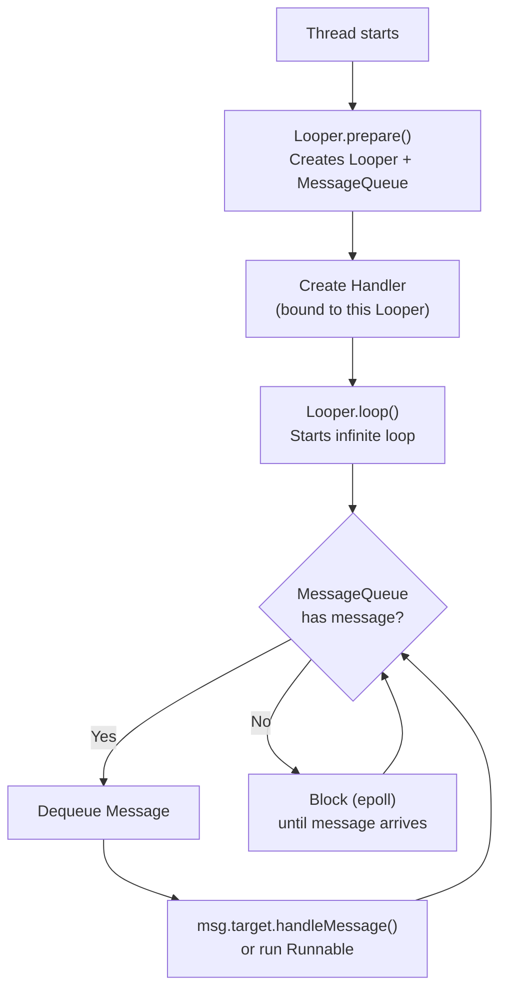
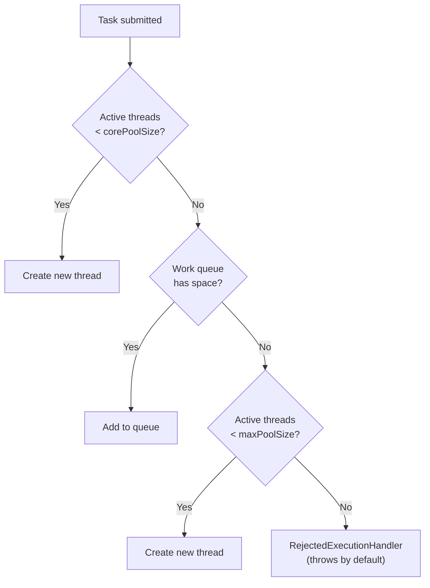

# Multithreading in Android

## Terminology

| Term | Definition |
|------|-----------|
| **Core** | Physical processing unit within CPU, independently executes instructions |
| **Process** | Running instance of an application with its own memory space, file handles, and resources |
| **Thread** | Unit of execution within a process, scheduled by the OS. Single-core CPUs handle multiple threads via time-sharing |
| **Thread Pool** | Pool of pre-created worker threads ready to execute tasks, avoids thread creation overhead |
| **Task Queue** | Holds tasks waiting for an idle thread in the pool |
| **Executors** | High-level abstractions managing creation, scheduling, and execution of threads |
| **ExecutorService** | Executor with lifecycle management (`shutdown()`) and `Future` for tracking async results |

!!! info "Concurrency vs Parallelism"
    - **Concurrency** = tasks overlap in time (possible on single-core via context switching)
    - **Parallelism** = tasks execute literally at the same time (requires multi-core)

---

## Handler, Looper, MessageQueue

### The Full Message Flow



### Looper

Tied to a specific thread. Runs an infinite message-processing loop. Each Looper owns a `MessageQueue`. One Looper per thread, enforced via `ThreadLocal` storage.

```java
public final class Looper {
    static final ThreadLocal<Looper> sThreadLocal = new ThreadLocal<>();
    private static Looper sMainLooper;
    final MessageQueue mQueue;
    final Thread mThread;

    public static void prepare() {
        if (sThreadLocal.get() != null) {
            throw new RuntimeException("Only one Looper per thread");
        }
        sThreadLocal.set(new Looper());
    }

    public static void loop() {
        final Looper me = myLooper();
        for (;;) {
            Message msg = me.mQueue.next(); // blocks until message
            msg.target.dispatchMessage(msg);
            msg.recycleUnchecked();
        }
    }
}
```

!!! info "Main Thread Looper"
    The main thread is the **only** thread with a Looper by default. Inside `ActivityThread.main()` (called by Zygote when the app process is forked), Android calls `Looper.prepareMainLooper()` and `Looper.loop()`. This is why you can post to a Handler on the main thread without any setup, but background threads require `Looper.prepare()` first.

### Handler

Posts `Message`s or `Runnable`s to a thread's `MessageQueue`. The Handler is always bound to the Looper (and thus the thread) it was created on.

```kotlin
// Post work to the main thread from a background thread
val mainHandler = Handler(Looper.getMainLooper())
mainHandler.post {
    textView.text = "Updated from background"
}

// Post with delay
mainHandler.postDelayed({
    showTimeout()
}, 5000)

// Send a Message with what/arg
val msg = Message.obtain(mainHandler, WHAT_UPDATE, data)
mainHandler.sendMessage(msg)
```

### Message

Container for data to be dispatched by a Handler. Has a `target` (the Handler), `what` (int identifier), `arg1`/`arg2`, and `obj` fields.

!!! tip "Message.obtain() over new Message()"
    `Message.obtain()` pulls from a **global pool** (max 50 messages). Avoids allocation and GC pressure in high-throughput message loops.

### MessageQueue

Priority queue of `Message` objects sorted by `when` (timestamp). Uses Linux `epoll` for efficient blocking when the queue is empty — the thread actually sleeps and consumes no CPU.

### ThreadLocal

Per-thread storage mechanism. Each thread gets its own independent copy of the stored value. Used internally by `Looper` to store the one-Looper-per-thread mapping.

```kotlin
val threadLocal = ThreadLocal<String>()

thread {
    threadLocal.set("Thread A value")
    println(threadLocal.get()) // "Thread A value"
}

thread {
    threadLocal.set("Thread B value")
    println(threadLocal.get()) // "Thread B value"
}
```

---

## HandlerThread

A `Thread` subclass that comes with its own `Looper`. Useful for sequential background tasks that need a message loop.

```kotlin
val handlerThread = HandlerThread("BackgroundThread")
handlerThread.start() // calls Looper.prepare() + Looper.loop() internally

val backgroundHandler = Handler(handlerThread.looper)
backgroundHandler.post {
    // runs on the HandlerThread
    val result = doExpensiveWork()

    Handler(Looper.getMainLooper()).post {
        // post result back to main thread
        updateUI(result)
    }
}

// Don't forget to quit when done
handlerThread.quitSafely()
```

---

## AsyncTask (Deprecated)

!!! warning "Deprecated since API 30"
    `AsyncTask` was deprecated in Android 11. It had fundamental issues: leaked Activity references, no lifecycle awareness, confusing error handling, and the serial executor bottleneck. **Do not use in new code.** Use coroutines instead.

Legacy flow for reference: `onPreExecute()` (main) --> `doInBackground()` (background) --> `onPostExecute()` (main).

---

## ThreadPoolExecutor

Java thread pool that manages worker threads with configurable sizing.

### Optimal Pool Size

```java
private static final int CPU_COUNT = Runtime.getRuntime().availableProcessors();
private static final int CORE_POOL_SIZE = CPU_COUNT + 1;       // CPU-bound tasks
private static final int MAXIMUM_POOL_SIZE = CPU_COUNT * 2 + 1; // burst capacity
```

### Parameters

| Parameter | Description |
|-----------|-------------|
| `corePoolSize` | Minimum threads kept alive. Created as tasks arrive. |
| `maximumPoolSize` | Max threads allowed. Excess threads created only when the work queue is **full**. |
| `keepAliveTime` | Idle timeout for threads above `corePoolSize` |
| `workQueue` | `BlockingQueue<Runnable>` holding pending tasks |

### Task Submission Flow



---

## Synchronization

### Volatile

Guarantees **visibility** across threads. Writes go directly to main memory; reads always come from main memory. Does **not** guarantee atomicity.

```kotlin
@Volatile
var isRunning = true // all threads see the latest value immediately
```

### Synchronized

Provides both **visibility** and **mutual exclusion**. Only one thread at a time can execute a synchronized block on the same monitor.

```kotlin
val lock = Any()
var counter = 0

synchronized(lock) {
    counter++ // atomic read-modify-write under the lock
}
```

### Atomic Classes

`AtomicInteger`, `AtomicBoolean`, `AtomicReference`, etc. Provide lock-free thread-safe operations using **CAS (Compare-And-Swap)** CPU instructions.

```kotlin
val counter = AtomicInteger(0)
counter.incrementAndGet()     // atomic: read + increment + write
counter.compareAndSet(5, 10)  // set to 10 only if current value is 5
```

!!! note "When to use Atomic vs Synchronized"
    Use `AtomicXXX` for single-variable thread safety (counters, flags). Use `synchronized` when multiple variables must be updated together atomically.

### ReentrantLock

Like `synchronized` but with more control. The **same thread** can acquire the lock multiple times without deadlocking (re-entrant). Supports `tryLock()` with timeout, interruptible locking, and fairness policies.

```kotlin
val lock = ReentrantLock()

fun updateState() {
    lock.lock()
    try {
        // critical section
        // can call other methods that also lock.lock() — same thread won't deadlock
    } finally {
        lock.unlock()
    }
}

// Non-blocking attempt with timeout
if (lock.tryLock(1, TimeUnit.SECONDS)) {
    try {
        // acquired the lock
    } finally {
        lock.unlock()
    }
} else {
    // could not acquire within 1 second
}
```

### ReadWriteLock

Allows **multiple concurrent readers** or **one exclusive writer**. Ideal for data structures read far more often than written.

```kotlin
val rwLock = ReentrantReadWriteLock()
val cache = mutableMapOf<String, String>()

fun read(key: String): String? {
    rwLock.readLock().lock()
    try {
        return cache[key] // multiple threads can read simultaneously
    } finally {
        rwLock.readLock().unlock()
    }
}

fun write(key: String, value: String) {
    rwLock.writeLock().lock()
    try {
        cache[key] = value // exclusive access, blocks all readers and other writers
    } finally {
        rwLock.writeLock().unlock()
    }
}
```

### Semaphore

Allows a **fixed number** of threads to access a shared resource concurrently.

```kotlin
val semaphore = Semaphore(3) // max 3 concurrent accesses

fun accessResource() {
    semaphore.acquire() // blocks if 3 threads already inside
    try {
        // use shared resource
    } finally {
        semaphore.release()
    }
}
```

### Mutex (Coroutine World)

The coroutine equivalent of `synchronized`, but **suspends** instead of blocking the thread. Non-reentrant.

```kotlin
val mutex = Mutex()
var sharedState = 0

suspend fun safeIncrement() {
    mutex.withLock {
        sharedState++ // only one coroutine at a time
    }
}
```

!!! warning "Mutex is Non-Reentrant"
    Unlike `ReentrantLock`, `Mutex` will **deadlock** if the same coroutine tries to acquire it twice. This is by design — coroutines can switch dispatchers, so re-entrancy semantics become ambiguous. If you need re-entrant behavior, restructure your code to avoid nested lock acquisition.

### Race Conditions

Occur when multiple threads **write** to shared state simultaneously with no synchronization. Read-only access to immutable data does **not** cause race conditions.

---

## Deadlock

Two or more threads are blocked forever, each waiting for the other to release a lock.

??? example "Deadlock Example"

    ```kotlin
    val lockA = ReentrantLock()
    val lockB = ReentrantLock()

    // Thread 1: acquires lockA, then tries to acquire lockB
    thread(name = "Thread-1") {
        lockA.lock()
        println("Thread-1: holding lockA, waiting for lockB...")
        Thread.sleep(100) // simulate work, gives Thread-2 time to acquire lockB
        lockB.lock() // BLOCKS FOREVER — Thread-2 holds lockB
        println("Thread-1: got both locks") // never reached
        lockB.unlock()
        lockA.unlock()
    }

    // Thread 2: acquires lockB, then tries to acquire lockA
    thread(name = "Thread-2") {
        lockB.lock()
        println("Thread-2: holding lockB, waiting for lockA...")
        Thread.sleep(100)
        lockA.lock() // BLOCKS FOREVER — Thread-1 holds lockA
        println("Thread-2: got both locks") // never reached
        lockA.unlock()
        lockB.unlock()
    }

    // Result: Both threads are permanently blocked — DEADLOCK
    ```

**Prevention strategies:**

- **Consistent lock ordering** — always acquire locks in the same order (e.g., always lockA before lockB)
- **`tryLock()` with timeout** — fail gracefully instead of blocking forever
- **Prefer higher-level abstractions** — coroutines, Flow, and Channels avoid explicit locking
- **Minimize lock scope** — hold locks for the shortest time possible

---

## Coroutine Dispatchers vs Thread Pools

| Old World (Java) | Coroutine World | Notes |
|-----------|----------------|-------|
| `Executors.newFixedThreadPool(n)` | `Dispatchers.Default` | Sized to CPU core count |
| `Executors.newCachedThreadPool()` | `Dispatchers.IO` | Expands up to 64 threads |
| `Handler(Looper.getMainLooper())` | `Dispatchers.Main` | UI thread |
| `HandlerThread` | `newSingleThreadContext()` | Dedicated single thread |
| `Executors.newFixedThreadPool(n)` | `Dispatchers.IO.limitedParallelism(n)` | Private sub-dispatcher |

### Dispatchers.IO.limitedParallelism(n)

Creates a **private view** of the IO dispatcher limited to `n` concurrent coroutines. Better than `newFixedThreadPool` for coroutines because:

- Shares threads with the IO pool (no extra threads sitting idle)
- Properly integrates with structured concurrency
- No need to manually shut down the executor

```kotlin
// Limit database operations to 4 concurrent coroutines
val dbDispatcher = Dispatchers.IO.limitedParallelism(4)

suspend fun queryDatabase() = withContext(dbDispatcher) {
    // at most 4 coroutines executing DB queries concurrently
    database.query(...)
}

// Limit file I/O to 2 concurrent coroutines
val fileDispatcher = Dispatchers.IO.limitedParallelism(2)
```

!!! note "limitedParallelism on Default vs IO"
    - `Dispatchers.Default.limitedParallelism(n)` — creates a view that uses **at most** n threads from the Default pool (constrains parallelism)
    - `Dispatchers.IO.limitedParallelism(n)` — creates an **independent** pool that can go **beyond** the 64-thread IO limit. Use this for operations that should not compete with general IO (e.g., database connections)

!!! tip "When to Use What"
    - **CPU-bound** (parsing, sorting, computation) --> `Dispatchers.Default` (core count threads)
    - **IO-bound** (network, disk, database) --> `Dispatchers.IO` (up to 64 threads)
    - **Throttled resource** (DB connection pool, rate-limited API) --> `Dispatchers.IO.limitedParallelism(n)` where n matches the resource limit
    - **UI updates** --> `Dispatchers.Main`

---

## HandlerThread vs Executor vs Coroutine

| Criteria | HandlerThread | ExecutorService | Coroutines |
|----------|--------------|-----------------|------------|
| **Model** | Single thread + message loop | Thread pool | Suspendable functions |
| **Cancellation** | Manual (removeCallbacks) | `Future.cancel()` | Structured concurrency (automatic) |
| **Lifecycle awareness** | None | None | `viewModelScope`, `lifecycleScope` |
| **Error handling** | Uncaught = crash | `Future.get()` throws | `CoroutineExceptionHandler`, try/catch |
| **Sequential tasks** | Natural (single thread) | Requires single-thread executor | Natural (sequential by default) |
| **Best for** | Legacy code, system services | Java interop, fine-grained pool control | Everything in modern Android |

!!! tip "Recommendation"
    Use coroutines for all new code. The only exception is low-level framework code or `Application.onCreate` where coroutine initialization overhead matters.
