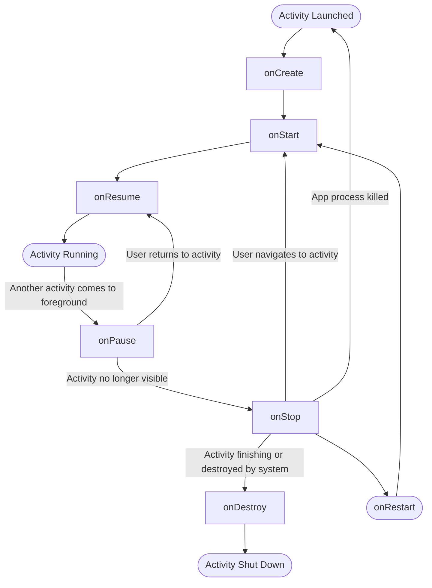
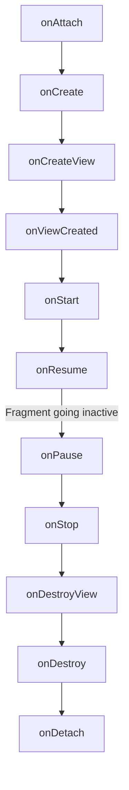

# Activity, Fragment & Lifecycle

## Activity Lifecycle



### State Saving on Configuration Change / Process Kill

- After `onPause` → `onSaveInstanceState`
- Before `onResume` → `onRestoreInstanceState`

### Opening Activity B from A (and Back Press)

**Forward navigation:**

1. A `onPause`
2. B `onCreate` → `onStart` → `onResume`
3. A `onStop`

**Back press:**

1. B `onPause`
2. A `onCreate` (depending on launch mode) → `onStart` → `onResume`
3. B `onStop` → `onDestroy`

---

## Activity Launch Modes

=== "Standard"

    Each Activity is added as a new instance in the Task stack. Multiple instances can exist.

=== "SingleTop"

    If the top activity opens again, **no new activity** is created. Instead, `onNewIntent()` is called on the existing instance.

=== "SingleTask"

    If the activity is already present in the stack, all activities above it are destroyed and `onNewIntent()` is called.

    !!! note "Task Affinity"
        - **Without `taskAffinity`**: All activities share the same affinity.
        - **With `taskAffinity`**: Opens in a separate task (two app icons appear in recents).
        - New activities launched from a `singleTask` activity take its affinity.

=== "SingleInstance"

    Opens in a **separate task**. The task can have only one activity. New activities launched from it open in the previous stack.

    One icon in recents unless a different `taskAffinity` is assigned.

---

## Fragment Lifecycle



### Callback Details

| Callback | Purpose |
|---|---|
| `onAttach` | Fragment attached to its host activity |
| `onCreate` | Fragment created, initialize non-UI components |
| `onCreateView` | Inflate the layout |
| `onViewCreated` | View is fully created, set up UI |
| `onDestroyView` | View hierarchy destroyed |
| `onDestroy` | Fragment destroyed |
| `onDetach` | Fragment detached from activity |

### Fragment Added in Activity's onCreate (Without Backstack)

**Creation order:**

1. Activity `onCreate`
2. Fragment `onAttach` → `onCreate` → `onCreateView` → `onViewCreated`
3. Activity `onStart`
4. Fragment `onStart`
5. Activity `onResume`
6. Fragment `onResume`

**Destruction order (back press):**

1. Fragment `onPause`
2. Activity `onPause`
3. Fragment `onStop`
4. Activity `onStop`
5. Fragment `onDestroyView` → `onDestroy` → `onDetach`
6. Activity `onDestroy`

---

## Fragment API

### FragmentManager and FragmentTransaction

- `FragmentManager` has `FragmentTransaction`
- `FragmentTransaction` supports: `add()` / `replace()` / `remove()`
- `addToBackStack()` — maintains a backstack of **transactions**, not fragments
- `commit()` finishes the transaction
- `popBackStack()` removes the last transaction

### Fragment A to B Transitions

=== "add() and Back Press"

    **Forward:** A (`onAttach` through `onResume`) → B (`onAttach` through `onResume`)

    **Back press:** B (`onPause` through `onDetach`)

    !!! tip
        With `add()`, Fragment A stays in the resumed state. Fragment B is added on top.

=== "replace() and Back Press"

    **Forward:** A (`onAttach` through `onResume`) → B (`onAttach` through `onResume`) → A (`onPause` through `onDestroyView`)

    !!! warning "Important"
        A will **NOT** call `onDestroy` / `onDetach` when replaced (if added to backstack).

    **Back press:** B (`onPause` through `onDetach`) → A (`onCreateView` through `onResume`)

### commit vs commitAllowingStateLoss

- `commit()` throws `IllegalStateException` if called after `onSaveInstanceState`
- `commitAllowingStateLoss()` does **not** throw the exception — but state may be lost

---

## Lifecycle Observers

```kotlin
class MyObserver : DefaultLifecycleObserver {
    override fun onStart(owner: LifecycleOwner) { super.onStart(owner) }
    override fun onStop(owner: LifecycleOwner) { super.onStop(owner) }
}

// For activity
lifecycle.addObserver(MyObserver())

// For application
ProcessLifecycleOwner.get().lifecycle.addObserver(MyObserver())
```

---

## Configuration Changes

Configuration changes include: **orientation**, **theme**, **locale**.

Handling strategies:

=== "onSaveInstanceState / onRestoreInstanceState"

    Store and restore state via `Bundle`.

    !!! warning "Bundle Size Limit"
        Bundle supports primitives, `Serializable`, and `Parcelable`. The limit is **1 MB** — exceeding it causes `TransactionTooLargeException`.

=== "ViewModel"

    Survives configuration changes but **not process death**.

    Use `SavedStateHandle` within ViewModel to survive process death.

=== "android:configChanges Flag"

    Declare in the manifest to handle specific config changes manually without recreating the activity.

---

## Other Important Concepts

### supportFragmentManager vs childFragmentManager

- `supportFragmentManager` — activity-level fragment manager
- `childFragmentManager` — fragment-level fragment manager (for nested fragments)

### lifecycleOwner vs viewLifecycleOwner

- `lifecycleOwner` — Fragment's overall lifecycle (`onAttach` to `onDetach`)
- `viewLifecycleOwner` — Fragment's **View** lifecycle (`onCreateView` to `onDestroyView`)

!!! tip
    Use `viewLifecycleOwner` when observing LiveData in fragments to avoid duplicate observers after view recreation.

### setContentView() in onCreate

Heavy operation — called only once in `onCreate`.

### finish() in onCreate

If `finish()` is called in `onCreate`, `onDestroy` is called **without** `onPause` / `onStop`.

### Fragments Without Activity

A fragment can exist as an object in memory but will have **no UI** or lifecycle callbacks.

### onPause vs onStop

| | onPause | onStop |
|---|---|---|
| User can interact? | No | No |
| User can see? | Partially (e.g., dialog over activity) | No |

### Default Constructor for Fragment

A default (no-arg) constructor is required because on orientation change, the system **recreates** the fragment using the default constructor.

### Why Use ConstraintLayout

ConstraintLayout flattens the view hierarchy, saving `measure` / `layout` / `draw` calls compared to nested layouts.
