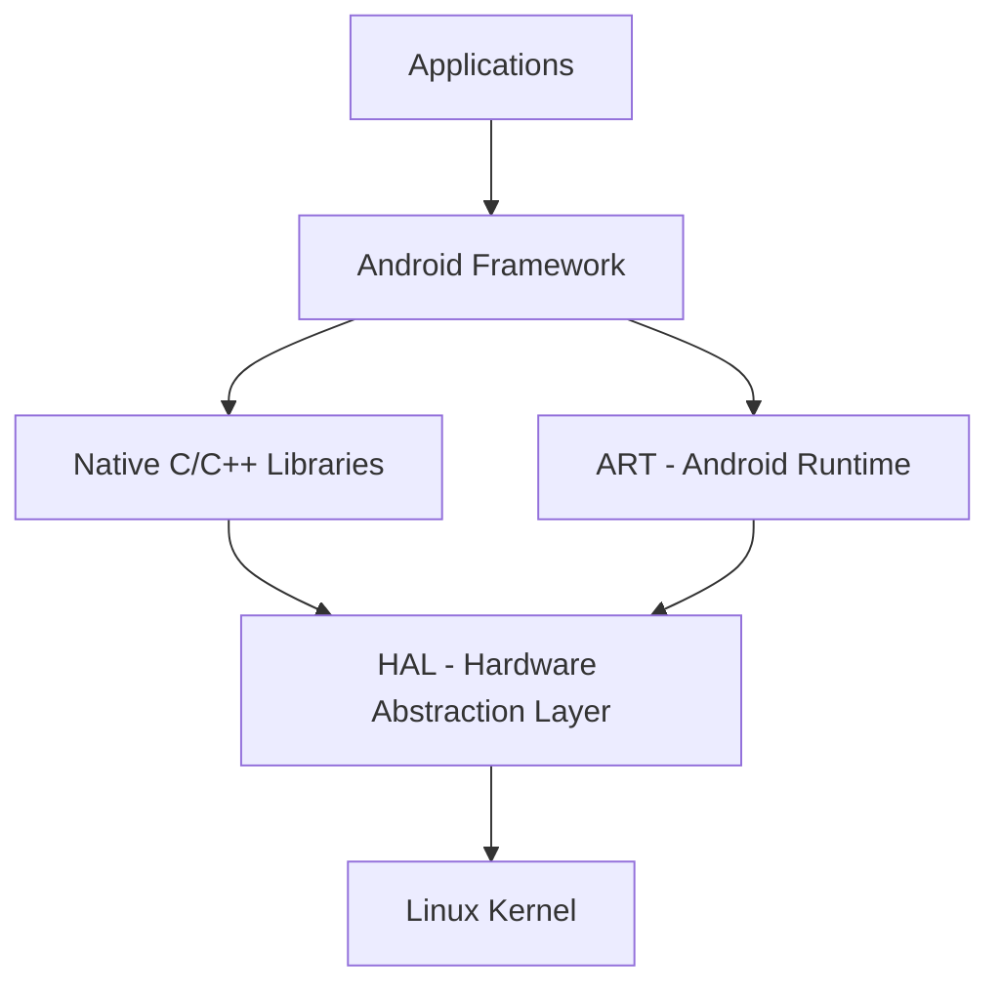
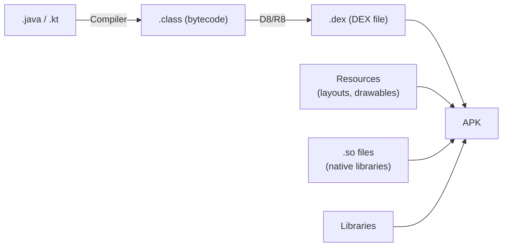

# Android Architecture & Runtime

## Android Architecture

Android is built on top of the **Linux OS**. The architecture is organized into distinct layers, each serving a specific purpose.

### Architecture Layers

#### Linux Kernel

Low-level hardware interaction. Provides core system services such as memory management, process management, and device drivers.

#### HAL (Hardware Abstraction Layer)

Interface for the Android framework to communicate with device-specific hardware — camera, display, sensors, etc. Each hardware vendor implements the HAL interfaces for their specific hardware.

#### ART (Android Runtime)

Runtime environment that executes and manages Java/Kotlin code. Uses **AOT (Ahead-of-Time) compilation** to convert bytecode into native machine code.

#### Native C/C++ Libraries

- **OpenGL** — graphic rendering
- **SQLite** — database
- **WebKit** — web content rendering

#### Android Framework

Higher-level APIs used by application developers:

- `ActivityManager`
- `NotificationManager`
- `Content Providers`

#### Applications

Topmost layer — the actual apps built using the Android SDK.

### How Pixels Are Displayed

App creates GUI → rendered by framework → communication with display drivers and hardware.

---

## Android Runtime (ART)

### ByteCode vs Machine Code

- **ByteCode** = `.class` file, an intermediate representation read by a VM which converts it to machine code
- **Machine Code** = native code, directly executed by the CPU

### Dalvik vs ART

| | Dalvik (Before Android 5.0) | ART (Android 5.0+) |
|---|---|---|
| Compilation | JIT (Just-In-Time) | AOT (Ahead-of-Time) |
| When | At runtime | Before execution, usually at build-time |
| Performance | Slower runtime | Better performance |

!!! info "AOT Compilation"
    AOT = compiling higher-level language to lower-level **before** execution, usually at build-time. This contrasts with JIT which compiles during execution.

### NDK and JNI

- **NDK** allows writing C/C++ code that is directly converted to machine code
- **JNI (Java Native Interface)** bridges Java/Kotlin and C/C++

### ART Tradeoffs

!!! warning "Tradeoffs"
    ART provides better runtime performance but comes with increased **install time** and **disk size**.

### Compilation Strategies

=== "Profile-Guided Compilation"

    Use JIT for the first few times the app runs, then cache important parts for AOT compilation.

    **Issue:** App is slow initially until profiles are built up.

=== "ART Cloud Profiles"

    Google aggregates user data across devices and creates **Cloud Profiles**, which are used to cache ahead of time.

    **Issue:** Slow for initial users of a new app (no data to aggregate yet).

=== "Baseline Profile"

    Developer uploads a profile that is **shipped with the APK**. The profile declares the most visited code paths for AOT compilation.

    This is the recommended approach for ensuring good performance from the first launch.

---

## JVM

The JVM is an interpreter that executes Java applications by converting bytecode to native code.

!!! tip "JVM on Android"
    The JVM is used for **Android Studio IDE** and **Gradle**. It is **NOT** used on devices or emulators — those use ART.

### Compilation Flow

- **Java:** `.java` → `javac` → `.class`
- **Kotlin:** Uses the JVM to convert `.kt` → `.class`

---

## APK vs AAB

=== "APK (Android Package)"

    - Complete, ready-to-install package
    - Contains **all resources** for all configurations (CPU architectures, languages, screen densities)
    - **Larger** file size

=== "AAB (Android App Bundle)"

    - Upload format for Google Play
    - Google Play generates **device-specific APKs** from the bundle
    - **Smaller** download size for users

---

## How an APK Is Formed

1. Kotlin/Java source files (`.java` / `.kt`) are compiled to bytecode (`.class`)
2. Bytecode is converted to **DEX format** (`.dex`)
3. All resources, `.so` files, libraries, and DEX files are packaged into the APK

!!! note "DEX Format"
    The DEX format is optimized for Android with efficient storage and execution. There is a **64K method limit** per DEX file (multidex is used to work around this).

---

## Zygote

Zygote is a special system process that:

- Initializes the Dalvik/ART runtime
- Preloads essential classes and resources

When an app is launched, a new process is **forked from Zygote**, significantly reducing startup time since the runtime and common classes are already loaded.

---

## CPU Architectures

Android supports multiple CPU architectures:

- **arm64** — most common on modern devices
- **x86** — used primarily in emulators
