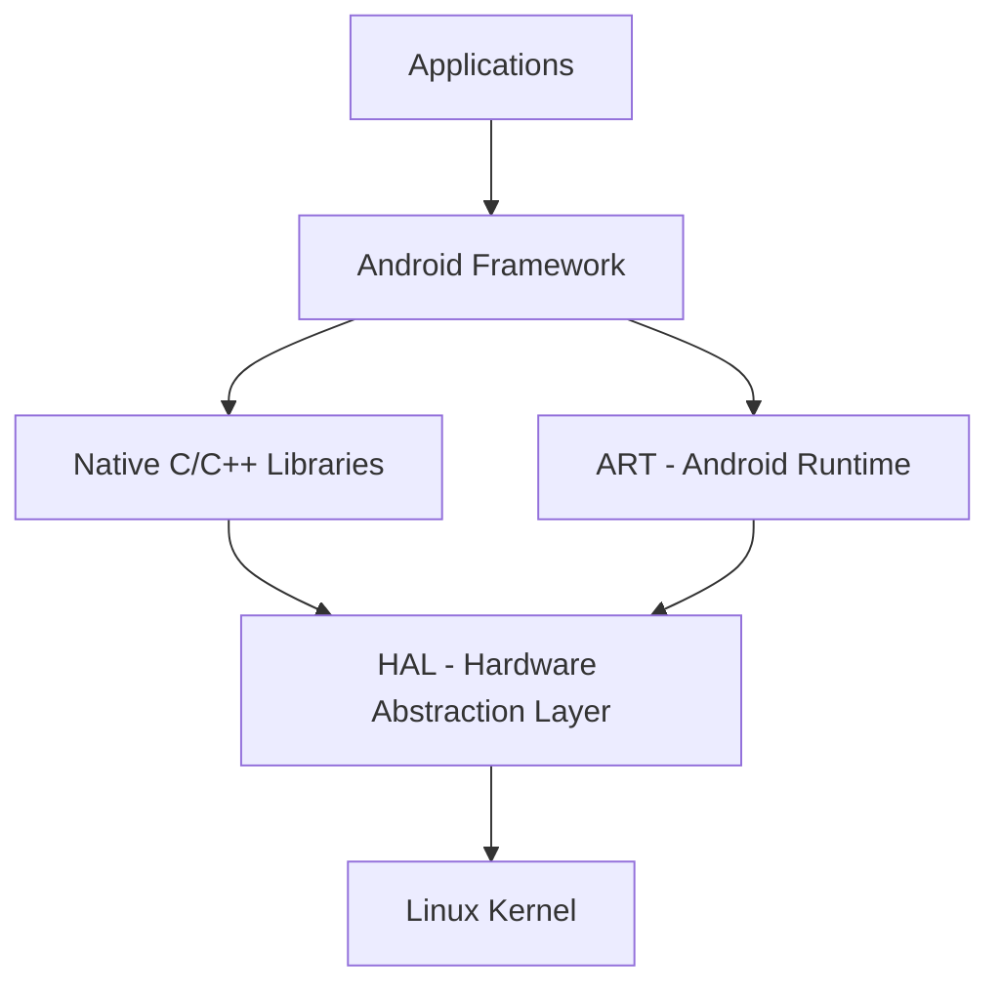
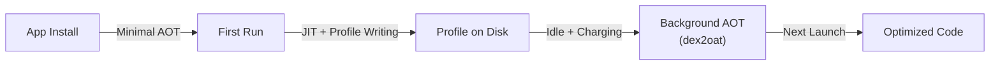
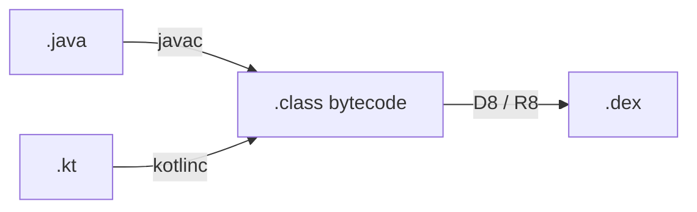
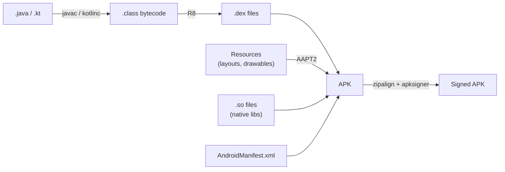
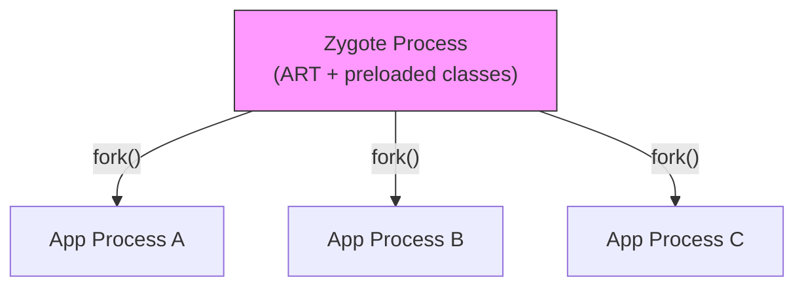

# Android Architecture & Runtime

## Android Architecture

Android is built on top of the **Linux kernel**. The architecture is organized into distinct layers, each serving a specific purpose.



### Architecture Layers

#### Linux Kernel

The foundation of Android. Provides core system services: memory management, process management, device drivers, power management, and the security model (UIDs, file permissions, SELinux). Every Android app ultimately runs as a Linux process.

#### HAL (Hardware Abstraction Layer)

Standard interface for the Android framework to communicate with device-specific hardware — camera, Bluetooth, sensors, audio, etc. Each hardware vendor implements HAL interfaces for their hardware, allowing the framework to remain hardware-agnostic.

#### ART (Android Runtime)

Runtime environment that executes and manages Java/Kotlin code. Uses a **hybrid compilation** strategy combining AOT, JIT, and profile-guided compilation.

#### Native C/C++ Libraries

- **OpenGL ES** — graphics rendering
- **SQLite** — embedded relational database
- **WebKit** — web content rendering
- **libc (Bionic)** — Android's custom C library, optimized for mobile

#### Android Framework

Higher-level Java/Kotlin APIs used by application developers:

- `ActivityManager` — manages the Activity lifecycle and back stack
- `WindowManager` — manages on-screen windows
- `NotificationManager` — manages notifications
- `PackageManager` — provides information about installed packages
- `Content Providers` — structured data sharing between apps

#### Applications

Topmost layer — the actual apps built using the Android SDK (system apps like Dialer, SMS, and third-party apps).

---

## Android Runtime (ART)

### Bytecode vs Machine Code

- **Bytecode** = `.class` file, an intermediate representation that a VM translates to machine code
- **Machine Code** = native CPU instructions, directly executed by the processor

### Dalvik vs ART

| | Dalvik (Before Android 5.0) | ART (Android 5.0+) |
|---|---|---|
| Compilation | JIT (Just-In-Time) only | Hybrid: AOT + JIT + Profile-Guided |
| When | At runtime, every time | Combination of install-time, runtime, and idle-time |
| Performance | Slower startup and runtime | Significantly better performance |
| Memory | Smaller install footprint | Larger install footprint (compiled code stored on disk) |

### ART: Hybrid Compilation (Android 7+)

!!! info "ART is NOT pure AOT"
    A common misconception is that ART only does AOT compilation. Modern ART (Android 7+) uses a **three-phase hybrid** approach combining AOT, JIT, and profile-guided compilation.

**Phase 1 — Install Time:**
Only critical code paths are AOT compiled (or none at all on fresh install). This keeps install times fast.

**Phase 2 — Runtime (JIT):**
When the app runs, ART's JIT compiler kicks in for methods that are executed frequently ("hot methods"). The JIT writes **profile data** to disk recording which methods are hot and which classes are used during startup.

**Phase 3 — Idle/Charging (Background dexopt):**
A background daemon (`dex2oat`) runs when the device is idle and charging. It reads the accumulated profiles and AOT-compiles the profiled methods. This produces optimized native code for the next launch.



### Compilation Strategies

=== "Cloud Profiles"

    Google aggregates profile data across devices and creates **Cloud Profiles** distributed via Play Store. These profiles allow AOT compilation of hot methods even on first install.

    **Limitation:** Not available for brand-new apps with no user base yet.

=== "Baseline Profiles"

    Developer-created profiles **shipped inside the APK/AAB**. Declare the most critical code paths (startup, navigation) for AOT compilation on install.

    ```
    // baseline-prof.txt (generated by Macrobenchmark)
    HSPLcom/example/MyApp;->onCreate()V
    HSPLcom/example/HomeScreen;->compose()V
    ```

    This is the recommended approach for ensuring good performance from the first launch, especially for new apps without Cloud Profile data.

### NDK and JNI

- **NDK (Native Development Kit)** — write performance-critical code in C/C++, compiled directly to machine code
- **JNI (Java Native Interface)** — bridge between Java/Kotlin and native C/C++ code. Allows calling native functions from managed code and vice versa.

---

## JVM

The JVM is a virtual machine that executes Java applications by interpreting bytecode and JIT-compiling hot paths to native code.

!!! tip "JVM on Android"
    The JVM is used for **Android Studio IDE** and **Gradle build system**. It is **NOT** used on devices or emulators — those use ART.

### Compilation Flow



- **Java:** `.java` --> `javac` --> `.class`
- **Kotlin:** `.kt` --> `kotlinc` --> `.class`

!!! warning "Common Misconception"
    Kotlin does **not** use the JVM to convert `.kt` to `.class`. The Kotlin compiler (`kotlinc`) directly compiles `.kt` files to `.class` bytecode. The JVM is not involved in the compilation process.

### D8 vs R8

| | D8 | R8 |
|---|---|---|
| **Role** | Dex compiler | Dex compiler + optimizer |
| **Input** | `.class` bytecode | `.class` bytecode |
| **Output** | `.dex` files | `.dex` files (optimized) |
| **What it does** | Converts Java bytecode to DEX bytecode, desugars Java 8+ features | Everything D8 does **plus** shrinking (remove unused code), optimization (inline methods, remove dead branches), obfuscation (rename classes/methods), and desugaring — all in one step |

!!! note "R8 = D8 + ProGuard"
    R8 replaced the old D8 + ProGuard pipeline. Instead of two separate steps, R8 performs dexing and optimization in a single pass, producing smaller and faster DEX files.

---

## APK vs AAB

=== "APK (Android Package)"

    - Complete, ready-to-install package
    - Contains **all resources** for all configurations (CPU architectures, languages, screen densities)
    - **Larger** file size
    - Can be sideloaded directly

=== "AAB (Android App Bundle)"

    - Upload format for Google Play (required since August 2021)
    - Google Play generates **device-specific APKs** (split APKs) from the bundle
    - **Smaller** download size — users only get resources matching their device
    - Cannot be sideloaded directly (use `bundletool` for local testing)

---

## How an APK Is Formed



1. Kotlin/Java source files are compiled to `.class` bytecode
2. R8 converts bytecode to optimized **DEX format** (`.dex`)
3. AAPT2 compiles resources into a binary format
4. All DEX files, compiled resources, native libraries, and manifest are packaged into the APK
5. APK is aligned (`zipalign`) and signed (`apksigner`)

### The 64K Method Limit (Multidex)

!!! note "Why 64K?"
    DEX bytecode uses a **16-bit index** for method references. 2^16 = 65,536 methods maximum per DEX file. This includes methods from your code, libraries, and the Android framework.

When an app exceeds 64K methods, it must be split into **multiple DEX files** (multidex).

- **Android 5.0+ (API 21+):** Multidex is handled natively by ART. ART looks for `classesN.dex` files at install time and compiles them all.
- **Android 4.x:** Required the `multidex` support library, which patched the classloader at runtime to load additional DEX files.

```groovy
// Only needed for minSdk < 21
android {
    defaultConfig {
        multiDexEnabled true
    }
}
dependencies {
    implementation "androidx.multidex:multidex:2.0.1"
}
```

---

## Zygote

Zygote is a special system process started early during Android boot that:

1. Initializes the ART runtime
2. Preloads common framework classes (~5000+ classes) and shared resources
3. Listens for requests to start new app processes

When an app is launched, a new process is **forked from Zygote** using the Linux `fork()` system call.

!!! info "Copy-on-Write (CoW)"
    `fork()` creates a child process that initially **shares all memory pages** with the parent (Zygote). Memory pages are only physically copied when either process **writes** to them. This means:

    - The forked app process gets ART, preloaded classes, and shared libraries essentially "for free" (no copying until modification)
    - Startup is fast because there is no need to re-initialize the runtime
    - Memory is conserved across all running apps since read-only pages (framework code) remain shared



---

## App Sandbox

Android enforces **security isolation** at the OS level using the Linux kernel's user-based protection model.

| Mechanism | Description |
|---|---|
| **Unique UID** | Each app is assigned a unique Linux user ID at install time |
| **Separate Process** | Each app runs in its own Linux process with its own ART instance |
| **Private Data Directory** | Each app has a private `/data/data/<package>` directory, accessible only to its UID |
| **SELinux** | Mandatory access control policies further restrict what each process can do |
| **Permissions** | Apps must explicitly request access to shared resources (camera, contacts, location) |

!!! warning "Security Implications"
    Apps **cannot** access each other's files, memory, or data by default. Cross-app data sharing must use explicit mechanisms: Content Providers, `FileProvider`, Intents, or bound Services with proper permissions.

---

## IPC: AIDL and Binder

Android processes are isolated — they cannot directly access each other's memory. **Inter-Process Communication (IPC)** is handled through the **Binder** framework.

### Binder

Binder is Android's high-performance IPC mechanism built into the kernel. It handles:

- Marshaling/unmarshaling of method calls and data across process boundaries
- Security checks (caller UID verification)
- Reference counting for remote objects

### AIDL (Android Interface Definition Language)

AIDL defines the interface for cross-process communication. The AIDL compiler generates the Binder boilerplate (Stub and Proxy classes).

```java
// IMyService.aidl
interface IMyService {
    String getData(int id);
    void sendData(in ParcelableData data);
}
```

The generated code creates:

- **Stub** (server-side) — extends `Binder`, implements the interface. Override methods here.
- **Proxy** (client-side) — marshals method calls into Parcel, sends via Binder, unmarshals the response.

!!! tip "When to Use AIDL"
    AIDL is needed when different apps (or different processes within the same app) need to communicate via bound Services. For same-process communication, use direct method calls or Messenger (simpler one-way IPC).

---

## CPU Architectures

Android supports multiple CPU architectures via **ABI (Application Binary Interface)**:

| ABI | Description | Usage |
|---|---|---|
| `arm64-v8a` | 64-bit ARM | Most modern Android devices |
| `armeabi-v7a` | 32-bit ARM | Older devices (backwards compatible on arm64) |
| `x86_64` | 64-bit x86 | Emulators, some Chromebooks |
| `x86` | 32-bit x86 | Older emulators |

!!! tip "Shipping Native Libraries"
    AAB automatically strips unused ABIs. For APK, use `abiFilters` to include only what you need. Most apps only need `arm64-v8a` and `x86_64` (for emulator testing).

    ```groovy
    android {
        defaultConfig {
            ndk {
                abiFilters "arm64-v8a", "x86_64"
            }
        }
    }
    ```

---

## Process & Thread Model

- Every app runs in its own **Linux process** with its own ART instance
- The main thread (UI thread) is created at process start — **never block it**
- All components (Activities, Services, BroadcastReceivers, ContentProviders) run on the main thread by default
- Use `android:process=":background"` in the manifest to run a component in a separate process (separate memory, separate ART instance)

!!! warning "ANR Thresholds"
    - **5 seconds** — main thread blocked for an input event (touch, key press)
    - **10 seconds** — `BroadcastReceiver.onReceive()` has not finished
    - **20 seconds** — `ContentProvider` not responding to a query

    ANRs are a top cause of bad Play Store ratings. Instrument ANR tracking in production (Firebase ANR reporting, custom watchdog threads).

### Process Priority (Low-Memory Killer)

Android's low-memory killer daemon (lmkd) kills processes in order of importance when memory is low:

1. **Empty processes** — cached, no active components
2. **Background processes** — have stopped Activities
3. **Service processes** — running a started Service
4. **Visible processes** — visible but not foreground Activity
5. **Foreground processes** — current Activity, foreground Service (almost never killed)
